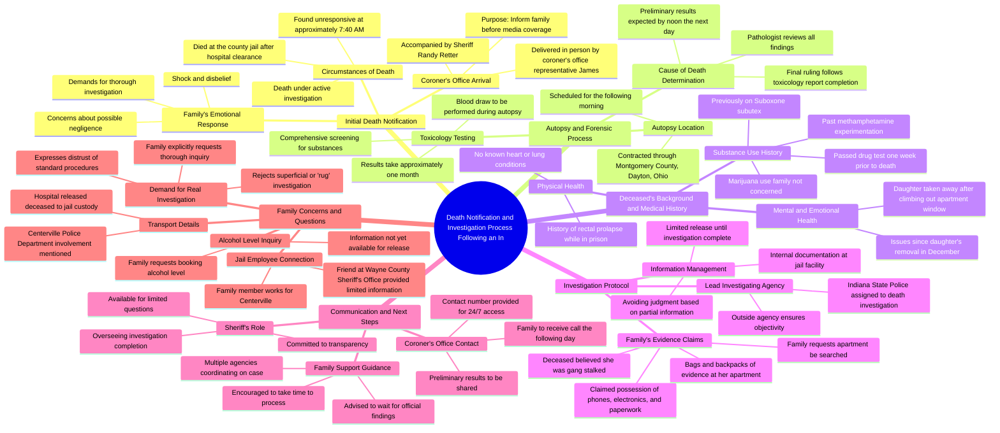

# Amanda Cole Hewitt Death Investigation Reopened by Mother

> 🌐 **Read this in:** [English](../../en/2026-09/tiktok-transcript-2-6m-views-20k-reactions-exposedjusticeisstilljustice-it-s-b-a3c7.md) · **中文**

> **Creator:** [@Kathy J Marcum](https://www.tiktok.com/@Kathy J Marcum) · **Views:** 1.2M · **Posted:** 2026-09-06 · **Niche:** other
>
> **TL;DR:** The blunt, devastating opening immediately grabs attention and sets a somber tone.

[Watch original video →](https://www.facebook.com/reel/2428768650862213/)

## Why This Went Viral

## 钩子（前3秒）
- **逐字开场白：**“她走了。她确实去世了，目前正在调查中。”
- **钩子模式：**大胆声明 + 未解之谜。说话者抛出一则死亡通告，毫无背景，紧接着是“正在调查中”，暗示有不当行为或谋杀嫌疑。
- **为何能让人停下滑动：**观众被直接抛入一个真实、原始、悲剧性的时刻。没有开场白，没有铺垫——只有一记直击心灵的陈述。这种模糊性（“谁带走了她？监狱？医院？”）制造了即时的认知失调，迫使观众继续观看，拼凑出事情的来龙去脉。

## 情绪节奏
1. **震惊/难以置信**——母亲反复说“我他妈不敢相信”和“这太不可思议了”。观众被锚定在母亲赤裸的悲痛中。
2. **困惑/沮丧**——母亲提出基本的程序性问题（谁带走了她、去了哪里、酒精浓度），得到的回应是“我没有那个信息”。这逐步累积紧张感和怀疑。
3. **愤怒/指控**——“我要一场他妈的调查。不是走过场的，是真正的调查。”母亲暗示有掩盖行为，这触发了观众的正义本能。
4. **偏执/阴谋论**——母亲透露阿曼达相信自己被“警察团伙跟踪”，有“成袋的证据”，并且要“告到最高层”。这引入了一个系统性腐败的叙事。
5. **认命/无助**——“我的脑子在空挡里进进出出。”母亲的情绪崩溃使她更加人性化，加深了观众的共情。
6. **高潮**——母亲问：“你们要去我们的公寓吗？有人要去我们的公寓找东西吗？”警长回避道：“你们四个目前不涉及实际调查。”这就是反转——掌权者正在与证据保持距离。
7. **未解的紧张**——视频在没有任何答案中结束，让观众和母亲一样处于焦虑的不确定状态。

## 关键词密度
- **“调查”**（提及10次以上）——通过与时事/新闻的关联推动算法触达；标志着一个正在发展中的故事。
- **“信息”**（提及8次以上）——反复拒绝提供信息助长了“掩盖”叙事，让观众持续上钩。
- **“证据”**（提及5次以上）——情感拉力；暗示母亲握有不当行为的证据，让观众想看到它。
- **“信任”**（提及4次以上）——警长反复说“你必须信任他”，讽刺的是这反而在观众心中滋生了不信任。
- **“答案”**（提及5次以上）——对未来答案的承诺在观众心中制造了“第二集”的强迫感。
- **“监狱/医院”**（提及5次以上）——地理/语境关键词，帮助视频在本地和真实犯罪搜索中浮现。
- **“团伙跟踪”**（提及1次）——一个小众但高互动率的真实犯罪术语，能引发评论区争论。

## 为何会传播
- **原始、无脚本的悲痛具有无可否认的真实性。**母亲那句“我就是他妈不敢相信”和“我的脑子在空挡里进进出出”不是表演。观众会分享那些感觉真实而非制作出来的内容。
- **权力动态在屏幕上清晰可见。**一名穿制服的警长站在一位悲痛的母亲面前，反复说“我没有那个信息”和“你必须信任我们”。这种制度权威与弱势公民的视觉对比是一个普遍的情绪触发器。
- **“证据”线索制造了悬念。**母亲说阿曼达有“成袋成背包的证据”，并且被“警察团伙跟踪”。随后警长说他没有在调查这件事。观众被留在想要证据被揭露的状态中——他们评论、@他人、要求更新。
- **反转落在结尾。**母亲关于公寓的最后一个问题被回避了。这是视频变得“可分享”的时刻——它证实了观众的怀疑，即有什么东西正在被隐瞒。
- **它符合“系统性不公”模板。**展示悲痛家属就可疑死亡质问官员的视频始终表现优异，因为它们触及了观众对机构已有的文化不信任。

## 你可以借鉴什么
- **从危机中间开始，而不是从头开始。**把观众直接投入情绪最激烈的时刻，零背景。困惑就是钩子。让背景故事通过对话自然展开。
- **让受访者用碎片化的方式说话。**不要剪辑掉犹豫、重复或情绪崩溃。“我只是……这太不可思议了”比任何精心打磨的独白都更有力量。真实的语言模式是真相的信号。
- **以一个未回答的问题结尾。**母亲最后的恳求——“有人要去我们的公寓吗？”——从未得到解答。在最大张力的时刻结束视频，而不是在解决时。这会迫使评论、分享和“第二集”的请求出现。

## Mind Map

## Full Transcript (Generated by [免费 TikTok 文稿生成器](https://toktranscript.com/?utm_source=github&utm_medium=breakdown&utm_campaign=tool_attribution))

> 📝 Transcripts on this page are auto-generated and show the first 60%. Want to transcribe any TikTok in 30 seconds and get the full version? [Try TokTranscript free →](https://toktranscript.com/?utm_source=github&utm_medium=breakdown&utm_campaign=transcript_cta)

She is gone. She did pass away and it is under investigation. Who took her to the jail? To the hospital? I don't have that information. I believe it was Centerville Police Department, but I don't have that information so I can't confirm that. Well, I can call Centerville. Because I work for Centerville. Okay. Indiana? Yep. Okay, good. the city employee. I found that out. Well, I'm just... It's gotta be shocking to hear. Considering, yeah. You have a seat. I mean, no one wants to get that news, this news. My name is James. I'm with the coroner's office. Um, so I just want to let you know a little bit of the next steps. Okay, we have our autopsies contracted through Montgomery County in Dayton, Ohio. So that's where we'll be going this morning. Okay, the autopsy will be performed first thing in the morning. And they'll call me tomorrow sometime probably around noon. Can't they do a blood draw like while she's dead? It's going to be accurate. It's going to show everything on there. We'll be doing that as well. We're going to do everything. Toxicology as well. All right. They'll call me tomorrow with some preliminary results. Just a little bit of information, not a lot. And then toxicology will be sent. toxicology can take a couple weeks to get back probably about a month to get back okay and then the autopsy will follow the toxicology report whenever the pathologist reviews everything and comes up with a ruling is their interpretation of a cause of death okay i'm very sorry i'm sorry we have to do this she knew somebody didn't kill her can you tell me a little bit about her medical history She's been fine. I mean she's had mental and emotional issues since her daughter got taken away. That was December. Meaning what kind of... Emotional issues? Yeah. Upset because her daughter got taken away for climbing out her goddamn window at her apartment. Any other medical issues like heart, lungs? No, nothing. A rectal prolapse one time while in prison. Okay. But yeah, nothing. Do you know if she had a drug history? Yeah, of course. Marijuana, she was on a sub-y tech for a while. She got off of it. She experimented with meth. And I just drug tested her a week ago. Passed it. Marijuana, I mean, hello? I don't have an issue with marijuana. That's natural weed. Anything man I have issues with Those are all drugs Those are my concern Please just Oh my God I certainly hated to have to deliver this news, but I felt it was important to tell you personally. And again, if there's anything that we can do to help you We're here for you. We want to stay in contact with you as best we can and help you through this process. Kathy, what's a good phone number we can reach you at? 765-277-2323. So you'll probably get a call from me sometime tomorrow, probably early afternoon. Do what? Huh? Do what? You'll probably get a phone call from me sometime tomorrow, early to mid-afternoon, with some updates on what we have, okay? There won't be answers. I want a fucking investigation. Oh, we are. No, I mean, not a rug one, a real one. No, the Indiana State Police is doing the investigation on Amanda's death. Thank you. Okay. She said she's got evidence, lots of evidence. She's got phones, she's got electronic equipment, she's gathered paperwork. She believed she was gang stalked by police and other people. I don't understand it. She was definitely doing stuff. She said she was going to the top for their evidence. Does anybody know anything about this? Nobody? Nobody? She's got bags of evidence at her apartment. And her apartment is horrible shape right now. She had five dogs and she's lost her power. like I said the Indiana State Police and the coroner's office are doing an investigation we're documenting it obviously internally as well at our facility did she die at the hospital? no she died at our jail after she got checked out at the hospital? correct what was her alcohol level? I don't have that information Why not? That's usually the first thing they have when they book somebody in. At this point, we're not going to be able to release a lot of information anyway, and I'm not going to release any information until it's complete, because as you know, I do. until we know all of the aspects of the investigation it wouldn be proper to make judgment on little bits of information So it important for us to get this thoroughly investigated And I'm having it investigated by an outside agency. She said she's got bags and backpacks of evidence in her apartment. Please do something. I think when you get things like this, you want answers. So everyone does. But I think you have to just happen this morning. And I can tell you what time? What time to pass away? We don't have an exact time of death. She was she was found unresponsive at approximately 740 a.m. So the sheriff wanted to let you know as mother as soon as he could. So there's a lot of answers that you want right now that we'd all want. We'd all want if we have it. You just have to trust him. I know it's a hard thing in our world today. You have to trust the sheriff's here on his own willingness to come and you this. There's nothing to hide. He's going to do everything he can to give you an answer what he can. You've got to give him the seconds to do that. It's hard. No one ever wants to hear. We don't want to stand here. I just can't fucking believe it. I just, I. It's unbelie

*[Read the full transcript on TokTranscript →](https://toktranscript.com/plaza/tiktok-transcript-2-6m-views-20k-reactions-exposedjusticeisstilljustice-it-s-b-a3c7?utm_source=github&utm_medium=breakdown&utm_campaign=transcript_full)*

## Browse More

- All [other](../../by-niche/zh-CN/other.md) breakdowns
- All [Shocking Revelation](../../by-pattern/zh-CN/hook-shocking-revelation.md) examples

## Video Info

| | |
|---|---|
| Creator | [@Kathy J Marcum](https://www.tiktok.com/@Kathy J Marcum) |
| Original video | [https://www.facebook.com/reel/2428768650862213/](https://www.facebook.com/reel/2428768650862213/) |
| Original title | 2.6M views · 20K reactions | #ExposedJusticeIsStillJustice It's been 11 (eleven) whole months. Amanda Cole Hewitt died in the Wayne county jail in Richmond, Indiana.09/27/25 I've reopened the investigation myself and have been sharing the EVIDENCE since my daughter died. Amanda Cole Hewitt had No STREET DRUGS IN HER SYSTEM. SHE DIED IN HER CELL UNDER 8 HOURS AFTER BOOKING. Everyone is looking up at my husband. The drug usage was 2020. She wasn't even smoking weed. Removing pharmaceuticals. One left. Only one. The cps case was fake and dropped. Lots more to expose. I hope this helps with all the questions going forward. The day Sheriff Ritter showed up with coroner Jones. Just wanted to let you know. Amanda Cole Hewitt is dead. We're going to do a GREAT JOB. The first four minutes are missing because I was in shock. Woke up my husband Bill Marcum and came back outside to this.. | Kathy J Marcum |
| Views | 1.2M (1167024) |
| Posted | 2026-09-06 |
| Duration | 0s |
| Niche | `other` |
| Hook pattern | `Shocking Revelation` |
| Original language | `en` (this page translated by AI) |
| Available languages | en, zh-CN |
| Generated | 2026-09-07 by [TokTranscript](https://toktranscript.com/) |

---

*This breakdown is for educational analysis under fair use. Original video © [@Kathy J Marcum](https://www.tiktok.com/@Kathy J Marcum). All transcripts are auto-generated and may contain errors.*

*Want to analyze your own TikToks like this? [TokTranscript →](https://toktranscript.com/viral-breakdown?utm_source=github&utm_medium=breakdown&utm_campaign=footer_cta)*