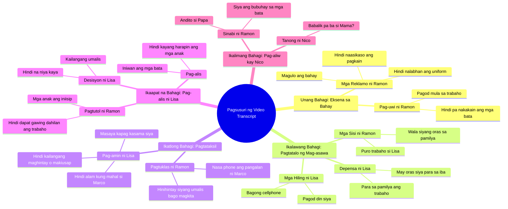

# Filipino Father's Silent Sacrifice Family Drama Part 1

> 🌐 **Read this in:** [English](../../en/2026-09/tiktok-transcript-2-7m-views-81k-reactions-tahimik-na-pasanin-part-1-isang-ama-7d7d.md) · **中文**

> **Creator:** [@Tagalog Real Talks](https://www.tiktok.com/@Tagalog Real Talks) · **Views:** 1.4M · **Posted:** 2026-09-10 · **Niche:** entertainment
>
> **TL;DR:** Opens with a common family concern that immediately draws viewers into the domestic tension.

[Watch original video →](https://www.facebook.com/share/v/19N359PLce/)

## Why This Went Viral

## 钩子（前3秒）
- **逐字台词：** “孩子们吃了吗？我不知道。还没呢。我饿了。”
- **钩子模式类型：** **场景+对比**——立即展现一个混乱的家庭情境（饥饿的孩子、疲惫的父母），屋内充满紧张感。
- **为什么能阻止滑动：** 语气像是普通的家庭对话，但暗藏明显的张力——仿佛你在偷听一个家庭的争吵。自然的对话和能引起共鸣的问题（疲惫、饥饿、工作）对许多菲律宾人来说都很熟悉，因此好奇心立刻被勾起：“这个家庭发生了什么？”

## 情感节奏
- **好奇** → “孩子们吃了吗？”——立即引入家庭情境，仿佛你在听真实生活。
- **紧张** → 紧张感逐渐升级：“你还没洗我的制服？”→“孩子们的饭，你没照顾好”→“Marco是谁？”——嫉妒与冲突在此登场。
- **悬念** → “你爱Marco吗？”——最沉重的问题，观众等待答案。
- **共鸣** → “我不需要等待。我不需要乞求被注意。”——对于感到被忽视的人来说极具共鸣。
- **反转** → “我再也受不了了。我需要先离开。”——Lisa突然决定离开，即使有孩子。
- **高潮** → “连孩子们也是？不。Lisa！他们是你的孩子！”——情绪在此爆发，母亲的离去和孩子们的哭泣。
- **释然/解决** → “没事的孩子，爸爸在这里。如果她不想和我们在一起了，我来养活你们。”——即使痛苦，也有安慰。
- **最终钩子** → “妈妈还会回来吗？”——留下一个触动情感、让观众思考的问题。

## 关键词密度
- **最强词汇/短语：**
  1. **疲惫**——争吵的情感基础
  2. **工作**——忽视与冲突的原因
  3. **孩子们/子女**——道德重量的中心
  4. **不**——反复的否定，强化紧张感
  5. **爱/爱情**——承载情感重量
  6. **离开/要走**——推动剧情
  7. **爸/爸爸/妈妈**——亲昵称呼，强化情感
  8. **食物/饥饿**——忽视的象征
  9. **对不起**——最后的情感重击
  10. **回来**——留下疑问

- **算法传播 vs. 情感牵引：**
  - **算法层面：** “疲惫”“工作”“家庭”“孩子”——菲律宾人经常搜索和分享，因此算法能更快分发。
  - **情感牵引：** “爱”“对不起”“回来”“离开”——让人流泪并分享，带来更高的互动量（评论、分享、收藏）。

## 为什么它会传播
- **能引起共鸣的家庭争吵：** “我累了。我也累了。”这句话正是许多菲律宾夫妻的真实写照——因此观众立刻产生连接。
- **道德困境：** “你爱Marco吗？”和“连孩子们也是？不。”——迫使观众选边站，因此产生大量评论和分享。
- **情感高潮：** “Lisa！他们是你的孩子！”——极其沉重的场景让人流泪，因此被反复观看和分享。
- **开放式结局：** “妈妈还会回来吗？”——留下一个让人思考的问题，并激发评论区讨论。
- **真实的对话：** 对话自然，像真实生活——不像剧本，因此更容易被相信和分享。

## 你可以借鉴的
1. **使用能引起共鸣的家庭情境**——用一段带有紧张感的普通对话开始视频，让观众立刻认出自己。
2. **提出没有答案的问题**——在结尾给观众留下开放式问题（如“妈妈还会回来吗？”），迫使他们评论和分享。
3. **用“疲惫”和“工作”作为情感锚点**——这些词对每个人都熟悉，因此视频更有可能被分享和收藏。

## Mind Map

## Full Transcript (Generated by [我们用的转录工具](https://toktranscript.com/?utm_source=github&utm_medium=breakdown&utm_campaign=tool_attribution))

> 📝 Transcripts on this page are auto-generated and show the first 60%. Want to transcribe any TikTok in 30 seconds and get the full version? [Try TokTranscript free →](https://toktranscript.com/?utm_source=github&utm_medium=breakdown&utm_campaign=transcript_cta)

Nakakain na ba mga bata? Ewan ko. Hindi pa po pa. Gutom na ako. Liza, alas seis na. Ano ba Ramon? Pagod ako. Kakauwi ko lang galing site. E di ikaw muna. Ako na dyan, Nico. Hindi mo na labahan uniform ko? Kailangan ko yan bukas. E di labhan mo. Mika! Ang kalat-kalat dito! Linisin mo yan! Salamat po, pa. Ramon, bilan mo nga ako ng bagong cellphone. Pagkain ng mga bata, hindi mo naasikaso. Uniform ko, hindi mo nilabhan. Pati bahay. Sabi ko nga, pagod ako. Pagod din ako. Ramon! Nasaan phone ko? Sino si Marco? Kaibigan ko. Kaibigan? Bakit hinihintay niyang umalis ako bago kayo magkita? Kasi kailan ka ba nandito? Puro trabaho ka. Pag uwi mo, pagod. Kinaumagahan, trabaho na naman. Para kanino ba yung trabaho ko Alam ko Pero pagdating ko rito gutom ang mga bata Hindi na luto ang pagkain Hindi na labahan damit ko Pero siya may oras ka? Pa? Anak, sa kwarto muna kayo. Nika, isama mo muna si Enzo. Mahal mo ba si Marco? Hindi ko alam. 

*[Read the full transcript on TokTranscript →](https://toktranscript.com/plaza/tiktok-transcript-2-7m-views-81k-reactions-tahimik-na-pasanin-part-1-isang-ama-7d7d?utm_source=github&utm_medium=breakdown&utm_campaign=transcript_full)*

## Browse More

- All [entertainment](../../by-niche/zh-CN/entertainment.md) breakdowns
- All [Relatable Question Hook](../../by-pattern/zh-CN/hook-relatable-question-hook.md) examples

## Video Info

| | |
|---|---|
| Creator | [@Tagalog Real Talks](https://www.tiktok.com/@Tagalog Real Talks) |
| Original video | [https://www.facebook.com/share/v/19N359PLce/](https://www.facebook.com/share/v/19N359PLce/) |
| Original title | 2.7M views · 81K reactions | Tahimik na Pasanin Part 1 Isang ama ang tahimik na bumubuhat sa bigat ng pamilya—hanggang sa isang gabi, mabunyag ang katotohanang tuluyang sisira sa tahanang pinoprotektahan niya. #tagalogstory #DramaSeries #PinoyDrama | Tagalog Real Talks |
| Views | 1.4M (1392321) |
| Posted | 2026-09-10 |
| Duration | 0s |
| Niche | `entertainment` |
| Hook pattern | `Relatable Question Hook` |
| Original language | `tl` (this page translated by AI) |
| Available languages | en, zh-CN |
| Generated | 2026-09-11 by [TokTranscript](https://toktranscript.com/) |

---

*This breakdown is for educational analysis under fair use. Original video © [@Tagalog Real Talks](https://www.tiktok.com/@Tagalog Real Talks). All transcripts are auto-generated and may contain errors.*

*Want to analyze your own TikToks like this? [TikTok 转录工具 →](https://toktranscript.com/viral-breakdown?utm_source=github&utm_medium=breakdown&utm_campaign=footer_cta)*