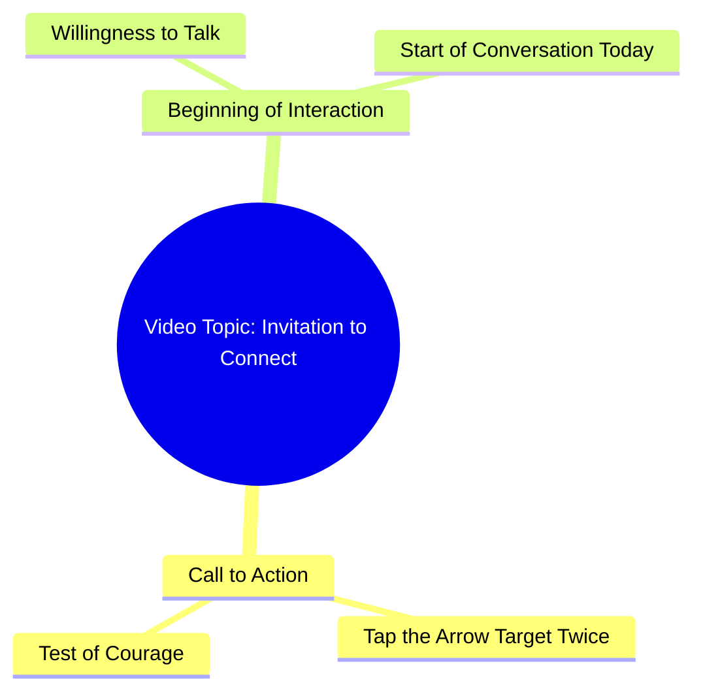

# Touch the Arrow Target Twice If You Dare

> 🌐 **Read this in:** [English](../../en/2026-09/tiktok-transcript-2-8m-views-42k-reactions-03045658504-81ab.md) · **中文**

> **Creator:** [@03045658504](https://www.tiktok.com/@03045658504) · **Views:** 1.0M · **Posted:** 2026-09-26 · **Niche:** other
>
> **TL;DR:** Directly challenges the viewer's courage, compelling them to engage.

[Watch original video →](https://www.facebook.com/reel/2105355380187493/?app=fbl)

## Why This Went Viral

## 钩子（前3秒）
- **逐字开场白：** “क्या आप हिम्मत करेंगे?”（你敢吗？）紧接着“इस तीर वाले निसान पर दो बार टच करके देखो”（触摸这个箭头符号两次，看看会发生什么）。
- **钩子模式：** 直接挑战/提问 + 身体微承诺（“挑战”钩子融合仪式性动作提示）。
- **为什么能让人停下滑动：** 它在一秒内将被动观看者转变为参与者。“हिम्मत”（勇气/挑战）一词同时触发自尊心和好奇心，而*触摸屏幕*的指令制造了一个不自觉的微动作，让拇指停下并提升互动信号（点击、重播），算法会将其解读为兴趣。

## 情绪节奏
- **节拍1——好奇/挑战（0–2秒）：** “क्या आप हिम्मत करेंगे?”打开一个悬念循环：*挑战什么？*
- **节拍2——指令/紧张（2–5秒）：** 触摸箭头的命令制造轻微悬念——观看者等待看会发生什么或这意味着什么。
- **节拍3——亲密/共鸣（5–10秒）：** “अगर आप सच में मुझसे बात करना चाहते हैं”从挑战转向情感邀请——把游戏变成个人连接。
- **节拍4——承诺/高潮（最后一句）：** “सायद आज से हमारी बातचीत की सुरुआत हो जाए”——高潮是*一个开始的承诺*，一种开放式的情感回报，而非揭示。
- **高潮时刻：** 最后一句，挑战化解为温柔的、近乎浪漫的邀请——这是情感钩子最强烈落点，驱动评论/回复。

## 关键词密度
- **हिम्मत**（勇气/挑战）——自尊触发，驱动停留率。
- **टच**（触摸）——动作动词，驱动互动机制。
- **तीर / निसान**（箭头/目标）——视觉锚点，驱动好奇心和评论提问（“这是什么意思？”）。
- **सच में**（真的/真正地）——真实性信号，情感拉力。
- **बात करना / बातचीत**（说话/对话）——关系关键词，驱动私信和评论。
- **आज से**（从今天起）——紧迫感/新鲜感，驱动分享。
- **सुरुआत**（开始）——叙事承诺，情感拉力。
- **算法驱动词：** टच、हिम्मत、निसान（动作 + 挑战词提升完播率和重复点击）。
- **情感驱动词：** सच में、बातचीत、सुरुआत（建立准社会亲密感，驱动收藏和回复）。

## 为什么它会传播
- **强制身体互动：** “दो बार टच करके देखो”让观看者点击屏幕——点击和重播是强排名信号，因此视频会被进一步推送。
- **挑战 + 奖励循环：** “क्या आप हिम्मत करेंगे?”设置了一个挑战；观看者留下来看是否有回报，从而拉高平均观看时长。
- **准社会亲密诱饵：** “अगर आप सच में मुझसे बात करना चाहते हैं”让每个观看者感觉被个人化地呼唤，触发“मैंने टच किया”之类的评论和私信。
- **开放式谜团：** 箭头/目标（तीर वाला निसान）从未被解释，因此评论区充满各种解读——评论量喂养算法。
- **可分享的情感承诺：** “आज से हमारी बातचीत की सुरुआत हो जाए”给观看者一个理由将其标记或发送给某人作为“信号”，驱动分享。

## 你可以借鉴什么
- **以挑战或直接提问开场**，强制一个微动作（“触摸两次”“评论你的答案”）——身体参与胜过被动观看。
- **在视频中途翻转语气：** 以挑战开始，以亲密或承诺结束。语气转折是让观看者重看和回复的关键。
- **留下一个未解释的元素**（箭头、信号、数字），让评论区成为真正的内容引擎——模糊性是分享倍增器。

## Mind Map

## Full Transcript (Generated by [TokTranscript](https://toktranscript.com/?utm_source=github&utm_medium=breakdown&utm_campaign=tool_attribution))

> 📝 Transcripts on this page are auto-generated and show the first 60%. Want to transcribe any TikTok in 30 seconds and get the full version? [Try TokTranscript free →](https://toktranscript.com/?utm_source=github&utm_medium=breakdown&utm_campaign=transcript_cta)

क्या आप हिम्मत करेंगे? इस तीर वाले निसान पर दो बार टच करके देखो. अगर आप सच में मुझसे बात 

*[Read the full transcript on TokTranscript →](https://toktranscript.com/plaza/tiktok-transcript-2-8m-views-42k-reactions-03045658504-81ab?utm_source=github&utm_medium=breakdown&utm_campaign=transcript_full)*

## Browse More

- All [other](../../by-niche/zh-CN/other.md) breakdowns
- All [Challenge/Question Hook](../../by-pattern/zh-CN/hook-challenge-question-hook.md) examples

## Video Info

| | |
|---|---|
| Creator | [@03045658504](https://www.tiktok.com/@03045658504) |
| Original video | [https://www.facebook.com/reel/2105355380187493/?app=fbl](https://www.facebook.com/reel/2105355380187493/?app=fbl) |
| Original title | 2.8M views · 42K reactions | کیا آپ ہمت کریں گے | 03045658504 |
| Views | 1.0M (1037542) |
| Posted | 2026-09-26 |
| Duration | 0s |
| Niche | `other` |
| Hook pattern | `Challenge/Question Hook` |
| Original language | `en` (this page translated by AI) |
| Available languages | en, zh-CN |
| Generated | 2026-09-27 by [TokTranscript](https://toktranscript.com/) |

---

*This breakdown is for educational analysis under fair use. Original video © [@03045658504](https://www.tiktok.com/@03045658504). All transcripts are auto-generated and may contain errors.*

*Want to analyze your own TikToks like this? [TokTranscript →](https://toktranscript.com/viral-breakdown?utm_source=github&utm_medium=breakdown&utm_campaign=footer_cta)*