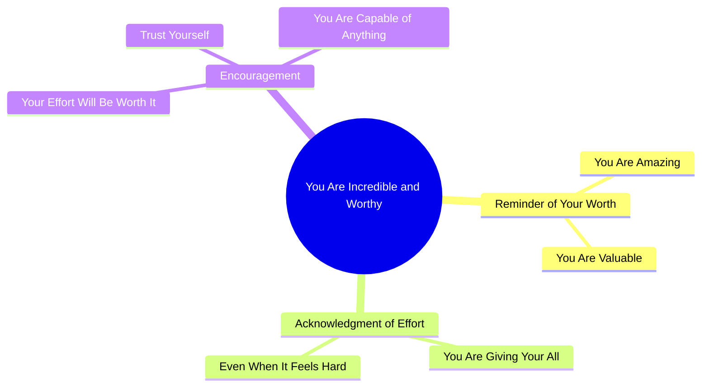

# Motivational Spanish Message About Self-Worth and Effort

> 🌐 **Read this in:** [English](../../en/2026-09/tiktok-transcript-22k-views-148k-reactions-tinitov-0716.md) · **中文**

> **Creator:** [@TinitoV](https://www.tiktok.com/@TinitoV) · **Views:** 2.6M · **Posted:** 2026-09-16 · **Niche:** entertainment
>
> **TL;DR:** Immediately validates the viewer with a positive affirmation, creating an instant emotional connection.

[Watch original video →](https://www.facebook.com/share/v/1DNGeVXYmQ/)

## Why This Went Viral

## 钩子（前3秒）
- **逐字开场白：** “Solo quería recordarte lo increíble que eres y lo mucho que vales.”（“我只是想提醒你，你有多了不起，你有多值得。”）
- **钩子模式：** 直接的第二人称肯定／情感认可（一种“你已经足够好”的钩子）。
- **为什么它能让人停下滑动：** 它在第一秒内就亲自对观众说话（“recordarte”、“eres”），触发即时的自我参照反射——大脑会把“你”当作注意力的提示。它承诺零阻力地提升情绪，所以观众留下来是为了获得情感回报，而不是为了获取信息。

## 情绪节奏
- **节拍1——认可（0–2秒）：** “lo increíble que eres” → 即时温暖，观众感到被看见。
- **节拍2——共情／张力（3–6秒）：** “Sé que le estás echando todas las ganas… aunque parezca difícil” → 承认挣扎，通过点出观众隐藏的努力制造一个小张力峰值。
- **节拍3——缓解／承诺（7–9秒）：** “todo ese esfuerzo va a valer la pena” → 用希望化解张力。
- **节拍4——赋能高潮（10–13秒）：** “Confía en ti. Eres capaz de todo.” → 情绪峰值；短促有力的祈使句作为释放落下。
- **高潮时刻：** 最后两句话（“Confía en ti. Eres capaz de todo.”）——最短的句子承载最高的情绪强度，也最值得引用／截图。

## 关键词密度
- **最强的重复词／短语：**
  1. “eres” / “eres capaz”（你是／你有能力）
  2. “todo”（一切——“todo ese esfuerzo”、“capaz de todo”）
  3. “lo mucho que vales”（你有多值得）
  4. “esfuerzo” / “ganas”（努力／意愿）
  5. “Confía en ti”（相信你自己）
  6. “difícil”（困难）
  7. “valer la pena”（值得）
  8. “recordarte”（提醒你）
- **算法传播力 vs. 情感拉力：**
  - *传播驱动词：* “confía en ti”、“eres capaz”、“vales”——高搜索、高收藏的励志关键词，会把视频推入自助／励志信息流并提升分享。
  - *情感拉力：* “esfuerzo”、“ganas”、“difícil”——这些词点出观众私下的挣扎，并制造亲密感，把被动滑动转化为收藏或分享给朋友。

## 为什么它会传播
- **普遍的第二人称称呼：** 每一句都使用“tú/ti”（“recordarte”、“Confía en ti”），所以每个观众都感觉被单独点名——这是可分享肯定类内容的核心机制。
- **认可未被看见的努力：** “Sé que le estás echando todas las ganas”奖励观众那些看不见的付出，而这正是人们会转发给正在挣扎的朋友的情绪。
- **低认知负荷，高情绪密度：** 整个脚本约40个词，没有故事或背景——它是纯粹的感受，因此可以瞬间消费并反复观看。
- **可引用的结尾句：** “Confía en ti. Eres capaz de todo.” 可作为独立字幕／截图使用，推动收藏，并作为文字帖或动态转发。
- **分享即关怀的触发点：** 信息被包装成礼物（“Solo quería recordarte”），所以分享它感觉像是在为别人做一件善意的事——一种内置的传播动机。

## 你可以借鉴什么
1. **用“Solo quería recordarte…”或等价的礼物框架开场。** 把你的信息框定为你在送给观众的东西（而不是在教他们），会降低防御并提高观看时长。
2. **在回报之前先说出挣扎。** 在传递希望之前插入一句承认观众努力的话（“Sé que le estás echando todas las ganas”）——先张力后缓解，才会让结尾真正落地。
3. **用两个超短祈使句收尾。** 用一句有力、可截图的短句对收尾，比如“Confía en ti. Eres capaz de todo.” 短的结尾句比长的更容易被收藏、引用和分享。

## Mind Map

## Full Transcript (Generated by [TokTranscript 转录工具](https://toktranscript.com/?utm_source=github&utm_medium=breakdown&utm_campaign=tool_attribution))

> 📝 Transcripts on this page are auto-generated and show the first 60%. Want to transcribe any TikTok in 30 seconds and get the full version? [Try TokTranscript free →](https://toktranscript.com/?utm_source=github&utm_medium=breakdown&utm_campaign=transcript_cta)

Solo quería recordarte lo increíble que eres y lo mucho que vales. Sé que le estás echando todas las ganas del mundo y aunque pa

*[Read the full transcript on TokTranscript →](https://toktranscript.com/plaza/tiktok-transcript-22k-views-148k-reactions-tinitov-0716?utm_source=github&utm_medium=breakdown&utm_campaign=transcript_full)*

## Browse More

- All [entertainment](../../by-niche/zh-CN/entertainment.md) breakdowns
- All [Direct compliment](../../by-pattern/zh-CN/hook-direct-compliment.md) examples

## Video Info

| | |
|---|---|
| Creator | [@TinitoV](https://www.tiktok.com/@TinitoV) |
| Original video | [https://www.facebook.com/share/v/1DNGeVXYmQ/](https://www.facebook.com/share/v/1DNGeVXYmQ/) |
| Original title | 22K views · 148K reactions | 🖤✨ | TinitoV |
| Views | 2.6M (2603027) |
| Posted | 2026-09-16 |
| Duration | 0s |
| Niche | `entertainment` |
| Hook pattern | `Direct compliment` |
| Original language | `en` (this page translated by AI) |
| Available languages | en, zh-CN |
| Generated | 2026-09-17 by [TokTranscript](https://toktranscript.com/) |

---

*This breakdown is for educational analysis under fair use. Original video © [@TinitoV](https://www.tiktok.com/@TinitoV). All transcripts are auto-generated and may contain errors.*

*Want to analyze your own TikToks like this? [免费 TikTok 文稿生成器 →](https://toktranscript.com/viral-breakdown?utm_source=github&utm_medium=breakdown&utm_campaign=footer_cta)*