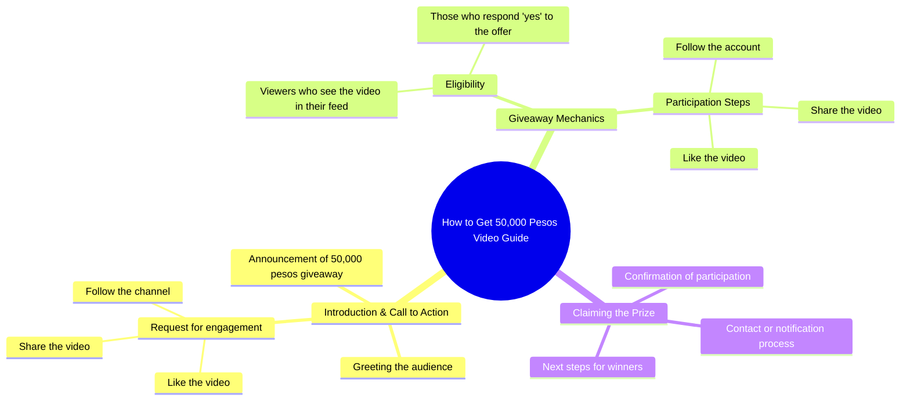

# Comment Now Boss, You Might Be Next! Win 50,000 Pesos

> 🌐 **Read this in:** [English](../../en/2026-09/tiktok-transcript-339k-views-15k-reactions-comment-nyo-na-mga-boss-baka-sa-iny-126b.md) · **中文**

> **Creator:** [@ꓮꓡawi familly](https://www.tiktok.com/@ꓮꓡawi familly) · **Views:** 146.1K · **Posted:** 2026-09-07 · **Niche:** other
>
> **TL;DR:** The hook instantly makes viewers feel special and lucky, creating immediate personal relevance.

[Watch original video →](https://www.facebook.com/share/r/1ETpA5vTL4/)

## Why This Went Viral

## Hook（前3秒）
- **逐字开场白：**“大家好！如果这个视频出现在你的信息流里，那你走运了！”
- **钩子模式：**大胆断言 + 直接称呼 + 奉承/算命式口吻
- **为何能阻止滑动：**它立刻奉承观众（“你走运了”），并暗示仅仅在场就有回报。它不索取注意力——它赐予好运。那种“我很特别/我很幸运”的心理冲击让拇指停下。

## 情绪节奏
1. **好奇 + 奉承**（“你走运了”）——观众感到被特别选中、感到幸运。
2. **贪婪/期待**（“你想拿到50,000比索”）——具体奖励悬在眼前，激发渴望。
3. **紧迫感/焦虑**（“别忘了关注、点赞和分享”）——害怕不立即行动就会错过奖励。
4. **顺从/承诺**——观众的大脑进入一种交易状态：“我做了动作，现在我的钱呢？”
- **高潮：**“50,000比索”说出口的那一刻——整个视频围绕这个数字转动。
- **没有反转，没有释放**——张力由未兑现的承诺维持，迫使评论区出现“是的！”来保持循环运转。

## 关键词密度
- **“你走运了”**（幸运）——情感拉力；让观众感到被选中。
- **“50,000比索”**——算法传播驱动（高价值数字，可搜索、可分享）。
- **“想”**（想要）——情感拉力；触发欲望。
- **“关注、点赞、分享”**——算法传播驱动；明确的互动指令。
- **“这个视频”**——算法驱动；制造自我指涉循环，提升观看时长和分享量。
- **“大家好”**——情感拉力；营造社群/亲切氛围。

## 为何能病毒式传播
- **“你是天选之人”框架**——“你走运了”让观众感到与众不同，于是他们评论“是的”来认领这份好运，推高互动信号。
- **明确的奖励诱惑**——“50,000比索”是一个具体、高风险的数字，触发巴甫洛夫式反应；观众把它分享给“需要好运”的朋友，成倍扩大传播。
- **伪装成条件的互动循环**——“关注、点赞、分享”不是请求，而是获得奖金的资格要求。这把被动观众转化为主动推广者。
- **开放式承诺**——没有机制、没有日期、没有名字。这种模糊性让评论区持续活跃，充满“我！”和“怎么弄？”——进一步喂养算法。
- **语言特定性**——他加禄语/菲律宾语精准瞄准高互动人群，在该人群中“抽奖文化”盛行；视频显得本土化、个人化，而非垃圾信息。

## 你可以借鉴什么
- **以“好运炸弹”开场，而非推销**——一开始就告诉观众，看到这个视频是他们走运。这把动态从“看我”翻转为“这是给你的”。
- **把互动变成资格条件，而非请求**——不要说“请点赞”，而是说“要得到X，你必须点赞”。这把软性请求变成硬性条件，大幅提升顺从率。
- **尽早抛出具体、整数的奖励数字**——“50,000比索”足够具体让人感觉真实，又足够整数让人记住。在前5秒内说出它，锚定整个视频的价值。

## Mind Map

## Full Transcript (Generated by [免费 TikTok 文稿生成器](https://toktranscript.com/?utm_source=github&utm_medium=breakdown&utm_campaign=tool_attribution))

> 📝 Transcripts on this page are auto-generated and show the first 60%. Want to transcribe any TikTok in 30 seconds and get the full version? [Try TokTranscript free →](https://toktranscript.com/?utm_source=github&utm_medium=breakdown&utm_campaign=transcript_cta)

Hello sa inyong lahat! Kung lumabas ang video na ito sa iyong feed, swerte ka! Sabihin ng yes kung gusto mong makakuha ng 50,0

*[Read the full transcript on TokTranscript →](https://toktranscript.com/plaza/tiktok-transcript-339k-views-15k-reactions-comment-nyo-na-mga-boss-baka-sa-iny-126b?utm_source=github&utm_medium=breakdown&utm_campaign=transcript_full)*

## Browse More

- All [other](../../by-niche/zh-CN/other.md) breakdowns
- All [Direct Address + Luck/Exclusivity](../../by-pattern/zh-CN/hook-direct-address-luck-exclusivity.md) examples

## Video Info

| | |
|---|---|
| Creator | [@ꓮꓡawi familly](https://www.tiktok.com/@ꓮꓡawi familly) |
| Original video | [https://www.facebook.com/share/r/1ETpA5vTL4/](https://www.facebook.com/share/r/1ETpA5vTL4/) |
| Original title | 339K views · 15K reactions | Comment nyo na mga boss baka sa inyo na sunod! 😱🥳 #ivanaalawi #monaalawi #ivanaalawireall #laptopwarehouse #lapag #dailyvlog #laptop #bossa #BossA #Pamorma #CrisHippers #Kuyamoboss #fistbump #TisayShin #filipina #iphone #pera | ꓮꓡawi familly |
| Views | 146.1K (146076) |
| Posted | 2026-09-07 |
| Duration | 0s |
| Niche | `other` |
| Hook pattern | `Direct Address + Luck/Exclusivity` |
| Original language | `en` (this page translated by AI) |
| Available languages | en, zh-CN |
| Generated | 2026-09-08 by [TokTranscript](https://toktranscript.com/) |

---

*This breakdown is for educational analysis under fair use. Original video © [@ꓮꓡawi familly](https://www.tiktok.com/@ꓮꓡawi familly). All transcripts are auto-generated and may contain errors.*

*Want to analyze your own TikToks like this? [TokTranscript →](https://toktranscript.com/viral-breakdown?utm_source=github&utm_medium=breakdown&utm_campaign=footer_cta)*