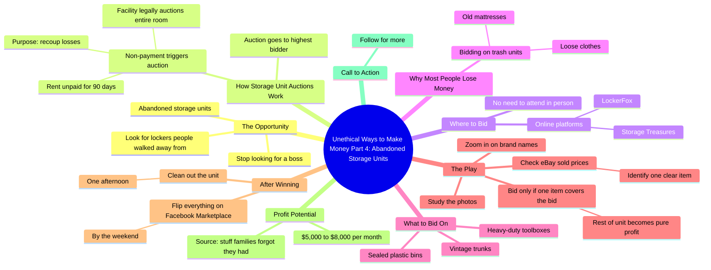

# Abandoned Storage Unit Auctions: Real Profit

> 🌐 **Read this in:** [English](../../en/2026-09/tiktok-transcript-392k-views-11k-reactions-everyone-watches-those-storage-show-d8ff.md) · **中文**

> **Creator:** [@Secret Money](https://www.tiktok.com/@Secret Money) · **Views:** 195.1K · **Posted:** 2026-09-27 · **Niche:** finance
>
> **TL;DR:** The word 'unethical' combined with profanity creates immediate intrigue and promises forbidden knowledge, while 'part four' implies a proven series.

[Watch original video →](https://www.facebook.com/share/r/1BcjGSaTpY/)

## Why This Went Viral

## 钩子（前3秒）
- **逐字开场白：** “不道德的生钱方式，第四部分。”
- **钩子模式：** 大胆断言 + 禁果框架 + 编号系列（“第四部分”）。
- **为什么能让人停下滚动：** “不道德”制造了好奇心缺口和一种观众想要目睹的轻微道德越界。“他妈的赚钱”拉高了情绪强度。“第四部分”表明这是一个已经确立、可刷剧的系列——观众会认为它已被验证，并因错过第1-3部分而产生错失恐惧。

## 情绪节奏
- **好奇（0–3秒）：** “不道德的生钱方式”——是什么招数？
- **重构 / 张力（3–8秒）：** “别再找老板了，开始找那些人们真的丢下不管的储物柜。”我们vs他们的能量；把观众定位成内部人。
- **权威 / 缓解（8–15秒）：** “法律要求拍卖……只是为了收回他们的损失”——使这个套路合法化，消除风险焦虑。
- **问题 → 张力（15–22秒）：** “大多数人亏钱，是因为他们竞拍垃圾储物间……”——制造了一个反派（天真的竞拍者）和利害关系。
- **高潮（22–30秒）：** “这就是玩法。”——揭晓。分步方法（放大看、查eBay成交价、一件物品覆盖出价）就是回报时刻。
- **奖励 / 证明（30–40秒）：** “每月5，000到8，000美元”——具体数字落地，成为情绪高点。
- **CTA（最后一句）：** “关注获取更多。”——把多巴胺冲击转化为关注。

**高潮时刻：** “这就是玩法。看照片。放大看品牌名……”——承诺转化为可复制战术的那一刻。

## 关键词密度
- **最强的重复词/短语：**
  1. “钱” / “赚钱”
  2. “储物间” / “被遗弃的储物间”
  3. “拍卖” / “出价” / “最高出价者”
  4. “不道德”
  5. “转卖” / “把所有东西都转卖”
  6. “利润” / “纯利润”
  7. “eBay” / “Facebook Marketplace”
  8. “每月5，000到8，000美元”
  9. “第四部分”
  10. “关注获取更多”

- **算法触达驱动因素：** “钱”“储物间”“拍卖”“eBay”“Facebook Marketplace”——高搜索、高兴趣的商业关键词，与算法已经知道表现良好的内容相匹配。
- **情绪拉动驱动因素：** “不道德”“他妈的赚钱”“每月5，000到8，000美元”“家庭忘了自己还有”——这些在一次表达中同时制造欲望、禁忌和怀旧。

## 为什么它会传播
- **禁忌知识框架。** “不道德的生钱方式”承诺的是大多数人不会大声说出来的信息——观众把它当作炫耀来分享（“看看我发现了什么”）。
- **系列机制。** “第四部分”暗示这是一个已被验证的系列；观众会往回刷，也会继续关注后续，这推动了观看时长和关注转化。
- **具体、可复制的步骤。** “放大看品牌名，并在eBay上查成交价”给出了可执行的玩法——收藏和分享会激增，因为视频不仅有趣，而且*有用*。
- **用数字作证明。** “每月5，000到8，000美元”和“90天”让说法更可信；具体数字比模糊数字更容易被分享。
- **内置反派 + 英雄。** “大多数人亏钱……你只竞拍那些有密封塑料箱的储物间”——观众被塑造成聪明的内部人，这会触发基于身份认同的分享。

## 你可以偷走什么
1. **用禁忌或反直觉的框架开场。** 像“不道德”“没人谈论”“他们不想让你知道”这样的词会立刻制造好奇心缺口，表现优于中性开场。
2. **打造编号系列。** “第四部分”把一个视频变成可刷剧的系列，并给观众一个关注而不只是点赞的理由。
3. **给出一个可识别、可复制的步骤。** “放大看品牌名 → 查eBay成交价”这个动作就是可分享单元。用一个观众今天就能执行的单一战术收尾，而不是一个模糊承诺。

## Mind Map

## Full Transcript (Generated by [TikTok 转录工具](https://toktranscript.com/?utm_source=github&utm_medium=breakdown&utm_campaign=tool_attribution))

> 📝 Transcripts on this page are auto-generated and show the first 60%. Want to transcribe any TikTok in 30 seconds and get the full version? [Try TokTranscript free →](https://toktranscript.com/?utm_source=github&utm_medium=breakdown&utm_campaign=transcript_cta)

Unethical ways to make fucking money, part four. Stop looking for a boss and start looking for the lockers people literally walked away from. I am talking about abandoned storage units. When someone stops paying their rent for 90 days, the facility is legally required to auction off the entire room to the highest bidder just to recoup their losses. You do not have to show up in person like a reality TV show. You go to sites like Storage Treasures or LockerFox. Most people lose money because they bid on trash units full of loose clothes and old mattresses. You only bid on units that have sealed plastic bins, vintage trunks, or heavy-duty toolboxes. Here is

*[Read the full transcript on TokTranscript →](https://toktranscript.com/plaza/tiktok-transcript-392k-views-11k-reactions-everyone-watches-those-storage-show-d8ff?utm_source=github&utm_medium=breakdown&utm_campaign=transcript_full)*

## Browse More

- All [finance](../../by-niche/zh-CN/finance.md) breakdowns
- All [Controversial Curiosity Hook](../../by-pattern/zh-CN/hook-controversial-curiosity-hook.md) examples

## Video Info

| | |
|---|---|
| Creator | [@Secret Money](https://www.tiktok.com/@Secret Money) |
| Original video | [https://www.facebook.com/share/r/1BcjGSaTpY/](https://www.facebook.com/share/r/1BcjGSaTpY/) |
| Original title | 392K views · 11K reactions | Everyone watches those storage shows on TV and thinks it’s all fake, but the online auctions are where the real money is moving. People leave their lives in these units and then stop paying rent. If you see sealed plastic bins, you’re usually looking at someone’s "good" stuff. It’s a dirty job cleaning them out, but the profit margins are insane if you find the right tools or electronics. 🔒💰 #secretmoney | Secret Money |
| Views | 195.1K (195074) |
| Posted | 2026-09-27 |
| Duration | 0s |
| Niche | `finance` |
| Hook pattern | `Controversial Curiosity Hook` |
| Original language | `en` (this page translated by AI) |
| Available languages | en, zh-CN |
| Generated | 2026-09-28 by [TokTranscript](https://toktranscript.com/) |

---

*This breakdown is for educational analysis under fair use. Original video © [@Secret Money](https://www.tiktok.com/@Secret Money). All transcripts are auto-generated and may contain errors.*

*Want to analyze your own TikToks like this? [TokTranscript 转录工具 →](https://toktranscript.com/viral-breakdown?utm_source=github&utm_medium=breakdown&utm_campaign=footer_cta)*