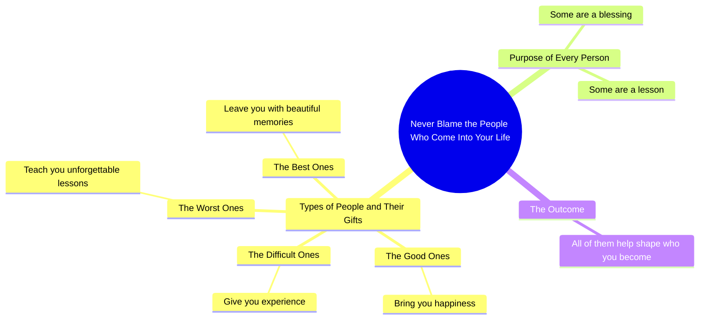

# Every Person Enters Your Life for a Reason

> 🌐 **Read this in:** [English](../../en/2026-09/tiktok-transcript-4-5m-views-110k-reactions-every-person-enters-your-life-for-3600.md) · **中文**

> **Creator:** [@Mind Decoded](https://www.tiktok.com/@Mind Decoded) · **Views:** 2.1M · **Posted:** 2026-09-10 · **Niche:** entertainment
>
> **TL;DR:** A direct imperative that challenges a common behavior, immediately grabbing attention.

[Watch original video →](https://www.facebook.com/share/r/1EP4YiAsVw/)

## Why This Went Viral

## 钩子（前3秒）
- 开场白，逐字引用：“永远不要责怪走进你生命里的人。”
- 钩子模式：**大胆命令 / 反直觉指令**——它告诉观众放下一种他们可能觉得自己有权拥有的行为（责怪）。
- 为什么它能阻止滑动：它触发即时的自我参照。任何被某人伤害过的人都会在第一秒内在脑海中重播那个人，所以拇指在大脑做出决定之前就停住了。“永远不要”这个词增加了绝对主义色彩，读起来像权威。

## 情绪节奏
- **节拍1——反抗/好奇：**“永远不要责怪走进你生命里的人。”以一个感觉略不公平的规则开场，制造轻微摩擦。
- **节拍2——宽慰：**“好人带给你快乐。”肯定观众的美好回忆；紧张感下降。
- **节拍3——紧张：**“难相处的人给你经验。最糟糕的人给你难忘的教训。”“最糟糕”这个词刺痛人心；观众具体的伤口在这里浮现。
- **节拍4——温暖/共鸣：**“最好的人给你留下美好的回忆。”情绪呼气；怀旧取代怨怼。
- **高潮：**“每个人都有其意义。”这是主题句——从个人怨怼转向普遍意义的支点。它正好落在情绪低谷（“最糟糕的人”）之后，并对其重新框定。
- **收束：**“有些是祝福，有些是教训。但他们都帮助塑造了你会成为谁。”闭合了钩子打开的循环，把责怪转化为感恩。

节奏是一条**先下降再上升的弧线**：快乐 → 困难 → 最糟糕 → 最好 → 意义。在上升到“意义”之前先下探到“最糟糕”，正是让回报感觉值得的原因。

## 关键词密度
- **people**——锚点名词；让信息具有普遍适用性（算法触达）。
- **ones**——在平行结构中重复4次；推动节奏和留存。
- **lessons / lesson**——核心重构词；承载情绪载荷。
- **memories**——怀旧触发器；可分享、值得截图的词。
- **purpose**——哲学回报；推动收藏和评论。
- **blame**——钩子词；情绪强度高，为反转做铺垫。
- **happiness / beautiful / blessing**——正向效价词，让视频可以安全地与家人分享。
- **experience**——中性桥梁词，缓和“难相处的人”这一节拍。

算法驱动因素：**people、purpose、lessons**（宽泛、可搜索、高互动主题）。情绪驱动因素：**blame、worst、memories、blessing**（这些是让人标记朋友或转发到故事的原因）。

## 为什么它会传播
- **它给观众许可，去重新框定一个真实的伤口。**“最糟糕的人给你难忘的教训”让人能把某个具体的痛苦之人转化为成长故事——这是一种可分享的身份动作，而不只是一句引言。
- **平行结构让它易于引用、适合截图。**重复的“The ___ ones ___”模式容易记住，也容易作为文本转发，这就是为什么这种格式能在视频本身之外存活。
- **钩子制造了轻微的道德挑战。**“永远不要责怪走进你生命里的人”略带挑衅——它邀请评论区的反对意见（“但虐待者呢？”），而评论量是主要排名信号。
- **结尾是普遍性的收束。**“他们都帮助塑造了你会成为谁”几乎适用于任何人的生活，所以没有观众会觉得被排除——最大化可触达受众。
- **它在情绪上适合分享。**没有政治，没有争议，没有特定人物——只有积极的重构。这使它发给朋友、伴侣或父母时风险很低。

## 你可以借鉴什么
- **用一个与常见本能相矛盾的命令开场。**“永远不要责怪……”之所以有效，是因为它禁止了人们会自动做的事。试试“停止向那些……的人解释自己”或“永远不要为……道歉”——摩擦就是钩子。
- **使用带情绪梯度的编号平行结构。**好 → 难 → 最糟 → 最好，迫使观众在20秒内经历完整的情绪周期。构建你的列表，让它在上升前先下探；低点正是让结尾落地的原因。
- **以普遍性的重构结尾，而不是具体的重构。**“每个人都有其意义”胜过“你的前任教会了你一些东西”，因为它能扩展到每个观众。把最后一句写成任何人都能把自己的故事放进去。

## Mind Map

## Full Transcript (Generated by [TikTok 转录工具](https://toktranscript.com/?utm_source=github&utm_medium=breakdown&utm_campaign=tool_attribution))

> 📝 Transcripts on this page are auto-generated and show the first 60%. Want to transcribe any TikTok in 30 seconds and get the full version? [Try TokTranscript free →](https://toktranscript.com/?utm_source=github&utm_medium=breakdown&utm_campaign=transcript_cta)

Never blame the people who come into your life. The good ones bring you happiness. The difficult ones give you experience. The worst ones teach you unforgettable lessons. And the best ones leave you wit

*[Read the full transcript on TokTranscript →](https://toktranscript.com/plaza/tiktok-transcript-4-5m-views-110k-reactions-every-person-enters-your-life-for-3600?utm_source=github&utm_medium=breakdown&utm_campaign=transcript_full)*

## Browse More

- All [entertainment](../../by-niche/zh-CN/entertainment.md) breakdowns
- All [Command + Reframe](../../by-pattern/zh-CN/hook-command-reframe.md) examples

## Video Info

| | |
|---|---|
| Creator | [@Mind Decoded](https://www.tiktok.com/@Mind Decoded) |
| Original video | [https://www.facebook.com/share/r/1EP4YiAsVw/](https://www.facebook.com/share/r/1EP4YiAsVw/) |
| Original title | 4.5M views · 110K reactions | Every person enters your life for a reason, even the ones who hurt you #relationships #mindset #reels #psychology #silence #lifelessons #wisdom #mentalhealth #InnerPeace | Mind Decoded |
| Views | 2.1M (2050238) |
| Posted | 2026-09-10 |
| Duration | 0s |
| Niche | `entertainment` |
| Hook pattern | `Command + Reframe` |
| Original language | `en` (this page translated by AI) |
| Available languages | en, zh-CN |
| Generated | 2026-09-11 by [TokTranscript](https://toktranscript.com/) |

---

*This breakdown is for educational analysis under fair use. Original video © [@Mind Decoded](https://www.tiktok.com/@Mind Decoded). All transcripts are auto-generated and may contain errors.*

*Want to analyze your own TikToks like this? [拆解你自己的 TikTok →](https://toktranscript.com/viral-breakdown?utm_source=github&utm_medium=breakdown&utm_campaign=footer_cta)*