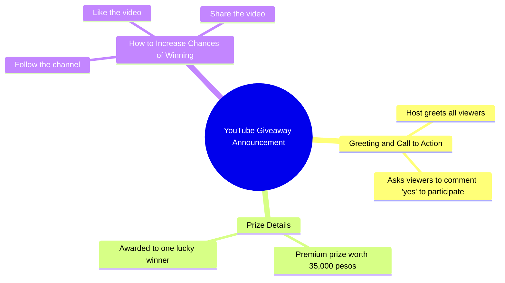

# Lucky Commenter Wins ₱35,000 Premium Prize

> 🌐 **Read this in:** [English](../../en/2026-09/tiktok-transcript-402k-views-18k-reactions-comment-nyo-na-mga-boss-baka-sa-iny-9869.md) · **中文**

> **Creator:** [@𝐀𝐋𝐀𝐰𝐢 𝐅𝐀𝐦𝐢𝐥𝐥𝐲](https://www.tiktok.com/@𝐀𝐋𝐀𝐰𝐢 𝐅𝐀𝐦𝐢𝐥𝐥𝐲) · **Views:** 175.3K · **Posted:** 2026-09-07 · **Niche:** other
>
> **TL;DR:** Immediately offers a high-value prize in exchange for a simple action, creating instant incentive.

[Watch original video →](https://www.facebook.com/share/v/1C37i6fHBT/)

## Why This Went Viral

## 钩子（前3秒）
- **逐字开场白：** “大家好！如果你们现在就在评论区写下‘yes’，我就会联系你们。”
- **钩子模式：** 直接互动 + 条件奖励（评论“yes”→ 我会联系你）。这是一种**行动号召式利诱**，而非提问或大胆宣言。
- **为何能阻止划走：** 它通过抛出一个具体的高价值奖品（₱35,000）并要求立即行动，制造了即时的错失恐惧（FOMO）。“ngayon din”（现在立刻）一词注入了紧迫感，迫使观众在理性思考跳过之前做出瞬间决定。

## 情绪节奏
- **节拍1 — 好奇/诱惑：** “Makikipag-ugnayan ako sa inyo”（我会联系你们）——暗示一种个人化、专属的连接。
- **节拍2 — 贪婪/期待：** “May premium 35,000 pesos para sa isang maswerteng mananalo”（有35,000比索的奖金给一位幸运的获胜者）——奖品具体、数额大，且被框定为靠运气（而非靠实力），让人觉得触手可及。
- **节拍3 — 紧迫/紧张：** “kung isusulat ninyo ang yes sa comment section ngayon din”（如果你们现在就在评论区写下yes）——压力骤增；观众觉得必须行动，否则就会错失良机。
- **节拍4 — 行动/承诺：** “pakifollow, like, at share”（请关注、点赞和分享）——要求从评论升级为全面互动，形成一种微型服从仪式。
- **高潮：** 说出奖品金额的那一刻。这是情绪峰值，因为它量化了奖励，并验证了评论行为的价值。
- **收尾：** 无——视频以行动清单结束，让观众处于一种未完成的紧张状态（我会赢吗？），这驱动了重复观看和分享。

## 关键词密度
- **“yes”** — 在开场中出现两次；核心行动词。通过评论速度驱动算法触达（评论=互动信号）。
- **“comment section”（评论区）** — 在语境中反复出现；算法触发评论数量的信号。
- **“35,000 pesos”（35,000比索）** — 确切奖品；高意图关键词，利于搜索和分享（人们会分享给需要钱的朋友）。
- **“mananalo”（获胜者）** — 情感拉力；唤起希望和个人关联感。
- **“follow, like, at share”（关注、点赞和分享）** — 明确的互动动词；算法触达的三重奏。
- **“ngayon din”（现在立刻）** — 紧迫感短语；情感拉力，非算法因素，但通过迫使立即行动来提升留存率。

**算法驱动词：** “yes”、“comment”（评论）、“follow”（关注）、“like”（点赞）、“share”（分享）——这些直接推高互动指标。
**情感驱动词：** “35,000”、“mananalo”（获胜者）、“ngayon din”（现在立刻）——这些触发欲望、希望和紧迫感。

## 为何能病毒式传播
- **评论诱饵循环：** 明确的“写下yes”指令创造了低摩擦行动。每条评论都会在算法中提升视频权重，而评论区本身也成为社会证明（别人都在参与，所以我也应该参与）。
- **奖品具体性：** “35,000比索”不是模糊的（“大奖”）——它是一个精确的、对菲律宾受众来说可感知的金额（大约相当于最低工资的3-4个月）。精确性增加了感知可信度和可分享性。
- **无截止日期的紧迫感：** “ngayon din”（现在立刻）制造压力但没有实际截止时间，所以观众会立即分享给朋友以“不错过”，尽管视频一直在线。
- **多步骤互动阶梯：** 评论 → 关注 → 点赞 → 分享。每一步都是独立的算法信号，视频训练观众按顺序完成全部四步，最大化分发。
- **运气框架：** “maswerteng mananalo”（幸运的获胜者）消除了技能门槛——任何人都能赢，因此可以分享给广泛的社交网络，而非小众受众。

## 你可以借鉴什么
1. **以条件奖励开场，而非问候。** 用“如果你[行动]，我就[奖励]”开头，而不是“嗨大家好，欢迎回来”。这会把价值主张前置，消除划走时间。
2. **使用精确的本地货币奖品。** 不要说“大赠送”，要说“₱35,000”或“$500”——精确数字触发具体欲望，更容易记住并在分享中复述。
3. **将互动要求堆叠在单句中。** 不要在结尾说“请点赞”。把它们捆绑在一起：“评论yes、关注、点赞和分享”——这一连串行动感觉像一项快速任务，而非四件独立琐事，而每一步都在喂养算法。

## Mind Map

## Full Transcript (Generated by [TokTranscript](https://toktranscript.com/?utm_source=github&utm_medium=breakdown&utm_campaign=tool_attribution))

> 📝 Transcripts on this page are auto-generated and show the first 60%. Want to transcribe any TikTok in 30 seconds and get the full version? [Try TokTranscript free →](https://toktranscript.com/?utm_source=github&utm_medium=breakdown&utm_campaign=transcript_cta)

Hello sa inyong lahat! Makikipag-ugnayan ako sa inyo kung isusulat ninyo ang yes sa comment section ngayon din. May premium 35,000 pesos para sa isan

*[Read the full transcript on TokTranscript →](https://toktranscript.com/plaza/tiktok-transcript-402k-views-18k-reactions-comment-nyo-na-mga-boss-baka-sa-iny-9869?utm_source=github&utm_medium=breakdown&utm_campaign=transcript_full)*

## Browse More

- All [other](../../by-niche/zh-CN/other.md) breakdowns
- All [Direct address + conditional reward](../../by-pattern/zh-CN/hook-direct-address-conditional-reward.md) examples

## Video Info

| | |
|---|---|
| Creator | [@𝐀𝐋𝐀𝐰𝐢 𝐅𝐀𝐦𝐢𝐥𝐥𝐲](https://www.tiktok.com/@𝐀𝐋𝐀𝐰𝐢 𝐅𝐀𝐦𝐢𝐥𝐥𝐲) |
| Original video | [https://www.facebook.com/share/v/1C37i6fHBT/](https://www.facebook.com/share/v/1C37i6fHBT/) |
| Original title | 402K views · 18K reactions | Comment nyo na mga boss baka sa inyo na sunod! 😱🥳 #ivanaalawi #monaalawi #ivanaalawireall #laptopwarehouse #lapag #dailyvlog #laptop #bossa #BossA #CrisHippers #Kuyamoboss #fistbump #TisayShin #filipina #iphone #pera #Pamorma #CrisHippers #laptop #bossa #Kuyamoboss #fistbump #sugodbahay | 𝐀𝐋𝐀𝐰𝐢 𝐅𝐀𝐦𝐢𝐥𝐥𝐲 |
| Views | 175.3K (175267) |
| Posted | 2026-09-07 |
| Duration | 0s |
| Niche | `other` |
| Hook pattern | `Direct address + conditional reward` |
| Original language | `en` (this page translated by AI) |
| Available languages | en, zh-CN |
| Generated | 2026-09-08 by [TokTranscript](https://toktranscript.com/) |

---

*This breakdown is for educational analysis under fair use. Original video © [@𝐀𝐋𝐀𝐰𝐢 𝐅𝐀𝐦𝐢𝐥𝐥𝐲](https://www.tiktok.com/@𝐀𝐋𝐀𝐰𝐢 𝐅𝐀𝐦𝐢𝐥𝐥𝐲). All transcripts are auto-generated and may contain errors.*

*Want to analyze your own TikToks like this? [TokTranscript 转录工具 →](https://toktranscript.com/viral-breakdown?utm_source=github&utm_medium=breakdown&utm_campaign=footer_cta)*