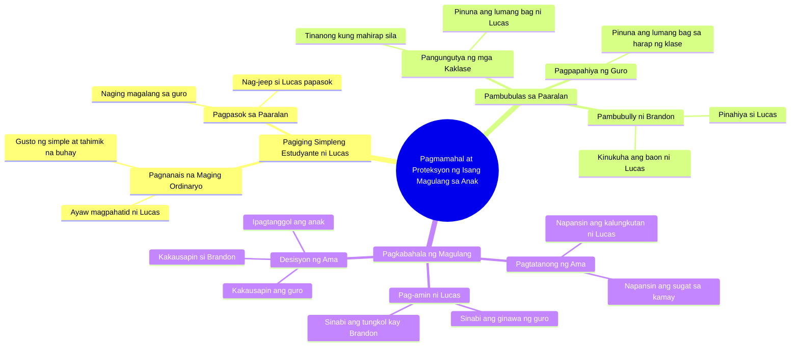

# Billionaire Dad Part 1: Daughter Rides Jeep to School

> 🌐 **Read this in:** [English](../../en/2026-09/tiktok-transcript-417k-views-19k-reactions-part-1-ang-bilyonaryong-tatay-melom-b4e7.md) · **中文**

> **Creator:** [@Melo Movie](https://www.tiktok.com/@Melo Movie) · **Views:** 243.5K · **Posted:** 2026-09-26 · **Niche:** entertainment
>
> **TL;DR:** Opens with a high-stakes, emotional question that immediately grabs attention and sets up a revenge/justice narrative.

[Watch original video →](https://www.facebook.com/share/v/1EgcxK3Hzh/)

## Why This Went Viral

## Hook（前3秒）
- **原文：** “谁打了我孩子？”——父亲脱口而出，没有铺垫，直接进入情绪化提问。
- **钩子模式：** 大胆提问 + 父母保护本能（家长进入危险模式）。
- **为什么让人停下滑动：** 立刻设定利害关系——有受害者、有施害者、有愤怒的家长。观众的大脑自动发问：*谁？为什么？发生了什么？*你无法滑过一个尚未被回答的问题。

## 情绪节奏
- **好奇（0–5秒）：** Lucas是个普通学生，不愿被接送——立刻制造悬念：为什么？
- **紧张升级（5–20秒）：** 老师和同学的羞辱（书包、午餐、“你们家很穷吗？”）——微伤害不断累积。
- **共鸣（20–30秒）：** “简单又安静”——任何经历过被排挤的人都能感同身受。
- **悬念飙升（30–45秒）：** “你的手怎么了？”+“我只是滑倒了”——经典的谎言，所有人都知道那是假话。
- **高潮（45–55秒）：** Lucas坦白——“我的老师让我丢脸……因为我的书包很旧。”
- **回报/宣泄（55秒–结尾）：** “谁打了我孩子？”——回到钩子，闭合循环，触发正义之怒 + 保护情绪。

## 关键词密度
- **“孩子”**——情感锚点，最强的拉力。
- **“Dad”**——建立父子纽带。
- **“书包”/“旧”**——羞耻与贫穷的具体象征。
- **“学校”/“老师”**——不公的设定，制度性背叛。
- **“打”/“嘲笑”**——冲突动词，推动剧情。
- **“为什么”/“谁”**——打开循环的疑问词。
- **“我没事”**——经典的压抑台词，共鸣度极高。
- **“简单又安静”**——向往的身份认同，引起大众共鸣。

**算法驱动因素：** “孩子”、“打”、“学校”、“老师”——在菲律宾受众中高搜索、高评论触发词。
**情感拉力：** “我没事”、“简单又安静”、“我的书包很旧”——这些促使用户分享和评论。

## 为什么它会传播
- **普遍的不公触发：** *“我的老师让我丢脸……因为我的书包很旧”*这句话击中了菲律宾学生的集体记忆——霸凌 + 老师羞辱 = 瞬间分享。
- **循环结构：** 回到开场白（*“谁打了我孩子？”*）——完美的重看诱饵，提高观看时长。
- **沉默受苦的套路：** *“没事，Dad。我只是滑倒了”*——每个观众都认识某个兄弟姐妹/孩子/经历过隐藏痛苦的人。他们评论“我哭了”。
- **家长作为复仇者：** 父亲作为保护者形象提供宣泄——Lucas不只是受害者，他有靠山。这是促使保存和分享的情感回报。
- **阶级共鸣：** “你们家很穷吗？”——直接击中90%受众的阶级问题。视频变得个人化。

## 你可以借鉴的
- **以有利害关系的问题开场：** 用一句有受害者、有对手、有情感赌注的话开头——不要铺垫。例如：“谁告诉你你不够好？”
- **用“谎言台词”制造悬念：** 让角色说谎（*“我只是滑倒了”*）——观众知道真相，所以紧张感上升，他们等待坦白。
- **将循环闭合回钩子：** 在结尾重复开场白（或其变体）——提高重看、分享和评论。这是短视频中最便宜的热门技巧。

## Mind Map

## Full Transcript (Generated by [拆解你自己的 TikTok](https://toktranscript.com/?utm_source=github&utm_medium=breakdown&utm_campaign=tool_attribution))

> 📝 Transcripts on this page are auto-generated and show the first 60%. Want to transcribe any TikTok in 30 seconds and get the full version? [Try TokTranscript free →](https://toktranscript.com/?utm_source=github&utm_medium=breakdown&utm_campaign=transcript_cta)

Sinong nanakit sa anak ko? Anak, hindi ka ba magpapahatid? Mag-jeep na lang ako, Dad. Sigurado ka? Gusto ko lang maging ordinaryong estudyante. Mauna na ako, Dad. Ganito lang ang gusto ko. Simple at tahimik. Toy, estudyante ka? Opo. Lucas! Oh, good morning. Lucas, seryoso ka ba? Yan pa rin ang bag mo? Hindi ka ba nahihiya? Mukha kang bagong lipat dito? Wala naman akong ginagawang masama. Pwede ba? Papasok na ako. Lucas, yan lang talaga gamit mo? Mahirap ba kayo kahit simpleng gamit hindi mo mabili? Sorry, ma'am. Ba't yan lang baon mo? Masarap naman. Pwede na sa akin. Akin na yan! Akin na yan! Lucas sure ka na okay ka Oo okay lang ako Lucas anak may problema ba Bakit parang malungkot ka W

*[Read the full transcript on TokTranscript →](https://toktranscript.com/plaza/tiktok-transcript-417k-views-19k-reactions-part-1-ang-bilyonaryong-tatay-melom-b4e7?utm_source=github&utm_medium=breakdown&utm_campaign=transcript_full)*

## Browse More

- All [entertainment](../../by-niche/zh-CN/entertainment.md) breakdowns
- All [Protective Parent Confrontation](../../by-pattern/zh-CN/hook-protective-parent-confrontation.md) examples

## Video Info

| | |
|---|---|
| Creator | [@Melo Movie](https://www.tiktok.com/@Melo Movie) |
| Original video | [https://www.facebook.com/share/v/1EgcxK3Hzh/](https://www.facebook.com/share/v/1EgcxK3Hzh/) |
| Original title | 417K views · 19K reactions | Part 1 | Ang Bilyonaryong Tatay #melomovie #drama | Melo Movie |
| Views | 243.5K (243506) |
| Posted | 2026-09-26 |
| Duration | 0s |
| Niche | `entertainment` |
| Hook pattern | `Protective Parent Confrontation` |
| Original language | `tl` (this page translated by AI) |
| Available languages | en, zh-CN |
| Generated | 2026-09-28 by [TokTranscript](https://toktranscript.com/) |

---

*This breakdown is for educational analysis under fair use. Original video © [@Melo Movie](https://www.tiktok.com/@Melo Movie). All transcripts are auto-generated and may contain errors.*

*Want to analyze your own TikToks like this? [TokTranscript 转录工具 →](https://toktranscript.com/viral-breakdown?utm_source=github&utm_medium=breakdown&utm_campaign=footer_cta)*