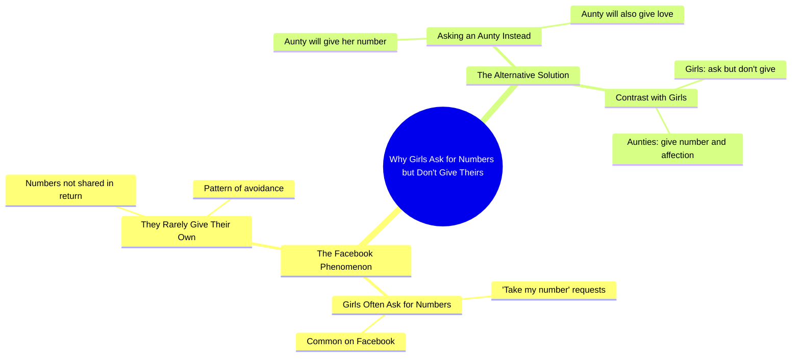

# Punjabi Girl Jokes About Aunties Giving Numbers on Facebook

> 🌐 **Read this in:** [English](../../en/2026-09/tiktok-transcript-5-2m-views-142k-reactions-han-btao-kon-hy-everyonehighlights-d414.md) · **中文**

> **Creator:** [@Nimra Ch](https://www.tiktok.com/@Nimra Ch) · **Views:** 2.0M · **Posted:** 2026-09-28 · **Niche:** entertainment
>
> **TL;DR:** It calls out a common behavior, creating immediate relatability and curiosity.

[Watch original video →](https://www.facebook.com/share/r/1ETmZ75W6q/)

## Why This Went Viral

## 钩子（前3秒）
- 逐字开场：“सब लड़कियां अकसर फेस्बुक पर जूट बोलती हैं के नंबर ले लो, लेकिन वो नंबर नहीं देते हैं”（“Facebook上的所有女孩总是说‘拿我的号码吧’，但她们从来不给。”）
- 钩子模式：**对比／点名**——先铺垫一种熟悉的挫败感，然后在同一句话里反转。
- 为什么能让人停下滚动：第一句就点出一个具体、有共鸣的抱怨（“女孩说会给号码，却不给”），让观众感觉被精准点名。未解决的“लेकिन”（但是）制造了一个开放循环，逼着人听下一句。

## 情绪节奏
- 第1拍——**认同／好奇**：“सब लड़कियां... नंबर ले लो”映射了一种常见经历，把观众拉进来。
- 第2拍——**紧张／挫败**：“लेकिन वो नंबर नहीं देते हैं”说出失望，积累轻微恼火。
- 第3拍——**反转／转向**：“कभी मुझ ज़से आंटी से नंबर मांगना”——说话者把自己重新定位为“आंटी”（阿姨），颠覆了预期的年轻女孩动态。
- 第4拍——**释放／回报（高潮）**：“वो नंबर भी देंगी और प्यार भी करेंगी”——笑点落在这里：她不仅会给号码，还会爱你。这是情绪峰值，也是最可能被引用／分享的一句。
- 高潮是最后一个小句；之前的一切都是为这个反转做铺垫。

## 关键词密度
- नंबर（号码）——重复3次；推动搜索／算法触达（高意图、常被搜索的词）。
- लड़कियां（女孩）——受众定位关键词；广泛情绪拉力。
- फेस्बुक（Facebook）——平台特定锚点；提升话题相关性和可分享性。
- बोलती हैं / देते हैं（说／给）——框定对比的动作动词。
- आंटी（阿姨）——反转关键词；承载幽默和文化共鸣。
- प्यार（爱）——情绪回报词；会被截图的那句。
- मुझ ज़से（像我这样的）——个性化提示；让说话者成为有共鸣的“另一个选项”。
- 算法驱动词：नंबर、फेस्बुक、लड़कियां（可搜索、高流量）。情绪拉力：आंटी、प्यार、说与做的对比。

## 为什么会传播
- **有共鸣的抱怨 → 即时自我代入**：“सब लड़कियां... नंबर नहीं देते हैं”映射了一种广泛共享的挫败感，所以观众会标记经历过这种事的朋友。
- **颠覆预期**：转向“मुझ ज़से आंटी”翻转了年轻女孩的刻板印象，制造惊喜，奖励看到最后的人。
- **可引用的金句**：“वो नंबर भी देंगी और प्यार भी करेंगी”短、有节奏、适合做梗——非常适合评论、字幕和合拍。
- **通过“आंटी”制造文化幽默**：在南亚互联网文化中，阿姨人设自带喜剧和亲昵含义，让这句话能跨年龄层传播。
- **紧凑循环**：整个视频就是一句话，带铺垫—回报结构，所以容易重看、二创和引用——这是短视频病毒传播的核心机制。

## 你可以借鉴什么
- **在前3秒用一个具体、有共鸣的抱怨开场**（“所有人都说X，但他们从来不做Y”），触发即时认同。
- **在句子中间用硬转向**（“但是……”）制造开放循环，迫使观众继续看下去等回报。
- **用一句短而有节奏的金句收尾**，容易引用、做字幕或截图——把你的最后一句设计成可分享的资产。

## Mind Map

## Full Transcript (Generated by [TikTok 转录工具](https://toktranscript.com/?utm_source=github&utm_medium=breakdown&utm_campaign=tool_attribution))

> 📝 Transcripts on this page are auto-generated and show the first 60%. Want to transcribe any TikTok in 30 seconds and get the full version? [Try TokTranscript free →](https://toktranscript.com/?utm_source=github&utm_medium=breakdown&utm_campaign=transcript_cta)

सब लड़कियां अकसर फेस्बुक पर जूट बोलती हैं के नंबर ले लो, लेकिन वो नंबर नहीं देते हैं, कभी मुझ

*[Read the full transcript on TokTranscript →](https://toktranscript.com/plaza/tiktok-transcript-5-2m-views-142k-reactions-han-btao-kon-hy-everyonehighlights-d414?utm_source=github&utm_medium=breakdown&utm_campaign=transcript_full)*

## Browse More

- All [entertainment](../../by-niche/zh-CN/entertainment.md) breakdowns
- All [Callout/Contrast](../../by-pattern/zh-CN/hook-callout-contrast.md) examples

## Video Info

| | |
|---|---|
| Creator | [@Nimra Ch](https://www.tiktok.com/@Nimra Ch) |
| Original video | [https://www.facebook.com/share/r/1ETmZ75W6q/](https://www.facebook.com/share/r/1ETmZ75W6q/) |
| Original title | 5.2M views · 142K reactions | Han btao Kon Hy #everyonehighlights #facebookreels #NimraCh #viralreels #facebookvideo #follower #punjabigirl #reels #fyp #everyone | Nimra Ch |
| Views | 2.0M (1962765) |
| Posted | 2026-09-28 |
| Duration | 0s |
| Niche | `entertainment` |
| Hook pattern | `Callout/Contrast` |
| Original language | `en` (this page translated by AI) |
| Available languages | en, zh-CN |
| Generated | 2026-09-29 by [TokTranscript](https://toktranscript.com/) |

---

*This breakdown is for educational analysis under fair use. Original video © [@Nimra Ch](https://www.tiktok.com/@Nimra Ch). All transcripts are auto-generated and may contain errors.*

*Want to analyze your own TikToks like this? [免费 TikTok 文稿生成器 →](https://toktranscript.com/viral-breakdown?utm_source=github&utm_medium=breakdown&utm_campaign=footer_cta)*