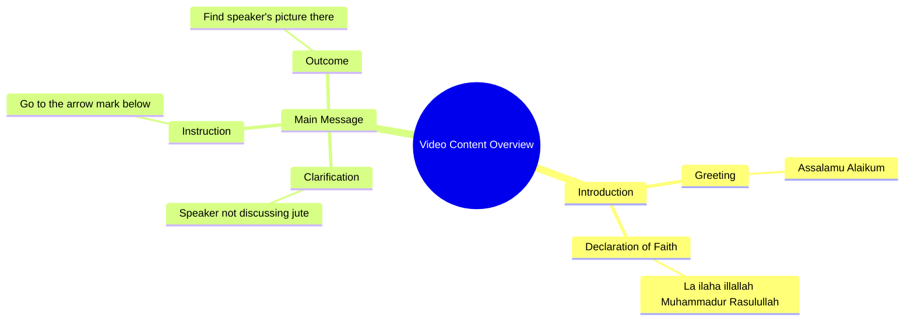

# Islamic Greeting and Shahada Recitation by Sanam

> 🌐 **Read this in:** [English](../../en/2026-09/tiktok-transcript-5-6m-views-150k-reactions-f491.md) · **中文**

> **Creator:** [@صنم](https://www.tiktok.com/@صنم) · **Views:** 2.0M · **Posted:** 2026-09-23 · **Niche:** other
>
> **TL;DR:** The speaker makes a bold claim that she is not lying, which challenges the viewer's trust and sparks curiosity.

[Watch original video →](https://www.facebook.com/share/r/19MJ7fqYvQ/)

## Why This Went Viral

## 钩子（前3秒）
- 以“असलाम लेकुम”（伊斯兰问候）开场，紧接着是清真言：“ला इलाह इलल्ला मुहम्मद रर्सूल उल्ला”——在第一口气中就传达出神圣的信仰宣言。
- 钩子模式：**反差 / 禁忌并置**——神圣的宗教诵念与平淡、几乎带有调情意味的转向（“我不是在跟你说话，去下面的箭头”）配对。
- 观众停下来是因为大脑遭遇了模式中断：宗教套语被用作*内容装置*，而非祈祷。好奇心瞬间被点燃——“她为什么在这里说清真言？”

## 情绪节奏
- **节拍1（0–1秒）：好奇 + 敬畏**——问候和清真言在穆斯林观众中触发熟悉感和尊重。
- **节拍2（1–3秒）：困惑 / 轻微紧张**——“मैं जूट नहीं बोल रही”（“我没有撒谎 / 不是开玩笑”）制造歧义；这是真诚还是诱饵？
- **节拍3（3–5秒）：转向 / 揭示**——“नीचे तीर के निशान में जाएं, वहां आपको मेरी तस्वीर मिल जाएगी”（“去下面的箭头，你会在那里找到我的照片”）将语气从神圣翻转为推广。
- **高潮：** 关于箭头的那句转折——观众意识到清真言是钩子，而不是布道的时刻。那种不协调*就是*回报。
- **共鸣：** 对宗教观众来说，虔诚与自我推广的混合要么好笑，要么大胆，要么冒犯——三者都会推动评论。

## 关键词密度
- **असलाम लेकुम**（问候）——情感拉力，群体内识别
- **ला इलाह इलल्ला मुहम्मद रर्सूल उल्ला**（清真言）——算法和情绪峰值；高评论触发器
- **जूट नहीं बोल रही**（“没有撒谎/开玩笑”）——可信度标记，张力构建器
- **नीचे तीर के निशान**（“下面的箭头”）——CTA，推动完播和个人主页点击
- **तस्वीर**（“照片”）——好奇心缺口，承诺揭示
- **मैं / आपको**（我 / 你）——直接称呼，准社会拉力
- 算法驱动因素：清真言 + 问候（穆斯林内容细分领域中高搜索/评论量）。情感驱动因素：“मेरी तस्वीर”（我的照片）——个人揭示承诺。

## 为什么它会传播
- **神圣与世俗相遇的冲击：** 背诵清真言，然后转向“去箭头看我的照片”，制造出观众*必须*做出反应的认知失调——评论区会同时爆发辩护和娱乐。
- **群体内信号：** “असलाम लेकुम”立即筛选受众——穆斯林观众感到被直接称呼，非穆斯林观众感到像窥视者，两者都会继续观看。
- **钩子内置CTA：** “नीचे तीर के निशान में जाएं”迫使重看或个人主页点击，提升观看时长和个人主页访问信号。
- **歧义引擎：** “मैं जूट नहीं बोल रही”让观众不确定这是讽刺、真诚还是诱饵——歧义 = 评论 = 传播。
- **短且可循环：** 整个片段不到10秒，因此可以干净地循环播放并抬高平均观看百分比。

## 你可以借鉴什么
- **用你所在领域的高识别度短语开场**（问候语、口号、名言）——它能在转向之前为你争取1–2秒的注意力。
- **在神圣/严肃的开场与随意的CTA之间插入一次刻意的语气急转**——这种不协调就是分享触发器。
- **把CTA埋在钩子本身里**（“去下面的箭头”），这样观众甚至在决定是否继续观看之前就必须行动或重看。

## Mind Map

## Full Transcript (Generated by [TikTok 转录工具](https://toktranscript.com/?utm_source=github&utm_medium=breakdown&utm_campaign=tool_attribution))

> 📝 Transcripts on this page are auto-generated and show the first 60%. Want to transcribe any TikTok in 30 seconds and get the full version? [Try TokTranscript free →](https://toktranscript.com/?utm_source=github&utm_medium=breakdown&utm_campaign=transcript_cta)

असलाम लेकुम, सुनो ला इलाह इलल्ला मुहम्मद रर्सूल उल्ला, मैं जूट नहीं बोल रही, नीचे

*[Read the full transcript on TokTranscript →](https://toktranscript.com/plaza/tiktok-transcript-5-6m-views-150k-reactions-f491?utm_source=github&utm_medium=breakdown&utm_campaign=transcript_full)*

## Browse More

- All [other](../../by-niche/zh-CN/other.md) breakdowns
- All [Controversial Statement](../../by-pattern/zh-CN/hook-controversial-statement.md) examples

## Video Info

| | |
|---|---|
| Creator | [@صنم](https://www.tiktok.com/@صنم) |
| Original video | [https://www.facebook.com/share/r/19MJ7fqYvQ/](https://www.facebook.com/share/r/19MJ7fqYvQ/) |
| Original title | 5.6M views · 150K reactions | اسلام علیکم لاء لاالہ الااللہ | صنم |
| Views | 2.0M (2009368) |
| Posted | 2026-09-23 |
| Duration | 0s |
| Niche | `other` |
| Hook pattern | `Controversial Statement` |
| Original language | `en` (this page translated by AI) |
| Available languages | en, zh-CN |
| Generated | 2026-09-25 by [TokTranscript](https://toktranscript.com/) |

---

*This breakdown is for educational analysis under fair use. Original video © [@صنم](https://www.tiktok.com/@صنم). All transcripts are auto-generated and may contain errors.*

*Want to analyze your own TikToks like this? [TokTranscript 转录工具 →](https://toktranscript.com/viral-breakdown?utm_source=github&utm_medium=breakdown&utm_campaign=footer_cta)*