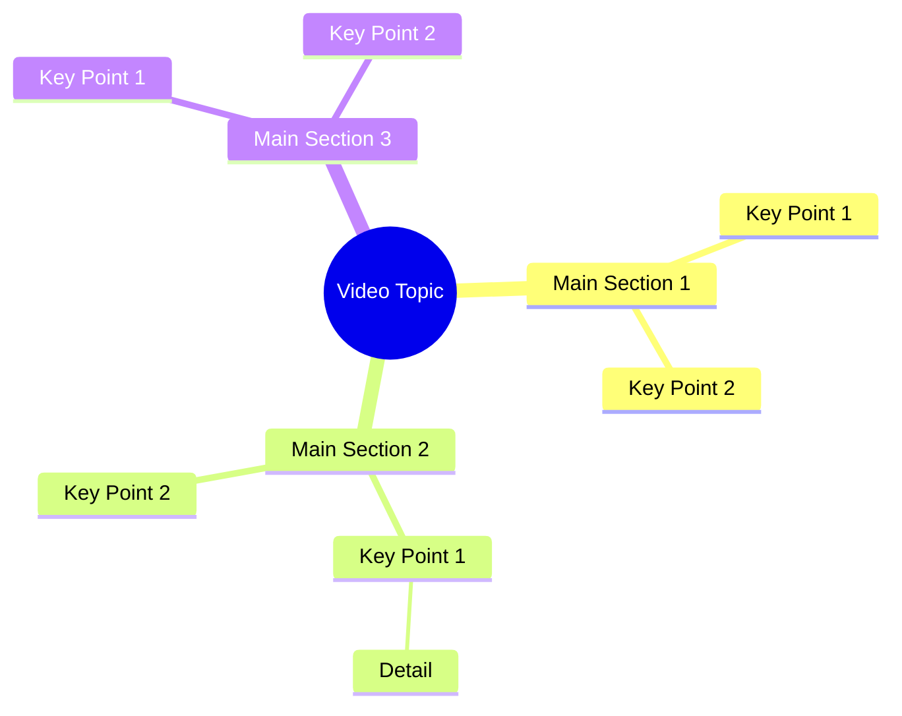

# Respect and Trust Build a Strong Relationship

> 🌐 **Read this in:** [English](../../en/2026-09/tiktok-transcript-5-9m-views-236k-reactions-s-s-s-reels-emotional-relationship-d005.md) · **中文**

> **Creator:** [@SᴏᴜʟSᴄʀɪᴘᴛ Sᴛᴜᴅɪᴏ](https://www.tiktok.com/@SᴏᴜʟSᴄʀɪᴘᴛ Sᴛᴜᴅɪᴏ) · **Views:** 2.4M · **Posted:** 2026-09-30 · **Niche:** other
>
> **TL;DR:** The hook immediately introduces a shocking scenario that compels viewers to keep watching.

[Watch original video →](https://www.facebook.com/share/r/19RNpTokTW/)

## Why This Went Viral

## 钩子（前3秒）
- 开场白是一句连珠炮式的非英语（孟加拉文）宣言：“જોદી શામી નિશેત કરેન તાહોલે સ્ત્રીર નિજેર બાબામાયાર બારીતેઓ જાવાર ઓધિકારની કારોન બીએર પળ એક જોન નારીર ઉપર તાર બાબા માર છે……”——一句密集而强硬的话，关于一个女人、一个“巴巴”以及权利/侵害。
- 钩子模式：**大胆断言 + 对比**（女人的权利 vs. 权威人物的侵害），零铺垫直接抛出。
- 它能让人停下滚动，是因为它一开场就切入冲突之中，带着指控性的、高风险的主张。没有任何铺垫——观众直接被丢进一桩冤屈里，这会触发要么是认同（“这事发生在我/我们身上”），要么是愤怒（“这个巴巴是谁？”）。陌生的文字/音频也为圈外观众制造了好奇心缺口。

## 情绪节奏
- **第1拍——好奇/困惑（0–2秒）：** 一句密集而陌生的主张，迫使观众去解析到底在说什么。
- **第2拍——紧张（2–6秒）：** 反复出现的“બાબા”（巴巴）和“ઓધિકાર”（权利/权威）营造出一种不公感——某个有权力的人正在被指控。
- **第3拍——共鸣（中段）：** “સ્ત્રીર”（女人的）+“ઓધિકાર”（权利）落地为一个普世的冤屈框架——女性权利被男性权威侵害。
- **第4拍——高潮：** “તાર બાબા માર છે”（“你的巴巴是我的/被打”）这句——对巴巴的直接指控——是情绪峰值。正是在这一刻，模糊的紧张变成了具体的靶子。
- **第5拍——舒缓/收束：** 结尾的“પ્રોતેક્ટા નારીર બોઝાઓ ચી”转向保护/捍卫的框架（“保护女人”），给观众一个可以抓住的道德落点。

## 关键词密度
- **બાબા（巴巴）**——反派标签；驱动情绪拉力（反派塑造）。
- **ઓધિકાર（权利/权威）**——反复出现；连接算法触达（权利话语）与情绪拉力（不公）。
- **સ્ત્રીર / નારીર（女人的）**——身份关键词；在性别正义类内容中情绪共鸣强、易分享。
- **માર（打/击）**——暴力触发词；拉高留存和评论区互动。
- **પ્રોતેક્ટા（保护）**——收束关键词；把视频软化为一条“呼吁捍卫”的信息。
- **નિજેર / નિશેત（自己/自身）**——个人化关键词；让主张显得私密切身。
- **算法触达驱动词：**“ઓધિકાર”（权利）和“સ્ત્રીર”（女人）——这些是高流量、高互动的话题标签。
- **情绪拉力驱动词：**“બાબા”（巴巴）和“માર”（打）——这些制造了反派/受害者的动态，助长评论和分享。

## 为什么会传播
- **反派塑造明确且反复：**“તાર બાબા માર છે”直接点名了一个靶子（“巴巴”），给观众一个可以反击的对象——愤怒是最强的分享触发器。
- **普世冤屈框架：**“સ્ત્રીર……ઓધિકાર”（女人的权利）把视频接入一场持续进行、情绪高涨的社会对话，因此它能传播到原语言社群之外。
- **密度高于清晰度：** 转录文本在很短的篇幅里塞满了相互重叠的主张——观众会反复观看以解析它，从而提升观看时长和循环率。
- **内置道德收束：** 结尾的“પ્રોતેક્ટા નારીર”（保护女人）给观众一个清晰的立场可站，把被动观众转化为评论者和分享者。
- **身份 + 权威冲突：**“巴巴”（宗教/社群权威）vs.“女性权利”这条轴线是一个经典的高冲突框架，能可靠地在评论区引发争论。

## 你可以借鉴什么
1. **从冲突中开场，而不是从铺垫中开场。** 第一句就用指控或利害关系开头——绝不用背景。转录文本的第一个词就已经是一个主张，而不是问候。
2. **重复你的反派关键词和受害者关键词。**“બાબા”和“સ્ત્રીર”反复出现，因为重复能锚定情绪框架。选两个关键词（一个反派、一个受害者），每个至少击中两次。
3. **以保护性/行动号召的调子收尾。** 最后的“પ્રોતેક્ટા”那句把紧张转化为可分享的道德。用一句收束或捍卫来结束你的视频，让观众知道该站哪一边——并分享。

## Mind Map

## Full Transcript (Generated by [我们用的转录工具](https://toktranscript.com/?utm_source=github&utm_medium=breakdown&utm_campaign=tool_attribution))

> 📝 Transcripts on this page are auto-generated and show the first 60%. Want to transcribe any TikTok in 30 seconds and get the full version? [Try TokTranscript free →](https://toktranscript.com/?utm_source=github&utm_medium=breakdown&utm_campaign=transcript_cta)

જોદી શામી નિશેત કરેન તાહોલે સ્ત્રીર નિજેર બાબામાયાર બારીતેઓ જાવાર ઓધિકારની કારોન બીએર પળ એક જોન નારીર ઉપર તાર

*[Read the full transcript on TokTranscript →](https://toktranscript.com/plaza/tiktok-transcript-5-9m-views-236k-reactions-s-s-s-reels-emotional-relationship-d005?utm_source=github&utm_medium=breakdown&utm_campaign=transcript_full)*

## Browse More

- All [other](../../by-niche/zh-CN/other.md) breakdowns
- All [Shock Reveal](../../by-pattern/zh-CN/hook-shock-reveal.md) examples

## Video Info

| | |
|---|---|
| Creator | [@SᴏᴜʟSᴄʀɪᴘᴛ Sᴛᴜᴅɪᴏ](https://www.tiktok.com/@SᴏᴜʟSᴄʀɪᴘᴛ Sᴛᴜᴅɪᴏ) |
| Original video | [https://www.facebook.com/share/r/19RNpTokTW/](https://www.facebook.com/share/r/19RNpTokTW/) |
| Original title | 5.9M views · 236K reactions | সম্পর্ক সুন্দর হয় পারস্পরিক সম্মান, বোঝাপড়া আর বিশ্বাসে। 🖤🥀✅ #SᴏᴜʟSᴄʀɪᴘᴛSᴛᴜᴅɪᴏ #reels #emotional #relationship #reality #ভালোবাসা #মায়া #সংসার #সম্পর্ক #সম্মান #বিশ্বাস #বাস্তবকথা #জীবনেরকথা | SᴏᴜʟSᴄʀɪᴘᴛ Sᴛᴜᴅɪᴏ |
| Views | 2.4M (2358397) |
| Posted | 2026-09-30 |
| Duration | 0s |
| Niche | `other` |
| Hook pattern | `Shock Reveal` |
| Original language | `en` (this page translated by AI) |
| Available languages | en, zh-CN |
| Generated | 2026-09-30 by [TokTranscript](https://toktranscript.com/) |

---

*This breakdown is for educational analysis under fair use. Original video © [@SᴏᴜʟSᴄʀɪᴘᴛ Sᴛᴜᴅɪᴏ](https://www.tiktok.com/@SᴏᴜʟSᴄʀɪᴘᴛ Sᴛᴜᴅɪᴏ). All transcripts are auto-generated and may contain errors.*

*Want to analyze your own TikToks like this? [拆解你自己的 TikTok →](https://toktranscript.com/viral-breakdown?utm_source=github&utm_medium=breakdown&utm_campaign=footer_cta)*