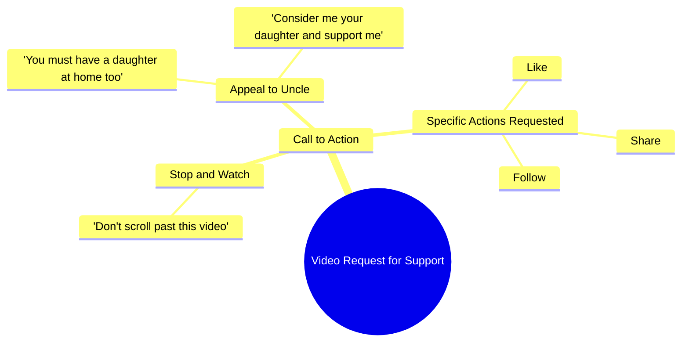

# Uncle, Please Support Me Like Your Own Daughter

> 🌐 **Read this in:** [English](../../en/2026-09/tiktok-transcript-6-2m-views-460k-reactions-03045658506-b71d.md) · **中文**

> **Creator:** [@03045658506](https://www.tiktok.com/@03045658506) · **Views:** 2.4M · **Posted:** 2026-09-21 · **Niche:** entertainment
>
> **TL;DR:** The hook stops the scroll by directly addressing 'chacha' and invoking a universal emotional trigger about having a daughter.

[Watch original video →](https://www.facebook.com/reel/1731520928144624/?app=fbl)

## Why This Went Viral

## 钩子（前3秒）
- **逐字开场：** “सुनो चाचा एक मिनिट रुख जो वीडियो आगे मत करो”（“听着，叔叔，等一下——别划走这个视频”）
- **钩子模式：** 直接命令 + 打断（“रुख जो” = 就停在那儿）针对特定的人（“चाचा” = 叔叔）。
- **为什么能阻止划走：** 它打破第四面墙并发出祈使句。观众被直接称为“चाचा”，瞬间建立亲近感。命令“别划走”触发逆反心理——大脑会暂停，想弄清楚*为什么*被要求停下。这是一个伪装成个人恳求的模式打断。

## 情绪节奏
- **第1拍——打断/好奇（0–2秒）：** “सुनो चाचा एक मिनिट रुख”——突然停下，略带命令语气。观众心想：这是谁，为什么是我？
- **第2拍——情绪升级（2–5秒）：** “आपके घर में भी बेटी होगी ना”——转向共同的情感真相（你也有女儿吧）。好奇转化为共情。
- **第3拍——脆弱/共鸣（5–7秒）：** “मुझे भी अपनी बेटी समझ कर सपोर्ट करो”——自我放低（“把我当成你的女儿”）。这是**高潮**——情感峰值，创作者将自己重新定位为一个求助的孩子。
- **第4拍——释然/行动（7–9秒）：** “बस एक लाइक एक शेयर एक फॉलो कर दो प्लीज चाचा”——缓和为一个微小、低成本的请求。紧张感化解为清晰的行动号召。
- **反转落点：** 反转在于角色对调——创作者把自己定位为观众的*女儿*，而不是内容制作者。正是这种重新定位让恳求在情感上打动人，而不是让人觉得在乞讨。

## 关键词密度
- **चाचा（叔叔）**——关系锚点，驱动亲近感和评论区互动。
- **बेटी（女儿）**——情感拉力最强的关键词；触发保护本能。
- **सपोर्ट（支持）**——柔和、不强求的请求；算法上中性但情感上温暖。
- **लाइक / शेयर / फॉलो**——纯算法触达关键词；明确的互动信号。
- **प्लीज（请）**——谦逊标记；降低观众抵触。
- **वीडियो आगे मत करो（别划走）**——留存触发词；直接针对观看时长指标。
- **घर（家）**——亲密词；让恳求感觉像家庭内部，而非商业行为。

**算法 vs. 情感的分野：** *लाइक、शेयर、फॉलो、वीडियो आगे मत करो* 驱动触达（它们对应互动和留存信号）。*चाचा、बेटी、घर、सपोर्ट* 驱动情感拉力——它们让观众*想要*配合，而不只是看到行动号召。

## 为什么它会传播
- **用亲属称谓武器化共鸣。** “चाचा”和“बेटी”在5秒内把陌生人变成家人。观众分享它，因为感觉像在帮亲戚，而不是在捧创作者。
- **无负罪感的互惠。** “आपके घर में भी बेटी होगी ना”创造了一面镜子——观众想象自己的女儿处在这个位置。分享变成一种道德行为，而不是帮忙。
- **微承诺行动号召。** “बस एक लाइक एक शेयर एक फॉलो”——“बस”（只是/仅仅）这个词把请求缩小到几乎零成本。低摩擦 = 高转化。
- **命令式留存。** “वीडियो आगे मत करो”直接攻击划走反射，提升平均观看时长——这是短视频平台上最强的排名信号。
- **情感悬念结构。** 观众直到第3–4秒才知道*为什么*被拦下。那个未解开的“为什么”让他们看到最后，请求才终于出现。

## 你可以借鉴什么
- **以对特定人物的直接命令开场。** “रुख जो” / “等等，别划走”比泛泛的开场白表现更好，因为它感觉个人化并打断自动驾驶。
- **把你的请求重新定位为家庭帮忙，而不是行动号召。** 把“请点赞订阅”换成关系框架（“把我当成你的[儿子/女儿/邻居]”）——它把负罪感转化为温暖。
- **把请求推迟到情感节拍之后。** 这个视频先用共情赢得行动号召，然后再提出请求。以“点赞关注”开头会扼杀留存；以情感开头才能赢得点击。

## Mind Map

## Full Transcript (Generated by [TokTranscript](https://toktranscript.com/?utm_source=github&utm_medium=breakdown&utm_campaign=tool_attribution))

> 📝 Transcripts on this page are auto-generated and show the first 60%. Want to transcribe any TikTok in 30 seconds and get the full version? [Try TokTranscript free →](https://toktranscript.com/?utm_source=github&utm_medium=breakdown&utm_campaign=transcript_cta)

सुनो चाचा एक मिनिट रुख जो वीडियो आगे मत करो आपके घर में भी बेटी होगी ना मुझे भी अपनी बेटी 

*[Read the full transcript on TokTranscript →](https://toktranscript.com/plaza/tiktok-transcript-6-2m-views-460k-reactions-03045658506-b71d?utm_source=github&utm_medium=breakdown&utm_campaign=transcript_full)*

## Browse More

- All [entertainment](../../by-niche/zh-CN/entertainment.md) breakdowns
- All [Emotional Appeal + Direct Address](../../by-pattern/zh-CN/hook-emotional-appeal-direct-address.md) examples

## Video Info

| | |
|---|---|
| Creator | [@03045658506](https://www.tiktok.com/@03045658506) |
| Original video | [https://www.facebook.com/reel/1731520928144624/?app=fbl](https://www.facebook.com/reel/1731520928144624/?app=fbl) |
| Original title | 6.2M views · 460K reactions | سنو چاچا | 03045658506 |
| Views | 2.4M (2394551) |
| Posted | 2026-09-21 |
| Duration | 0s |
| Niche | `entertainment` |
| Hook pattern | `Emotional Appeal + Direct Address` |
| Original language | `en` (this page translated by AI) |
| Available languages | en, zh-CN |
| Generated | 2026-09-22 by [TokTranscript](https://toktranscript.com/) |

---

*This breakdown is for educational analysis under fair use. Original video © [@03045658506](https://www.tiktok.com/@03045658506). All transcripts are auto-generated and may contain errors.*

*Want to analyze your own TikToks like this? [TokTranscript 转录工具 →](https://toktranscript.com/viral-breakdown?utm_source=github&utm_medium=breakdown&utm_campaign=footer_cta)*