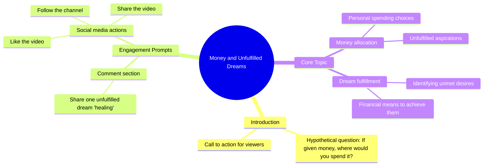

# Laptop Giveaway Comment to Win

> 🌐 **Read this in:** [English](../../en/2026-09/tiktok-transcript-655k-views-27k-reactions-comment-nyo-na-mga-boss-baka-sa-iny-d5f1.md) · **中文**

> **Creator:** [@𝐌𝟎𝐧𝐚 𝐀𝐥𝐚𝐰𝐢 𝐅𝐚𝐧𝐬..gmrs](https://www.tiktok.com/@𝐌𝟎𝐧𝐚 𝐀𝐥𝐚𝐰𝐢 𝐅𝐚𝐧𝐬..gmrs) · **Views:** 305.9K · **Posted:** 2026-09-05 · **Niche:** other
>
> **TL;DR:** The hook immediately engages viewers by offering a hypothetical windfall, prompting them to imagine and comment.

[Watch original video →](https://www.facebook.com/share/r/1MvTr1sDqK/?mibextid=wwXIfr)

## Why This Went Viral

## 钩子（前3秒）
- **逐字开场白：** “如果我给你钱，你会用它做什么？”
- **钩子模式：** 提问 + 假设情境（条件式“如果” + 直接称呼）
- **为何能阻止滑动：** 它迫使观众进行即时心理模拟。观众不只是观看——他们会回答。这是一个低风险、高想象力的提示，让人感觉具有个人针对性（你），并触及渴望。问题足够开放以引发好奇心，但又足够具体，使人在决定是否观看之前就产生即时的内心回应。

## 情绪节奏
- **节拍1 – 好奇（0–1秒）：** 问题打断了被动滑动。大脑自动补全：“我会怎么做？”
- **节拍2 – 期待（1–3秒）：** 观众等待下一个指令——有什么陷阱？背景是什么？
- **节拍3 – 张力/参与（3–5秒）：** 行动号召（“写在评论区”）制造了一个决策时刻。他们会参与还是不参与？这是一个微承诺时刻。
- **节拍4 – 社会义务/共鸣（5–7秒）：** “尚未完成的疗愈”这一短语将语气从轻松转为感性。它重新定义了金钱——金钱是疗愈的工具，而不仅仅是消费——这在经济困难和家庭责任普遍存在的文化中深深引发共鸣。
- **节拍5 – 高潮（最后一句）：** 三重请求（关注、点赞、分享）作为释放点落地。情绪峰值实际上是*参与的邀请*，而非叙事转折。高潮是观众意识到自己的评论可能被看到和被认可的瞬间。
- **没有视觉转折或揭露——情绪弧线完全建立在自我投射和社区互动承诺之上。**

## 关键词密度
- **Pera（金钱）** – 出现1次，但贯穿始终。驱动核心幻想/渴望。
- **Saan（哪里）** – 出现1次。迫使回答具体化的空间/行动词。
- **Gagamitin（使用/将使用）** – 出现1次。以行动为导向，务实。
- **Comment section（评论区）** – 出现1次。触发互动量的算法关键词。
- **Hindi pa natutupad（尚未实现/未完成）** – 出现1次。情绪重锤——暗示未满足的愿望、遗憾、希望。
- **Healing（疗愈）** – 出现1次。一个具有文化共鸣的术语（心理健康、家庭创伤、财务疗愈），将视频从“谈钱”提升到“个人成长”。
- **Follow / Like / Share（关注/点赞/分享）** – 出现3次。直接的算法指令。

**算法触达：** “评论”“关注”“点赞”“分享”是明确的互动信号，可提升视频在推荐系统中的权重。
**情绪吸引力：** “疗愈”和“尚未实现”是让人们感到*被看见*而非仅仅被娱乐的词。

## 为何能传播
- **普适问题，个人答案：** “如果我给你钱”是每个人都曾幻想过的场景。它不需要专业知识——任何人都能回答，这扩大了潜在评论池。这个问题是自我表达的*入口*。
- **“疗愈”重构是秘密武器：** 不是“你会买什么？”而是“你会疗愈什么？”这把视频从物质层面转向情感层面，使其具有可分享性，因为它感觉有意义而非肤浅。观众会@那些“需要疗愈”或有未实现梦想的朋友。
- **评论区即内容：** 该视频旨在生成一串个人故事。每条评论都是一个迷你视频，延长了原始帖子的生命周期。创作者不需要提供价值——观众为彼此创造价值。
- **低制作成本，高心理触发：** 文案纯粹是口头的。没有视觉依赖，这意味着它适用于任何格式（文字叠加、配音、甚至静态图片）。它是一个可以无限混搭的模板。
- **文化特异性与普适吸引力并存：** 菲律宾语短语“hindi pa natutupad na healing”触及菲律宾文化背景（家庭恩情、经济牺牲），但核心问题可以跨语言翻译——使其成为一种可以本地化并在全球重新分享的格式。

## 你可以借鉴什么
- **提出一个迫使个人化、具体化回答的问题，而非泛泛的观点。** “你会用它做什么？”比“你想要钱吗？”更好，因为它迫使观众想象一个场景。使用“哪里/什么/谁”类问题，而非“是/否”类。
- **用情感视角重构一个常见话题。** 不要问“你会买什么？”要问“你会疗愈什么？”或“你会修复什么？”这增加了深度，使内容感觉不那么功利、更有人情味——从而提高可分享性。
- **将视频设计为评论诱饵引擎，而非独白。** 以直接指令结尾，邀请观众讲述故事（“在评论区写下你尚未完成的一项疗愈”）。目标是让观众成为内容本身，而不仅仅是消费者。

## Mind Map

## Full Transcript (Generated by [拆解你自己的 TikTok](https://toktranscript.com/?utm_source=github&utm_medium=breakdown&utm_campaign=tool_attribution))

> 📝 Transcripts on this page are auto-generated and show the first 60%. Want to transcribe any TikTok in 30 seconds and get the full version? [Try TokTranscript free →](https://toktranscript.com/?utm_source=github&utm_medium=breakdown&utm_campaign=transcript_cta)

Kung bibigyan kita ng pera, saan mo ito gagamitin? Isulat sa comment section ang isa sa iyong mga hindi pa natutupad

*[Read the full transcript on TokTranscript →](https://toktranscript.com/plaza/tiktok-transcript-655k-views-27k-reactions-comment-nyo-na-mga-boss-baka-sa-iny-d5f1?utm_source=github&utm_medium=breakdown&utm_campaign=transcript_full)*

## Browse More

- All [other](../../by-niche/zh-CN/other.md) breakdowns
- All [Hypothetical question](../../by-pattern/zh-CN/hook-hypothetical-question.md) examples

## Video Info

| | |
|---|---|
| Creator | [@𝐌𝟎𝐧𝐚 𝐀𝐥𝐚𝐰𝐢 𝐅𝐚𝐧𝐬..gmrs](https://www.tiktok.com/@𝐌𝟎𝐧𝐚 𝐀𝐥𝐚𝐰𝐢 𝐅𝐚𝐧𝐬..gmrs) |
| Original video | [https://www.facebook.com/share/r/1MvTr1sDqK/?mibextid=wwXIfr](https://www.facebook.com/share/r/1MvTr1sDqK/?mibextid=wwXIfr) |
| Original title | 655K views · 27K reactions | Comment nyo na mga boss baka sa inyo na sunod! 😱🥳 #ivanaalawi #laptopwarehouse #lapag #dailyvlog #laptop #bossa #BossA #Pamorma #CrisHippers #Kuyamoboss #fistbump | 𝐌𝟎𝐧𝐚 𝐀𝐥𝐚𝐰𝐢 𝐅𝐚𝐧𝐬..gmrs |
| Views | 305.9K (305890) |
| Posted | 2026-09-05 |
| Duration | 0s |
| Niche | `other` |
| Hook pattern | `Hypothetical question` |
| Original language | `en` (this page translated by AI) |
| Available languages | en, zh-CN |
| Generated | 2026-09-05 by [TokTranscript](https://toktranscript.com/) |

---

*This breakdown is for educational analysis under fair use. Original video © [@𝐌𝟎𝐧𝐚 𝐀𝐥𝐚𝐰𝐢 𝐅𝐚𝐧𝐬..gmrs](https://www.tiktok.com/@𝐌𝟎𝐧𝐚 𝐀𝐥𝐚𝐰𝐢 𝐅𝐚𝐧𝐬..gmrs). All transcripts are auto-generated and may contain errors.*

*Want to analyze your own TikToks like this? [TokTranscript →](https://toktranscript.com/viral-breakdown?utm_source=github&utm_medium=breakdown&utm_campaign=footer_cta)*