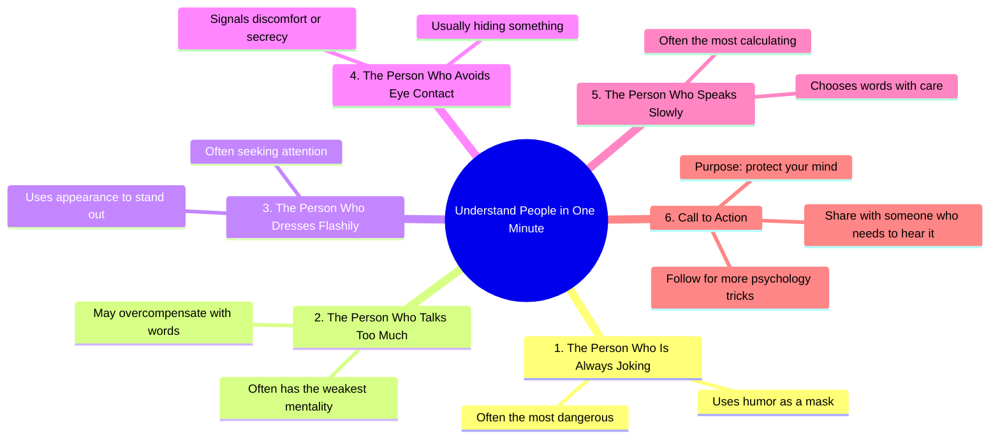

# 5 Behaviors That Reveal True Personality

> 🌐 **Read this in:** [English](../../en/2026-09/tiktok-transcript-662k-views-27k-reactions-5-human-behaviors-that-expose-someo-49c6.md) · **中文**

> **Creator:** [@Psygena](https://www.tiktok.com/@Psygena) · **Views:** 302.1K · **Posted:** 2026-09-03 · **Niche:** other
>
> **TL;DR:** The hook promises a quick, valuable skill and immediately subverts expectations with a dark twist, triggering curiosity.

[Watch original video →](https://www.facebook.com/share/r/1HcWUuXR3d/)

## Why This Went Viral

## 钩子（前3秒）
- **逐字开场白：**“一分钟看懂一个人。”
- **钩子模式：**大胆承诺 + 时间限制（“一分钟”）+ 直接价值主张。
- **为何能阻止滑动：**它提供了即时、低成本的心理学洞察。观众被承诺在60秒内获得完整的技能升级，触发大脑的“快速获胜”奖励预期。它还触及了普遍存在的解码他人隐藏动机的渴望。

## 情绪节奏
1. **好奇（0–3秒）：**“看懂人”的承诺激活了对社交权力的渴望。
2. **轻度紧张（每个编号要点）：**每个“第X条”都制造了一个微悬念循环——“这说的是我吗？这说的是我讨厌的人吗？”观众在脑海中扫描自己的社交圈。
3. **认同/验证（要点1–4）：**每句话都像是一个隐秘的真相，让观众产生一种优于他人的感觉。
4. **反转/共鸣（要点5）：**“说话慢的人心机最深”是最不直观的，作为最终的“恍然大悟”落地，重新定义了一个观众可能曾忽视的人。
5. **保护性紧迫感（结尾）：**“保护你的心智”将情绪从好奇转向自我防御，创造了一种基于轻度恐惧的行动动机。
6. **高潮：**要点5——说话慢者的揭示——是峰值，因为它与普遍认知相矛盾，感觉像是内幕知识。

## 关键词密度
- **“一个人”（5次）**——结构锚点，驱动列表式内容的留存。
- **“往往”（5次）**——软化表述，使其感觉普遍适用而非绝对化（算法安全）。
- **“危险”/“隐藏”/“心机”**——触发威胁检测的情绪吸引词。
- **“注意力”/“心态”**——与自我提升受众契合的心理特征关键词。
- **“保护你的心智”**——将被动观看转化为分享意图的行动短语。
- **“关注”/“分享”**——直接的算法行动号召（提升触达信号）。

## 为何能传播
- **通过列表格式打破模式：**“第一、第二、第三”的节奏制造了完成强迫症——观众会看到最后以核对全部五条，从而提升观看时长。
- **社交比较燃料：**每一条都让观众对生活中的人进行分类，使内容无需任何操作即可互动。他们会在心中将其应用于老板、朋友或对手。
- **“危险”反转：**第1条（“总开玩笑的人很危险”）颠覆了一个讨喜的特质，制造了认知失调，让人忍不住作为警告分享出去。
- **自我保护框架：**“分享给需要听到的人”不是关于娱乐——它将分享者定位为关心他人的保护者，赋予社交货币。
- **低摩擦CTA叠加：**“关注”和“分享”既明确又内嵌，最大化从两种不同行为中获得算法放大的机会。

## 你可以借鉴什么
- **使用“编号揭示”结构：**以大胆的限时承诺开场，然后快速输出5条洞察。编号格式强制留存，让内容感觉既可快速浏览又完整。
- **反转一个正面特质以制造冲击力：**选择一个普遍受欢迎的行为（开玩笑、友善、沉默），并附加一个阴暗或精于算计的动机。这创造了“等等，什么？”的时刻，推动评论和分享。
- **以保护性CTA收尾，而非通用CTA：**不要用“点赞订阅”，而是说“分享给需要听到的人”或“关注以保护你的心智”。这将行动重新定义为对他人的帮助，而非自我推销，大幅提升分享意愿。

## Mind Map

## Full Transcript (Generated by [拆解你自己的 TikTok](https://toktranscript.com/?utm_source=github&utm_medium=breakdown&utm_campaign=tool_attribution))

> 📝 Transcripts on this page are auto-generated and show the first 60%. Want to transcribe any TikTok in 30 seconds and get the full version? [Try TokTranscript free →](https://toktranscript.com/?utm_source=github&utm_medium=breakdown&utm_campaign=transcript_cta)

Understand people in one minute. Number one, the person who is always joking is often the most dangerous. Number two, the person who talks too much often has the weakest mentality. Number three, the person who dresses flashily is often seeking attention. Number four, the person who avoids eye contact is

*[Read the full transcript on TokTranscript →](https://toktranscript.com/plaza/tiktok-transcript-662k-views-27k-reactions-5-human-behaviors-that-expose-someo-49c6?utm_source=github&utm_medium=breakdown&utm_campaign=transcript_full)*

## Browse More

- All [other](../../by-niche/zh-CN/other.md) breakdowns
- All [Listicle with shocking claim](../../by-pattern/zh-CN/hook-listicle-with-shocking-claim.md) examples

## Video Info

| | |
|---|---|
| Creator | [@Psygena](https://www.tiktok.com/@Psygena) |
| Original video | [https://www.facebook.com/share/r/1HcWUuXR3d/](https://www.facebook.com/share/r/1HcWUuXR3d/) |
| Original title | 662K views · 27K reactions | 5 Human Behaviors That Expose Someone’s True Personality. Most people hide their true intentions with words… but their behavior always exposes them. In this video, discover the hidden psychology behind human actions, body language, and subconscious behavior patterns through the wisdom of Niccolò Machiavelli and modern psychology. If you understand behavior, you understand power. Watch till the end — the final sign is the most dangerous. #psychology #humanbehavior #mindgames #bodylanguage #darkpsychology #machiavelli | Psygena |
| Views | 302.1K (302130) |
| Posted | 2026-09-03 |
| Duration | 0s |
| Niche | `other` |
| Hook pattern | `Listicle with shocking claim` |
| Original language | `en` (this page translated by AI) |
| Available languages | en, zh-CN |
| Generated | 2026-09-04 by [TokTranscript](https://toktranscript.com/) |

---

*This breakdown is for educational analysis under fair use. Original video © [@Psygena](https://www.tiktok.com/@Psygena). All transcripts are auto-generated and may contain errors.*

*Want to analyze your own TikToks like this? [TokTranscript →](https://toktranscript.com/viral-breakdown?utm_source=github&utm_medium=breakdown&utm_campaign=footer_cta)*