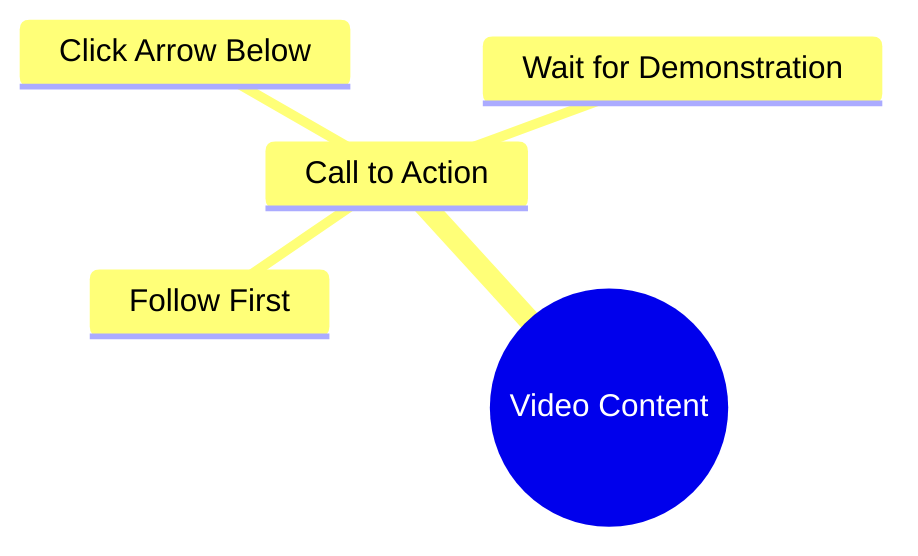

# Wafa World Reel: Follow for Friendship Content

> 🌐 **Read this in:** [English](../../en/2026-09/tiktok-transcript-7-1m-views-90k-reactions-wafa-world-facebookreels-reels-tren-21a6.md) · **中文**

> **Creator:** [@Sonlika Tudu](https://www.tiktok.com/@Sonlika Tudu) · **Views:** 3.3M · **Posted:** 2026-09-24 · **Niche:** entertainment
>
> **TL;DR:** Creates immediate curiosity by claiming to know the viewer's desire, then demands a follow and click to reveal the payoff.

[Watch original video →](https://www.facebook.com/share/r/19nXrTCjkM/)

## Why This Went Viral

## 钩子（前3秒）
- 逐字稿：“मुझे पता है आपको क्या चाहिए पहले फॉलो करो और नीचे जो तीर का निसान है वहाँ पे आओ फिर दिखाती हूँ”（“我知道你想要什么——先关注，然后到下面箭头标记那里来，然后我展示给你看”）
- 模式：**命令 + 扣留揭示**（一种把关/好奇心缺口的钩子，不是主张或提问）
- 为什么能止住滑动：它以“我知道你想要什么”开场——一种个人化的读心，让观众感觉被瞄准——然后立即施加条件（关注 + 点击箭头）才给出回报。未兑现的承诺制造了一个大脑想要闭合的开放循环。

## 情绪节奏
- **节拍1 – 认同（0–1秒）：**“我知道你想要什么”→ 奉承/被看见。
- **节拍2 – 微摩擦（1–3秒）：**两个命令（关注、点击箭头）→ 轻微阻力，但奖励被悬吊着。
- **节拍3 – 悬念平台期（3秒–结束）：**“फिर दिखाती हूँ”（“然后我展示给你看”）→ 揭示被推迟，而非交付。
- **高潮：**“फिर दिखाती हूँ”这句话本身——回报的承诺就是峰值，而不是任何实际内容。
- **反转：**片段内没有反转，也没有回报；“奖励”就是关注这个动作。视频的张力被刻意地从未在屏幕上解决。

## 关键词密度
- **फॉलो**（关注）——主要算法驱动；直接向平台发出互动意图信号。
- **आपको / आप**（你）——情绪拉力；第二人称称呼使命令个人化。
- **क्या चाहिए**（你想要什么）——好奇心驱动；将观众框定为有未满足的需求。
- **नीचे**（下面）——方向性CTA；将注意力推向UI元素。
- **तीर का निसान**（箭头标记）——空间指令；强化点击目标。
- **आओ**（来）——祈使拉力；移动命令。
- **दिखाती हूँ**（我会展示）——延迟回报关键词；维持开放循环。
- 算法触达：फॉलो、नीचे、तीर का निसान（互动/UI动作）。情绪拉力：आपको、क्या चाहिए、दिखाती हूँ（个人化 + 承诺）。

## 为什么它会传播
- **零成本开放循环：**“फिर दिखाती हूँ”承诺了一个在片段中永远不会到来的揭示——观众会重看或评论问“那是什么？”，喂养算法。
- **直接的第二人称瞄准：**“मुझे पता है आपको क्या चाहिए”让每个观众都感觉被单独称呼，提高完播率和重看率。
- **内置互动指令：**“पहले फॉलो करो”和“नीचे... तीर का निसान”字面上脚本化了关注 + 点击动作，将被动观众转化为可衡量的信号。
- **以省略作评论诱饵：**缺失的回报是评论区该去要求的——“kya dikhana tha?”评论会激增互动。
- **低制作、高可迁移性：**整个片段就是一句口头CTA，因此可以无限混剪/合拍，倍增分发。

## 你可以偷师的
1. **以读心开场，而非主张：**用“我知道你想要什么”/“你一直把X做错了”开场，让观众在1秒内感觉被个人化地看见。
2. **把回报挡在一个微动作后面：**在揭示前要求一个单一、具体的UI动作（关注、点击箭头、收藏）——但只保留一个要求，这样不会感觉像乞求。
3. **推迟揭示，不要取消它：**以“然后我展示给你看”结束，并在下一个片段或置顶评论中交付实际回报——这会把一个视频变成引发关注的系列。

## Mind Map

## Full Transcript (Generated by [TokTranscript 转录工具](https://toktranscript.com/?utm_source=github&utm_medium=breakdown&utm_campaign=tool_attribution))

> 📝 Transcripts on this page are auto-generated and show the first 60%. Want to transcribe any TikTok in 30 seconds and get the full version? [Try TokTranscript free →](https://toktranscript.com/?utm_source=github&utm_medium=breakdown&utm_campaign=transcript_cta)

मुझे पता है आपको क्या चाहिए पहले फॉलो करो और नीचे जो तीर

*[Read the full transcript on TokTranscript →](https://toktranscript.com/plaza/tiktok-transcript-7-1m-views-90k-reactions-wafa-world-facebookreels-reels-tren-21a6?utm_source=github&utm_medium=breakdown&utm_campaign=transcript_full)*

## Browse More

- All [entertainment](../../by-niche/zh-CN/entertainment.md) breakdowns
- All [Curiosity Gap + Direct Command](../../by-pattern/zh-CN/hook-curiosity-gap-direct-command.md) examples

## Video Info

| | |
|---|---|
| Creator | [@Sonlika Tudu](https://www.tiktok.com/@Sonlika Tudu) |
| Original video | [https://www.facebook.com/share/r/19nXrTCjkM/](https://www.facebook.com/share/r/19nXrTCjkM/) |
| Original title | 7.1M views · 90K reactions | Wafa World 🥀 #FacebookReels #Reels #TrendingReels #ReelsVideo #ShortVideo #ViralVideo #Explore #ForYou #Dosti #Friendship #OnlineDosti #DesiVibes #UrduPosts #followformore | Sonlika Tudu |
| Views | 3.3M (3296128) |
| Posted | 2026-09-24 |
| Duration | 0s |
| Niche | `entertainment` |
| Hook pattern | `Curiosity Gap + Direct Command` |
| Original language | `en` (this page translated by AI) |
| Available languages | en, zh-CN |
| Generated | 2026-09-25 by [TokTranscript](https://toktranscript.com/) |

---

*This breakdown is for educational analysis under fair use. Original video © [@Sonlika Tudu](https://www.tiktok.com/@Sonlika Tudu). All transcripts are auto-generated and may contain errors.*

*Want to analyze your own TikToks like this? [我们用的转录工具 →](https://toktranscript.com/viral-breakdown?utm_source=github&utm_medium=breakdown&utm_campaign=footer_cta)*