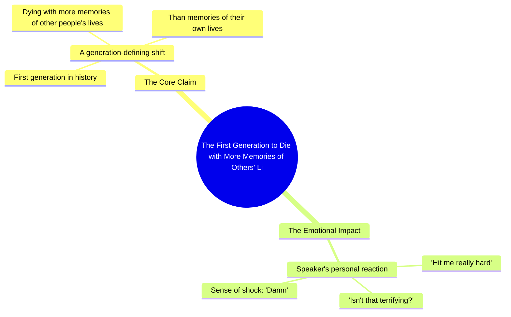

# Generation Living Through Others' Memories, Not Their Own

> 🌐 **Read this in:** [English](../../en/2026-09/tiktok-transcript-7-5m-views-116k-reactions-go-live-your-life-dietstartsmonday-78c8.md) · **中文**

> **Creator:** [@Diet Starts Monday](https://www.tiktok.com/@Diet Starts Monday) · **Views:** 3.5M · **Posted:** 2026-09-11 · **Niche:** entertainment
>
> **TL;DR:** It makes a bold, unsettling claim about a generation, immediately grabbing attention and provoking thought.

[Watch original video →](https://www.facebook.com/share/r/19SQmVcgU6/)

## Why This Went Viral

## 钩子（前3秒）
- **逐字开场白：**“这一代人将是第一代带着更多关于他人生活的记忆、而非自己生活的记忆死去的人。”
- **钩子模式：**大胆断言／预言＋对比（你的人生 vs. 他人的人生）——一种“黑暗预测”式钩子。
- **为什么它能让人停下滑动：**它是一句完整、自洽、令人不适的论点，一口气说完。它在观众决定离开之前就触发存在主义式的自我审视（“这说的是我吗？”）。“die”一词增加了死亡赌注，而“first”暗示你正身处其中的一次历史断裂。

## 情绪节奏
- **节拍1——冷开场／预言（0–3秒）：**陈述式，无铺垫。像在陈述事实，而非观点。瞬间制造不安。
- **节拍2——认同（“Yeah.”）：**一个词的认同节拍。起到停顿和镜子的作用——创作者认同这种恐惧，把观众拉入一个共享的“我们都完了”空间。
- **节拍3——直接提问（“Isn't that terrifying?”）：**从陈述转向质问。迫使内心回应，而这正是互动触发器。
- **节拍4——个人坦白（“Hit me really hard. I was like, damn.”）：**脆弱感投放。打破说教语气，使其人性化。这是**共鸣节拍**——观众评论“same”的时刻。
- **高潮：**开场白本身就是高潮。之后的一切都是余震。这是一个“前置式”视频——峰值在第1秒，其余部分是情绪确认。

## 关键词密度
- **“generation”**——身份标记；让它感觉像一份你被卷入其中的代际诊断。
- **“first”**——新颖性／历史性框架；驱动算法好奇心（“first to what?”）。
- **“die”／“memories”**——死亡＋记忆；情绪核心。高停留时长词汇。
- **“other people's lives”**——对比锚点；人们转发时会重复的短语。
- **“terrifying”**——情绪标签；告诉观众该如何感受，从而增加评论量。
- **“hit me really hard”／“damn”**——共鸣关键词；把论点转化为个人反应。

**算法触达驱动因素：**“generation”“first”“die”——宽泛、高搜索、高分享词。
**情绪拉力驱动因素：**“memories”“other people's lives”“terrifying”——这些是人们在评论和转发中引用的内容。

## 为什么它会传播
- **它是一句可分享的话，而不是一个可分享的视频。**开场白可以逐字引用。人们截图、发推，并用自己的帖子配上它——文字稿*就是*梗。
- **它分配了集体罪责／身份。**“This generation”让观众成为参与者，而非旁观者。分享它成为一种自我标签（“this is so us”）。
- **“Yeah.”和“Isn't that terrifying?”制造了一呼一应。**视频提出一个问题，观众在心里回答，而停顿邀请他们在评论中作答——一种直接的互动机制。
- **个人坦白（“Hit me really hard. I was like, damn.”）降低了回复门槛。**它示范了脆弱，因此评论者觉得有权分享自己的“damn”时刻。
- **它短到可以循环重看。**整个信息量约10秒，因此完播率和重播率飙升——这是两个最强的分发信号。

## 你可以借鉴什么
1. **把一句完整、令人不适的论点前置。**不要铺垫到重点——用重点开场。让它单独拿出来就可引用，无需任何语境。
2. **使用“this generation / this era / we”框架。**集体身份语言把被动观众变成被卷入的参与者，从而驱动分享和自我标签式评论。
3. **在论点之后接一个认同节拍＋直接提问＋个人坦白。**“Yeah. Isn't that terrifying? Hit me really hard.”这个模式是一个可复用的情绪弧：认同→质问→坦白。它把一句陈述变成一场对话。

## Mind Map

## Full Transcript (Generated by [TikTok 转录工具](https://toktranscript.com/?utm_source=github&utm_medium=breakdown&utm_campaign=tool_attribution))

> 📝 Transcripts on this page are auto-generated and show the first 60%. Want to transcribe any TikTok in 30 seconds and get the full version? [Try TokTranscript free →](https://toktranscript.com/?utm_source=github&utm_medium=breakdown&utm_campaign=transcript_cta)

This generation will be the first to die with more memories of other people's lives than of their own

*[Read the full transcript on TokTranscript →](https://toktranscript.com/plaza/tiktok-transcript-7-5m-views-116k-reactions-go-live-your-life-dietstartsmonday-78c8?utm_source=github&utm_medium=breakdown&utm_campaign=transcript_full)*

## Browse More

- All [entertainment](../../by-niche/zh-CN/entertainment.md) breakdowns
- All [Provocative Prediction](../../by-pattern/zh-CN/hook-provocative-prediction.md) examples

## Video Info

| | |
|---|---|
| Creator | [@Diet Starts Monday](https://www.tiktok.com/@Diet Starts Monday) |
| Original video | [https://www.facebook.com/share/r/19SQmVcgU6/](https://www.facebook.com/share/r/19SQmVcgU6/) |
| Original title | 7.5M views · 116K reactions | Go live your life. #dietstartsmonday #podcast #generation #socialmedia | Diet Starts Monday |
| Views | 3.5M (3477323) |
| Posted | 2026-09-11 |
| Duration | 0s |
| Niche | `entertainment` |
| Hook pattern | `Provocative Prediction` |
| Original language | `en` (this page translated by AI) |
| Available languages | en, zh-CN |
| Generated | 2026-09-12 by [TokTranscript](https://toktranscript.com/) |

---

*This breakdown is for educational analysis under fair use. Original video © [@Diet Starts Monday](https://www.tiktok.com/@Diet Starts Monday). All transcripts are auto-generated and may contain errors.*

*Want to analyze your own TikToks like this? [免费 TikTok 文稿生成器 →](https://toktranscript.com/viral-breakdown?utm_source=github&utm_medium=breakdown&utm_campaign=footer_cta)*