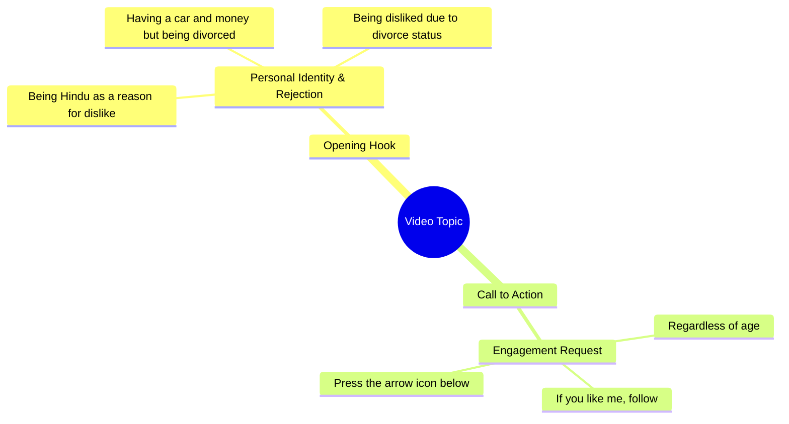

# Divorced Man Says Nobody Likes Him for Being Hindu

> 🌐 **Read this in:** [English](../../en/2026-09/tiktok-transcript-8-1m-views-217k-reactions-wafa-world-facebookreels-reels-tre-46ee.md) · **中文**

> **Creator:** [@Diya Sinha ](https://www.tiktok.com/@Diya Sinha ) · **Views:** 3.1M · **Posted:** 2026-09-23 · **Niche:** entertainment
>
> **TL;DR:** Opens with a bold religious identity statement that immediately provokes curiosity and debate.

[Watch original video →](https://www.facebook.com/share/r/1DwK9gS5RF/)

## Why This Went Viral

## 钩子（前3秒）
- **逐字开场白：** “हिंदू हूँ इसलिए पसंद नहीं करते”（“我是印度教徒，所以他们不喜欢我”）
- **钩子模式：** 大胆断言 + 基于身份的排斥（一种“被拒绝的自白”钩子）
- **为什么能让人停下滚动：** 它以一句赤裸、有争议的社会判决开场——宗教身份成了被嫌弃的理由。它瞬间激发好奇心（“那为什么会重要？”）和群体防御心理（观众要么认同、要么反对、要么觉得被看见），迫使他们在判断之前先停一下。

## 情绪节奏
- **第1拍——好奇/震惊：** “हिंदू हूँ इसलिए पसंद नहीं करते”——一种被拒绝的身份。
- **第2拍——升级（地位 vs. 孤独）：** “गाड़ी है, पैसा है”——物质成功层层堆叠。
- **第3拍——张力/反转：** “लेकिन तलाक शुदा हूँ इसलिए कोई मुझे पसंद नहीं करता”——真正的伤口揭开：离过婚，不被喜欢。
- **第4拍——普遍共鸣：** “उम्र कितनी भी हो”——不受年龄限制的不安全感，扩大可共鸣范围。
- **高潮：** “अगर मैं आपको पसंद हूँ”——从被拒绝转向直接请求，把观众变成评判者/认可者。
- **收束/CTA：** “फॉलो करके नीचे तीर के निशान पे दबाओ”——把情绪转化为行动。
- **高潮时刻：** “अगर मैं आपको पसंद हूँ”这句——整个视频的存在就是为了赢得这个条件句。

## 关键词密度
- **हिंदू**（印度教徒）——算法触达（身份/宗教 = 高互动触发器）
- **पसंद नहीं करते / पसंद**（不喜欢 / 喜欢）——情绪拉力（拒绝 + 认可循环）
- **तलाक शुदा**（离过婚）——情绪拉力（污名、脆弱）
- **गाड़ी / पैसा**（车 / 钱）——算法 + 向往型触达（地位标志）
- **उम्र**（年龄）——情绪拉力（普遍的不安全感）
- **कोई मुझे**（没有人 / 我）——情绪拉力（自怜框架）
- **फॉलो करके**（关注）——算法触达（直接互动信号）
- **तीर के निशान**（箭头标记）——算法触达（界面动作提示）

**驱动因素：** “हिंदू”“गाड़ी”“पैसा”“फॉलो”通过身份 + 向往 + 明确CTA推动分发。“पसंद”“तलाक शुदा”“उम्र”驱动情绪拉力，让人们去评论。

## 为什么会传播
- **身份诱饵式开场**——“हिंदू हूँ इसलिए पसंद नहीं करते”迫使人们站队；观众会评论以表示认同或争论，而评论是最强的排名信号。
- **地位与孤独的对比**——“गाड़ी है, पैसा है लेकिन...”制造了一个人们会截图并分享的悖论，作为“金钱买不到爱”的真相。
- **污名自白**——“तलाक शुदा हूँ”触及一个庞大却少被服务的受众，他们很少看到自己的故事；他们会把它当作代表性来分享。
- **普遍自怜桥梁**——“उम्र कितनी भी हो”让这个具体故事感觉像每个人的故事，扩大分享池。
- **直接认可CTA**——“अगर मैं आपको पसंद हूँ तो फॉलो करके...”把同情转化为无摩擦的关注，拉高完播率 + 关注率。

## 你可以偷走什么
1. **用拒绝开场，而不是自我介绍。** 用人们会*说*你的那句话开场（“X हूँ इसलिए पसंद नहीं करते”）——它会立刻制造张力并触发评论。
2. **把地位与伤口叠在一起。** 把你拥有的（गाड़ी、पैसा）和你缺少的（爱、接纳）配对——这种对比才会被截图和分享。
3. **让观众成为认可者，然后给一个极小的CTA。** 以一个条件句收尾（“अगर मैं आपको पसंद हूँ...”），再附上一个低门槛动作（关注 / 点箭头），让情绪直接转化为互动。

## Mind Map

## Full Transcript (Generated by [免费 TikTok 文稿生成器](https://toktranscript.com/?utm_source=github&utm_medium=breakdown&utm_campaign=tool_attribution))

> 📝 Transcripts on this page are auto-generated and show the first 60%. Want to transcribe any TikTok in 30 seconds and get the full version? [Try TokTranscript free →](https://toktranscript.com/?utm_source=github&utm_medium=breakdown&utm_campaign=transcript_cta)

हिंदू हूँ इसलिए पसंद नहीं करते, गाड़ी है, पैसा है लेकिन तलाक शुदा हूँ इसलिए कोई मुझे पसंद नहीं करता, उम्र क

*[Read the full transcript on TokTranscript →](https://toktranscript.com/plaza/tiktok-transcript-8-1m-views-217k-reactions-wafa-world-facebookreels-reels-tre-46ee?utm_source=github&utm_medium=breakdown&utm_campaign=transcript_full)*

## Browse More

- All [entertainment](../../by-niche/zh-CN/entertainment.md) breakdowns
- All [Controversial Confession](../../by-pattern/zh-CN/hook-controversial-confession.md) examples

## Video Info

| | |
|---|---|
| Creator | [@Diya Sinha ](https://www.tiktok.com/@Diya Sinha ) |
| Original video | [https://www.facebook.com/share/r/1DwK9gS5RF/](https://www.facebook.com/share/r/1DwK9gS5RF/) |
| Original title | 8.1M views · 217K reactions | Wafa World 🥀 #FacebookReels #Reels #TrendingReels #ReelsVideo #ShortVideo #ViralVideo #Explore #ForYou #Dosti #Friendship #OnlineDosti #DesiVibes | Diya Sinha |
| Views | 3.1M (3074595) |
| Posted | 2026-09-23 |
| Duration | 0s |
| Niche | `entertainment` |
| Hook pattern | `Controversial Confession` |
| Original language | `en` (this page translated by AI) |
| Available languages | en, zh-CN |
| Generated | 2026-09-24 by [TokTranscript](https://toktranscript.com/) |

---

*This breakdown is for educational analysis under fair use. Original video © [@Diya Sinha ](https://www.tiktok.com/@Diya Sinha ). All transcripts are auto-generated and may contain errors.*

*Want to analyze your own TikToks like this? [TokTranscript →](https://toktranscript.com/viral-breakdown?utm_source=github&utm_medium=breakdown&utm_campaign=footer_cta)*