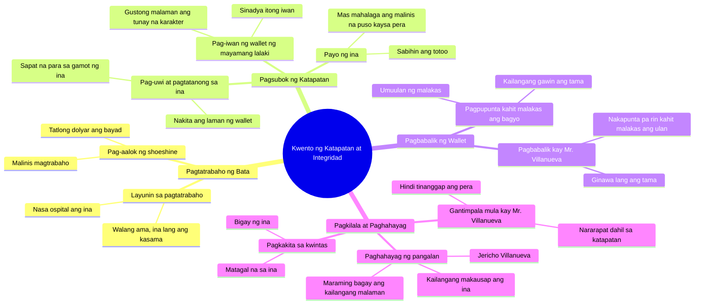

# Jericho's Honest Shoeshine Earns Praise

> 🌐 **Read this in:** [English](../../en/2026-09/tiktok-transcript-8-1m-views-249k-reactions-ang-malinis-na-trabaho-ni-jericho-acc3.md) · **中文**

> **Creator:** [@Karlos](https://www.tiktok.com/@Karlos) · **Views:** 4.5M · **Posted:** 2026-09-12 · **Niche:** entertainment
>
> **TL;DR:** The hook instantly creates tension by introducing a poor shoeshine boy and a wealthy man's dismissive companion, setting up a classic underdog vs. elite dynamic.

[Watch original video →](https://www.facebook.com/share/v/1KyvBqoChS/)

## Why This Went Viral

## 钩子（前3秒）
- **逐字稿：** “先生，您需要擦鞋吗？”——一个在街头提供服务的男孩。
- **钩子模式：** *场景+提问*（直接以“先生”发问的沉浸式情境）。
- **观众为什么会停下来：** 立刻建立了权力关系（富人vs.贫穷的孩子），并让大脑发问：*“这个孩子会怎么样？”* 这个简单的问题成为通往道德故事的入口。

## 情绪节奏
- **好奇（0–5秒）：** 擦鞋提议→这个孩子是谁，为什么在工作？
- **紧张#1（5–15秒）：** “那家伙可能只是想要施舍”——维拉纽瓦先生同伴的轻蔑。立刻有了反派。
- **共鸣（15–25秒）：** “妈妈在医院……我只有妈妈了。”——心碎节拍。同情在这里扎根。
- **测试铺垫（25–40秒）：** 留下钱包——“看看没人看见时你有多诚实。”悬念：会拿走还是归还？
- **紧张#2（40–60秒）：** 钱包在家里，妈妈的忠告：*“干净的心比钱更重要。”* 风暴来临——字面和道德上的紧张。
- **高潮（60–75秒）：** 暴风雨中，杰里科赶来归还钱包。*“我必须做正确的事。”* 情绪在这里爆发。
- **反转（75–90秒）：** 项链→“杰里科·维拉纽瓦”→*“维拉纽瓦……”*——这个孩子竟然是维拉纽瓦先生的亲戚。这就是引爆分享的**剧情反转**。

## 关键词密度
- **“妈妈”**——情感锚点，反复提及。
- **“诚实/诚信”**——核心主题，算法钩子。
- **“正确/做正确的事”**——故事的道德指南针。
- **“钱”**——与“干净的心”形成对比。
- **“维拉纽瓦”**——反转关键词，连接开头和结尾。
- **“钱包”**——麦高芬，推动情节。
- **“项链”**——揭示装置。
- **“雨/暴风雨”**——象征性紧张放大器。

**算法驱动因素：** *“诚实”、“妈妈”、“维拉纽瓦”*——搜索量和重播价值高。**情感拉力：** *“妈妈”、“心”、“正确”*——触发评论和分享（“我哭了”）。

## 为什么会传播
- **道德测试公式：** “看看没人看见时你有多诚实”——经典困境，人们观看是为了知道答案。
- **预期反转：** 所有人都以为孩子只是想要施舍；结果变成了诚实测试。维拉纽瓦先生同伴的轻蔑起到了衬托作用。
- **压力下的牺牲：** 暴风雨中仍然前来——*“我必须做正确的事。”* 情绪在反转前达到顶峰。
- **改变一切的反转：** *“杰里科·维拉纽瓦……维拉纽瓦。”* 只是一个名字，却重新串联了整个故事——这就是分享触发器。
- **家庭+贫困+正直：** 普遍的菲律宾价值观（家庭、苦难、尊严）——大众能产生共鸣，因此评论和分享量高。

## 你可以借鉴什么
1. **在前30秒设置道德测试。** 一个对错分明的困境——人们观看是为了知道答案。
2. **用一个词作为反转触发器。** 一个名字、物品或台词，改变整个含义（如“维拉纽瓦”或项链）。
3. **叠加字面和象征性紧张。** 外面的暴风雨+内心的道德压力——双重情感冲击。

## Mind Map

## Full Transcript (Generated by [TokTranscript](https://toktranscript.com/?utm_source=github&utm_medium=breakdown&utm_campaign=tool_attribution))

> 📝 Transcripts on this page are auto-generated and show the first 60%. Want to transcribe any TikTok in 30 seconds and get the full version? [Try TokTranscript free →](https://toktranscript.com/?utm_source=github&utm_medium=breakdown&utm_campaign=transcript_cta)

Sir, kailangan niyo po ba ng shoeshine? Hayaan mo na, Mr. Villanueva. Baka limos lang ang habol niyan. Hindi po, sir. Nagtatrabaho po ako para kumita. Magkano? Tatlong dolyar lang po. Magmumukhang bago ang sapatos niyo. Malinis kang magtrabaho, iho. Sabi po ni Mama, kahit maliit na trabaho, dapat malaki ang effort. Bakit ka nagtatrabaho sa ganitong panahon? Nasa ospital po si Mama. At ang tatay mo? Si mama lang po ang meron ako. Sir, sobra naman po ito. Punin mo. Para sa mama mo. Tingnan natin kung gaano ka katapat kapag walang nakakakita. Sir, naiwan niyo po ang wallet niyo. Alam ko. Sinadya niyo? Gusto kong malaman kung sino talaga ang binatang yun. Sir, shoeshine worker lang naman siya. Mr. Villanueva? Aalis na pala sila. Hindi ito sa akin. Kailangan kong tanungin si Mama kung ano ang gagawin. Jericho, ano yan? Iniwan po nung mayamang lalaki kanina. Tinignan mo ba? Hindi po Mabuti Tingnan natin ang magkasama Ma pwede nitong bayaran lahat ng gamot mo Totoo. Pero kailangan natin ng pera. Anak, mas mahalaga ang malinis na puso kaysa pera. Paano kong isipin niyang kinuha ko? Sabihin mo ang totoo. Babalik ko po bukas

*[Read the full transcript on TokTranscript →](https://toktranscript.com/plaza/tiktok-transcript-8-1m-views-249k-reactions-ang-malinis-na-trabaho-ni-jericho-acc3?utm_source=github&utm_medium=breakdown&utm_campaign=transcript_full)*

## Browse More

- All [entertainment](../../by-niche/zh-CN/entertainment.md) breakdowns
- All [Immediate Conflict & Misjudgment](../../by-pattern/zh-CN/hook-immediate-conflict-misjudgment.md) examples

## Video Info

| | |
|---|---|
| Creator | [@Karlos](https://www.tiktok.com/@Karlos) |
| Original video | [https://www.facebook.com/share/v/1KyvBqoChS/](https://www.facebook.com/share/v/1KyvBqoChS/) |
| Original title | 8.1M views · 249K reactions | Ang Malinis na Trabaho ni Jericho #DramaSeries #kindnessmatters #LifeLesson | Karlos |
| Views | 4.5M (4472239) |
| Posted | 2026-09-12 |
| Duration | 0s |
| Niche | `entertainment` |
| Hook pattern | `Immediate Conflict & Misjudgment` |
| Original language | `tl` (this page translated by AI) |
| Available languages | en, zh-CN |
| Generated | 2026-09-13 by [TokTranscript](https://toktranscript.com/) |

---

*This breakdown is for educational analysis under fair use. Original video © [@Karlos](https://www.tiktok.com/@Karlos). All transcripts are auto-generated and may contain errors.*

*Want to analyze your own TikToks like this? [我们用的转录工具 →](https://toktranscript.com/viral-breakdown?utm_source=github&utm_medium=breakdown&utm_campaign=footer_cta)*