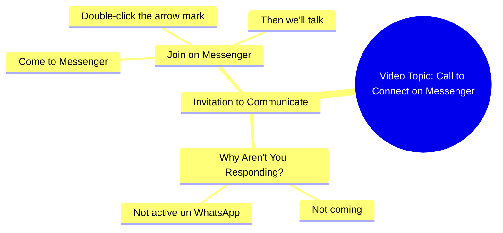

# Why Don't You Come Talk on Messenger

> 🌐 **Read this in:** [English](../../en/2026-09/tiktok-transcript-8-9m-views-237k-reactions-03045658506-740c.md) · **中文**

> **Creator:** [@03045658506](https://www.tiktok.com/@03045658506) · **Views:** 2.7M · **Posted:** 2026-09-21 · **Niche:** other
>
> **TL;DR:** The hook directly questions the audience, creating immediate engagement and curiosity.

[Watch original video →](https://www.facebook.com/share/r/1FSTNPFtH1/)

## Why This Went Viral

## 钩子（前3秒）
- 逐字开场：“आप लोग क्यों नहीं आते हो, WhatsApp पे तो नहीं आ रहे हो, Messenger पे तो आ जाओ…”——对缺席观众发出的直接、带着受伤感的恳求。
- 钩子模式：**直接指责 + 情感恳求**（“点名/对峙”钩子的变体），紧接着就是CTA。
- 为什么能止住滑动：它打破第四面墙，把观众当作亲自冷落了创作者的人来对话。指责式的“आप लोग क्यों नहीं आते हो”触发内疚/好奇（“他是在说我吗？”），而迅速转向平台指令又制造出必须解决的困惑——大脑会留下来弄清楚到底在要求什么。

## 情绪节奏
- **节拍1——对峙/内疚（0–1秒）：**“आप लोग क्यों नहीं आते हो”——轻度指责，观众感觉被单独点名。
- **节拍2——抱怨升级（1–3秒）：**“WhatsApp पे तो नहीं आ रहे हो”——反复诉苦，构建出“他一直在等”的叙事。
- **节拍3——转向指令（3–5秒）：**“Messenger पे तो आ जाओ, तीर के निशान पे दो बार क्लिक करो”——紧张感转化为具体行动。
- **节拍4——解决/承诺（最后一句）：**“फिर बात करते हैं”——柔和、亲密的回报（“然后我们聊聊”），释放感 + 奖励。
- **高潮：**指令“तीर के निशान पे दो बार क्लिक करो”——情绪铺垫坍缩成一个单一的身体动作，而这正是整个视频的重点。
- 悬念落在*他为什么难过*；共鸣落在“फिर बात करते हैं”的亲密感；反转在于这场“情感危机”实际上是通往关注/跳转的漏斗。

## 关键词密度
- **आप लोग**（你们这些人）——直接称呼，情绪牵引
- **क्यों नहीं आते हो**（你们为什么不来）——内疚触发，情绪牵引
- **WhatsApp / Messenger**——平台名称，算法 + 搜索触达
- **आ जाओ / आ रहे हो**（来 / 不来）——重复制造节奏和紧迫感
- **तीर के निशान**（箭头图标）——字面CTA对象，驱动预期动作
- **दो बार क्लिक करो**（点击两次）——祈使动词，驱动行动
- **फिर बात करते हैं**（然后我们聊聊）——亲密/奖励关键词，情绪牵引
- **算法驱动词：**“WhatsApp”“Messenger”“क्लिक करो”——平台 + 动作词会把视频推给已经在使用通讯应用的用户，并提升评论/分享信号。
- **情绪驱动词：**“आप लोग क्यों नहीं आते हो”和“फिर बात करते हैं”——它们承载着准社会关系重量，让人回复、@朋友并反复观看。

## 为什么会传播
- **它把准社会内疚武器化。**“आप लोग क्यों नहीं आते हो”让每个观众都感觉被单独点名并略带被指责——这是评论（“sorry bhai aa raha hoon”）和分享的最强驱动力。
- **它是伪装的CTA。**整个情绪弧线只为传递一条指令：“तीर के निशान पे दो बार क्लिक करो。”照做的观众会产生算法奖励的关注/点击信号，而视频的目的直到最后都不可见。
- **它短到可以循环播放并当作玩笑转发。**整段一口气说完——人们把它发给朋友说“他在说你”，把视频变成社交道具。
- **平台名称充当触达诱饵。**“WhatsApp”和“Messenger”是高频搜索/兴趣词；任何信息流与通讯应用相关的人都会看到这个视频。
- **结尾句邀请互惠。**“फिर बात करते हैं”承诺一种双向关系，把被动观众转化为评论者和私信者——这些互动信号会把视频推得更远。

## 你可以偷走什么
- **用直接指责或对“你们这些人”的恳求开场。**把观众当作欠你什么的人来对话（“आप लोग क्यों नहीं आते हो”），会瞬间制造内疚-好奇，并在1秒内止住滑动。
- **把CTA埋进情感故事里。**不要说“关注我”——构建一个5秒迷你剧，其唯一解决方式就是你想要的动作（“तीर के निशान पे दो बार क्लिक करो”）。让情绪完成说服。
- **以亲密承诺收尾，而不是要求。**“फिर बात करते हैं”感觉像关系，而不是交易——它把观众转化为评论者，并给他们一个回来的理由。

## Mind Map

## Full Transcript (Generated by [TokTranscript](https://toktranscript.com/?utm_source=github&utm_medium=breakdown&utm_campaign=tool_attribution))

> 📝 Transcripts on this page are auto-generated and show the first 60%. Want to transcribe any TikTok in 30 seconds and get the full version? [Try TokTranscript free →](https://toktranscript.com/?utm_source=github&utm_medium=breakdown&utm_campaign=transcript_cta)

आप लोग क्यों नहीं आते हो, WhatsApp पे तो नहीं आ रहे हो, Messenger पे तो आ जाओ, तीर के निश

*[Read the full transcript on TokTranscript →](https://toktranscript.com/plaza/tiktok-transcript-8-9m-views-237k-reactions-03045658506-740c?utm_source=github&utm_medium=breakdown&utm_campaign=transcript_full)*

## Browse More

- All [other](../../by-niche/zh-CN/other.md) breakdowns
- All [Direct Question](../../by-pattern/zh-CN/hook-direct-question.md) examples

## Video Info

| | |
|---|---|
| Creator | [@03045658506](https://www.tiktok.com/@03045658506) |
| Original video | [https://www.facebook.com/share/r/1FSTNPFtH1/](https://www.facebook.com/share/r/1FSTNPFtH1/) |
| Original title | 8.9M views · 237K reactions | آپ کیوں نہیں آتے ہو | 03045658506 |
| Views | 2.7M (2663651) |
| Posted | 2026-09-21 |
| Duration | 0s |
| Niche | `other` |
| Hook pattern | `Direct Question` |
| Original language | `en` (this page translated by AI) |
| Available languages | en, zh-CN |
| Generated | 2026-09-22 by [TokTranscript](https://toktranscript.com/) |

---

*This breakdown is for educational analysis under fair use. Original video © [@03045658506](https://www.tiktok.com/@03045658506). All transcripts are auto-generated and may contain errors.*

*Want to analyze your own TikToks like this? [TokTranscript 转录工具 →](https://toktranscript.com/viral-breakdown?utm_source=github&utm_medium=breakdown&utm_campaign=footer_cta)*