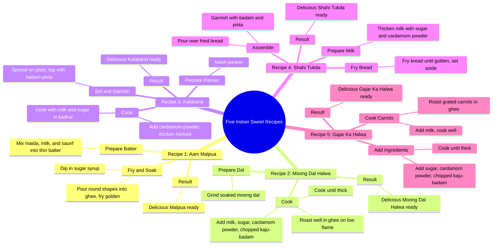

# 3 Easy Indian Mithai Recipes: Malpua and Moong Dal Halwa

> 🌐 **Read this in:** [English](../../en/2026-09/tiktok-transcript-9-5m-views-91k-reactions-viralreels-fbreels-trendingreels-in-e802.md) · **中文**

> **Creator:** [@Facts Girl](https://www.tiktok.com/@Facts Girl) · **Views:** 4.2M · **Posted:** 2026-09-26 · **Niche:** food
>
> **TL;DR:** Starts with a numbered list, immediately promising multiple recipes, which hooks viewers interested in variety.

[Watch original video →](https://www.facebook.com/share/r/1CWa5xbmmv/)

## Why This Went Viral

## 钩子（前3秒）
- 以“नमबर एक, आम मालपुआ”（第一，芒果马尔普阿）开场——这是一个编号列表条目，不是问候，不是露脸，也不是提问。
- 钩子模式：**编号列表 / 倒计时式承诺**（“第一……”暗示后面还有更多，制造开放循环）。
- 它能阻止滑动，因为它立刻传递出*实用密度*——观众在一秒内就知道自己会得到多个食谱，而不是一个，因此每秒感知价值很高。没有浪费的开场，没有“嗨大家好”，没有铺垫。

## 情绪节奏
- **好奇**（0–2秒）：“第一”+ 一个菜名——大脑会问“有多少个？都是什么？”
- **微满足循环**（重复5次）：每个食谱都呈现 设定 → 动作 → 回报（“स्वादिश्ट... तैयार है” / “美味……做好了”）。这是多巴胺节拍，不是故事弧线。
- **期待/列表张力**：编号（“नमबर दो”、“नमबर 3”、“नमबर चार”、“नमबर पांच”）让观众脑中持续进行倒计时——他们会留下来看完整个合集。
- **高潮时刻**：最后一项，“नमबर पांच गाजर का हलवा”——第五个回报。整个视频的设计就是让最后一句“तैयार है”闭合循环，并触发重看/收藏。
- 没有反转，没有冲突——节奏是**纯粹累积**，这就是为什么它适合作为背景/收藏视频，而不是只看一次的视频。

## 关键词密度
- **नमबर**（编号）——结构主轴，重复5次
- **स्वादिश्ट / स्वादिष्ट**（美味）——每次回报时重复
- **तैयार है**（做好了）——反复出现的“完成”节拍
- **घी**（酥油）——几乎每个食谱都重复
- **दूध**（牛奶）——多个食谱重复
- **चीनी**（糖）——重复
- **इलाइची पाउडर**（小豆蔻粉）——重复
- **बादाम / पिस्ता / काजू**（杏仁/开心果/腰果）——重复出现的点缀组合
- **हलवा**（哈尔瓦）——出现3次（绿豆、胡萝卜），外加相关甜点

算法驱动因素：**नमबर、हलवा、मालपुआ、कलाकंद、गाजर का हलवा**——这些是高搜索量的节日/甜点词，因此有助于发现和相关视频推荐。情绪拉力：**स्वादिश्ट、तैयार है、घी、चीनी**——这些承载感官/味觉承诺和“我也能做”的感觉。

## 为什么会传播
- **列表格式 = 收藏并回看的价值。**“नमबर एक... नमबर दो... नमबर 3... नमबर चार... नमबर पांच”把视频变成清单。观众会收藏起来以后做菜，而收藏是强排名信号。
- **节日/甜点关键词聚类。**Malpua、kalakand、shahi tukda、gajar ka halwa 都是经典印度甜点——转录文本堆叠了高需求季节性关键词，因此算法可以同时把它推给许多相关兴趣集群。
- **零阻力节奏。**每个食谱都遵循同样的压缩模板（食材 → 烹饪 → “स्वादिश्ट... तैयार है”）。没有冷场，所以留存率保持高位，完播率反哺算法。
- **重复建立记忆点。**反复出现的“स्वादिश्ट... तैयार है”像一句口头广告歌——观众能记住并复述，从而推动评论和分享（“你最先做哪一个？”）。
- **模仿门槛低。**编号列表 + 回报句结构极易复制，所以其他创作者会合拍/混剪，扩大传播。

## 你可以借鉴什么
- **用“第一”开场，而不是介绍。**跳过问候；数字本身就是钩子，并承诺这是一个合集，而不是单个回报。
- **使用一句重复的回报台词。**像“स्वादिश्ट... तैयार है”这样的固定短语在每个节拍出现，能创造节奏、帮助记忆，并让视频感觉完整且令人满足。
- **在列表中堆叠可搜索关键词。**把多个高需求词（菜名 + 食材）塞进编号结构，让一个视频同时覆盖多个搜索集群。

## Mind Map

## Full Transcript (Generated by [TokTranscript](https://toktranscript.com/?utm_source=github&utm_medium=breakdown&utm_campaign=tool_attribution))

> 📝 Transcripts on this page are auto-generated and show the first 60%. Want to transcribe any TikTok in 30 seconds and get the full version? [Try TokTranscript free →](https://toktranscript.com/?utm_source=github&utm_medium=breakdown&utm_campaign=transcript_cta)

नमबर एक, आम मालपुआ, मैदा, दूध और सौफ डाल कर पतला घोल तयार करें. इसे घी में गोल-गोल डाल कर सुनहरा तलें और चीनी की चाशनी में डुबोएं. स्वादिश्ट मालपुआ तयार है. नमबर दो, मूंग दाल का हलवा. भिगोई हुई मूंग दाल को पीस कर घी में धीमी आज पर अच्छी तरह भूने इसमें दूध, चीनी, इलाइची पाउडर और कटे हुए काजो बादाम डाल कर गाड़ा होने तक पकाए स्वादिश्ट मूंग दाल का हलवा तैयार है नमबर 3. कलाकंद पनीर को मसल कर कड़ाही में दूद और चीनी के साथ पकाएं इलाइची पाउडर डाल कर मिश्रन गाड़ा करें फिर थाली में जमा कर उपर से बादाम पिस्ता डालें स्वादिश्ट कलाकन तैयार है नमबर चार

*[Read the full transcript on TokTranscript →](https://toktranscript.com/plaza/tiktok-transcript-9-5m-views-91k-reactions-viralreels-fbreels-trendingreels-in-e802?utm_source=github&utm_medium=breakdown&utm_campaign=transcript_full)*

## Browse More

- All [food](../../by-niche/zh-CN/food.md) breakdowns
- All [Listicle Hook](../../by-pattern/zh-CN/hook-listicle-hook.md) examples

## Video Info

| | |
|---|---|
| Creator | [@Facts Girl](https://www.tiktok.com/@Facts Girl) |
| Original video | [https://www.facebook.com/share/r/1CWa5xbmmv/](https://www.facebook.com/share/r/1CWa5xbmmv/) |
| Original title | 9.5M views · 91K reactions | मीठा खाने का मन हो तो आज कौन-सी मिठाई बनाएं? 😋🍬 #ViralReels #FBReels #TrendingReels #IndianSweets #MithaiRecipes | Facts Girl |
| Views | 4.2M (4189548) |
| Posted | 2026-09-26 |
| Duration | 0s |
| Niche | `food` |
| Hook pattern | `Listicle Hook` |
| Original language | `en` (this page translated by AI) |
| Available languages | en, zh-CN |
| Generated | 2026-09-27 by [TokTranscript](https://toktranscript.com/) |

---

*This breakdown is for educational analysis under fair use. Original video © [@Facts Girl](https://www.tiktok.com/@Facts Girl). All transcripts are auto-generated and may contain errors.*

*Want to analyze your own TikToks like this? [TikTok 转录工具 →](https://toktranscript.com/viral-breakdown?utm_source=github&utm_medium=breakdown&utm_campaign=footer_cta)*