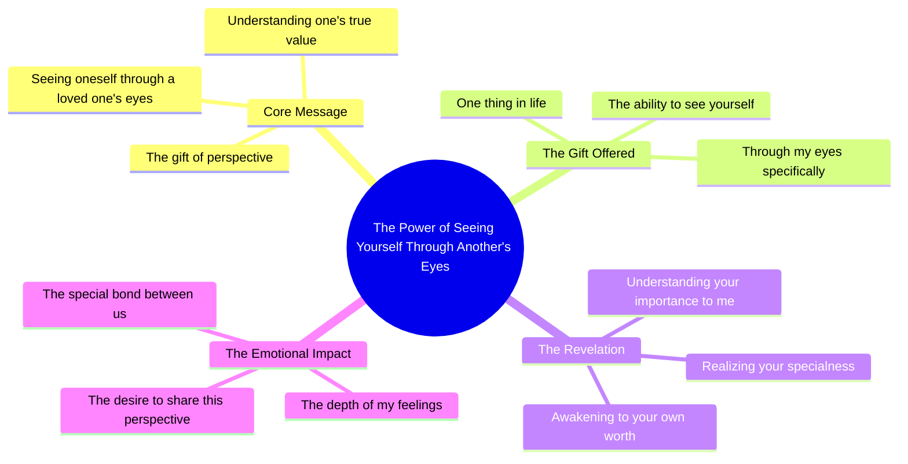

# See Yourself Through My Eyes

> 🌐 **Read this in:** [English](../../en/2026-09/tiktok-transcript-945k-views-27k-reactions-one-thing-i-want-to-give-you-in-lif-5f43.md) · **中文**

> **Creator:** [@Whisprs "](https://www.tiktok.com/@Whisprs ") · **Views:** 356.2K · **Posted:** 2026-09-03 · **Niche:** other
>
> **TL;DR:** The hook instantly creates an intimate, emotional premise that makes viewers feel personally addressed.

[Watch original video →](https://www.facebook.com/share/r/1EPqQe15yE/)

## Why This Went Viral

## 钩子（前3秒）
- **逐字开场**：“如果我能给你生命中的一样东西，我会给你透过我的眼睛看自己的能力。”
- **钩子模式**：情感反差 + 假设性礼物（不是提问，不是大胆宣言——而是一个亲密、出人意料的设定）。
- **为何能阻止滑动**：它将标准的“我爱你”陈词滥调翻转成一个具体、视觉化的隐喻。观众立刻想知道说话者*看到*了什么，从而产生即时的个人关联感。这感觉像是一场私密的告白，而非表演。

## 情感节奏
1. **好奇**——“如果我能给你一样东西……”设置了一个谜题。
2. **张力**——“……透过我的眼睛看自己的能力”引入了脆弱感和悬念（他们看待自己的方式有什么问题？）。
3. **共鸣**——“只有那样你才会意识到你对我有多特别”落下了情感回报——自我价值、爱与认可，一句话全部涵盖。
4. **高潮**——最后一个词“我”将焦点从观众的自我怀疑转向说话者的深情，形成尖锐的情感峰值。
5. **余韵**——台词之后的沉默/画面让情感沉淀；没有生硬剪辑，没有行动号召。

## 关键词密度
- **“看自己”**（隐含×2）——驱动情感拉力；触发自我反思和身份认同。
- **“透过我的眼睛”**——独特短语；成为病毒式钩子和可分享金句。
- **“给你”**（×2）——将爱框定为一种主动的给予，而非被动的状态。
- **“意识到”**——算法触达（在自我提升/爱情领域常见）+ 情感拉力（顿悟时刻）。
- **“特别”**——高情感关键词；被普遍搜索和感知。
- **“一样东西”**——稀缺性框架；使信息显得独特而紧迫。

## 为何能传播
- **触及普遍的不安全感**：“透过我的眼睛看自己”这句话直接回应了人们如何看待自己与所爱之人如何看待他们之间近乎普遍的差距。观众会@需要听到这句话的伴侣或朋友。
- **可引用性**：整个文案是一句干净、可直接截图的完整句子。它可以独立作为状态、配文或私信使用——无需上下文，因此能在各平台原样传播。
- **情感镜像**：观众不只是观看——他们*感受*说话者的视角。评论区充斥着“我希望有人对我说过这句话”或“我把它发给了我女朋友”，将被动观众转化为主动传播者。
- **反向脆弱**：说话者不是在索取爱；而是在无条件地给予爱。这创造了一种“礼物”动态，促使观众将其作为情感货币继续分享出去。
- **节奏与留白**：文案自然的停顿（“眼睛”之后类似省略号的节奏）模仿了真实的告白，使其感觉未经排练、真实可信——这是推动那些不信任精致内容的用户进行分享的关键因素。

## 你可以借鉴什么
- **以假设性礼物开场，而非陈述句**：“如果我能给你一样东西……”迫使观众想象收到某物，这立即激活他们的情感大脑。将此模式应用于任何领域（例如，“如果我能给你一条建议……”）。
- **让第二句成为视觉隐喻**：不要说“我爱你”——描述你*如何*看待他们。具体性（“透过我的眼睛”）每次都胜过抽象表达。将其应用于产品利益或人生教训：“我会让你看到未来的自己。”
- **以听者而非说话者收尾**：高潮词是“我”，但情感目标是“你”。构建你的最后一句，让观众感觉自己是信息的英雄——这才是让他们点击分享的原因。

## Mind Map

## Full Transcript (Generated by [TokTranscript 转录工具](https://toktranscript.com/?utm_source=github&utm_medium=breakdown&utm_campaign=tool_attribution))

> 📝 Transcripts on this page are auto-generated and show the first 60%. Want to transcribe any TikTok in 30 seconds and get the full version? [Try TokTranscript free →](https://toktranscript.com/?utm_source=github&utm_medium=breakdown&utm_campaign=transcript_cta)

If I could give you one thing in life, I would give you the ability to see yourself through m

*[Read the full transcript on TokTranscript →](https://toktranscript.com/plaza/tiktok-transcript-945k-views-27k-reactions-one-thing-i-want-to-give-you-in-lif-5f43?utm_source=github&utm_medium=breakdown&utm_campaign=transcript_full)*

## Browse More

- All [other](../../by-niche/zh-CN/other.md) breakdowns
- All [Hypothetical gift](../../by-pattern/zh-CN/hook-hypothetical-gift.md) examples

## Video Info

| | |
|---|---|
| Creator | [@Whisprs "](https://www.tiktok.com/@Whisprs ") |
| Original video | [https://www.facebook.com/share/r/1EPqQe15yE/](https://www.facebook.com/share/r/1EPqQe15yE/) |
| Original title | 945K views · 27K reactions | One thing I want to give you in life 🥀🖤 #poetry #quotes #deepthoughts | Whisprs " |
| Views | 356.2K (356162) |
| Posted | 2026-09-03 |
| Duration | 0s |
| Niche | `other` |
| Hook pattern | `Hypothetical gift` |
| Original language | `en` (this page translated by AI) |
| Available languages | en, zh-CN |
| Generated | 2026-09-04 by [TokTranscript](https://toktranscript.com/) |

---

*This breakdown is for educational analysis under fair use. Original video © [@Whisprs "](https://www.tiktok.com/@Whisprs "). All transcripts are auto-generated and may contain errors.*

*Want to analyze your own TikToks like this? [拆解你自己的 TikTok →](https://toktranscript.com/viral-breakdown?utm_source=github&utm_medium=breakdown&utm_campaign=footer_cta)*