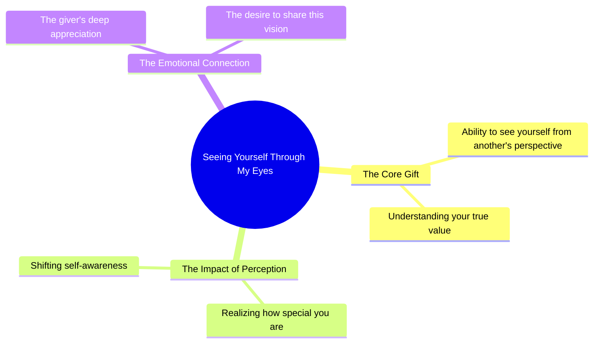

# See Yourself Through My Eyes

> 🌐 **Read this in:** [English](../../en/2026-09/tiktok-transcript-945k-views-27k-reactions-one-thing-i-want-to-give-you-in-lif-b37d.md) · **中文**

> **Creator:** [@Whisprs "](https://www.tiktok.com/@Whisprs ") · **Views:** 352.2K · **Posted:** 2026-09-03 · **Niche:** other
>
> **TL;DR:** This hook instantly creates an intimate, emotional connection by offering a profound perspective shift.

[Watch original video →](https://www.facebook.com/share/r/1cUT1dHm2W/)

## Why This Went Viral

## 钩子（前3秒）
- **逐字开场白：** “如果我能给你生命中的一样东西，我会给你透过我的眼睛看自己的能力。”
- **钩子模式：** 情感反差/私密告白（不是大胆的主张或提问——而是一句脆弱的陈述，听起来像私密想法被公之于众）。
- **为何能阻止滑动：** 它以直接的第二人称（“你”）开场，让人感觉私密且出乎意料。“透过我的眼睛看自己”这一新颖比喻瞬间引发好奇——观众想知道说话者是谁，又是对谁说的。

## 情感节奏
- **节拍1——好奇（0–2秒）：** “如果我能给你一样东西”这一假设设定了一个价值承诺，让观众不由自主地凑近。
- **节拍2——亲密（2–5秒）：** “透过我的眼睛看自己的能力”从泛泛而谈转向深度私人化——观众感觉自己是被倾诉的对象，而非旁观者。
- **节拍3——张力（5–8秒）：** “只有到那时你才会意识到……”制造了期待——答案被刻意延迟片刻。
- **节拍4——共鸣（8–10秒）：** “……你对我有多特别”作为情感释放落地。它将整条信息重新定义为一种爱的表达，而非信息传递。
- **高潮时刻：** 最后一个词“我”——反转在于说话者并非在索取什么；他们是在将自己的感知作为礼物献出。脆弱感在此达到顶峰。

## 关键词密度
- **“你”**（出现6次）——通过高互动（评论、分享）驱动算法触达，因为每个观众都感觉被直接点名。
- **“看自己”**（2次）——情感牵引；创造出一个可作为引文分享的视觉/心理画面。
- **“透过我的眼睛”**（1次，但主题核心）——使视频可被引用和转发的独特短语。
- **“特别”**（1次）——高情感词汇，触发自我关联；观众将其代入自己的关系中。
- **“给你”**（2次）——将信息框定为一份礼物，提升感知价值和可分享性。
- **“意识到”**（1次）——暗示隐藏的真相，驱动好奇心和重复观看。

**算法驱动词：** “你”和“给”（高互动动词）。
**情感牵引词：** “特别”、“看自己”、“透过我的眼睛”。

## 为何能广泛传播
- **以具体为外衣的普遍性：** “你对我有多特别”这句话足够模糊，任何观众都能将其投射到自己的关系中——父母、伴侣、朋友，甚至自己。它之所以传播，是因为人们会@某个他们想对之说这句话的人。
- **“未寄出的信”效应：** 这段文字读起来像一封意外公开的私密消息。这制造了一种窥视般的吸引力——观众分享它，是因为它感觉像一封他们愿意与之关联的告白。
- **适合文字叠加的完美长度：** 约30个词，恰好适合单屏文字展示。这使得它可以被截图、在Stories中转发，并轻松制作成引文图片。
- **无需任何背景：** 没有铺垫、没有面孔、没有地点——文字承载了所有意义。这意味着它可以在各平台（TikTok、Reels、X、Pinterest）上无缝传播，无需改编。
- **情感镜像：** 分享它的观众在暗示“这就是我对你的感觉”——视频成为分享者自身脆弱的代言，这是一种强大的社交货币。

## 你可以借鉴什么
- **以一个假设性的礼物开场：** 用“如果我能给你一样东西……”开始你的视频——它瞬间将你的内容框定为有价值且私人的，而非推销性的。
- **全程使用第二人称：** 将“我觉得”替换为“你会”或“你值得”。直接称呼能增加停留时长和评论率。
- **以一个有力单词收尾：** 最后一个词“我”是让整段话落地的关键。设计你的脚本，让最后一个词承载情感重量——不要拖沓，以一个能重新定义前面所有内容的名词或代词收尾。

## Mind Map

## Full Transcript (Generated by [TokTranscript](https://toktranscript.com/?utm_source=github&utm_medium=breakdown&utm_campaign=tool_attribution))

> 📝 Transcripts on this page are auto-generated and show the first 60%. Want to transcribe any TikTok in 30 seconds and get the full version? [Try TokTranscript free →](https://toktranscript.com/?utm_source=github&utm_medium=breakdown&utm_campaign=transcript_cta)

If I could give you one thing in life, I would give you the ability to see yourself through m

*[Read the full transcript on TokTranscript →](https://toktranscript.com/plaza/tiktok-transcript-945k-views-27k-reactions-one-thing-i-want-to-give-you-in-lif-b37d?utm_source=github&utm_medium=breakdown&utm_campaign=transcript_full)*

## Browse More

- All [other](../../by-niche/zh-CN/other.md) breakdowns
- All [Empathetic wish](../../by-pattern/zh-CN/hook-empathetic-wish.md) examples

## Video Info

| | |
|---|---|
| Creator | [@Whisprs "](https://www.tiktok.com/@Whisprs ") |
| Original video | [https://www.facebook.com/share/r/1cUT1dHm2W/](https://www.facebook.com/share/r/1cUT1dHm2W/) |
| Original title | 945K views · 27K reactions | One thing I want to give you in life 🥀🖤 #poetry #quotes #deepthoughts | Whisprs " |
| Views | 352.2K (352152) |
| Posted | 2026-09-03 |
| Duration | 0s |
| Niche | `other` |
| Hook pattern | `Empathetic wish` |
| Original language | `en` (this page translated by AI) |
| Available languages | en, zh-CN |
| Generated | 2026-09-04 by [TokTranscript](https://toktranscript.com/) |

---

*This breakdown is for educational analysis under fair use. Original video © [@Whisprs "](https://www.tiktok.com/@Whisprs "). All transcripts are auto-generated and may contain errors.*

*Want to analyze your own TikToks like this? [TokTranscript 转录工具 →](https://toktranscript.com/viral-breakdown?utm_source=github&utm_medium=breakdown&utm_campaign=footer_cta)*