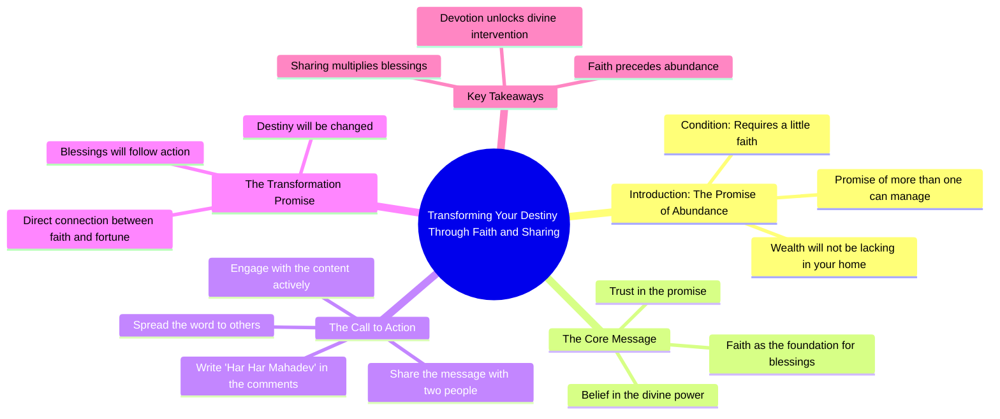

# Sheetal Devi Wins Gold at Khelo India Para Games

> 🌐 **Read this in:** [English](../../en/2026-09/tiktok-transcript-984k-views-207k-reactions-jammu-and-kashmir-s-armless-archer-7e40.md) · **中文**

> **Creator:** [@हर हर शंभू](https://www.tiktok.com/@हर हर शंभू) · **Views:** 255.9K · **Posted:** 2026-09-01 · **Niche:** other
>
> **TL;DR:** Opens with a direct, personal promise of wealth that immediately grabs attention and creates curiosity.

[Watch original video →](https://www.facebook.com/share/r/1J8P48b4CZ/)

## Why This Went Viral

## 钩子（前3秒）
- **逐字开场白：** “你家里不会缺财富，我会给到你无法承受的程度”
- **钩子模式：** 大胆承诺 + 直接称呼（使用“你”的亲密形式）
- **为何能让人停下滚动：** 这是一种以命令式、神一般的语气说出的超自然财富承诺。“无法承受”一词制造了即时的“怎么会？”好奇心缺口。亲密的“你”让人感觉是针对个人的，而非泛泛之谈。

## 情绪节奏
1. **诱惑（0–2秒）：** 财富承诺——即时奖励期待
2. **好奇（2–4秒）：** “我会给那么多”——规模未具体说明，大脑自动填补空白
3. **条件/挑战（4–6秒）：** “如果你对我哪怕有一点点信心”——制造考验，观众感到被审视
4. **行动要求（6–8秒）：** “分享出去，在评论区写下‘哈-哈·马哈拉夫’”——紧迫感，直接命令
5. **高潮（8–10秒）：** “然后看着，我是如何改变你命运的”——最终承诺，以挑战收尾闭环

**高潮时刻：** 最后一句——这是一个挑衅。观众此时已被卷入，因为他们被告知要*看着*某件事发生。

## 关键词密度
- **财富** — 出现1次，但作为第一个词出现；锚定了整个视频的承诺
- **会给** — 出现2次；强化给予者的力量
- **信心/信仰** — 出现1次；触发宗教/情感吸引力
- **命运** — 出现1次；与文化信仰体系相连
- **改变** — 出现1次；暗示转变，一种核心渴望
- **分享** — 出现1次；直接的算法行动号召
- **哈-哈·马哈拉夫** — 出现1次；宗教口号，驱动社群认同

**算法驱动因素：** “分享”是唯一的直接互动关键词。“评论”是隐含的。这些词密度低但影响力高，因为它们是明确的指令。

**情感吸引力驱动因素：** 财富、信心、命运——这些触及深层文化和精神焦虑。它们不需要重复；它们是自带分量的词。

## 为何能传播
- **互惠陷阱：** “你分享，我就给你财富”——观众在心理上被条件反射地驱动去完成行动以获得承诺的奖励。分享不是帮忙；而是一笔交易。
- **宗教身份触发器：** “哈-哈·马哈拉夫”是一个特定的虔诚用语。评论它创造了一种群体归属感。用户分享是为了表明他们的信仰社群身份，而不仅仅是分享视频。
- **低成本、高回报行动：** 门槛极低（一次分享、一条评论），但承诺的回报极大（无限财富）。这种不对称性驱动冲动参与。
- **直接称呼制造拥有感：** “你的”让每个观众都感到被特别选中。这不是群发信息；而是一对一的承诺。
- **无法验证的结果 = 无限循环：** “然后看着”设定了一个未来的回报。当没有明显的事情发生时，观众会重新观看、重新分享，或评论问“什么时候？”——每个动作都在喂养算法。

## 你可以借鉴什么
- **以承诺开场，而非问题：** 先给出奖励（“我会给你X”）再提条件。观众在1秒内决定是否留下；先给他们能得到什么，而不是你需要什么。
- **使用条件式命令：** 将你的行动号召结构化为“如果你做这件事，那么这件事就会发生。”这会把被动观众转化为主动参与者，因为他们觉得自己在解锁某种东西。
- **锚定一个共享身份短语：** 选择一个你的受众已经在使用的词或口号（宗教、文化或特定圈层的）。当你把*那个*作为评论触发器时，你不是在要求互动——你是在邀请他们确认自己是谁。

## Mind Map

## Full Transcript (Generated by [TokTranscript 转录工具](https://toktranscript.com/?utm_source=github&utm_medium=breakdown&utm_campaign=tool_attribution))

> 📝 Transcripts on this page are auto-generated and show the first 60%. Want to transcribe any TikTok in 30 seconds and get the full version? [Try TokTranscript free →](https://toktranscript.com/?utm_source=github&utm_medium=breakdown&utm_campaign=transcript_cta)

तेरे घर में धन की कमी नहीं रहेगी, इतना दूंगा की समाल नहीं पाएगा, अगर मुझ पर थोड़ा सा भी विश्वास है, तो मेरी बात माल लें, सिर्फ दो लो

*[Read the full transcript on TokTranscript →](https://toktranscript.com/plaza/tiktok-transcript-984k-views-207k-reactions-jammu-and-kashmir-s-armless-archer-7e40?utm_source=github&utm_medium=breakdown&utm_campaign=transcript_full)*

## Browse More

- All [other](../../by-niche/zh-CN/other.md) breakdowns
- All [Promise of transformation](../../by-pattern/zh-CN/hook-promise-of-transformation.md) examples

## Video Info

| | |
|---|---|
| Creator | [@हर हर शंभू](https://www.tiktok.com/@हर हर शंभू) |
| Original video | [https://www.facebook.com/share/r/1J8P48b4CZ/](https://www.facebook.com/share/r/1J8P48b4CZ/) |
| Original title | 984K views · 207K reactions | "🌹🙏🏻 Jammu and Kashmir's armless archer and Paralympics medallist Sheetal Devi edged out quadruple amputee Payal Nag of Odisha to win the gold in a much-anticipated clash of the Khelo India Para Games on Sunday. In the battle between two teenagers, defending champion Sheetal came from behind to successfully bag her second gold medal of the Games at the Jawaharlal Nehru Stadium. | हर हर शंभू |
| Views | 255.9K (255885) |
| Posted | 2026-09-01 |
| Duration | 0s |
| Niche | `other` |
| Hook pattern | `Promise of transformation` |
| Original language | `en` (this page translated by AI) |
| Available languages | en, zh-CN |
| Generated | 2026-09-02 by [TokTranscript](https://toktranscript.com/) |

---

*This breakdown is for educational analysis under fair use. Original video © [@हर हर शंभू](https://www.tiktok.com/@हर हर शंभू). All transcripts are auto-generated and may contain errors.*

*Want to analyze your own TikToks like this? [TokTranscript 转录工具 →](https://toktranscript.com/viral-breakdown?utm_source=github&utm_medium=breakdown&utm_campaign=footer_cta)*