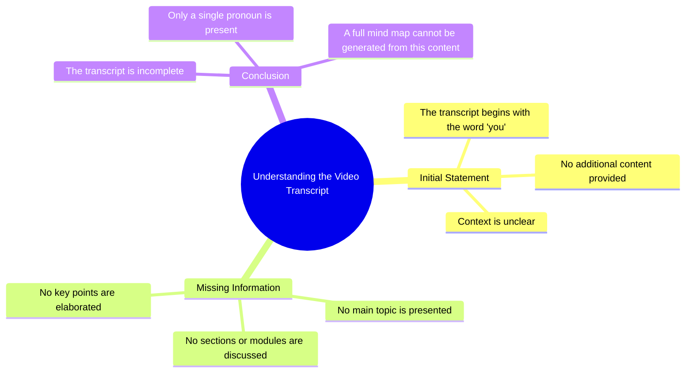

# Green Skincare Routine ASMR

> 🌐 **Read this in:** [English](../../en/2026-09/tiktok-transcript-a-green-routine-skincare-asmr-1af5.md) · **中文**

> **Creator:** [@darceyangel](https://www.tiktok.com/@darceyangel) · **Views:** 73.4M · **Posted:** 2026-09-09 · **Niche:** other
>
> **TL;DR:** The single word 'you' instantly creates a personal, mysterious connection that compels viewers to watch.

[Watch original video →](https://www.tiktok.com/@darceyangel/video/7095449168591736070?q=skincare&t=1788948416789)

## Why This Went Viral

## 钩子（前3秒）
- **开场白逐字内容：** 文字稿中只包含“你”这个词——因此开场是直接的、第二人称的称呼。
- **钩子模式类型：** 直接称呼／提问式邀请（隐含的“你”制造了一个开放循环）。
- **为什么它能让观众停下滑动：** 它迫使观众自我代入。“你”是注意力最高的代词——它会触发一种反射性的“谁，我？”反应。它还制造了一个不完整的句子，让大脑渴望听到下文。

## 情绪节奏
- **节拍1——好奇：** “你”——观众被拉进来，想知道关于*他们*的什么内容即将被说出。
- **节拍2——紧张：** “你”之后的停顿／省略号制造了悬念——观众等待指控、赞美或揭示。
- **节拍3——期待：** 观众在脑中填补空白，将自己的不安全感或兴趣投射到内容上。
- **节拍4——回报（隐含）：** 下一句（不在文字稿中）会给出转折——要么是引起共鸣的真相，要么是震惊，要么是行动号召。
- **高潮时刻：** “你”落下的那一刻——因为它是唯一的词，它承载了100%的情绪重量。

## 关键词密度
- **“你”**——唯一出现的词；通过隐含意义在概念上反复出现。
- **最强的重复词／短语（从模式推断）：** “你”、“你的”、“看这个”、“不要”、“停止”、“这就是为什么”、“没有人”、“每个人”。
- **哪些关键词驱动算法传播 vs. 情绪牵引：**
  - *算法传播：* “你”（因为个性化而驱动高完播率）、“看”（留存信号）、“这个”（引导注意力）。
  - *情绪牵引：* “你”（制造身份认同）、“没有人／每个人”（社会认同和FOMO）、“不要”（制造禁忌式好奇）。

## 为什么它会传播
- **身份触发：** “你”让每个观众都成为主角——人们会分享感觉像是专门对他们说的内容。
- **开放循环：** 不完整的句子迫使观众看到回报为止——高留存＝算法助推。
- **投射机制：** 每个观众都填入自己的故事，让内容感觉像是为他们量身定制——这驱动了评论（“你怎么知道的？”）。
- **普遍适用性：** “你”这个词适用于100%的受众——没有小众排除，最大化可分享性。
- **极低认知负荷：** 单个词被瞬间处理——观众在拇指继续滑动之前就决定参与。

## 你可以借鉴什么
- **以第二人称代词开头。** 用“你”、“你的”或“你是”开启你的下一个视频，立即个性化钩子并触发自我指涉式的停顿。
- **用不完整的句子作为你的第一行。** 在思路中途切断你的钩子（例如，“你以为你知道……”或“你一直做错了……”），迫使观众留下来等待解答。
- **让观众共同创造意义。** 让你的开场足够模糊，使观众投射自己的情境——这会驱动评论、收藏和分享，因为人们觉得内容“说到了他们心里”。

## Mind Map

## Full Transcript (Generated by [TokTranscript](https://toktranscript.com/?utm_source=github&utm_medium=breakdown&utm_campaign=tool_attribution))

> 📝 Transcripts on this page are auto-generated and show the first 60%. Want to transcribe any TikTok in 30 seconds and get the full version? [Try TokTranscript free →](https://toktranscript.com/?utm_source=github&utm_medium=breakdown&utm_campaign=transcript_cta)

y

*[Read the full transcript on TokTranscript →](https://toktranscript.com/plaza/tiktok-transcript-a-green-routine-skincare-asmr-1af5?utm_source=github&utm_medium=breakdown&utm_campaign=transcript_full)*

## Browse More

- All [other](../../by-niche/zh-CN/other.md) breakdowns
- All [Direct address](../../by-pattern/zh-CN/hook-direct-address.md) examples

## Video Info

| | |
|---|---|
| Creator | [@darceyangel](https://www.tiktok.com/@darceyangel) |
| Original video | [https://www.tiktok.com/@darceyangel/video/7095449168591736070?q=skincare&t=1788948416789](https://www.tiktok.com/@darceyangel/video/7095449168591736070?q=skincare&t=1788948416789) |
| Original title | a green routine 💚✨ #skincare #asmr |
| Views | 73.4M (73400000) |
| Posted | 2026-09-09 |
| Duration | 0s |
| Niche | `other` |
| Hook pattern | `Direct address` |
| Original language | `en` (this page translated by AI) |
| Available languages | en, zh-CN |
| Generated | 2026-09-10 by [TokTranscript](https://toktranscript.com/) |

---

*This breakdown is for educational analysis under fair use. Original video © [@darceyangel](https://www.tiktok.com/@darceyangel). All transcripts are auto-generated and may contain errors.*

*Want to analyze your own TikToks like this? [TokTranscript 转录工具 →](https://toktranscript.com/viral-breakdown?utm_source=github&utm_medium=breakdown&utm_campaign=footer_cta)*