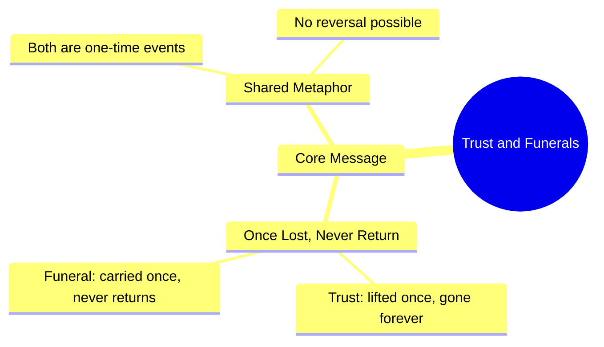

# Trust and Funerals Never Return Once Gone

> 🌐 **Read this in:** [English](../../en/2026-09/tiktok-transcript-beshak-kurulusosman-viral-1millionaudition-turkishseries-bur-63af.md) · **中文**

> **Creator:** [@burak_king_editx](https://www.tiktok.com/@burak_king_editx) · **Views:** 1.8M · **Posted:** 2026-09-19 · **Niche:** entertainment
>
> **TL;DR:** The hook uses a powerful metaphor comparing trust to a funeral, creating an immediate emotional and thought-provoking impact.

[Watch original video →](https://vt.tiktok.com/ZSq7PhKRy/)

## Why This Went Viral

## 钩子（前3秒）
- 逐字开场白：“بھروسہ اور جنازہ ایک بار اٹھ جانے کے بعد کبھی واپس نہیں آتے”（“信任和葬礼——一旦被抬走，就再也回不来了。”）
- 钩子模式：**对比／大胆断言**——两个不相关的名词（信任、葬礼）融合成一句不可逆的陈述。
- 为什么它能阻止滑动：这是一个完整的、自成一体的重击，在3秒内送达。大脑瞬间获得一个完整的想法，从而触发要么认同（“真的”），要么不适（“等等，什么？”）。无需铺垫，无需语境——在观众决定滑动之前，他们已经置身于这个隐喻之中。

## 情绪节奏
- **0–2秒——震惊／好奇：** 葬礼的类比作为一个意想不到、略带黑暗的画面落下。
- **2–5秒——共鸣：** 观众将“信任”映射到个人记忆上（一次背叛、一个破碎的承诺）。
- **5–10秒——紧张：** “کبھی واپس نہیں آتے”（再也回不来）这句话关上了门——没有希望，没有逆转。情绪的重量在此沉淀。
- **10–15秒——共鸣／释然：** 这种终结性本身变成了安慰——它印证了观众早已有却无法表达的感受。
- **高潮：** “جنازہ”（葬礼）这个词。它是转折词——句子在这一刻不再关于关系，而变成关于死亡。

## 关键词密度
- بھروسہ（信任）——情感锚点；驱动收藏和分享
- جنازہ（葬礼）——算法钩子词；高停留率、高评论率
- ایک بار（一次）——创造“一次性”的终结感
- اٹھ جانے（被抬走／被抬起）——让画面具象化的动作动词
- کبھی واپس نہیں آتے（再也回不来）——收尾的重锤；驱动重看
- **算法驱动因素：** جنازہ、واپس نہیں——不寻常＋情绪化＝高观看时长和评论触发
- **情感驱动因素：** بھروسہ、ایک بار——这些让观众标记某人或在评论中引用

## 为什么它会传播
- **它是一口气说完的完整想法。** 整个视频本质上就是一句话——观众不需要等待回报，因此完播率接近100%，而算法会奖励这一点。
- **它将一种普遍的创伤武器化。** “بھروسہ”（信任）是每个观众至少失去过一次的东西。葬礼的隐喻赋予这种私人痛苦一种公开的、可引用的形式。
- **它适合截图。** 这句话适合放在标题、动态、WhatsApp状态中。这种格式（短、屏幕上文字、单行）使其可以无限转发而不丢失出处。
- **它引发评论区的争论。** 有人同意，有人争辩“信任可以重建”——无论哪种，评论都会激增，而评论速度是顶级排名信号。
- **葬礼这个词是模式中断。** 在一个充满励志内容的推送中，“جنازہ”（葬礼）是刺耳且意想不到的——它打破了滑动模式，迫使你再看一眼。

## 你可以借鉴什么
- **将两个不相关的名词融合成一句不可逆的陈述。** “信任和葬礼”之所以有效，是因为这种搭配意想不到但瞬间合乎逻辑。试试：“尊重和镜子——一旦破碎，你只看到裂痕。”
- **在3秒内传达整个想法。** 没有开场白，没有“愿平安与你同在”，没有语境。从点睛之笔开始。让观众的大脑去做解读。
- **让最后一个词成为最重的词。** “واپس نہیں آتے”（再也回不来）是重锤。构建你的句子，让最后2–3个词承载情感和算法重量——这正是驱动重看和分享的关键。

## Mind Map

## Full Transcript (Generated by [TokTranscript](https://toktranscript.com/?utm_source=github&utm_medium=breakdown&utm_campaign=tool_attribution))

> 📝 Transcripts on this page are auto-generated and show the first 60%. Want to transcribe any TikTok in 30 seconds and get the full version? [Try TokTranscript free →](https://toktranscript.com/?utm_source=github&utm_medium=breakdown&utm_campaign=transcript_cta)

بھروسہ اور جنازہ ایک بار اٹھ جانے ک

*[Read the full transcript on TokTranscript →](https://toktranscript.com/plaza/tiktok-transcript-beshak-kurulusosman-viral-1millionaudition-turkishseries-bur-63af?utm_source=github&utm_medium=breakdown&utm_campaign=transcript_full)*

## Browse More

- All [entertainment](../../by-niche/zh-CN/entertainment.md) breakdowns
- All [Metaphorical Comparison](../../by-pattern/zh-CN/hook-metaphorical-comparison.md) examples

## Video Info

| | |
|---|---|
| Creator | [@burak_king_editx](https://www.tiktok.com/@burak_king_editx) |
| Original video | [https://vt.tiktok.com/ZSq7PhKRy/](https://vt.tiktok.com/ZSq7PhKRy/) |
| Original title | Beshak 💯😢. #kurulusosman #viral #1millionaudition #turkishseries #bur... |
| Views | 1.8M (1800000) |
| Posted | 2026-09-19 |
| Duration | 0s |
| Niche | `entertainment` |
| Hook pattern | `Metaphorical Comparison` |
| Original language | `en` (this page translated by AI) |
| Available languages | en, zh-CN |
| Generated | 2026-09-20 by [TokTranscript](https://toktranscript.com/) |

---

*This breakdown is for educational analysis under fair use. Original video © [@burak_king_editx](https://www.tiktok.com/@burak_king_editx). All transcripts are auto-generated and may contain errors.*

*Want to analyze your own TikToks like this? [TokTranscript →](https://toktranscript.com/viral-breakdown?utm_source=github&utm_medium=breakdown&utm_campaign=footer_cta)*