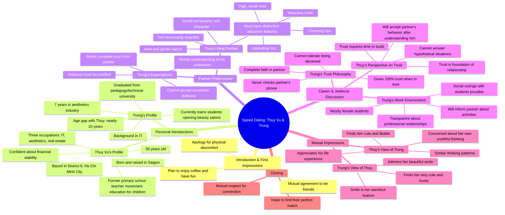

# Gentle Teacher Shocked as Real Estate Tycoon Rejects Her

> 🌐 **Read this in:** [English](../../en/2026-09/tiktok-transcript-c-gi-o-d-u-d-ng-ng-ng-ng-b-i-gia-b-s-t-ch-i-ph-nghe-l-do-xon-359d.md) · **中文**

> **Creator:** [@Yêu là cưới?](https://www.tiktok.com/@Yêu là cưới?) · **Views:** 441.9K · **Posted:** 2026-09-06 · **Niche:** entertainment
>
> **TL;DR:** Opens with a playful apology and immediate question, creating curiosity and a flirty dynamic.

[Watch original video →](https://www.facebook.com/share/v/1EiRCPjdmr/)

## Why This Went Viral

## 钩子（前3秒）
- **逐字开场：** “弟弟别捏”——紧接着是“哥哥跟你道歉哈”。
- **钩子模式：** 场景 + 反差。这是一档相亲节目，男方在开场时立即为一次肢体失误（很可能是介绍环节中的无意触碰）道歉，营造出尴尬又搞笑的张力。
- **为何能让人停下滑动：** 道歉出人意料且带有自嘲意味。它传递出“出了点状况”的信号，颠覆了通常“自信第一印象”的套路，让观众好奇到底发生了什么，以及两人的互动会如何发展。

## 情绪节奏
1. **尴尬/搞笑** — 道歉以令人尴尬又好笑的瞬间开场；观众会凑近看。
2. **好奇/评估** — 女方（Thuy Vu，39岁）列出自己的资历（3份工作：IT、美容、房地产）——表明她独立自主，“不会饿死”。
3. **紧张** — 男方承认自己的工作（教美容）意味着经常接触女性；他先发制人地回应嫉妒问题。
4. **释然/共鸣** — 她成熟地回应：“如果我们没什么好隐瞒的，就不需要偷偷摸摸。”这化解了紧张气氛，显示出情商。
5. **脆弱/信任** — 他宣称自己100%信任，从不查手机，但警告“别让我发现”。这是一个反转——用柔软的话语包裹着坚定的界限。
6. **高潮** — 互相赞美：他说她的笑容是他最喜欢的特征；她说他“很容易让人喜欢”，并注意到他的人生阅历。年龄差距（约10岁）被承认并接受。
7. **结局/温暖** — 主持人总结：“我们尊重你们的缘分。你们会找到缺失的那一块。”以充满希望、令人愉悦的氛围收尾。

## 关键词密度
- **“Tin”（信任）** — 出现约10次。核心情感主题；推动叙事和观众投入。
- **“Anh/Em”（我/你，分性别）** — 持续出现；强化亲密感和相亲节目的框架（算法友好：评论区互动率高）。
- **“Ghen”（嫉妒）** — 在冲突部分反复出现；引发评论区争论（通过评论大战获得算法传播）。
- **“Công việc”（工作）** — 多次提及；将对话扎根于现实生活的实际层面（引发共鸣）。
- **“Cười”（笑容）** — 被强调为他最喜欢的特质；情感吸引力（正面联想）。
- **“39 tuổi”（39岁）** — 具体数字；锚定年龄，激发人群定向和共鸣。

## 为何能广泛传播
- **无剧本的尴尬是金矿。** 开场道歉（“弟弟别捏”）是一个真实、未经修饰的瞬间，感觉非常真实——观众因为这种 relatable 的尴尬感而分享。这不是精心设计的搭讪台词；而是人类真实的失误。
- **嫉妒问题是普世钩子。** 他的工作（教女性美容）和她的回应（“如果没什么好隐瞒的，就不需要偷偷摸摸”）创造了一堂成熟关系的小型大师课。观众@伴侣或在评论区争论，推动分享。
- **信任边界的反转金句值得引用。** “我100%信任，但别让我发现”是一句犀利、令人难忘的话，会被剪辑和反复引用。这是一种人们要么认同要么反对的立场——完美激发互动。
- **年龄差距 + 人生阅历的动态。** 她39岁，他约49岁。她承认自己有时想法“幼稚”；他珍视她的笑容。这颠覆了典型的“年轻女性”套路，与在约会内容中感到被忽视的年长群体产生共鸣。
- **主持人的框架营造了安全空间。** “我们尊重你们的缘分”肯定了这段互动，让视频感觉像是一个积极、支持性的空间——观众将其作为“治愈系内容”分享。

## 你可以借鉴什么
- **以缺点开场，而非炫耀。** 在视频开头承认一个错误或尴尬时刻。这会解除观众的防备，让你比精心打磨的开场更讨喜。
- **尽早点名房间里的大象。** 如果有潜在的反对点（他的工作、她的年龄、过去的问题），在前30秒内直面它。这能建立信任，并让观众继续观看以了解如何解决。
- **以可引用的界限收尾。** 精心设计一句以柔软、令人难忘的方式表达坚定底线的话（“我100%信任，但别让我发现”）。这给观众提供了可以剪辑、引用和争论的内容——这正是分享的燃料。

## Mind Map

## Full Transcript (Generated by [免费 TikTok 文稿生成器](https://toktranscript.com/?utm_source=github&utm_medium=breakdown&utm_campaign=tool_attribution))

> 📝 Transcripts on this page are auto-generated and show the first 60%. Want to transcribe any TikTok in 30 seconds and get the full version? [Try TokTranscript free →](https://toktranscript.com/?utm_source=github&utm_medium=breakdown&utm_campaign=transcript_cta)

Em trai không bóp Anh xin lỗi em nha Dạ rồi, anh muốn sao anh? Anh muốn em một người bạn của anh Dạ rồi, ok Mình có thể uống cà phê chơi vui thôi Khi anh yêu, anh muốn cô gái tin Trên này anh hỏi rất là kỹ Tại rồi xưa anh cũng bị một vấn đề đó Anh muốn sao? Tin anh hoàn toàn Em tên là Thuy Vũ Năm nay em 39 tuổi Ngoại nghiệp của em thì em làm tới 3 ngày IT, thẩm mỹ và kinh doanh bất lộng sản Rồi, dạ Dạ, cho nên em sẽ không bao giờ sợ đói Em gái vậy anh bảo đảm em no Ở đâu? Dạ em ở Sài Gòn à? Quận mấy? Dạ em quận 6 à Tức là sinh ra lớn lên ở TP.HCM luôn Dạ, sinh ra Vua bạn gái của em là như thế nào? Trước tiên là tánh hiền Hiền nhưng phải ca tính nha Với đường hiền bánh bèo Không cần phải xinh, không cần phải đẹp Có một cái điểm ứng tưởng nào đó Ứng tưởng như là có cái mũi cao cao nhỏ nhỏ Và có bờ môi quý rũ Hay có dòng 1 hấp dẫn và dòng ba lôi cuốn vậy đó, có một cái điểm gì đó hay là tóc và hiền vậy đó một cái điểm ứng từ Nhiều trung em nghe cô giáo em cũng thích đó Ông ơi, em cô giáo dạy cấp mấy em? Em dạy cấp 1 nhưng mà hiện tại thì em đã nghỉ công việc ở trường rồi tại vì em muốn ra ngoài làm nhiều hơn Em là dạy về vận động cho bé bé nhỏ Em d tham m kh D D tham m l d v c g Em d v Phung Thi B c th b kia c c B kia c m m t G tr em g xinh D em ch anh c Linh Có cái điểm úy nào không? Có nhiều à Nhiều cái ấn tượng luôn á, chứ không phải là một đâu Hồi nãy em nghe nói là anh có dạy cái gì ta? Dạy về tham mỹ á Hồi trước anh làm bên IT Anh tốt nghiệp bên trường sư phẩm chú thuật á Mỗi năm làm một thời gian xong anh có bén duyên Bé duyên nghề thẩm mỹ Anh mới làm Anh làm cũng được 7 năm Xong bây giờ anh đi dạy học Anh đào tạo cho học viên cho mấy ai mà muốn mở tiệm á Anh dạy lại Thì đó, nói chung mà Cái nghề đó thì Trung anh nói trước nha Cái nghề đó thì anh tiếp xúc với con gái cũng hơi nhiều À dạ Tại vì đa số học viên là nữ không à À thì đó, em với em có ghen hay không? Cũng có đó anh Nhưng mà nói chung là Mình trao đổi rõ ràng thôi Tính chất công việc mà đâu ai muốn đâu Có nghĩa là nếu như mình không có gì Thì mình không cần phải mập mờ hay là gì đó Thì anh nói nghe là em có game bua không dạ? Nhưng mà học viên nó rủ anh đi ăn Thì lúc mà anh thì lịch sử Thì một người thầy giáo đi ăn với học viên đúng không? Thì xong rồi anh sẽ báo em Dạ rồi Th em c nh m em c bu hay em c b x c g kh Em tr ra c Th s anh c mu h k v em b C th m n c c hay kh th m Cái này chắc phải để thời gian trả lời đi anh. Tại vì nếu như bây giờ trong trường hợp này em chưa hiểu gì anh hết. Em không biết anh như thế nào thì em không thể trả lời được. Sau một thời gian tìm hiểu em cảm thấy anh là người đáng tin tưởng. Thì anh làm gì em sẽ chấp nhận. Nên em không có trả lời được. Trong tình yêu á, trước tiên là phải tin nhau. Tin trước đi. Tin trước đi. Đó là điều kiện đầu tiên tạo cho hai đứa gắn bó hơn Anh muốn một cô gái gì đó Ừ, tin anh Giờ một cô gái

*[Read the full transcript on TokTranscript →](https://toktranscript.com/plaza/tiktok-transcript-c-gi-o-d-u-d-ng-ng-ng-ng-b-i-gia-b-s-t-ch-i-ph-nghe-l-do-xon-359d?utm_source=github&utm_medium=breakdown&utm_campaign=transcript_full)*

## Browse More

- All [entertainment](../../by-niche/zh-CN/entertainment.md) breakdowns
- All [Apology tease](../../by-pattern/zh-CN/hook-apology-tease.md) examples

## Video Info

| | |
|---|---|
| Creator | [@Yêu là cưới?](https://www.tiktok.com/@Yêu là cưới?) |
| Original video | [https://www.facebook.com/share/v/1EiRCPjdmr/](https://www.facebook.com/share/v/1EiRCPjdmr/) |
| Original title | Cô giáo dịu dàng ngỡ ngàng bị đại gia BĐS từ chối phũ, nghe lý do xong nàng chỉ biết gượng cười |
| Views | 441.9K (441901) |
| Posted | 2026-09-06 |
| Duration | 0s |
| Niche | `entertainment` |
| Hook pattern | `Apology tease` |
| Original language | `en` (this page translated by AI) |
| Available languages | en, zh-CN |
| Generated | 2026-09-07 by [TokTranscript](https://toktranscript.com/) |

---

*This breakdown is for educational analysis under fair use. Original video © [@Yêu là cưới?](https://www.tiktok.com/@Yêu là cưới?). All transcripts are auto-generated and may contain errors.*

*Want to analyze your own TikToks like this? [TokTranscript →](https://toktranscript.com/viral-breakdown?utm_source=github&utm_medium=breakdown&utm_campaign=footer_cta)*