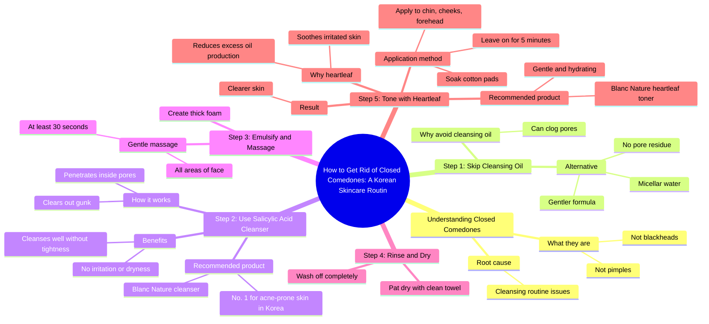

# Korean Cleansing Routine for Closed Comedones

> 🌐 **Read this in:** [English](../../en/2026-09/tiktok-transcript-cleansing-routine-for-closed-comedones-kbeauty-koreanskincar-5408.md) · **中文**

> **Creator:** [@hudsonsqrd](https://www.tiktok.com/@hudsonsqrd) · **Views:** 3.9M · **Posted:** 2026-09-12 · **Niche:** beauty
>
> **TL;DR:** It stops the scroll by directly accusing the viewer of a common mistake and pointing at a visible problem.

[Watch original video →](https://www.tiktok.com/@hudsonsqrd/video/7639402905992318238?_r=1&_t=ZS-99fJgDVzjzm)

## Why This Went Viral

## 钩子（前3秒）
- **逐字开场白：** “别再这样洗脸了。你有这个或这个。”
- **钩子模式：** 直接命令 + 视觉演示（“别再这样做X”）结合好奇心缺口（“这个或这个”，同时指着皮肤）。
- **为什么能阻止滑动：** 它攻击了观众几乎肯定每天都在犯的习惯，然后立即暗示他们有一个自己不知道的可见问题。模糊的“这个或这个”迫使眼睛留在屏幕上以识别状况——答案被保留了好几秒。

## 情绪节奏
- **0–3秒——指责/好奇：** “别再这样洗脸了”制造轻微内疚 + 模式打断。
- **3–8秒——宽慰重构：** “它们不是黑头，也不是痘痘。它们叫闭合性粉刺”——重新命名问题，感觉像是内部知识。焦虑转化为“原来是这样。”
- **8–12秒——权威植入：** “你的韩国兄弟说”——借来的可信度，降低怀疑。
- **12–40秒——教学张力：** 五个编号步骤创造清单节奏。每一步都解决一个微小担忧（毛孔堵塞 → 更温和的选择；干燥 → “没有紧绷感”）。
- **约30秒——社会认同高峰：** “韩国祛痘护肤第一洁面”—— reassurance节拍。
- **高潮：** 鱼腥草爽肤水演示——“浸湿化妆棉……敷在下巴、脸颊和额头五分钟。”这是视觉回报和产品英雄时刻。
- **最终节拍——承诺/宽慰：** “然后你的皮肤就会干净。”一个干净、绝对的解决，闭合了前3秒打开的循环。

## 关键词密度
- **最强重复词：** *毛孔、洁面、闭合性粉刺、水杨酸、韩国、温和/更温和、爽肤水、鱼腥草、Blanc Nature、干净。*
- **算法触达关键词：** *痘痘、黑头、粉刺、水杨酸、洁面、毛孔*——高搜索、高竞争词，将视频锚定在护肤搜索和推荐流中。
- **情绪拉动关键词：** *韩国兄弟、温和、没有紧绷感、刺激、干净*——这些承载信任和宽慰，比原始搜索量更能驱动收藏和分享。
- **品牌关键词：** *Blanc Nature* 重复两次并带有排名声明（“韩国第一”）——将触达转化为商业意图。

## 为什么它会传播
- **它命名了观众没有词汇描述的问题。** “它们不是黑头，也不是痘痘。它们叫闭合性粉刺”给观众一个可以搜索、截图、发给朋友的标签——这是文字稿中最具分享性的一句话。
- **它将日常程序重构为可修复的错误。** “别再这样洗脸了”将被动观众变成有行动项的人，这驱动收藏和重看。
- **借来的权威消除怀疑。** “你的韩国兄弟说”和“韩国祛痘护肤第一洁面”让观众外包信任，而不是自己评估声明。
- **编号结构让它感觉完整且可参考。** 步骤1–5给视频一个“稍后保存”的架构——正是被存入收藏并被算法重新推送的格式。
- **结尾有具体、视觉化的回报。** 化妆棉爽肤水演示（“敷在下巴、脸颊和额头五分钟”）可截图且容易模仿，这推动合拍、拼接和评论区提问。

## 你可以借鉴什么
1. **以攻击习惯开场，而不是自我介绍。** 以“别再这样做X”和一个模糊视觉（“这个或这个”）开头，只在视频中途才揭晓——这能为你多买5–10秒的留存。
2. **在推销解决方案之前重新命名问题。** 给观众一个他们已有事物的新术语（“闭合性粉刺”）创造一个截图时刻，让你的视频感觉像内部知识而不是广告。
3. **将你的产品包装成编号方案。** 步骤1–5将单一产品推销变成值得保存的日常程序，而排名声明（“韩国第一”）替你完成说服工作，无需你争辩。

## Mind Map

## Full Transcript (Generated by [免费 TikTok 文稿生成器](https://toktranscript.com/?utm_source=github&utm_medium=breakdown&utm_campaign=tool_attribution))

> 📝 Transcripts on this page are auto-generated and show the first 60%. Want to transcribe any TikTok in 30 seconds and get the full version? [Try TokTranscript free →](https://toktranscript.com/?utm_source=github&utm_medium=breakdown&utm_campaign=transcript_cta)

Stop washing your face like this. You have this or this. They're not blackheads, they're not pimples. They're called closed comedones, and it's time to check your cleansing routine. Step one your Korean brother says skip cleansing oil. It can clog your pores. So switch to micellar water. It's gentler and doesn't leave residue in your pores. Step 2 use a cleanser with salicylic acid. It goes inside your pores and clears out the gunk. I've been using this cleanser from Blanc Nature because most acne cleansers dry my skin out, but this one cleanses really well without the tight feeling or irritation. And it's the No.. 1 cleanser for acne prone skin in Korea. Step 3 emulsify your cleanser 

*[Read the full transcript on TokTranscript →](https://toktranscript.com/plaza/tiktok-transcript-cleansing-routine-for-closed-comedones-kbeauty-koreanskincar-5408?utm_source=github&utm_medium=breakdown&utm_campaign=transcript_full)*

## Browse More

- All [beauty](../../by-niche/zh-CN/beauty.md) breakdowns
- All [Pattern interrupt + callout](../../by-pattern/zh-CN/hook-pattern-interrupt-callout.md) examples

## Video Info

| | |
|---|---|
| Creator | [@hudsonsqrd](https://www.tiktok.com/@hudsonsqrd) |
| Original video | [https://www.tiktok.com/@hudsonsqrd/video/7639402905992318238?_r=1&_t=ZS-99fJgDVzjzm](https://www.tiktok.com/@hudsonsqrd/video/7639402905992318238?_r=1&_t=ZS-99fJgDVzjzm) |
| Original title | Cleansing routine for closed comedones! #kbeauty #koreanskincare #bla... |
| Views | 3.9M (3900000) |
| Posted | 2026-09-12 |
| Duration | 0s |
| Niche | `beauty` |
| Hook pattern | `Pattern interrupt + callout` |
| Original language | `en` (this page translated by AI) |
| Available languages | en, zh-CN |
| Generated | 2026-09-13 by [TokTranscript](https://toktranscript.com/) |

---

*This breakdown is for educational analysis under fair use. Original video © [@hudsonsqrd](https://www.tiktok.com/@hudsonsqrd). All transcripts are auto-generated and may contain errors.*

*Want to analyze your own TikToks like this? [拆解你自己的 TikTok →](https://toktranscript.com/viral-breakdown?utm_source=github&utm_medium=breakdown&utm_campaign=footer_cta)*