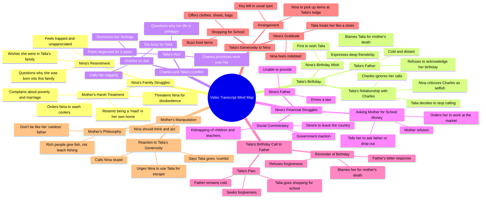

# Dear Talia: African AI Series Review

> 🌐 **Read this in:** [English](../../en/2026-09/tiktok-transcript-dear-talia-the-african-ai-series-you-need-to-watch-deartalia-31f1.md) · **中文**

> **Creator:** [@storybuzzhq](https://www.tiktok.com/@storybuzzhq) · **Views:** 1.5M · **Posted:** 2026-09-16 · **Niche:** entertainment
>
> **TL;DR:** The stark contrast between peaceful sleep and inhaling smoke immediately grabs attention and evokes sympathy.

[Watch original video →](https://vm.tiktok.com/ZN86L4fMo/)

## Why This Went Viral

## 钩子（前3秒）
- **逐字开场：** “我的朋友们还在床上安睡。而我却在这里吸着烟。”
- **钩子模式：** 对比 + 共鸣感（同伴比较 / “他们在睡，我在受苦”）。
- **为什么能让人停下滑动：** 瞬间构建出阶级/地位差距（“我的朋友们” vs.“我”），并在第一口气就抛出一个感官性的、令人不适的画面（“吸着烟”）。观众被直接丢进冲突之中，没有任何背景——大脑需要缺失的前情，所以会继续看下去。

## 情绪节奏
- **0–15秒——好奇 + 怨恨：** 母亲的咆哮（“那个蠢女孩在哪”，“尼日利亚会让你看起来像加纳一样”）建立起反派能量和利害关系。
- **15–45秒——对妮娜的共情：** 妮娜的内心独白（“为什么我没有生在塔莉亚家？”）积累怜悯，并塑造出清晰的下位者形象。
- **45秒–1:30——温暖 + 对比：** 塔莉亚的生日来电是情绪高点——友情、忠诚，以及短暂的舒缓节拍。
- **1:30–2:00——紧张升级：** 查尔斯的电话。冷淡、轻蔑，“你太爱唠叨了”——背叛节拍落在这里。
- **2:00–2:45——双重拒绝：** 父亲那句“我怎么会忘记你害死我妻子的那一天？”是剧本中最锋利的情感切割。
- **2:45–3:30——悬念 + 道德岔路：** 塔莉亚提出把一切都买下来；妮娜的母亲把善意重新定义为操控（“一整条面包上掉下来的碎屑”）。
- **高潮：** “想想，妮娜，想想！”——母亲的操控作为最后一拍落下，把一个悲伤故事转化为观众必须自己解决的道德困境。

## 关键词密度
- **“生日”**——锚定整集；驱动情绪拉力（每个节拍都与之绑定）。
- **“钱” / “学费”**——驱动阶级冲突主题和算法触达（高搜索、高共鸣）。
- **“女佣” / “冷藏箱” / “市场”**——夯实贫困设定；强烈的区域共鸣。
- **“塔莉亚”**——情绪支点；重复名字建立角色品牌。
- **“自私” / “操控”**——触发评论区争论的道德标签。
- **“原谅” / “害死我妻子”**——情绪密度最高的短语；驱动分享和重看。
- **“想想，妮娜，想想”**——收尾钩子短语；为评论诱饵而设计。
- **算法驱动词：** “生日”、“学费”、“尼日利亚”、“女佣”（搜索 + 区域定向）。
- **情绪驱动词：** “害死我妻子”、“一整条面包上掉下来的碎屑”、“自私”、“原谅”。

## 为什么会传播
- **层层叠加的微型悬念。** 每20–30秒都以一个未解决的节拍结束（“那个蠢女孩在哪？”→“我要打给查尔斯”→“我该告诉他吗？”→“想想，妮娜，想想！”）。观众不看到解决就无法退出。
- **普世反派原型。** 恶毒继母（“你会后悔有我这样的母亲”）、冷漠男友（“你太爱唠叨了”）、不肯原谅的父亲（“把我妻子带回来”）。每一个都映射到观众真实的伤口，迫使认同。
- **为评论而设计的道德模糊性。** 母亲那段话——“像她这样的有钱人不会教你如何钓鱼”——把令人同情的塔莉亚重新定义为守门人。这会把观众分裂成两个阵营（妮娜应该忠诚 vs. 妮娜应该利用塔莉亚），而这是评论区病毒式传播的最大单一驱动因素。
- **阶级奇观式共鸣。** 像“我在这个家里被当成女佣使唤”和“一个在太阳底下卖食物的母亲，一个开出租车的父亲”这样的台词，击中大量非洲/工薪阶层观众，具有高分享性。
- **不到4分钟内的情绪过山车。** 观众在一次观看中被从怜悯 → 温暖 → 背叛 → 悲痛 → 诱惑。高情绪速度 = 高重看率和高完播率，而算法会奖励这一点。

## 你可以偷走的东西
- **从冲突中途开场，而不是从铺垫中途开场。** 用场景中最响亮的台词开场（“尼日利亚会让你看起来像加纳一样”）——绝不要用说明性内容开场。观众应该感觉自己走进了一场已经在进行的争吵。
- **给每个角色一句可引用的道德台词。** “一整条面包上掉下来的碎屑”、“把我妻子带回来”、“你太爱唠叨了”。每个角色一句令人难忘的话，才是会被截图、配字幕和转发的内容。
- **以困境收尾，而不是以解决收尾。** “想想，妮娜，想想！”迫使观众选边站。发布前问自己：*人们会在评论区争论什么？* 如果你答不出来，这个视频就不会传播。

## Mind Map

## Full Transcript (Generated by [TokTranscript](https://toktranscript.com/?utm_source=github&utm_medium=breakdown&utm_campaign=tool_attribution))

> 📝 Transcripts on this page are auto-generated and show the first 60%. Want to transcribe any TikTok in 30 seconds and get the full version? [Try TokTranscript free →](https://toktranscript.com/?utm_source=github&utm_medium=breakdown&utm_campaign=transcript_cta)

My mates are still in bed sleeping peacefully. And I'm here inhaling smoke. In fact, where is that stupid girl? Nina, if I meet you in that room, Nigeria will look like Ghana to you. All you know is how to ask me for money. But you won't help to make it. It's not like she would give me money for my school fees even after I help her. God, why did you bring me into this family? Why wasn't I born into Talia's family? Why are you still standing there? Will you go and wash those coolers before I descend on you this morning? You will know my true colour when I get to the market and find that my customers have already eaten. My maids that got married to rich men are in their beds now while their maids serve them. Meanwhile, I am being used as a maid in this house. Because I married a man with a bright future. Yet for 26 years, the future is still not bright. Why is she always complaining every day? It's not like anyone forced her to marry my father. I need to call Talia now before this woman comes back. Happy birthday to you. Happy birthday to you. Happy birthday, dear Talia. Happy birthday to you, my best friend. I wish you nothing but the best things life has to offer. Thank you so much, Nina. You are the first person who wish me a happy birthday today. I Honestly, wonder what my life would be without you. Really? What about your father? Is he still being cold to you and Charles? Didn't he call? Surely he did something fancy for you. I haven't heard from Charles since yesterday. I've called several times, but he won't pick up and he hasn't called back. Honestly, I'm done. I won't call him again. He's not the only one who's busy. I'm busy too. And as for my father, well, you already know what our relationship is like. Honestly, I wouldn't want to spoil my day by going to him just to remind him that it's my birthday. I never liked that Charles guy. I don't know what you even see in that selfish man. Even on your birthday, he didn't call or do anything romantic. I'm sure he's on set right now, flirting with anything in a skirt. He's just a wasted soul. Where is that stupid girl? I asked her to wash the coolers for me. Nina, if I meet you inside that house, you will regret having me as a mother. Will you come and wash these coolers? Mommy, I'm coming! I'm in the toilet. I'm having a running stomach. If I meet you in there, your stomach won't be the only thing running. Your tears will run too, you idiot! Talia, I have to go. I'll call you later. Let me try calling Charles for the very last time. This is the last time I'm going to explain This scene, if either of you messes it up again, you're off my set. Let's take a break. So you can finally take calls now? Charles, it's my birthday. You didn't even bother to call or wish me a happy birthday. Just how heartless can you be? Why do you nag so much? You called and I didn't pick up. Shouldn't your common sense tell you that I'm too busy to talk? As for your birthday, the day has only just started. Something can still be done about it. But if you keep nagging, I'm just going to ignore you. Just imagine the stupid things coming out of your mouth. I nag only because I'm trying to explain how your actions are hurting me. Anyway, I shouldn't have expected more from a selfish, manipulative man like you. Oh, so now I'm selfish and manipulative just because I said I'm busy? Talia, you are dating an alias director, not some common church rat. Hello, Talia. Break is over. Everyone back to work! How can a man not understand that he's hurting his woman? It's been 3 years, and Charles keeps putting his work above my needs. Why is my life like this? I'm never happy. I have a father who hates me, and now this. Mommy, please, I need money to get the things I need for school. I'm leaving tomorrow. Go and ask that stupid father of yours who sent you to school for the money. And if he can't, Give you the money for school, then drop out and join me in selling food at the market. But for today, make sure I don't get to the store before you. This country is a joke. Kids under 3 years old and their teachers have been kidnapped for weeks now, and the government says nothing. Honestly, it would be better if they just sold this country and gave me my own share so I could seek refuge somewhere else. Should I tell him? What if he gets cold or angry with me? He already hates me. But not telling him won't change anything. Oh, god, please help me. Daddy, I'm sorry to disturb you. It's just. I wanted to remind you

*[Read the full transcript on TokTranscript →](https://toktranscript.com/plaza/tiktok-transcript-dear-talia-the-african-ai-series-you-need-to-watch-deartalia-31f1?utm_source=github&utm_medium=breakdown&utm_campaign=transcript_full)*

## Browse More

- All [entertainment](../../by-niche/zh-CN/entertainment.md) breakdowns
- All [Contrast Hook](../../by-pattern/zh-CN/hook-contrast-hook.md) examples

## Video Info

| | |
|---|---|
| Creator | [@storybuzzhq](https://www.tiktok.com/@storybuzzhq) |
| Original video | [https://vm.tiktok.com/ZN86L4fMo/](https://vm.tiktok.com/ZN86L4fMo/) |
| Original title | Dear Talia | The African AI Series You Need To Watch#deartalia #story... |
| Views | 1.5M (1500000) |
| Posted | 2026-09-16 |
| Duration | 0s |
| Niche | `entertainment` |
| Hook pattern | `Contrast Hook` |
| Original language | `en` (this page translated by AI) |
| Available languages | en, zh-CN |
| Generated | 2026-09-17 by [TokTranscript](https://toktranscript.com/) |

---

*This breakdown is for educational analysis under fair use. Original video © [@storybuzzhq](https://www.tiktok.com/@storybuzzhq). All transcripts are auto-generated and may contain errors.*

*Want to analyze your own TikToks like this? [TikTok 转录工具 →](https://toktranscript.com/viral-breakdown?utm_source=github&utm_medium=breakdown&utm_campaign=footer_cta)*