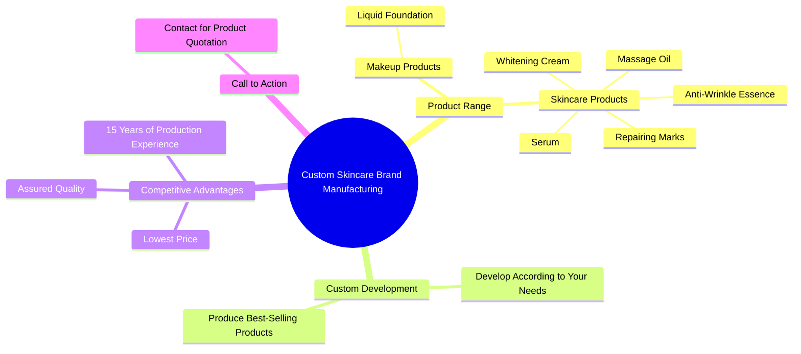

# Custom Private Label Skincare Products Manufacturing

> 🌐 **Read this in:** [English](../../en/2026-09/tiktok-transcript-do-you-want-to-customize-your-own-brand-of-skin-care-product-7458.md) · **中文**

> **Creator:** [@yuchengcosmeticsfactory](https://www.tiktok.com/@yuchengcosmeticsfactory) · **Views:** 1.8M · **Posted:** 2026-09-17 · **Niche:** beauty
>
> **TL;DR:** Immediately engages business owners by asking if they want to create their own brand, tapping into entrepreneurial aspirations.

[Watch original video →](https://www.tiktok.com/@yuchengcosmeticsfactory/video/7449962848203181354?is_from_webapp=1&sender_device=pc)

## Why This Went Viral

## 钩子（前3秒）
- **逐字开场白：**“你好老板，你想定制自己品牌的护肤品吗？”
- **钩子模式：**直接提问 + 身份恭维（“老板”）+ 机会框架（自有品牌代工）。
- **为什么能让人停下滚动：**它在第一秒就锁定了一个特定的观众身份（有品牌梦想的创业者 / 经销商 / 电商卖家）。“老板”这个词瞬间激发自我认同，而“定制自己的品牌”则承诺了所有权和利润——一种高价值结果。提问形式迫使大脑做出是/否判断，让人很难划过去。

## 情绪节奏
- **0–3秒——好奇 + 恭维：**“你好老板……定制自己的品牌？”→ 观众感到被看见并产生兴趣。
- **3–8秒——渴望叠加：**列出产品品类（祛斑修复、美白霜、粉底液、抗皱精华、按摩油、精华液）。快速列举营造出丰富感和可能性。
- **8–12秒——信任 + 权威：**“15年生产经验”“质量放心。”对“这靠谱吗？”的紧张感得到部分回答。
- **12–15秒——价格张力 + 释放：**“最低价。最低价。”重复猛击核心痛点（成本）并带来释放。
- **高潮时刻：**双重“最低价”——这是情绪峰值，因为它以最大重复化解了最大的未说出口异议（利润空间/盈利能力）。
- **15–18秒——行动号召 + 古怪结尾：**“联系我获取产品报价。咔。咔咔。”奇怪的“咔咔”结尾制造出突兀、难忘、几乎喜剧化的节拍，让视频显得真实、不精致——这反而增加了分享性。

## 关键词密度
- **最强的重复词/短语：**
  1. “老板”
  2. “定制 / 自己的品牌”
  3. “护肤品”（以及产品品类名称）
  4. “最低价”（连续重复两次）
  5. “中国化妆品工厂”
  6. “15年生产经验”
  7. “质量”
  8. “联系我 / 产品报价”
  9. “咔咔”（结尾标志）
- **算法触达驱动因素：**“定制”“自己的品牌”“护肤品”“化妆品工厂”“最低价”——这些匹配高意图B2B搜索和推荐查询。
- **情绪拉动驱动因素：**“老板”“放心”“质量”“咔咔”——这些建立融洽、信任和个人连接感，让观众觉得是在直接对自己说话，而不是被广告轰炸。

## 为什么它会传播
- **高度具体的受众定位创造圈层分享。**“你想定制自己品牌的护肤品吗？”这句话直接对一个细分群体说话（寻找贴牌代工的人、代发货商、美妆创业者）。细分受众会分享那些感觉“就是为我做的”内容。
- **快速产品列举充当“菜单”，触发收藏。**“祛斑修复、美白霜、粉底液、抗皱精华、按摩油、精华液”——想要其中任何一款的观众都会把视频收藏作参考，从而提升收藏指标。
- **“最低价”的重复创造了一个有黏性、可引用的时刻。**这个双重复短语是一种节奏强调，会被重播、剪辑，并变成梗或声音。
- **“咔咔”结尾反精致，因此令人难忘。**它打破了预期的企业腔调，让视频显得真实且略带荒诞——荒诞会推动评论和分享（“他刚才是说咔咔吗？”）。
- **清晰的行动号召 + 低摩擦。**“联系我获取产品报价”给出即时下一步，把好奇转化为私信和主页访问，从而向算法发出互动信号。

## 你可以借鉴什么
1. **用直接的身份点名 + 所有权承诺开场。**把“老板”替换成你受众的自我标识（例如“嘿创始人”“嘿卖家”），并在前3秒搭配一个高价值结果。
2. **快速叠加具体供给清单。**不要模糊描述——快速说出5–7个具体产品/服务。这会触发收藏，并把你定位为一站式来源。
3. **用一个重复短语作为情绪锚点。**选择你的核心利益点（价格、速度、质量），并在高潮处连续说两次。重复 = 留存。
4. **用古怪、人性化的标志收尾。**一个奇特的结束语（“咔咔”）让你令人难忘，并给评论者提供谈资。
5. **始终以一个无摩擦的行动号召收尾。**一个动作，清晰陈述——“联系我获取报价”——这样观众就知道下一步该做什么。

## Mind Map

## Full Transcript (Generated by [TokTranscript 转录工具](https://toktranscript.com/?utm_source=github&utm_medium=breakdown&utm_campaign=tool_attribution))

> 📝 Transcripts on this page are auto-generated and show the first 60%. Want to transcribe any TikTok in 30 seconds and get the full version? [Try TokTranscript free →](https://toktranscript.com/?utm_source=github&utm_medium=breakdown&utm_campaign=transcript_cta)

Hello boss, do you want to customize your own brand of skincare products? Repairing Marks, Whitening Cream, liquid foundation, anti wrinkle essence, massage oil, serum and so on? We can develop and produce various best selling products according to your needs. The lowest price. The lowest price 

*[Read the full transcript on TokTranscript →](https://toktranscript.com/plaza/tiktok-transcript-do-you-want-to-customize-your-own-brand-of-skin-care-product-7458?utm_source=github&utm_medium=breakdown&utm_campaign=transcript_full)*

## Browse More

- All [beauty](../../by-niche/zh-CN/beauty.md) breakdowns
- All [Direct Question Hook](../../by-pattern/zh-CN/hook-direct-question-hook.md) examples

## Video Info

| | |
|---|---|
| Creator | [@yuchengcosmeticsfactory](https://www.tiktok.com/@yuchengcosmeticsfactory) |
| Original video | [https://www.tiktok.com/@yuchengcosmeticsfactory/video/7449962848203181354?is_from_webapp=1&sender_device=pc](https://www.tiktok.com/@yuchengcosmeticsfactory/video/7449962848203181354?is_from_webapp=1&sender_device=pc) |
| Original title | Do you want to customize your own brand of skin care products at a lo... |
| Views | 1.8M (1800000) |
| Posted | 2026-09-17 |
| Duration | 0s |
| Niche | `beauty` |
| Hook pattern | `Direct Question Hook` |
| Original language | `en` (this page translated by AI) |
| Available languages | en, zh-CN |
| Generated | 2026-09-18 by [TokTranscript](https://toktranscript.com/) |

---

*This breakdown is for educational analysis under fair use. Original video © [@yuchengcosmeticsfactory](https://www.tiktok.com/@yuchengcosmeticsfactory). All transcripts are auto-generated and may contain errors.*

*Want to analyze your own TikToks like this? [TikTok 转录工具 →](https://toktranscript.com/viral-breakdown?utm_source=github&utm_medium=breakdown&utm_campaign=footer_cta)*