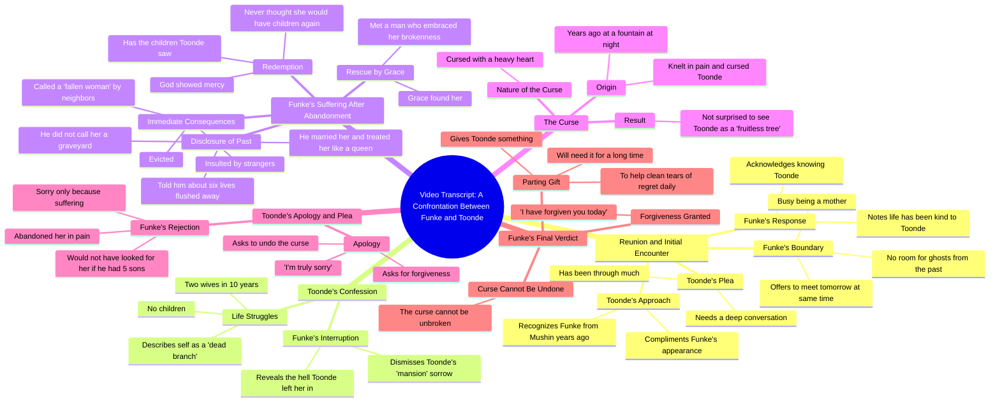

# Final Part: The Curse Nollywood Story

> 🌐 **Read this in:** [English](../../en/2026-09/tiktok-transcript-final-part-the-curse-naijatiktok-fyp-viral-ai-ff42.md) · **中文**

> **Creator:** [@talesbyoma02](https://www.tiktok.com/@talesbyoma02) · **Views:** 1.8M · **Posted:** 2026-09-30 · **Niche:** entertainment
>
> **TL;DR:** A familiar face from the past instantly creates curiosity and emotional stakes.

[Watch original video →](https://vm.tiktok.com/ZN8hFxsuw/)

## Why This Went Viral

## 钩子（前3秒）
- 逐字台词：“Funke，是的，我认识你吗？是我，Toonde，多年前在Mushin。”
- 模式：**认出／重逢触发点**——一个名字＋一个地点（“Mushin”）＋一段时间间隔（“多年前”），瞬间暗示一段被埋藏的往事。
- 为什么能让人停下滑动：它从对话中途开始，带着一个具体的专有名词和地点，让观众感觉自己走进了一场已经在进行中的真实对峙。大脑会反射性地问“这些人是谁，发生了什么？”——而答案被刻意扣住。

## 情绪节奏
- **好奇**——“是我，Toonde，多年前在Mushin。”未解的历史被吊起。
- **温暖／怀旧**——“你看起来很好。生活显然待你不薄。”营造出一种虚假安全的语气。
- **不祥信号**——“我需要和你谈谈……今天有件很深的事。”温度骤降。
- **边界／紧张**——Funke拒绝：“我的生活[没有]空间留给来自过去的鬼魂进行深谈。”权力转向她。
- **坦白→对比**——Toonde：“我10年里有过两个妻子，却没有孩子。”立刻被Funke关于*她*所受苦难的反转揭露压过。
- **升级／揭露**——“你让我冲走的六条生命”——道德筹码引爆。
- **反转／逆转**——“他没有叫我坟墓。他娶了我，待我如女王。”苦难转化为洗冤。
- **高潮**——“我在痛苦中跪下诅咒了你……我看到你坐在这里像一棵不结果的树，并不惊讶。”诅咒被点名并确认。
- **冷峻收束**——“这诅咒，无法被解除。拿着这个。”没有救赎，只有后果。

## 关键词密度
- **诅咒／被诅咒**——整个故事的引擎；同时驱动算法（高情绪搜索词）和道德报应。
- **孩子／儿子／不结果的树**——核心筹码；情绪牵引（传承、羞耻、祝福）。
- **痛苦／苦难／地狱**——情绪共鸣锚点。
- **对不起／原谅／宽恕**——观众在评论中争论的道德张力。
- **抛弃／离开／赶出**——确立反派和 stakes。
- **女王／怜悯／神**——救赎的对重；触发宗教／向往型互动。
- **来自过去的鬼魂**——最可引用、最可分享的短语；强力的钩子重播驱动因素。
- **Mushin**——高度具体的本地关键词；提升区域算法定向和真实感。

算法驱动因素：*诅咒、孩子、原谅、神、Mushin*（可搜索、高情绪、本地相关）。情绪驱动因素：*痛苦、抛弃、女王、不结果的树、鬼魂*。

## 为什么它会传播
- **没有干净答案的道德困境。**“我今天已经原谅你了，但这诅咒，无法被解除”迫使观众选边站——这是最大的评论诱饵机制。人们不会分享他们认同的视频；他们会分享他们需要争论的视频。
- **反转重新定义了反派。**“他没有叫我坟墓。他娶了我，待我如女王”把受害者故事变成接近复仇的胜利——这是观众会重播和引用的情绪回报。
- **具体、感官化的细节让它显得真实。**“你让我冲走的六条生命”“夜晚的喷泉”“Mushin”“不结果的树”——具体意象才会被截图、配字幕和转述。
- **诅咒是可分享的单位。**“我诅咒了你……不结果的树”是一句自足、可重复的台词——那种会变成评论、合拍或拼接的句子。
- **接近悬念式的结尾。**“拿着这个。它会帮助你每天清理悔恨的泪水”留下了一个未解的物品和暗示——驱动“第二部分？”评论和重看。

## 你可以偷学什么
1. **用名字和地点从冲突中途开场。**跳过铺垫。以“是我，[名字]，多年前在[具体地点]”开始，让观众被丢进一个已经在进行的故事。
2. **构建反转，而不只是一个悲伤故事。**给“受害者”第二幕——女王那句台词才是它传播的原因。单纯的苦难得到同情；苦难*加上洗冤*得到分享。
3. **植入一句可引用、可重复的台词。**写一句专为截图或评论设计的句子（“来自过去的鬼魂”“一棵不结果的树”）。一句台词比整个脚本承担更多传播工作。
4. **以一个未解的物品或动作结尾。**“拿着这个”却不揭示是什么——这个开放循环会触发“第二部分”需求和重看。
5. **使用高度本地化的具体性。**“Mushin”“夜晚的喷泉”——具体性读起来像真相，并解锁区域算法触达。

## Mind Map

## Full Transcript (Generated by [TokTranscript](https://toktranscript.com/?utm_source=github&utm_medium=breakdown&utm_campaign=tool_attribution))

> 📝 Transcripts on this page are auto-generated and show the first 60%. Want to transcribe any TikTok in 30 seconds and get the full version? [Try TokTranscript free →](https://toktranscript.com/?utm_source=github&utm_medium=breakdown&utm_campaign=transcript_cta)

Funke, yes, do I know you? It's me, Toonde, from years ago in Mushin. Ah, Toonde, you look very good. Life has clearly been kind to you. Funky, I have been through so much. I saw you and I couldn't believe it. I need to talk to you, please. It's something very deep today. I am having fun with my children right now. And my life have room for deep conversations with ghosts from my past. Today, I come here often. If you really have something to say, I can meet you here tomorrow at the same time. But for now, I am busy being a mother. I am a dead branch, funk. I had two wives in 10 years, yet no children. Are you done? You talk about your sad life in a mansion. Let me tell you about the hell you left me in after you walked out. I was evicted. I was insulted by strangers, called a fallen woman by neighbors who knew my story. I suffered until Grace found me. I met a man who found my brokenness. I told him everything. I told him about the six lives you made me flush away. Do you know what he did? He didn't call me a graveyard. He married me and treated me 

*[Read the full transcript on TokTranscript →](https://toktranscript.com/plaza/tiktok-transcript-final-part-the-curse-naijatiktok-fyp-viral-ai-ff42?utm_source=github&utm_medium=breakdown&utm_campaign=transcript_full)*

## Browse More

- All [entertainment](../../by-niche/zh-CN/entertainment.md) breakdowns
- All [Recognition Hook](../../by-pattern/zh-CN/hook-recognition-hook.md) examples

## Video Info

| | |
|---|---|
| Creator | [@talesbyoma02](https://www.tiktok.com/@talesbyoma02) |
| Original video | [https://vm.tiktok.com/ZN8hFxsuw/](https://vm.tiktok.com/ZN8hFxsuw/) |
| Original title | FINAL PART: The Curse #naijatiktok #fyp #viral #ai  |
| Views | 1.8M (1800000) |
| Posted | 2026-09-30 |
| Duration | 0s |
| Niche | `entertainment` |
| Hook pattern | `Recognition Hook` |
| Original language | `en` (this page translated by AI) |
| Available languages | en, zh-CN |
| Generated | 2026-10-01 by [TokTranscript](https://toktranscript.com/) |

---

*This breakdown is for educational analysis under fair use. Original video © [@talesbyoma02](https://www.tiktok.com/@talesbyoma02). All transcripts are auto-generated and may contain errors.*

*Want to analyze your own TikToks like this? [TokTranscript →](https://toktranscript.com/viral-breakdown?utm_source=github&utm_medium=breakdown&utm_campaign=footer_cta)*