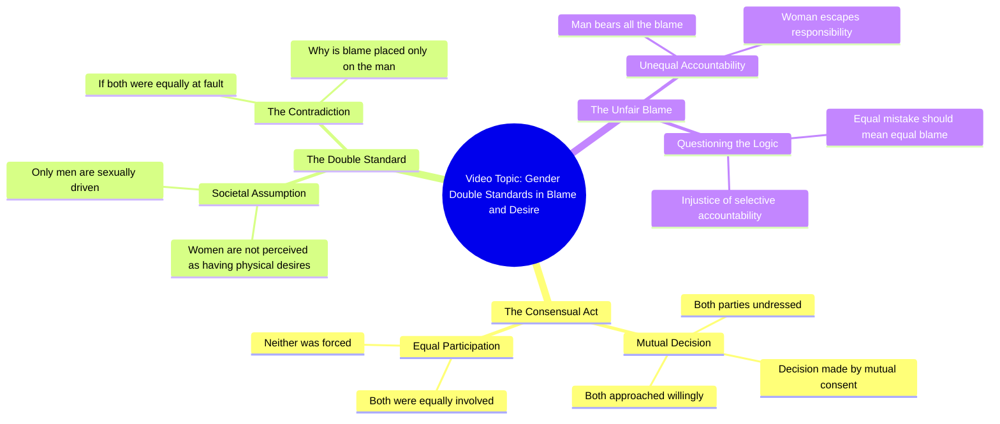

# Couple's Consent Double Standard Questioned

> 🌐 **Read this in:** [English](../../en/2026-09/tiktok-transcript-foryoupage-viralvideo-tren-71c8.md) · **中文**

> **Creator:** [@hania.writes05](https://www.tiktok.com/@hania.writes05) · **Views:** 3.9M · **Posted:** 2026-09-19 · **Niche:** entertainment
>
> **TL;DR:** Establishes shared responsibility upfront, setting up the hypocrisy reveal.

[Watch original video →](https://vt.tiktok.com/ZSq7FAaUe/)

## Why This Went Viral

## 钩子（前3秒）
- 开场白（翻译）：“两人都脱了衣服，决定是双方同意的，两人都是自愿靠近的——那么是谁规定了只有男人渴望肉体，而女人不渴望？”
- 钩子模式：**对比 + 反问**（一个双方同意的叠加铺垫，翻转成对双重标准的控诉）。
- 为什么能让人停下滑动：它在第一口气就前置了一个禁忌前提（亲密、双方同意），然后立即抛出一个未解决的*不公*问题。观众的大脑不听到答案就无法闭合这个回路——而道德框架要么引发认同，要么引发愤怒，两者都能让拇指停在屏幕上。

## 情绪节奏
- **第1拍 – 好奇/震惊（0–3秒）：** 直白的身体意象（“脱了衣服”“靠近”）在任何论证之前就抓住注意力。
- **第2拍 – 公平的铺垫（3–6秒）：** “双方都同意了”“两人都是自愿的”——建立一个观众认同的逻辑前提。
- **第3拍 – 紧张/转折（6–9秒）：** “那么是谁规定的……”从中性事实转向控诉。悬念飙升。
- **第4拍 – 共鸣/愤慨（9–12秒）：** “只有男人渴望肉体，女人不渴望”——直接点出双重标准。这是观众感到被看见或被激怒的地方。
- **高潮：** 最后一句——“如果错误是相等的，为什么所有指责只落在男人头上？”这是情绪峰值，也是最可能被引用、拼接或评论的一句。
- **缓解：** 没有提供——视频以一个未愈合的伤口结束，这是刻意的。未解决的紧张感驱动评论。

## 关键词密度
- **دونوں**（两者）——重复约5次；锚定“平等”论证。
- **مرد**（男人）——被指控的主体；驱动性别辩论的传播范围。
- **عورت**（女人）——对应方；完成助燃评论战的二元对立。
- **غلطی / الزام**（错误/指责）——道德核心；情绪拉力。
- **مرضی / اچھا**（意愿/自己愿意）——同意框架；法律相关的触发词。
- **جسم**（身体）——提升完播率和分享的禁忌关键词。
- **کیوں**（为什么）——修辞引擎；邀请回应。

**算法传播驱动因素：** مرد、عورت、جسم、کیوں——性别/社会辩论内容中的高搜索、高评论、高分享词。
**情绪拉力驱动因素：** غلطی、الزام、مرضی——这些让观众亲身感受到不公并打出回复。

## 为什么它会传播
- **它武器化了一个普遍的双重标准。** “صرف مرد ہی جسم کا بھوکا ہوتا ہے اور عورت نہیں”这句话陈述了一个数百万人要么经历过、要么争论过的信念——瞬间认同或瞬间反驳。
- **它被构建成一个逻辑陷阱。** 同意前提（“دونوں کی مرضی سے ہوا تھا”）陈述得如此直白，以至于最后的问题（“سارا الزام صرف مرد کے سر کیوں”）感觉*必须*被回答。观众评论要么捍卫要么攻击这个逻辑。
- **它以开放性问题结束，而非结论。** “کیوں”作为最后一个词迫使观众自己完成思考——这是评论区互动的最强驱动力。
- **它简短且可引用。** 整个论证约15秒，非常适合拼接、合拍和附加评论的转发。
- **它挑起争端却不点名任何人。** 没有政客，没有名人——只是一个社会规范。这意味着每个人都觉得有权发表意见，将受众扩展到任何单一细分群体之外。

## 你可以借鉴什么
1. **以所有人都同意的前提开场，然后翻转它。** 在前3秒陈述共同事实（“双方都同意了”），这样转折就会像背叛而非观点。先认同 = 保持注意力。
2. **以问题结束，而非裁决。** 用一句“为什么/کیوں/这怎么公平”替换你的收尾陈述。未解决的问题是评论燃料。
3. **叠加一个锚定词的重复。** 重复“两者/دونوں”（或你的对应词）直到它成为情绪鼓点——它让不公感觉在数学上显而易见，并让视频能用一句话引用。

## Mind Map

## Full Transcript (Generated by [TokTranscript 转录工具](https://toktranscript.com/?utm_source=github&utm_medium=breakdown&utm_campaign=tool_attribution))

> 📝 Transcripts on this page are auto-generated and show the first 60%. Want to transcribe any TikTok in 30 seconds and get the full version? [Try TokTranscript free →](https://toktranscript.com/?utm_source=github&utm_medium=breakdown&utm_campaign=transcript_cta)

کپڑے دونوں نے اتارے تھے فیصلہ بھی دونوں کی مرضی سے ہوا تھا قریب بھی دونوں اپنی اچھا سے آئے تھے پھر یہ کس نے طے کر دیا کہ صرف مرد ہی جسم 

*[Read the full transcript on TokTranscript →](https://toktranscript.com/plaza/tiktok-transcript-foryoupage-viralvideo-tren-71c8?utm_source=github&utm_medium=breakdown&utm_campaign=transcript_full)*

## Browse More

- All [entertainment](../../by-niche/zh-CN/entertainment.md) breakdowns
- All [Mutual Action Contrast](../../by-pattern/zh-CN/hook-mutual-action-contrast.md) examples

## Video Info

| | |
|---|---|
| Creator | [@hania.writes05](https://www.tiktok.com/@hania.writes05) |
| Original video | [https://vt.tiktok.com/ZSq7FAaUe/](https://vt.tiktok.com/ZSq7FAaUe/) |
| Original title | 𝙍𝙚𝙥𝙤𝙨𝙩 𝙈𝙮 𝙫𝙞𝙙𝙚𝙤𝙨 𝙋𝙡𝙚𝙖𝙨𝙚 𝙑𝙞𝙚𝙬𝙨 𝙋𝙧𝙤𝙗𝙡𝙚𝙢𝙨🥺😭#foryoupage #viralvideo #tren... |
| Views | 3.9M (3900000) |
| Posted | 2026-09-19 |
| Duration | 0s |
| Niche | `entertainment` |
| Hook pattern | `Mutual Action Contrast` |
| Original language | `en` (this page translated by AI) |
| Available languages | en, zh-CN |
| Generated | 2026-09-20 by [TokTranscript](https://toktranscript.com/) |

---

*This breakdown is for educational analysis under fair use. Original video © [@hania.writes05](https://www.tiktok.com/@hania.writes05). All transcripts are auto-generated and may contain errors.*

*Want to analyze your own TikToks like this? [免费 TikTok 文稿生成器 →](https://toktranscript.com/viral-breakdown?utm_source=github&utm_medium=breakdown&utm_campaign=footer_cta)*