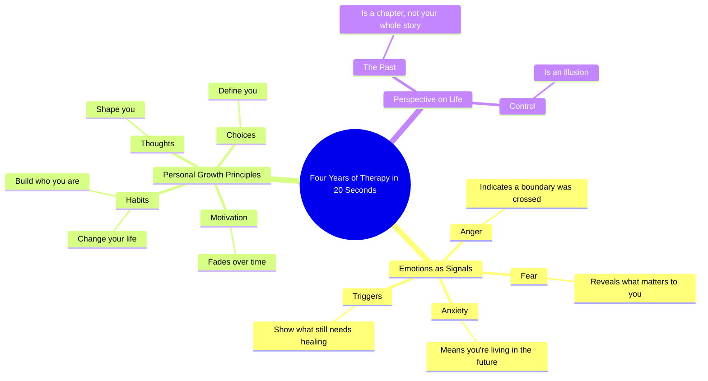

# Four Years of Therapy Explained in 20 Seconds

> 🌐 **Read this in:** [English](../../en/2026-09/tiktok-transcript-four-years-of-therapy-in-20-seconds-bca2.md) · **中文**

> **Creator:** [@Detach.Reinvent411](https://www.tiktok.com/@Detach.Reinvent411) · **Views:** 2.1M · **Posted:** 2026-09-29 · **Niche:** other
>
> **TL;DR:** It promises massive value in an impossibly short time, creating immediate curiosity and a reason to keep watching.

[Watch original video →](https://www.facebook.com/reel/1367182055184930)

## Why This Went Viral

## 钩子（前3秒）
- **原文：**“好吧，这是20秒讲完4年心理治疗。”
- **钩子模式：**时间压缩承诺+大胆断言（把巨大的回报压缩进一个短得不可思议的窗口）。
- **为什么能让人停下滚动：**它制造了一个开放循环，带着一个具体到近乎荒谬的比例（4年→20秒）。观众会觉得自己即将免费获得昂贵知识，而倒计时压力（“20秒”）让观看成本显得微不足道。“心理治疗”这个词也传递出情感利害，而不只是信息。

## 情绪节奏
- **0–3秒——好奇/兴趣：**“4年浓缩成20秒”的承诺抓住注意力。
- **3–8秒——认同：**“恐惧告诉你什么重要/愤怒告诉你边界在哪里被越过/焦虑意味着你活在未来”——观众会实时自我诊断。这是共鸣区。
- **8–13秒——允许/宽慰：**“动力会消退。习惯改变你的人生。你的过去是一章，不是你的全部故事。”紧张感软化为安慰与自我原谅。
- **13–18秒——升级到意义：**“触发点告诉你哪里仍需疗愈。控制是幻觉。”利害升高——更深、更存在主义。
- **高潮（最后一句）：**“你的想法塑造你。你的习惯构建你，你的选择定义你。”三重节拍渐强，作为情绪与修辞的顶点落地。
- **收尾：**视频以能动性收束，而不是诊断——让观众感到被赋权，而不是被暴露。

## 关键词密度
- **最强重复/高负载词：**therapy、fear、anger、anxiety、habits、triggers、control、thoughts、choices、you/your。
- **算法驱动词：**“therapy”“anxiety”“habits”“triggers”——高搜索、高收藏的心理健康关键词，会把视频推入健康/自我提升信息流。
- **情绪拉力：**“you/your”“matters”“boundary”“healing”“define”——第二人称框架让每一句都像在直接对个人说话。
- **结构黏合剂：**平行结构（“X shows you Y”）制造节奏，让这些句子可引用、可截图，提升分享。

## 为什么会传播
- **极高价值密度：**“20秒讲完4年心理治疗”设定了预期，而视频确实兑现了——每一句都是独立洞见，所以没有一秒被浪费。高完播率→算法助推。
- **截图/收藏机制：**像“你的过去是一章，不是你的全部故事”和“控制是幻觉”这样的句子是自足式格言。观众会保存并作为文本再次分享，把传播延伸到视频之外。
- **普遍自我认同：**“恐惧告诉你什么重要”“焦虑意味着你活在未来”“触发点告诉你哪里仍需疗愈”——每一句都让不同观众感到被看见，把受众扩展到任何单一细分领域之外。
- **三重节拍高潮：**“你的想法塑造你。你的习惯构建你，你的选择定义你。”节奏渐强给视频一个令人满足的结尾，促使人重看和引用转发。
- **低制作，高信号：**内容纯粹是脚本——不需要视觉也能竞争，这让它极易被混剪、拼接或跨平台转发。

## 你可以偷什么
- **用时间压缩承诺开场。**“这是[巨大的东西]，用[极短时间]讲完”会强制制造开放循环，并设定观众想要满足的完播预期。
- **用平行、可引用的句子写作。**使用重复句式结构（“X shows you Y”），让每一句都能独立成立——这会最大化收藏、截图和分享。
- **以三重节拍渐强收尾。**在最后一句堆叠三个简短、递进的从句，给视频一个难忘、值得重播的高潮，而不是渐渐淡出。

## Mind Map

## Full Transcript (Generated by [拆解你自己的 TikTok](https://toktranscript.com/?utm_source=github&utm_medium=breakdown&utm_campaign=tool_attribution))

> 📝 Transcripts on this page are auto-generated and show the first 60%. Want to transcribe any TikTok in 30 seconds and get the full version? [Try TokTranscript free →](https://toktranscript.com/?utm_source=github&utm_medium=breakdown&utm_campaign=transcript_cta)

Okay, here's four years of therapy in 20 seconds. Fear shows you what matters. Anger shows you where a boundary was crossed. Anxiety means you're living in the future. Motivation fades. Habits change your life. Your past is a chapter, not y

*[Read the full transcript on TokTranscript →](https://toktranscript.com/plaza/tiktok-transcript-four-years-of-therapy-in-20-seconds-bca2?utm_source=github&utm_medium=breakdown&utm_campaign=transcript_full)*

## Browse More

- All [other](../../by-niche/zh-CN/other.md) breakdowns
- All [Time Compression Promise](../../by-pattern/zh-CN/hook-time-compression-promise.md) examples

## Video Info

| | |
|---|---|
| Creator | [@Detach.Reinvent411](https://www.tiktok.com/@Detach.Reinvent411) |
| Original video | [https://www.facebook.com/reel/1367182055184930](https://www.facebook.com/reel/1367182055184930) |
| Original title | Four Years of Therapy in 20 Seconds |
| Views | 2.1M (2079955) |
| Posted | 2026-09-29 |
| Duration | 0s |
| Niche | `other` |
| Hook pattern | `Time Compression Promise` |
| Original language | `en` (this page translated by AI) |
| Available languages | en, zh-CN |
| Generated | 2026-09-30 by [TokTranscript](https://toktranscript.com/) |

---

*This breakdown is for educational analysis under fair use. Original video © [@Detach.Reinvent411](https://www.tiktok.com/@Detach.Reinvent411). All transcripts are auto-generated and may contain errors.*

*Want to analyze your own TikToks like this? [TokTranscript →](https://toktranscript.com/viral-breakdown?utm_source=github&utm_medium=breakdown&utm_campaign=footer_cta)*