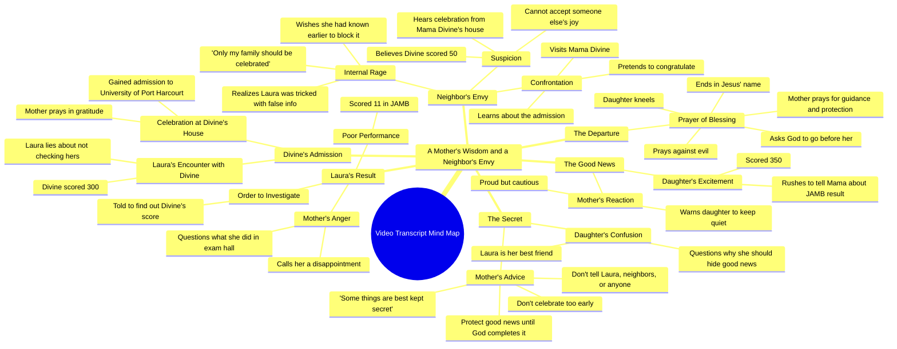

# Son Tells Mother He Passed His JAMB Exam

> 🌐 **Read this in:** [English](../../en/2026-09/tiktok-transcript-full-story-based-on-true-life-experience-aigenerated-fyp-vir-8d87.md) · **中文**

> **Creator:** [@omoai7](https://www.tiktok.com/@omoai7) · **Views:** 3.6M · **Posted:** 2026-09-12 · **Niche:** entertainment
>
> **TL;DR:** The immediate shushing and secrecy create instant intrigue and suspense.

[Watch original video →](https://vm.tiktok.com/ZN8jY6mx7/)

## Why This Went Viral

## 钩子（前3秒）
- 逐字开场白：“妈妈！妈妈，我有好消息。嘘！小声点。我们进去说。”
- 钩子模式：**反差／被打断的兴奋**（一个喜悦的宣告立刻被一声压低、急切的“嘘！”和要求进屋所打断）。
- 为什么它能阻止滑动：情绪错位瞬间产生且悬而未决。孩子的兴奋与父母的隐秘相撞，制造出一个开放循环——观众需要知道为什么好消息必须被隐藏。那声提高的“妈妈！”也读起来像真实的家庭剧，而非编排好的内容，这降低了观众的广告识别反射。

## 情绪节奏
- **0–5秒——好奇飙升：**“嘘！小声点”埋下一个问题（为什么要隐藏好消息？）。
- **5–20秒——骄傲＋困惑：**JAMB成绩揭晓（“我考了3:50”）带来一个小回报，随后母亲的警告（“我不想你把这件事告诉任何人”）重新打开紧张感。
- **20–40秒——通过对比制造悬念：**切到Laura的成绩（“11”）和母亲的羞辱。观众现在怀疑这两个家庭正被安排成对立面。
- **40–60秒——观众自我代入：**Divine含糊的“还没有”和“300”制造出戏剧性反讽——观众知道的比角色更多。
- **60–90秒——共鸣＋祈祷：**录取庆祝和祈祷（“愿每一位等待好消息的父母都能收到属于自己的见证”）将剧情转化为共同愿望——这是许多观众截图或评论“阿门”的时刻。
- **高潮：**邻居的失控——“不，不，不，不！我养了个多么没用的女儿！……我不希望任何家庭有喜乐，除了我家。”这是情绪峰值：嫉妒被彻底暴露。
- **结局：**结尾的祈祷场景将故事重新框定为道德教训，把紧张释放为宣泄。

## 关键词密度
- **妈妈**（最高频）——驱动情绪拉力；向算法的受众匹配发出家庭剧信号。
- **JAMB／JMB**——话题关键词；将视频锚定到一个庞大的尼日利亚搜索／兴趣集群（考试放榜季）。
- **录取／大学**——算法触达；匹配高意图搜索词。
- **好消息／庆祝／庆典**——情绪拉力；主题脊梁。
- **成绩／3:50／11／300／50**——数字；具体、可截图、可引评论。
- **秘密／隐藏／偷偷摸摸**——情绪拉力；道德张力。
- **Laura／Divine**——角色锚点；让故事感觉真实、可指称。
- **谢谢／阿门／耶稣**——共鸣关键词；触发评论区“阿门”互动，从而提升触达。

## 为什么它会传播
- **双家庭镜像结构引发比较。**文字稿将Divine妈妈谦卑的隐秘（“保护你的好消息，直到上帝成就它”）与Laura妈妈的嫉妒（“我不希望任何家庭有喜乐，除了我家”）配对。观众选边站并评论——这是视频中最强的评论驱动力。
- **包裹在肥皂剧里的道德教训。**“永远不要过早庆祝”这句话给剧情一个可分享的要点，因此观众把它当作建议而不仅是娱乐来转发。
- **祈祷作为分享触发器。**“愿每一位等待好消息的父母都能收到属于自己的见证”把结尾变成一种祝福，观众会标记朋友和家人——这是宗教／励志内容中内置的传播机制。
- **戏剧性反讽让留存率保持高位。**观众知道Divine考了300，而Laura的母亲相信是“50”——这个差距（“他们故意骗了她”）维持观看时长直到揭晓。
- **带有普遍缺陷的反派。**“为什么她能在我不行的时候庆祝？”直接点出嫉妒。观众认出自己认识的某个人，这推动二创、拼接和引用转发。

## 你可以借鉴什么
- **用情绪错位开场，而不是铺垫。**从冲突中途开始——兴奋对隐秘，骄傲对羞耻——让观众的大脑去填补空白。跳过说明。
- **在中点埋下一句“道德金句”。**一句可引用的话（“保护你的好消息，直到上帝成就它”）把你的故事转化为观众可以复述、配字幕和分享的东西。
- **以祝福或面向观众的问题结尾。**用一句邀请参与的话（“愿每一位等待的父母……”）替代泛泛的行动号召——它把被动观众变成评论者和标记者。

## Mind Map

## Full Transcript (Generated by [TokTranscript](https://toktranscript.com/?utm_source=github&utm_medium=breakdown&utm_campaign=tool_attribution))

> 📝 Transcripts on this page are auto-generated and show the first 60%. Want to transcribe any TikTok in 30 seconds and get the full version? [Try TokTranscript free →](https://toktranscript.com/?utm_source=github&utm_medium=breakdown&utm_campaign=transcript_cta)

Mama! Mama, I have good news. Shh! Lower your voice. Let's go inside. Mama, what's wrong? Is everything okay? Everything is fine. Just follow me. Mama, why did you stop me? I was so excited. I couldn't wait to tell you the good news. I know. So what's the good news? Mama, I passed my JAMB. I scored 3:50. Oh, my daughter, I'm so proud of you. You've made me very happy. Mama, I can't wait to tell Laura. She'll be so happy for me. Listen to me carefully. I don't want you telling this to anyone. Not Laura, not the neighbors, nobody. Do you understand? Mama, Laura is my best friend. Why should I hide something so good from her? Because some things are best kept secret. And this is only the beginning. You passed JMB. You haven't gained admission, and you haven't entered the university. Never celebrate too early. Protect your good news until God completes it. Oh, okay, Mom. Laura, let me see your result. Mama, give it to me. 11. You scored 11, Laura. Mama, I don't understand. I answered the questions. I think they mixed up my score. Enough! Always one disappointment after another. How does someone score 11? What were you doing in that exam hall? I'm sorry, Mama. I'll do better next time. What about divine? Has she checked his? I don't know. I haven't asked. Go find out today. I want to know exactly what she scored. Okay, Mama. Divine. Divine! Hi, Laura, how are you? I'm fine. Have you checked your JMB results yet? Um. Um. Not yet. What about you? Have you checked yours? Yes. Oh really? How is it? Fine. I scored 300. Wow, 300! That's big. Thank you. When are you checking yours? Soon. Okay. Mama! Mama! What is it? My daughter? Mama, I've gained admission. I've been admitted to the university of Port Harcourt. Oh, my father, king of kings, receive all the honour. You have remembered the labour of this child. Thank you. May every parent waiting for good news receive their own testimony. May every child trusting you for open doors be remembered by your mercy. The same god who has done this for us will do it for them. Amen. What is this sound of joy and happiness I'm hearing from Mama Divine's house? What are they celebrating? Laura told me divine scored 50 in JAMB. There's no way she would gain admission with such low score. So what could they possibly be celebrating? No, something isn't right. I must find out. This my neighbour is somet

*[Read the full transcript on TokTranscript →](https://toktranscript.com/plaza/tiktok-transcript-full-story-based-on-true-life-experience-aigenerated-fyp-vir-8d87?utm_source=github&utm_medium=breakdown&utm_campaign=transcript_full)*

## Browse More

- All [entertainment](../../by-niche/zh-CN/entertainment.md) breakdowns
- All [Urgent Secret](../../by-pattern/zh-CN/hook-urgent-secret.md) examples

## Video Info

| | |
|---|---|
| Creator | [@omoai7](https://www.tiktok.com/@omoai7) |
| Original video | [https://vm.tiktok.com/ZN8jY6mx7/](https://vm.tiktok.com/ZN8jY6mx7/) |
| Original title | Full story based on true life experience.#aigenerated #fyp #viralvideos  |
| Views | 3.6M (3600000) |
| Posted | 2026-09-12 |
| Duration | 0s |
| Niche | `entertainment` |
| Hook pattern | `Urgent Secret` |
| Original language | `en` (this page translated by AI) |
| Available languages | en, zh-CN |
| Generated | 2026-09-14 by [TokTranscript](https://toktranscript.com/) |

---

*This breakdown is for educational analysis under fair use. Original video © [@omoai7](https://www.tiktok.com/@omoai7). All transcripts are auto-generated and may contain errors.*

*Want to analyze your own TikToks like this? [免费 TikTok 文稿生成器 →](https://toktranscript.com/viral-breakdown?utm_source=github&utm_medium=breakdown&utm_campaign=footer_cta)*