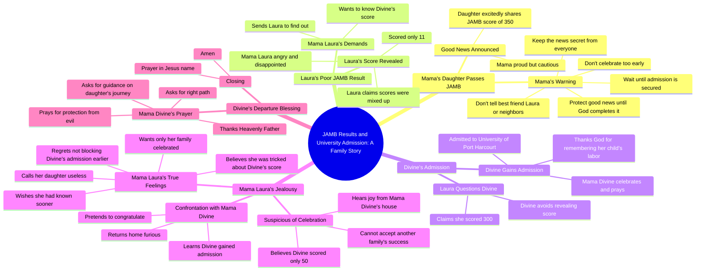

# Son Tells Mother He Passed His JAMB Exam

> 🌐 **Read this in:** [English](../../en/2026-09/tiktok-transcript-full-story-based-on-true-life-experience-aigenerated-fyp-vir-f898.md) · **中文**

> **Creator:** [@omoai7](https://www.tiktok.com/@omoai7) · **Views:** 3.6M · **Posted:** 2026-09-12 · **Niche:** entertainment
>
> **TL;DR:** The immediate shushing creates intrigue and signals a hidden conflict, compelling viewers to keep watching.

[Watch original video →](https://vm.tiktok.com/ZN8jYec3s/)

## Why This Went Viral

## 钩子（前3秒）
- **原话：** “妈妈！妈妈，我有好消息。”——一个气喘吁吁、高能量的入场，紧接着是“嘘！小声点。我们进去说。”
- **钩子模式：** 场景+反差（兴奋的女儿 vs. 神秘、压低声音的母亲）。它从动作中间开始，零铺垫。
- **为什么能让人停下滑动：** 一个响亮的情绪高点（“我有好消息”）瞬间撞上一个压制信号（“嘘！小声点”）。这种矛盾——喜悦被*隐藏*——在3秒内制造了一个未解的问题：*为什么好消息需要低声说？* 观众的大脑不看完就无法闭合这个回路。

## 情绪节奏
- **0–15秒——好奇+紧张：** 女儿很兴奋；母亲制止她并把她拉进屋里。“秘密”的框架抓住了注意力。
- **15–40秒——骄傲→好奇：** “我考了3:50”（JAMB分数）给出回报，然后立即转向母亲的规矩：“别告诉任何人。不要告诉Laura，也不要告诉邻居。”好奇心加深。
- **40–60秒——对比节拍（Laura）：** 硬切到Laura考了**11**分。情绪急转——观众的同情和优越感同时飙升。
- **60–90秒——悬念：** Laura被派去窥探Divine。Divine回避（“还没呢”）。观众现在*知道*一些Laura不知道的事——戏剧性反讽锁住了注意力。
- **90–120秒——释然+共鸣：** Divine获得录取。祈祷场景。情绪释放和集体回报（“愿每一位等待的父母……都能收到属于自己的见证”）。
- **120–160秒——反派揭露：** Laura妈妈的独白暴露了嫉妒：“这个院子里不该有任何庆祝，除非它来自我的家庭。”
- **高潮时刻：** “要是我当时知道，我一定会阻止它。现在太晚了。一切都毁了。”——反派自白破坏意图。这是顶点。
- **结尾——解决：** 为女儿离家上学祈祷，以平静和昭雪闭合了回路。

## 关键词密度
- **妈妈**——锚定每个场景，驱动共鸣和家庭框架
- **JAMB/分数/成绩**——情节引擎；可搜索、有话题性，在尼日利亚/非洲短视频信息流中有算法优势
- **录取/大学**——赌注；“胜利”条件
- **好消息/庆祝/庆祝活动**——视频的情绪主题
- **秘密/隐藏/保密**——张力发生器
- **Laura/Divine**——用于呼应和评论的角色锚点
- **“要是我当时知道”**——点燃评论区辩论的后悔钩子
- **嫉妒/邻居/院子**——让内容感觉“真实”的社会观察关键词

**算法传播驱动因素：** JAMB、录取、大学、分数——这些在特定区域受众中是高搜索、高相关性的词，能提升分发和重看率。
**情绪拉动驱动因素：** 好消息、秘密、庆祝、“要是我当时知道”——这些触发分享、评论和“这是我阿姨”的标记行为。

## 为什么它会传播
- **戏剧性反讽作为注意力陷阱。** 观众比Laura更早知道Divine的真实分数（300）（“我考了300……快了” vs. Laura后来声称的“50”）。观众留下来看谎言如何被揭穿——回报落在“他们故意骗了她。”
- **一个普遍可识别的反派。** Laura妈妈的台词——“只有我的家庭才该被庆祝，别人不行”——映射到一个真实的社会原型（嫉妒的亲戚/邻居）。观众标记他们认识的人，这是主要的分享驱动因素。
- **带有祈祷的道德回报。** 结尾的祈祷（“愿每一位等待好消息的父母都能收到属于自己的见证”）将剧情转化为*祝福*，使其可以分享到宗教/社区群组而不显得八卦。
- **可引用、可截图的台词。** “永远不要庆祝得太早。在上帝成就之前，保护好你的好消息”是一句独立的格言——非常适合字幕、合拍和转发。
- **反转+后悔结局。** “要是我当时知道，我一定会阻止它”给了反派一个自我指控的供词——正是那种点燃愤怒评论和再分享的台词。

## 你可以借鉴什么
1. **从冲突中间开始，而不是从铺垫中间开始。** 从最响亮的情绪台词开始（“妈妈！我有好消息”），然后立即用矛盾回应它（“嘘！小声点”）。跳过说明——让矛盾成为钩子。
2. **用戏剧性反讽来构建。** 让观众知道某个角色不知道的真相。这会把被动观看转化为“我必须看到他们发现”——短视频剧中最强的留存机制。
3. **以可引用的道德或祝福结尾。** 把你故事中的教训变成一句干净、可分享的话（“在上帝成就之前，保护好你的好消息”）。它给观众一个保存、转发和标记的理由——这三个动作才能真正推动一个视频。

## Mind Map

## Full Transcript (Generated by [拆解你自己的 TikTok](https://toktranscript.com/?utm_source=github&utm_medium=breakdown&utm_campaign=tool_attribution))

> 📝 Transcripts on this page are auto-generated and show the first 60%. Want to transcribe any TikTok in 30 seconds and get the full version? [Try TokTranscript free →](https://toktranscript.com/?utm_source=github&utm_medium=breakdown&utm_campaign=transcript_cta)

Mama! Mama, I have good news. Shh! Lower your voice. Let's go inside. Mama, what's wrong? Is everything okay? Everything is fine. Just follow me. Mama, why did you stop me? I was so excited. I couldn't wait to tell you the good news. I know. So what's the good news? Mama, I passed my JAMB. I scored 3:50. Oh, my daughter, I'm so proud of you. You've made me very happy. Mama, I can't wait to tell Laura. She'll be so happy for me. Listen to me carefully. I don't want you telling this to anyone. Not Laura, not the neighbors, nobody. Do you understand? Mama, Laura is my best friend. Why should I hide something so good from her? Because some things are best kept secret. And this is only the beginning. You passed JMB. You haven't gained admission, and you haven't entered the university. Never celebrate too early. Protect your good news until God completes it. Oh, okay, Mom. Laura, let me see your result. Mama, give it to me. 11. You scored 11, Laura. Mama, I don't understand. I answered the questions. I think they mixed up my score. Enough! Always one disappointment after another. How does someone score 11? What were you doing in that exam hall? I'm sorry, Mama. I'll do better next time. What about divine? Has she checked his? I don't know. I haven't asked. Go find out today. I want to know exactly what she scored. Okay, Mama. Divine. Divine! Hi, Laura, how are you? I'm fine. Have you checked your JMB results yet? Um. Um. Not yet. What about you? Have you checked yours? Yes. Oh really? How is it? Fine. I scored 300. Wow, 300! That's big. Thank you. When are you checking yours? Soon. Okay. Mama! Mama! What is it? My daughter? Mama, I've gained admission. I've been admitted to the university of Port Harcourt. Oh, my father, king of kings, receive all the honour. You have remembered the labour of this child. Thank you. May every parent waiting for good news receive their own testimony. May every child trusting you for open doors be remembered by your mercy. The same god who has done this for us will do it for them. Amen. What is this sound of joy and happiness I'm hearing from Mama Divine's house? What are they celebrating? Laura told me divine scored 50 in JAMB. There's no way she would gain admission with such low score. So what could they possibly be celebrating? No, something isn't right. I must find out. This my neighbour is somet

*[Read the full transcript on TokTranscript →](https://toktranscript.com/plaza/tiktok-transcript-full-story-based-on-true-life-experience-aigenerated-fyp-vir-f898?utm_source=github&utm_medium=breakdown&utm_campaign=transcript_full)*

## Browse More

- All [entertainment](../../by-niche/zh-CN/entertainment.md) breakdowns
- All [Urgent Secret](../../by-pattern/zh-CN/hook-urgent-secret.md) examples

## Video Info

| | |
|---|---|
| Creator | [@omoai7](https://www.tiktok.com/@omoai7) |
| Original video | [https://vm.tiktok.com/ZN8jYec3s/](https://vm.tiktok.com/ZN8jYec3s/) |
| Original title | Full story based on true life experience.#aigenerated #fyp #viralvideos  |
| Views | 3.6M (3600000) |
| Posted | 2026-09-12 |
| Duration | 0s |
| Niche | `entertainment` |
| Hook pattern | `Urgent Secret` |
| Original language | `en` (this page translated by AI) |
| Available languages | en, zh-CN |
| Generated | 2026-09-13 by [TokTranscript](https://toktranscript.com/) |

---

*This breakdown is for educational analysis under fair use. Original video © [@omoai7](https://www.tiktok.com/@omoai7). All transcripts are auto-generated and may contain errors.*

*Want to analyze your own TikToks like this? [免费 TikTok 文稿生成器 →](https://toktranscript.com/viral-breakdown?utm_source=github&utm_medium=breakdown&utm_campaign=footer_cta)*