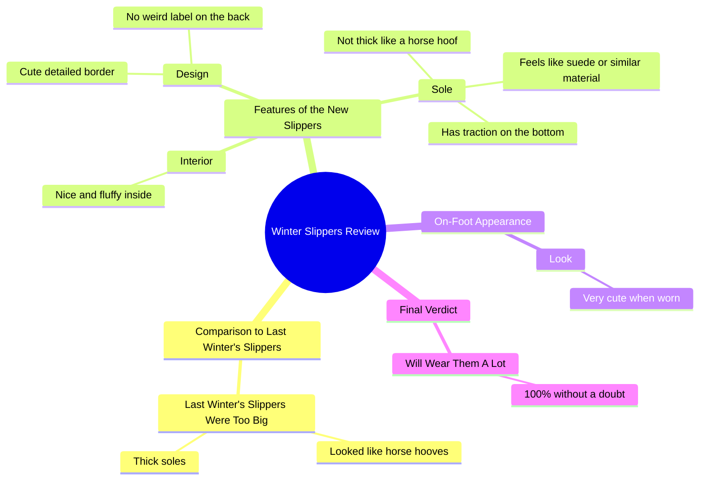

# Fluffy Winter Boots That Beat Horse Hoof Look

> 🌐 **Read this in:** [English](../../en/2026-09/tiktok-transcript-i-will-proudly-wear-these-because-i-don-t-feel-like-a-wannab-84a8.md) · **中文**

> **Creator:** [@lifesrad](https://www.tiktok.com/@lifesrad) · **Views:** 5.3M · **Posted:** 2026-09-22 · **Niche:** other
>
> **TL;DR:** Immediately contrasts with a negative past experience to highlight the improvement.

[Watch original video →](https://www.tiktok.com/@creator/video/7400401284945333550)

## Why This Went Viral

## 钩子（前3秒）
- 逐字开场：“这些比我去年冬天买的那双可爱太多了”
- 钩子模式：**对比 + 大胆断言**（新款 vs. 旧款，配合强调性最高级“可爱太多了”）
- 为什么能让人停下滚动：它把观众直接丢进一个没有铺垫的对比中——大脑需要补全缺失的语境（“比*什么*可爱？”）。全大写的“SO MUCH”传递出强烈的主观意见，读起来真实而非照本宣科。它还预先筛选了受众：任何去年买错冬季靴子的人都会瞬间被钩住。

## 情绪节奏
- **好奇**——“比我去年冬天买的那双可爱太多了”制造了一个关于旧靴子的开放悬念。
- **滑稽的厌恶 / 认同感**——“巨大……看起来像马蹄”是张力节拍；既好笑又有共鸣（买家懊悔）。
- **释然 / 回报**——“但这双……又好又蓬松……可爱的精致包边”用感官细节化解了张力。
- **微型反转**——“背面没有奇怪的标签”和“底部有防滑”是意想不到的具体细节，感觉像内部情报。
- **高潮**——试穿：“这是穿上后的样子，太可爱了。”视觉证明是情绪峰值。
- **收尾 / 承诺**——“100%毫无疑问，我会经常穿这双”以确定性收束。

## 关键词密度
- **“可爱 / 可爱”**（重复3次）——情绪拉力；核心价值主张。
- **“马蹄”**（2次）——令人难忘、可截图的短语；驱动分享和评论。
- **“去年冬天”**（2次）——让对比具体化的时间锚点。
- **“蓬松”**——感官/触觉关键词；驱动欲望。
- **“鞋底 / 厚”**——异议处理关键词；回应靴子第一大抱怨。
- **“防滑”**——实用关键词；转化怀疑者。
- **“奇怪标签”**——具体性关键词；表明“我真的检查过这些”。
- **“太多 / 经常”**——强度修饰词，增强情绪信号。
- **算法触达驱动词：**“可爱”“蓬松”“冬季”“鞋底”——高搜索、高购买意图的商业词。
- **情绪拉力驱动词：**“马蹄”“可爱太多了”“奇怪标签”——这些是人们在评论中会引用的内容。

## 为什么它会传播
- **“马蹄”这句是可分享的梗。**“穿在我脚上真的看起来像马蹄”画面感强、荒诞、自嘲——正是人们会截图或在评论中重复的那类句子。
- **这是对比，不是测评。**以“我去年冬天买的那双”为参照，给观众一个前后对比的叙事弧，天然比平铺直叙的产品描述更值得看。
- **具体性快速建立信任。**“背面没有奇怪标签”“底部有防滑”“摸起来像麂皮”——这些微观细节读起来像非赞助、诚实，降低了广告识别防御并提升完播率。
- **它在异议被提出前就回答了。**“鞋底不像马蹄那么厚”预先化解了对厚重冬季靴的第一大抱怨，让视频不仅有趣，还有用。
- **试穿是回报镜头。**“这是穿上后的样子”兑现了钩子承诺的视觉奖励——这是驱动收藏和重看的时刻。

## 你可以借鉴什么
- **从对比中途开场。**用“这比[我以前用的那个]好太多了”开头，而不是先自我介绍或介绍产品。缺失的语境就是钩子。
- **给你的旧问题起个绰号。**“马蹄”之所以有黏性，是因为它是一幅生动的画面。用一个人们会重复的比喻来命名你过去的痛点。
- **在揭晓前堆叠三个具体的微观细节。**“没有奇怪标签”“底部有防滑”“摸起来像麂皮”——小而可核实的事实传递真实性，并在试穿回报前保持注意力。

## Mind Map

## Full Transcript (Generated by [TokTranscript](https://toktranscript.com/?utm_source=github&utm_medium=breakdown&utm_campaign=tool_attribution))

> 📝 Transcripts on this page are auto-generated and show the first 60%. Want to transcribe any TikTok in 30 seconds and get the full version? [Try TokTranscript free →](https://toktranscript.com/?utm_source=github&utm_medium=breakdown&utm_campaign=transcript_cta)

these ones are SO MUCH CUTER than the ones I had last winter the ones that I had last winter were HUGE they literally looked like horse hooves on me but these they are nice and fluffy on the inside they have the cute detailed border the sole is not thick like a horse hoof It does feel li

*[Read the full transcript on TokTranscript →](https://toktranscript.com/plaza/tiktok-transcript-i-will-proudly-wear-these-because-i-don-t-feel-like-a-wannab-84a8?utm_source=github&utm_medium=breakdown&utm_campaign=transcript_full)*

## Browse More

- All [other](../../by-niche/zh-CN/other.md) breakdowns
- All [Comparison Hook](../../by-pattern/zh-CN/hook-comparison-hook.md) examples

## Video Info

| | |
|---|---|
| Creator | [@lifesrad](https://www.tiktok.com/@lifesrad) |
| Original video | [https://www.tiktok.com/@creator/video/7400401284945333550](https://www.tiktok.com/@creator/video/7400401284945333550) |
| Original title | I Will Proudly Wear These Because I Don’t Feel Like A Wannabe Clydesd... |
| Views | 5.3M (5300000) |
| Posted | 2026-09-22 |
| Duration | 0s |
| Niche | `other` |
| Hook pattern | `Comparison Hook` |
| Original language | `en` (this page translated by AI) |
| Available languages | en, zh-CN |
| Generated | 2026-09-23 by [TokTranscript](https://toktranscript.com/) |

---

*This breakdown is for educational analysis under fair use. Original video © [@lifesrad](https://www.tiktok.com/@lifesrad). All transcripts are auto-generated and may contain errors.*

*Want to analyze your own TikToks like this? [免费 TikTok 文稿生成器 →](https://toktranscript.com/viral-breakdown?utm_source=github&utm_medium=breakdown&utm_campaign=footer_cta)*