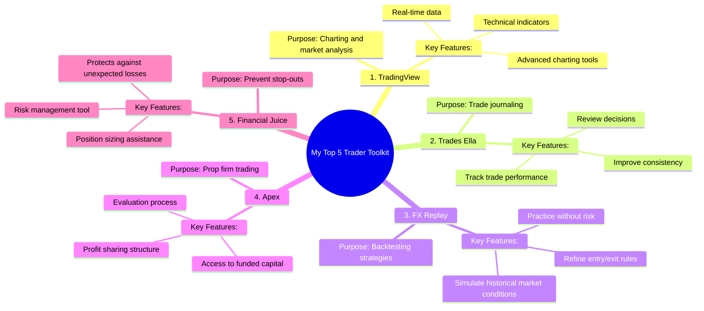

# My Top 5 Trader Toolkit Apps

> 🌐 **Read this in:** [English](../../en/2026-09/tiktok-transcript-my-top-5-trader-toolkit-apps-43c4.md) · **中文**

> **Creator:** [@Sisterhood Trading Academy](https://www.tiktok.com/@Sisterhood Trading Academy) · **Views:** 211.9K · **Posted:** 2026-09-02 · **Niche:** finance
>
> **TL;DR:** The hook promises a quick, actionable list of five tools, immediately signaling value and specificity.

[Watch original video →](https://www.facebook.com/share/r/1DeQjjHJw5/)

## Why This Went Viral

## 钩子（前3秒）
- **逐字内容：** “我的五大交易员工具包”——以快速列举式开场，无任何铺垫。
- **钩子模式：** 大胆声明/清单式承诺（“五大”）+ 细分领域权威信号（“交易员”）。
- **为何能让人停下滑动：** 它前置了一个具体、可操作的价值主张。观众立刻知道他们会得到一个精选工具清单（节省他们的研究时间），而“交易员”一词精准筛选出目标受众——让算法将其推送给更多交易员，他们极有可能停下来，因为这直接关系到他们的日常工作流程。

## 情绪节奏
- **节拍1 — 好奇（0–1秒）：** “我的五大交易员工具包”制造了一个开放循环；观众想知道清单内容。
- **节拍2 — 快速期待（1–4秒）：** 每个工具被快速连续点名（“TradingView……Trades Ella……FX Replay……Apex……”）——节奏营造出动势和分享内幕知识的感觉。
- **节拍3 — 紧张感飙升（4–5秒）：** “……financial juice，这样我永远不会被止损出局”——这引入了痛点（被止损）和解决方案（financial juice），制造了一个微小的“顿悟”时刻。
- **节拍4 — 社区号召行动（5秒）：** “评论sister获取更多”——从信息传递转向邀请互动，营造归属感和互惠感。
- **高潮：** “这样我永远不会被止损出局”这句话——这是情感回报。它将工具清单转化为对*保护*和*能力*的承诺。

## 关键词密度
- **交易员/交易**（4次）——推动算法触达；这是核心细分关键词，向平台表明内容类别。
- **工具包**（1次）——强烈的情感吸引力；暗示一个精选的、必备的集合——不是随机的应用。
- **复盘/回测**（各1次）——算法触达；这些是交易领域内高意图搜索词。
- **永远不会被止损出局**（1次）——情感吸引力；这是与交易员深度共鸣的恐惧型痛点。
- **评论sister**（1次）——算法触达；明确的互动提示提升分发量。
- **Apex / FX Replay / TradingView**（3次）——算法触达；品牌名称触发相关话题标签和搜索流量。

## 为何能广泛传播
- **超精准细分定位：** 视频不试图吸引所有人。它在第一秒就直接对“交易员”说话。这确保了正确受众的高完播率，而算法会奖励这一点。*具体台词：“我的五大交易员工具包。”*
- **痛点回报：** 结尾台词“这样我永远不会被止损出局”是情感共鸣的教科书级示范。它点出了交易员的普遍恐惧，并暗示这些工具就是盾牌。曾被止损的观众感到被理解，并被迫保存或分享。*具体台词：“……financial juice，这样我永远不会被止损出局。”*
- **评论诱饵是社区建设者：** “评论sister获取更多”是一个带有性别色彩的圈内号召——它建立了一个微型社区并促进评论，而评论是病毒式传播的第一大互动信号。它也很个人化，不像泛泛的“点赞和订阅”。*具体台词：“评论sister获取更多。”*
- **节奏创造感知价值密度：** 快速连珠炮式的呈现（5秒内5个工具）让视频显得信息密集。观众感知到每秒的高价值，增加了他们多次观看或将其作为“速查表”分享的可能性。*具体台词：整个清单无停顿地一口气说完。*
- **品牌名称堆叠提升可搜索性：** 提及TradingView、Apex和FX Replay意味着视频会在这些特定工具的搜索中被呈现，将触达范围扩展到粉丝之外。*具体台词：“TradingView看图表……FX Replay做回测……Apex做自营交易公司。”*

## 你可以借鉴什么
1. **以你所在领域的“Top 5”清单式承诺开场。** 不要热身。直接说“我的五大[领域]工具包”并立即列出。这种模式之所以有效，是因为它承诺在10秒内给出一个完整、可操作的答案。
2. **将清单锚定在一个特定的恐惧或痛点上。** 不要只列出工具——解释每个工具*防止*或*解决*了什么（例如，“这样我永远不会被止损出局”）。这能把枯燥的清单转化为情感解决方案。
3. **使用个人化、社区驱动的评论提示。** 不要用“关注获取更多”，而是用能营造圈内感的短语，比如“评论sister获取更多”或“同意就评论你的城市”。这能提升评论数和算法触达，因为它感觉像对话，而不是广播。

## Mind Map

## Full Transcript (Generated by [拆解你自己的 TikTok](https://toktranscript.com/?utm_source=github&utm_medium=breakdown&utm_campaign=tool_attribution))

> 📝 Transcripts on this page are auto-generated and show the first 60%. Want to transcribe any TikTok in 30 seconds and get the full version? [Try TokTranscript free →](https://toktranscript.com/?utm_source=github&utm_medium=breakdown&utm_campaign=transcript_cta)

My top five trader toolkit, trading view for charts, trades Ella for journaling, FX replay for backtesting, Apex for prop firm trading, 

*[Read the full transcript on TokTranscript →](https://toktranscript.com/plaza/tiktok-transcript-my-top-5-trader-toolkit-apps-43c4?utm_source=github&utm_medium=breakdown&utm_campaign=transcript_full)*

## Browse More

- All [finance](../../by-niche/zh-CN/finance.md) breakdowns
- All [Listicle teaser](../../by-pattern/zh-CN/hook-listicle-teaser.md) examples

## Video Info

| | |
|---|---|
| Creator | [@Sisterhood Trading Academy](https://www.tiktok.com/@Sisterhood Trading Academy) |
| Original video | [https://www.facebook.com/share/r/1DeQjjHJw5/](https://www.facebook.com/share/r/1DeQjjHJw5/) |
| Original title | My Top 5 Trader Toolkit Apps |
| Views | 211.9K (211946) |
| Posted | 2026-09-02 |
| Duration | 0s |
| Niche | `finance` |
| Hook pattern | `Listicle teaser` |
| Original language | `en` (this page translated by AI) |
| Available languages | en, zh-CN |
| Generated | 2026-09-03 by [TokTranscript](https://toktranscript.com/) |

---

*This breakdown is for educational analysis under fair use. Original video © [@Sisterhood Trading Academy](https://www.tiktok.com/@Sisterhood Trading Academy). All transcripts are auto-generated and may contain errors.*

*Want to analyze your own TikToks like this? [TokTranscript →](https://toktranscript.com/viral-breakdown?utm_source=github&utm_medium=breakdown&utm_campaign=footer_cta)*