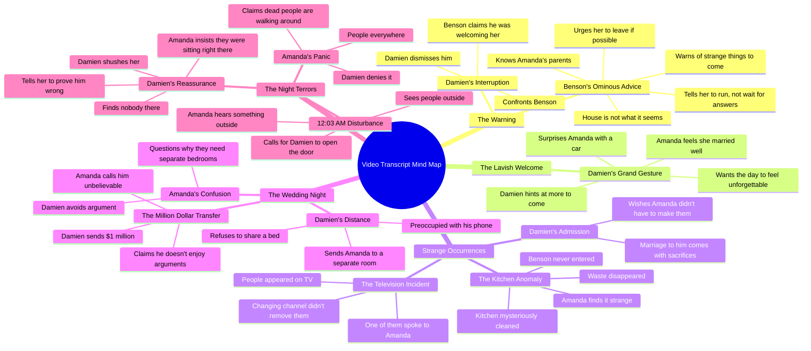

# Newlywed Warned About Her Husband's House

> 🌐 **Read this in:** [English](../../en/2026-09/tiktok-transcript-mystery-after-my-wedding-episode-one-africanmovies-africanst-55de.md) · **中文**

<a href="https://www.tiktok.com/@chief_collins_studio/video/7685858423841312022?_r=1&u_code=f465j142e3727d&preview_pb=0&sharer_language=en&_d=f16ac27dk6j77b&share_item_id=7685858423841312022&source=h5_m&timestamp=1789585244&item_author_type=2&utm_source=copy&share_enter_from=others_homepage&tt_from=copy&enable_checksum=1&utm_medium=ios&share_link_id=1BAD3AE6-5EF9-4DD3-81B6-D00353498E31&user_id=7654162232096605206&sec_user_id=MS4wLjABAAAAJg78oFVD55oylpfsTcCqCsxjw16m1L2uWTRKB56uc_8laoxVb7koecPWnsocfKR0&utm_campaign=client_share&panel_source_v2=share_panel&ug_btm=b5836,b2878&social_share_type=0&link_reflow_popup_iteration_sharer=%7B%22click_empty_to_play%22:1,%22dynamic_cover%22:1,%22follow_to_play_duration%22:-1,%22profile_clickable%22:1%7D&share_app_id=1233&sp_root_share_link_id=1BAD3AE6-5EF9-4DD3-81B6-D00353498E31&sp_root_d=f16ac27dk6j77b&sp_level=1&sp_root_u=f465j142e3727d" target="_blank"></a>

> **Creator:** [@chief_collins_studio](https://www.tiktok.com/@chief_collins_studio) · **Views:** 744.9K · **Posted:** 2026-09-16 · **Niche:** entertainment
>
> **TL;DR:** The hook immediately creates mystery and stakes by revealing a secret tied to the viewer's parents, compelling them to keep watching.

[Watch original video →](https://www.tiktok.com/@chief_collins_studio/video/7685858423841312022?_r=1&u_code=f465j142e3727d&preview_pb=0&sharer_language=en&_d=f16ac27dk6j77b&share_item_id=7685858423841312022&source=h5_m&timestamp=1789585244&item_author_type=2&utm_source=copy&share_enter_from=others_homepage&tt_from=copy&enable_checksum=1&utm_medium=ios&share_link_id=1BAD3AE6-5EF9-4DD3-81B6-D00353498E31&user_id=7654162232096605206&sec_user_id=MS4wLjABAAAAJg78oFVD55oylpfsTcCqCsxjw16m1L2uWTRKB56uc_8laoxVb7koecPWnsocfKR0&utm_campaign=client_share&panel_source_v2=share_panel&ug_btm=b5836,b2878&social_share_type=0&link_reflow_popup_iteration_sharer=%7B%22click_empty_to_play%22:1,%22dynamic_cover%22:1,%22follow_to_play_duration%22:-1,%22profile_clickable%22:1%7D&share_app_id=1233&sp_root_share_link_id=1BAD3AE6-5EF9-4DD3-81B6-D00353498E31&sp_root_d=f16ac27dk6j77b&sp_level=1&sp_root_u=f465j142e3727d)

## Why This Went Viral

## 钩子（前3秒）
- **逐字开场白：**“夫人，我认识你的父母。这是我告诉你这件事的唯一原因。”
- **钩子模式：**阴谋/秘密警告式钩子（一个仆人向新嫁娘泄露禁忌信息）。这是大胆断言模式的一种“禁忌知识”变体。
- **为什么它能让人停下滚动：**它零铺垫地切入冲突中段。“我认识你的父母”暗示着债务、威胁或隐藏的联系——而“这是我告诉你这件事的唯一原因”承诺了一个说话者本不该分享的秘密。观众被直接丢进一场已经在进行的阴谋中，所以大脑必须先补全缺失的语境才能继续往下走。

## 情绪节奏
- **好奇（0–15秒）：**本森的警告——“这座房子不是你想的那样……快跑。”未解的问题层层堆叠：这房子有什么问题？他为什么怜悯她？
- **松一口气/虚假的安全感（15–30秒）：**达米安打断，本森退下（“我只是在欢迎她”）。紧张感归零。
- **温暖→不安（30–60秒）：**汽车礼物、“你还没见识到呢”、“我觉得我嫁得很好”。浪漫达到顶峰——然后那间干净得不可能的厨房和“能跑就跑”将其刺破。
- **恐惧升级（60–90秒）：**换台后“留在”电视上的人；其中一个对她说话。达米安含糊的道歉（“伴随着牺牲”）将婚姻重新定义为一场交易。
- **紧张飙升（90–120秒）：**分房睡的命令、100万美元转账以平息争吵。金钱变成控制机制，而非爱意。
- **高潮（120–150秒）：**凌晨12:03——敲门声、“这些人是谁？”、“为什么死人会在你家里走来走去？”阿曼达质问达米安；他否认一切。最后的“嘘。”作为反转落下——要么他在让她噤声，要么房间里还有别的东西。
- **高潮时刻：**“阿曼达，为什么死人会在你家里走来走去？”——整个视频的核心问题，以直接指控的方式抛出。

## 关键词密度
- **最强的重复词/短语：***快跑/能跑就跑*、*达米安*、*阿曼达*、*房子*、*死人*、*本森*、*夫人/妻子*、*开门*、*奇怪*、*100万美元*。
- **算法触达驱动词：***快跑*、*死人*、*房子*、*奇怪*——高情绪、高搜索量的恐怖/惊悚词元，触发“恐怖故事”和“有毒婚姻”细分领域的推荐聚类。
- **情绪牵引驱动词：***达米安*、*阿曼达*、*夫人*、*妻子*、*结婚*——专有名词和关系称谓，让观众感觉自己在看真实的人，而不是短剧。100万美元的数字增添了阶级/财富的窥视感。
- **结构性关键词：***快跑*出现两次（本森和无实体声音），作为一个反复出现的母题，训练观众预期危险。

## 为什么它会传播
- **未解决的威胁循环：**本森说“快跑”，却从不解释原因。视频以“嘘。”结束，零解决——观众重看以捕捉线索并评论理论，这反哺算法。
- **类型叠加：**它同时是有毒婚姻剧、鬼屋恐怖和财富幻想（100万美元转账、豪车）。每种类型都把不同的受众群体拉进同一个2分钟片段。
- **直接指控式台词：**“为什么死人会在你家里走来走去？”和“你不会和她同床”是可引用、可截图的台词，专为被剪辑和转发而设计。
- **POV沉浸感：**镜头始终停留在阿曼达的体验上——她是观众的替身。每一个揭示（电视上的人、行走的死人、分房睡）都是*和她一起*发现的，这维持了“我会怎么做？”的参与感。
- **固定时间线中的不断升级：**12:03的时间戳和婚礼之夜的框架创造了一个滴答作响的时钟结构。观众留下来看这一夜会变得多糟，而结局拒绝给出收束——经典的“第1部分”留存策略。

## 你可以偷学什么
- **以一个禁忌的秘密开场，而不是铺垫。**让你的视频以一个角色说出不该说的话开始——“我认识你的父母”、“别告诉他是我说的”——让观众的大脑自行补全缺失的语境。不要介绍，不要背景，不要问候。
- **早早埋下一个警告，然后让观众忘记它。**本森的“快跑”出现在第5秒，在第140秒兑现。这个间隔正是让兑现显得有分量的原因。把你的脚本结构安排成第一句和最后一句是同一个威胁。
- **以否认结束，而不是解决。**“这里没有人。嘘。”不给观众任何闭合循环的东西——而这正是让他们评论、重看和分享的原因。每次都在解释之前切掉。

## Mind Map

## Full Transcript (Generated by [TokTranscript 转录工具](https://toktranscript.com/?utm_source=github&utm_medium=breakdown&utm_campaign=tool_attribution))

> 📝 Transcripts on this page are auto-generated and show the first 60%. Want to transcribe any TikTok in 30 seconds and get the full version? [Try TokTranscript free →](https://toktranscript.com/?utm_source=github&utm_medium=breakdown&utm_campaign=transcript_cta)

Madam, I know your parents. That's the only reason I'm telling you this. Telling me what? This house is not what you think it is. If you get a chance to leave, take it. I just married this man. What exactly are you saying? I'm saying I pity the life you're about to live when strange things begin. Don't wait for answers. Run. Benson, what? What exactly were you telling my wife? Nothing, sir. I was only welcoming her. Good. Keep it that way. Yes, sir. Finish your duties. Damien, don't tell me that car is mine. I want today to feel unforgettable. You're going to spoil me. That's the plan. I think I married very well. You haven't seen anything yet. Benson. this kitchen was a mess a few minutes ago. Who arranged all this? Benson didn't even come in here. Even the waste is gone. This is strange. Run if you can. There were people on that television. What people? I changed the channel. They remained. One of them spoke to me. I'm sorry, Amanda. Being married to a man like me comes with sacrifices. I wish you didn't have to make them. Are you seriously going to spend our wedding night staring at you

*[Read the full transcript on TokTranscript →](https://toktranscript.com/plaza/tiktok-transcript-mystery-after-my-wedding-episode-one-africanmovies-africanst-55de?utm_source=github&utm_medium=breakdown&utm_campaign=transcript_full)*

## Browse More

- All [entertainment](../../by-niche/zh-CN/entertainment.md) breakdowns
- All [Secret Warning](../../by-pattern/zh-CN/hook-secret-warning.md) examples

## Video Info

| | |
|---|---|
| Creator | [@chief_collins_studio](https://www.tiktok.com/@chief_collins_studio) |
| Original video | [https://www.tiktok.com/@chief_collins_studio/video/7685858423841312022?_r=1&u_code=f465j142e3727d&preview_pb=0&sharer_language=en&_d=f16ac27dk6j77b&share_item_id=7685858423841312022&source=h5_m&timestamp=1789585244&item_author_type=2&utm_source=copy&share_enter_from=others_homepage&tt_from=copy&enable_checksum=1&utm_medium=ios&share_link_id=1BAD3AE6-5EF9-4DD3-81B6-D00353498E31&user_id=7654162232096605206&sec_user_id=MS4wLjABAAAAJg78oFVD55oylpfsTcCqCsxjw16m1L2uWTRKB56uc_8laoxVb7koecPWnsocfKR0&utm_campaign=client_share&panel_source_v2=share_panel&ug_btm=b5836,b2878&social_share_type=0&link_reflow_popup_iteration_sharer=%7B%22click_empty_to_play%22:1,%22dynamic_cover%22:1,%22follow_to_play_duration%22:-1,%22profile_clickable%22:1%7D&share_app_id=1233&sp_root_share_link_id=1BAD3AE6-5EF9-4DD3-81B6-D00353498E31&sp_root_d=f16ac27dk6j77b&sp_level=1&sp_root_u=f465j142e3727d](https://www.tiktok.com/@chief_collins_studio/video/7685858423841312022?_r=1&u_code=f465j142e3727d&preview_pb=0&sharer_language=en&_d=f16ac27dk6j77b&share_item_id=7685858423841312022&source=h5_m&timestamp=1789585244&item_author_type=2&utm_source=copy&share_enter_from=others_homepage&tt_from=copy&enable_checksum=1&utm_medium=ios&share_link_id=1BAD3AE6-5EF9-4DD3-81B6-D00353498E31&user_id=7654162232096605206&sec_user_id=MS4wLjABAAAAJg78oFVD55oylpfsTcCqCsxjw16m1L2uWTRKB56uc_8laoxVb7koecPWnsocfKR0&utm_campaign=client_share&panel_source_v2=share_panel&ug_btm=b5836,b2878&social_share_type=0&link_reflow_popup_iteration_sharer=%7B%22click_empty_to_play%22:1,%22dynamic_cover%22:1,%22follow_to_play_duration%22:-1,%22profile_clickable%22:1%7D&share_app_id=1233&sp_root_share_link_id=1BAD3AE6-5EF9-4DD3-81B6-D00353498E31&sp_root_d=f16ac27dk6j77b&sp_level=1&sp_root_u=f465j142e3727d) |
| Original title | Mystery after my Wedding. Episode One #africanmovies #africanstorytel... |
| Views | 744.9K (744900) |
| Posted | 2026-09-16 |
| Duration | 0s |
| Niche | `entertainment` |
| Hook pattern | `Secret Warning` |
| Original language | `en` (this page translated by AI) |
| Available languages | en, zh-CN |
| Generated | 2026-09-17 by [TokTranscript](https://toktranscript.com/) |

---

*This breakdown is for educational analysis under fair use. Original video © [@chief_collins_studio](https://www.tiktok.com/@chief_collins_studio). All transcripts are auto-generated and may contain errors.*

*Want to analyze your own TikToks like this? [免费 TikTok 文稿生成器 →](https://toktranscript.com/viral-breakdown?utm_source=github&utm_medium=breakdown&utm_campaign=footer_cta)*