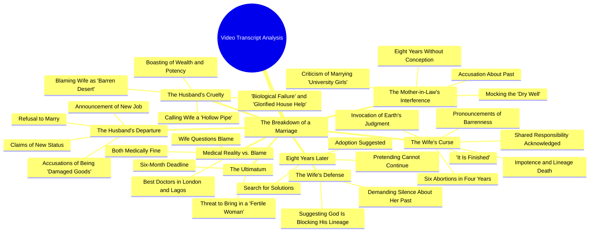

# Nigerian Drama: Woman Leaves After Job Offer and Insult

> 🌐 **Read this in:** [English](../../en/2026-09/tiktok-transcript-part-1-the-curse-fyp-viral-naijatiktok-uktiktok-ai-2ed8.md) · **中文**

> **Creator:** [@talesbyoma02](https://www.tiktok.com/@talesbyoma02) · **Views:** 5.3M · **Posted:** 2026-09-23 · **Niche:** entertainment
>
> **TL;DR:** Opens with a relatable question that immediately creates curiosity and sets up the conflict.

[Watch original video →](https://vm.tiktok.com/ZN8MVaFGf/)

## Why This Went Viral

## 钩子（前3秒）
- 开场白逐字：“我们今天终于要搬了吗？是莱基的那份工作吗？我要搬走了。”
- 钩子模式：**反差 + 冷开场**——一句家庭状态式提问（“我们今天终于要搬了吗？”）瞬间被“我要搬走了”（单数、排他）翻转。
- 为什么能让人停下滚动：观众被直接丢进一场争吵中，没有任何铺垫。代词从“我们”切换到“我”，在3秒内就释放出背叛信号，而未解的“是莱基的那份工作吗？”则埋下一个地点/状态问题，让大脑想要得到答案。

## 情绪节奏
- **第1拍——好奇（0–3秒）：** 含糊的“搬家”问题；观众不知道是谁要离开谁。
- **第2拍——震惊/紧张（3–15秒）：** “我没打算娶你……残次品……打掉了六个孩子。”指控快速堆叠；道德筹码飙升。
- **第3拍——反转（15–30秒）：** “是你出的主意。是你提供的子宫。”责任从受害者翻转到共犯——这是共鸣点，观众会在这里选边站。
- **第4拍——诅咒/高潮（30–55秒）：** “正如大地喝下了那六个孩子的血……大地也必将吞没你的名字。”诅咒独白就是**高潮**——它是最适合引用、最适合截图、最容易被二次剪辑拼接的段落。
- **第5拍——时间跳跃 + 新反派（55秒–结尾）：** “已经8年了。”第二幕引入亿万富翁丈夫和婆婆，从单个背叛者升级为整个体系（婚姻、金钱、家庭、宗教）。
- **缓解：** 完全没有提供。视频以“也许你声称侍奉的那位神正在拦阻他的血脉”收尾——刻意不解决，从而驱动评论。

## 关键词密度
- **六个孩子 / 六次怀孕 / 六个灵魂**——支撑整个诅咒；情绪拉力最强。
- **不孕 / 枯井 / 沙漠 / 石子宫**——主题脊柱；驱动隐喻识别和引用分享。
- **亿万富翁 / 地位 / 财富**——算法触达关键词；向推荐系统发出阶级冲突内容信号。
- **子宫**——重复4次以上；承载医学与道德论证的单一核心词。
- **没用 / 残次品 / 生理失败**——侮辱词簇；驱动愤怒评论。
- **8年 / 6个月 / 4年**——数字制造虚假精确的可信度，并为怨愤打上时间戳。
- **伦敦和拉各斯**——地理关键词配对，扩大离散群体 + 本地信息流受众。
- **诅咒 / 灰烬 / 水 / 血**——仪式性语言；情绪拉力，而非算法拉力。
- 算法驱动词：*亿万富翁、拉各斯、伦敦、婚姻、8年*（可搜索、可分类标签）。情绪驱动词：*六个孩子、不孕、诅咒、被太阳晒干*（触发评论、可引用）。

## 为什么它会传播
- **道德模糊迫使选边。** “是你出的主意。是你提供的子宫”让受害者变成共犯——观众无法被动观看；他们必须在评论区争论谁有罪。
- **诅咒作为可分享的物件。** “正如大地喝下了你从我身上夺走的那六个孩子的血，大地也必将吞没你的名字”是一段自成一体、可直接截图的独白——正是会被剪辑、拼接、转发的那种单元。
- **双场景结构让回报翻倍。** 第一幕（背叛 + 诅咒）负责钩住；第二幕（“已经8年了……我是亿万富翁”）用新对手重置赌注，让差点划走的观众获得第二个留下来的理由，并愿意重看。
- **禁忌 + 地位碰撞。** 生育、堕胎、财富和宗教集中在一条视频里——每个话题都会独立触发算法加权和评论区冲突。
- **未解决的结尾邀请续集。** “也许你声称侍奉的那位神正在为某个原因拦阻他的血脉”以公开的神学指控收尾——这是完美的“第2部”诱饵，也适合二重唱/拼接回应。

## 你可以借鉴什么
1. **从争吵中途开场，而不是从头开始。** 用一句暗示此前已有对话的台词开场（“我们今天终于要搬了吗？”），让观众感觉自己走进了真实发生的事——不要说明，不要铺垫。
2. **每条视频设计一句“引用句”。** 写一句专门用于截图或做字幕的句子——比如诅咒演讲——并把它放在情绪峰值，而不是结尾。
3. **使用两幕式重置。** 如果你的视频超过40秒，就引入一次时间跳跃（“已经8年了”）和一个新角色或新赌注，重新钩住那些正要划走的观众。

## Mind Map

## Full Transcript (Generated by [拆解你自己的 TikTok](https://toktranscript.com/?utm_source=github&utm_medium=breakdown&utm_campaign=tool_attribution))

> 📝 Transcripts on this page are auto-generated and show the first 60%. Want to transcribe any TikTok in 30 seconds and get the full version? [Try TokTranscript free →](https://toktranscript.com/?utm_source=github&utm_medium=breakdown&utm_campaign=transcript_cta)

Are we finally moving today? Is it the job in Leki? I am moving. Funky. You are staying. What do you mean? I got the job. But don't bother waiting for me. I don't plan to marry you. A woman who has flushed six babies down the drain in four years. You are damaged goods. You are no longer useful to a man of my new status. But today you forced me. You said we weren't ready. You bought the drugs. You. I provided the suggestion. You provided the womb. A virtuous woman would have said no. I have a better life ahead. And it doesn't include a graveyard. Today you made me terminate 6 pregnancies in 4 years. And now you have left me. Today you took my blood and made it water. You took my future and turned it into a curse. As the earth drank the blood of the six you tore from me, so shall the earth swallow your name. You seek a better life. May that life be as barren. Your seed is turned to ash. Your strength is turned to water. You shall marry a thousand women. And their womb shall turn to stone the moment you touch them. You will travel to the west and the doctors will find no pulse in your loins. You will remain impotent. You called me useless. You shall be the trunk of a tree that bears no fruit. A dead end in the lineage of your fathers. Until the six souls you rejected call you father, you shall remain a man who dried by the sun. It is finished today. It has been 8 years. We can't keep pr

*[Read the full transcript on TokTranscript →](https://toktranscript.com/plaza/tiktok-transcript-part-1-the-curse-fyp-viral-naijatiktok-uktiktok-ai-2ed8?utm_source=github&utm_medium=breakdown&utm_campaign=transcript_full)*

## Browse More

- All [entertainment](../../by-niche/zh-CN/entertainment.md) breakdowns
- All [Question Hook](../../by-pattern/zh-CN/hook-question-hook.md) examples

## Video Info

| | |
|---|---|
| Creator | [@talesbyoma02](https://www.tiktok.com/@talesbyoma02) |
| Original video | [https://vm.tiktok.com/ZN8MVaFGf/](https://vm.tiktok.com/ZN8MVaFGf/) |
| Original title | PART 1: The Curse #fyp #viral #naijatiktok #uktiktok #ai  |
| Views | 5.3M (5300000) |
| Posted | 2026-09-23 |
| Duration | 0s |
| Niche | `entertainment` |
| Hook pattern | `Question Hook` |
| Original language | `en` (this page translated by AI) |
| Available languages | en, zh-CN |
| Generated | 2026-09-24 by [TokTranscript](https://toktranscript.com/) |

---

*This breakdown is for educational analysis under fair use. Original video © [@talesbyoma02](https://www.tiktok.com/@talesbyoma02). All transcripts are auto-generated and may contain errors.*

*Want to analyze your own TikToks like this? [TokTranscript →](https://toktranscript.com/viral-breakdown?utm_source=github&utm_medium=breakdown&utm_campaign=footer_cta)*