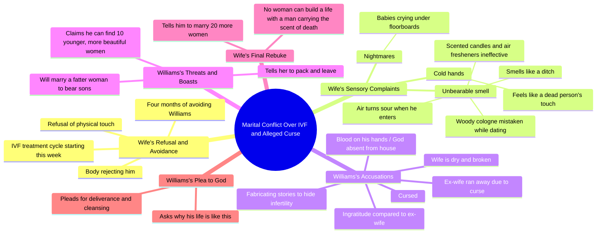

# Couple Argues Over IVF Treatment in Fate Cursed Part 2

> 🌐 **Read this in:** [English](../../en/2026-09/tiktok-transcript-part-2-fate-cursed-aistory-aistoryteller-ai-6053.md) · **中文**

> **Creator:** [@talesbyoma02](https://www.tiktok.com/@talesbyoma02) · **Views:** 414.3K · **Posted:** 2026-09-27 · **Niche:** entertainment
>
> **TL;DR:** Immediate tension and rejection create curiosity about the relationship.

[Watch original video →](https://vm.tiktok.com/ZN8ryQx6M/)

## Why This Went Viral

## 钩子（前3秒）
- **逐字开场白：** “Chinerre，看看我现在，Williams，求你了，待在你那边。别靠近我。”
- **钩子模式：** 场景/中途冲突——视频在零铺垫的情况下把你丢进一场争吵中。第二层：直接称呼名字（“Chinerre”）读起来像个人点名，这欺骗大脑以为它在对自己说话。
- **为什么能阻止滑动：** 没有给出背景，所以大脑必须解决一个开放循环（“她为什么不让他靠近她？”）。婚床上的身体排斥是一个即时可读、高风险的禁忌。观众在偷听亲密关系的崩塌——窥视欲加上未解决的紧张感。

## 情绪节奏
- **好奇**（0–5秒）：“别靠近我”——为什么？他做了什么？
- **背景/紧张升级**（5–20秒）：试管婴儿、4个月的回避、“我们在努力要孩子”——赌注被点名：一段婚姻和一个孩子。
- **揭示#1——厌恶**（约20–40秒）：“我的皮肤发麻”、“那气味”、“闻起来像沟渠”。感官语言将抽象冲突转化为身体厌恶。
- **揭示#2——恐怖升级**（约40–55秒）：“你的手总是冰冷……像死人抱着我”、“地板下婴儿在哭”。这是**转折落地**——故事从婚姻戏剧转向超自然恐惧。
- **高潮**（约55–70秒）：相互指责的螺旋——“你被诅咒了”/“你才是身体坏掉的那个”/“你前妻跑掉是对的”。两个角色同时引爆；前妻的细节追溯性地将一切重新框定为一种模式，而非孤立争吵。
- **解脱/宣泄**（约70秒–结束）：Williams的崩溃——“天哪，为什么？我做了什么？拯救我。净化我。”反派/攻击者变成了恳求者。通过角色反转实现情绪释放。

## 关键词密度
- **最强的重复词：** *气味*（及变体：味道、酸、沟渠、死亡）、*诅咒/被诅咒*、*身体*（皮肤、手、坏掉、干燥）、*婴儿/孩子/儿子*、*Williams*（名字重复）、*离开/跑掉*、*床/房间/房子*。
- **算法驱动词：** *被诅咒*、*死亡*、*婴儿*、*试管婴儿*——高情绪、高搜索量的词，触发围绕生育、婚姻冲突和超自然/诅咒内容的主题聚类。这些同时将视频拉入多个推荐池。
- **情绪拉动词：** *气味*、*皮肤发麻*、*冰冷*、*死人*、*地板下*——这些是人们会在评论中引用和拼接的台词。感官+恐怖词汇使片段*作为一种感觉*可分享，而不仅仅是一个故事。
- **结构性关键词：** 名字*Williams*作为直接称呼重复，使独白感觉像对峙，而非叙述——它维持了“偷听到的争吵”幻觉。

## 为什么它会传播
- **双类型诱饵。** 前40秒读起来像现实的婚姻/生育剧；后半部分转向超自然恐怖（“地板下婴儿在哭”、“死亡的气味”）。为一种类型而来的观众被另一种类型伏击——这种错配是评论磁铁（“等等，这是鬼故事？？”）。
- **可引用、可截图的台词。** “没有女人能和一个带着死亡气味的男人建立生活”和“你的手总是冰冷……像死人抱着我”是为字幕、合拍和反应拼接而生的。病毒式传播需要可移植的台词；这个脚本密集地充满了它们。
- **道德模糊迫使站队。** 双方都不干净——她说他被诅咒，他说她坏掉并威胁用“10个更年轻更漂亮的女孩”替换她。评论区分裂成Team Chinerre/Team Williams，而争论是最便宜的互动引擎。
- **没有解决的升级循环。** 每10–15秒就有一个新的指责超越上一个（气味→冰冷的手→噩梦→诅咒→前妻→替换妻子）。没有平静的节拍可以退出，所以观众看到最后等待一个永远不会到来的解决——提升完播率。
- **普遍恐惧锚定。** 生育失败、伴侣的厌恶、以及血脉上的“诅咒”是原始焦虑。超自然包装使真正的恐惧（不被想要且无法修复）变得安全可消费——这就是为什么它超越了戏剧利基。

## 你可以偷什么
- **以身体边界在中途冲突中开场。** 从“别靠近我”这样的台词开始——一个身体拒绝另一个身体。没有背景故事，没有问候。观众解释拒绝的需求*就是*你的留存。
- **在感官层面升级，而非情节层面。** 不要添加新事件；添加新*感觉*（气味→温度→声音→梦境）。每种感官加深同一冲突而不是稀释它，而感官台词是人们引用的。
- **让攻击者说最后一句话——然后击垮他们。** 以看似掌控的角色崩溃结束（“拯救我。净化我。”）。反转是情绪回报，它使观众重看和评论，而不仅仅是滑过。

## Mind Map

## Full Transcript (Generated by [TokTranscript](https://toktranscript.com/?utm_source=github&utm_medium=breakdown&utm_campaign=tool_attribution))

> 📝 Transcripts on this page are auto-generated and show the first 60%. Want to transcribe any TikTok in 30 seconds and get the full version? [Try TokTranscript free →](https://toktranscript.com/?utm_source=github&utm_medium=breakdown&utm_campaign=transcript_cta)

Chinerre, look at me now, Williams, please just stay on your side. Don't come near me. What is the meaning of this nonsense? For the past 4 months, you have been avoiding me. We are trying to have a baby. Remember, you agreed to the new cycle of IVF treatment starting this week. How can we make a child if you won't even let me touch your skin? Every time you come close to me in this bed, my skin crawls. It's not that I don't want to be a wife to you, but my body is rejecting you. What are you talking about? The smell, Williams. The smell. When we were dating, we were always outdoors, in open restaurants, in clubs. I thought maybe you just liked a specific woody Cologne. But living in this house, sleeping in this bed, it is unbearable. It doesn't matter how many scented candles I burn. It doesn't matter how many air fresheners the maids spray. The moment you enter the room, the air turns sour. It smells like a ditch. And when you touch me, your hands are always ice cold. It feels like a dead person is holding me. I have nightmares every single night, Williams. I dream of babies crying under the floorboards of this room. You are ungrateful, just like my ex wife. You are cursed. I gave you a name

*[Read the full transcript on TokTranscript →](https://toktranscript.com/plaza/tiktok-transcript-part-2-fate-cursed-aistory-aistoryteller-ai-6053?utm_source=github&utm_medium=breakdown&utm_campaign=transcript_full)*

## Browse More

- All [entertainment](../../by-niche/zh-CN/entertainment.md) breakdowns
- All [Conflict Hook](../../by-pattern/zh-CN/hook-conflict-hook.md) examples

## Video Info

| | |
|---|---|
| Creator | [@talesbyoma02](https://www.tiktok.com/@talesbyoma02) |
| Original video | [https://vm.tiktok.com/ZN8ryQx6M/](https://vm.tiktok.com/ZN8ryQx6M/) |
| Original title | PART 2: FATE CURSED #aistory #aistoryteller #ai  |
| Views | 414.3K (414300) |
| Posted | 2026-09-27 |
| Duration | 0s |
| Niche | `entertainment` |
| Hook pattern | `Conflict Hook` |
| Original language | `en` (this page translated by AI) |
| Available languages | en, zh-CN |
| Generated | 2026-09-28 by [TokTranscript](https://toktranscript.com/) |

---

*This breakdown is for educational analysis under fair use. Original video © [@talesbyoma02](https://www.tiktok.com/@talesbyoma02). All transcripts are auto-generated and may contain errors.*

*Want to analyze your own TikToks like this? [TikTok 转录工具 →](https://toktranscript.com/viral-breakdown?utm_source=github&utm_medium=breakdown&utm_campaign=footer_cta)*