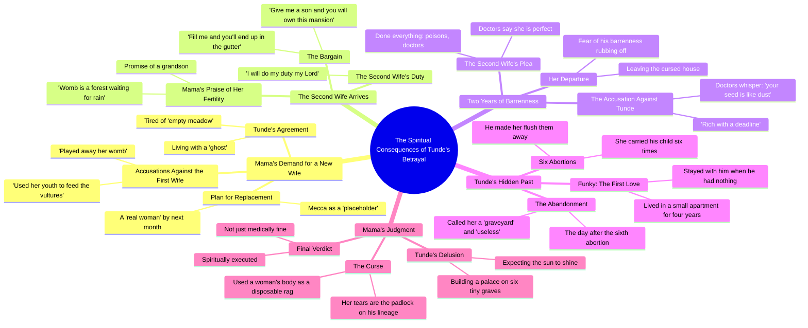

# The Curse Part 2: A Barren Wife Story

> 🌐 **Read this in:** [English](../../en/2026-09/tiktok-transcript-part-2-the-curse-naijatiktok-viral-fyp-ai-uktiktok-3daf.md) · **中文**

> **Creator:** [@talesbyoma02](https://www.tiktok.com/@talesbyoma02) · **Views:** 1.5M · **Posted:** 2026-09-27 · **Niche:** entertainment
>
> **TL;DR:** Immediately introduces a high-stakes family conflict with shocking accusations, grabbing attention.

[Watch original video →](https://vm.tiktok.com/ZN8rSmgmQ/)

## Why This Went Viral

## 钩子（前3秒）
- 逐字开场白：“我的儿子，你需要一个新妻子，这一个已经把她的子宫玩坏了”
- 钩子模式：**大胆断言 + 禁忌坦白**（一位母亲命令儿子抛弃妻子，以紧急建议的形式呈现）
- 为什么它能让人停下滚动：它以冲突中途开场，抛出一句令人震惊、充满道德重量的陈述。观众被直接丢进一场没有背景的私人家庭战争——大脑立刻发问：“等等，她刚才说了什么？”“子宫”这个词释放出高风险信号（血脉、生育），这是非洲家庭剧情内容中被验证有效的留存触发点。

## 情绪节奏
- **第1拍——好奇（0–5秒）：** 母亲冷酷的命令。观众想知道这些人是谁，以及妻子为什么被抛弃。
- **第2拍——愤慨（5–20秒）：** “空荡的草地”“占位者”“没有住户的装饰房间”——妻子被非人化。观众开始站队。
- **第3拍——反抗 / 张力飙升（20–35秒）：** 妻子反击——“问问你儿子，他把财富建在哪座坟场上。”反派叙事第一次出现真正的裂缝。
- **第4拍——升级（35–60秒）：** 新妻子登场，“子宫是一片等待降雨的森林”，随后揭示她两年后也没有孩子。
- **第5拍——悬念峰值（60–80秒）：** “你的种子像尘土”——这项指控翻转了整个前提。问题从来不在女人身上。
- **第6拍——高潮 / 反转（80–100秒）：** 坦白——“六次，她怀了我的孩子，我让她把它们冲掉了。”这是情绪引爆点。“坟场”的隐喻在此兑现。
- **第7拍——道德裁决 / 释然（100–110秒）：** “你不只是医学上没问题，你是精神上被处决了。”正义落地。观众松一口气。

**高潮时刻：** “六次，妈妈，六次，她怀了我的孩子”——这一揭示将此前每一句侮辱都重新定义为投射。

## 关键词密度
- **子宫**——情绪牵引（生育、血脉、羞耻）
- **孩子 / 儿子 / 孙子**——情绪牵引（传承赌注）
- **坟场 / 坟墓 / 尘土**——情绪牵引（精神后果，视频的核心隐喻）
- **不孕 / 空荡 / 干涸**——情绪牵引（侮辱词汇）
- **妈妈**——情绪牵引（权威 + 背叛）
- **妻子 / 女人 / 真正的女人**——算法触达（关系/家庭标签）
- **房子 / 豪宅 / 宫殿**——算法触达（财富/地位标签）
- **毒药 / 医生 / 医学上**——算法触达（生育/医疗剧情标签）
- **上帝 / 精神上 / 被诅咒**——算法触达（信仰类互动，在非洲短视频中极其庞大）

算法驱动因素：家庭、生育、财富、信仰——全部是高流量、高评论类别。情绪驱动因素：“坟场”“子宫”“六次”——这些是人们在评论中引用的台词。

## 为什么它会传播
- **道德愤怒诱饵 + 延迟兑现。** 开场（“你需要一个新妻子”）让观众对母亲愤怒，然后反转（“六座小小的坟墓”）将愤怒重新导向儿子——迫使观众重看并评论。“问问你儿子，他把财富建在哪座坟场上”这句台词是让结尾落地的种子。
- **可引用隐喻密度。** “空荡的草地”“子宫是一片等待降雨的森林”“富有却带着截止日期”“精神上被处决”——每10秒就有一句值得截图的台词。这些会成为字幕、评论和合拍。
- **禁忌 + 信仰框架。** 堕胎（“把它们冲掉”）、一夫多妻和精神后果（“你血脉上的挂锁”）相互碰撞。这同时触发宗教互动和道德辩论——短视频中两个最强的评论驱动因素。
- **反派翻转结构。** 观众被引导去恨婆婆，然后儿子坦白。“你把女人的身体当作一次性抹布”这句台词重新定义了整个角色阵容。反转结局推动分享，因为人们会发给朋友说“等到最后。”
- **悬念节奏。** 每15–20秒引入一个新角色或新指控（第一任妻子 → 第二任妻子 → 前女友 → 坦白）。没有任何一拍拖沓。留存率保持高位，算法因此给予更广泛的分发奖励。

## 你可以借鉴什么
- **以禁忌命令在争论中途开场。** 不要铺垫——从角色能说出的最令人震惊的台词开始。前3秒必须感觉像走进一场已经在进行的争吵。
- **早早埋下隐喻，在高潮处兑现。** “坟场”在第25秒被随口提到，在第90秒引爆。在第一幕埋下一个鲜明意象，让它在第三幕成为反转。
- **翻转反派。** 让观众恨角色A六十秒，然后揭示角色B更糟。重看率和评论率会翻倍，因为观众想回头核对前面的台词。

## Mind Map

## Full Transcript (Generated by [TokTranscript 转录工具](https://toktranscript.com/?utm_source=github&utm_medium=breakdown&utm_campaign=tool_attribution))

> 📝 Transcripts on this page are auto-generated and show the first 60%. Want to transcribe any TikTok in 30 seconds and get the full version? [Try TokTranscript free →](https://toktranscript.com/?utm_source=github&utm_medium=breakdown&utm_campaign=transcript_cta)

my son you need a new wife this one has played away her womb she has used her youth to feed the vultures you are right Mama I'm tired of looking at her empty meadow it's like living with a ghost Mecca you are just a placeholder a decorated room with no occupants by next month a real woman will be sitting in that chair a real woman tunde you can fill this house with a thousand concubines you can marry the most fertile women in Africa go and ask your son which graveyard he built his wealth upon Tunde you aren't looking for a wife your tunde you're looking for a miracle that your wicked soul doesn't deserve keep your better life I'd rather be barren alone than spend one more day breathing the air of a man who may be spiritually important my son look at her look at those hips this one is not like that dry firewood we just threw out this one's womb is a forest waiting for rain by this time next year I will be carrying my grandson welcome Mama has told you why you are here in this house give me a son and you will own this mansion fill me and you'll end up in the gutter she will fill this house with children I will do my duty my Lord two years Mama since you brought her and yet no children as you hide Mama I have done everything I have drunk your poisons I have seen the doctors they say I am perfect two dates not me wasn't your first wife the doctors they whisper 

*[Read the full transcript on TokTranscript →](https://toktranscript.com/plaza/tiktok-transcript-part-2-the-curse-naijatiktok-viral-fyp-ai-uktiktok-3daf?utm_source=github&utm_medium=breakdown&utm_campaign=transcript_full)*

## Browse More

- All [entertainment](../../by-niche/zh-CN/entertainment.md) breakdowns
- All [Conflict Hook](../../by-pattern/zh-CN/hook-conflict-hook.md) examples

## Video Info

| | |
|---|---|
| Creator | [@talesbyoma02](https://www.tiktok.com/@talesbyoma02) |
| Original video | [https://vm.tiktok.com/ZN8rSmgmQ/](https://vm.tiktok.com/ZN8rSmgmQ/) |
| Original title | PART 2: The Curse #naijatiktok #viral #fyp #ai #uktiktok  |
| Views | 1.5M (1500000) |
| Posted | 2026-09-27 |
| Duration | 0s |
| Niche | `entertainment` |
| Hook pattern | `Conflict Hook` |
| Original language | `en` (this page translated by AI) |
| Available languages | en, zh-CN |
| Generated | 2026-09-28 by [TokTranscript](https://toktranscript.com/) |

---

*This breakdown is for educational analysis under fair use. Original video © [@talesbyoma02](https://www.tiktok.com/@talesbyoma02). All transcripts are auto-generated and may contain errors.*

*Want to analyze your own TikToks like this? [TokTranscript 转录工具 →](https://toktranscript.com/viral-breakdown?utm_source=github&utm_medium=breakdown&utm_campaign=footer_cta)*