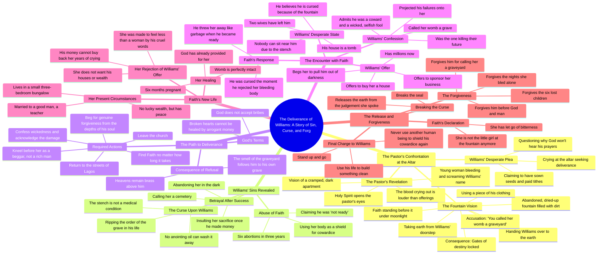

# Pastor Tells Williams His Prayers Go Unheard

> 🌐 **Read this in:** [English](../../en/2026-09/tiktok-transcript-part-3-fate-cursed-aistoryteller-aistory-ai-a70c.md) · **中文**

> **Creator:** [@talesbyoma02](https://www.tiktok.com/@talesbyoma02) · **Views:** 343.4K · **Posted:** 2026-09-29 · **Niche:** entertainment
>
> **TL;DR:** Immediately confronts the viewer with a bold spiritual claim, creating curiosity and tension.

[Watch original video →](https://vm.tiktok.com/ZN8r7v1ju/)

## Why This Went Viral

## 钩子（前3秒）
- **逐字开场白：**“威廉姆斯，你在祭坛前哭泣，也找不到你所寻求的拯救。”
- **钩子模式：**大胆断言 + 直接第二人称称呼（先知式斥责）。它从对峙中途切入，in medias res。
- **为什么能让人停下滚动：**它在第一口气里就点出一个人的名字（“威廉姆斯”），并否定了他想要的东西（“拯救”）。观众被丢进一场私密、高风险的 confrontations 中，而他们本不该听见——这就是“偷听到秘密”的效果。“拯救”+“祭坛”这两个词立刻释放出灵性剧的信号，而这是一个自带留存率的类型。

## 情绪节奏
- **0–10秒——好奇 + 指控：**牧师否认拯救，威廉姆斯为自己的十一奉献抗辩。问题被抛出：*为什么神不听他？*
- **10–30秒——恐惧揭示：**“向你呼喊的血，比钱更响。”一个流血女人尖叫着他名字的异象 → 紧张感飙升。
- **30–60秒——不断升级的恐怖：**喷泉、土地仪式、“你称她的子宫为坟墓。”六次堕胎的背景故事。当罪被点名时，悬念达到顶点。
- **60–90秒——处方 / 虚假解决：**牧师命令他去找 Faith 并乞求。为第二幕做铺垫。
- **90–120秒——对峙 + 反转：**威廉姆斯找到 Faith——她已婚、怀孕、平安。他的钱毫无价值。**高潮落在这里：**“我怀孕六个月了”——正是他毁掉的东西，如今在没有他的情况下茁壮成长。
- **120秒–结束——宣泄：**Faith 原谅了他。“我打破封印。”情绪得到缓解与释放。

**高潮时刻：**“我的子宫完好无损。我怀孕六个月了。”这就是重新定义整个故事的反转——受害者是完整的，施害者却是破碎的。

## 关键词密度
- **最强的重复词：** *诅咒 / 被诅咒*、*喷泉*、*墓地 / 坟墓 / 墓穴*、*子宫*、*血*、*钱 / 财富*、*faith*（名字 + 概念）、*原谅 / 宽恕*、*黑暗*、*懦弱*。
- **算法触达驱动词：** *诅咒、拯救、十一奉献、膏油、祭坛、神*——这些词聚集到“属灵争战 / 拯救”这一细分领域，而该领域拥有庞大且高度活跃的受众，他们会积极评论和分享。
- **情绪拉动驱动词：** *子宫、墓地、血、六次堕胎、怀孕、原谅*——这些词承载着道德与本能层面的重量；它们会触发愤怒、怜悯和沉冤得雪的快感，从而推动评论和反复观看。

## 为什么会传播
- **道德清晰 + 禁忌题材：**“你让那个女孩做了六次堕胎”是一句被设计来激起双方强烈反应的话——反堕胎和支持堕胎的观众会在评论区争论，使互动量翻倍。
- **反转回报：**“我的子宫完好无损。我怀孕六个月了”提供了观众等了90秒才等到的精确情绪奖励——受害者茁壮成长，而施害者却在乞求。这是可分享的沉冤得雪。
- **类型原生结构：**这是一部被压缩成短形式的诺莱坞式拯救剧。“牧师看见异象”的框架（“圣灵开了我的眼”）为极端 exposition 提供了许可，而不会让人觉得是剧情漏洞。
- **可引用、可截图的台词：**“你称她的子宫为坟墓。”“你把火柴递给她，她就点了火。”“你上方的诸天仍然如铜。”这些台词就是为被剪辑、配字幕和转发而设计的。
- **第二人称称呼：**不断的“你”和“威廉姆斯”让观众感觉自己被个人化地牵连并被直接说话——这是一种让眼睛留在屏幕上的留存技巧。

## 你可以偷走的东西
1. **用否认开场，而不是提问。**“[你想要的东西]无法通过[你正在做的事]找到”比“你有没有想过……”是更强的钩子——它会立刻制造冲突。
2. **点名一个具体的人和一个具体的地点。**“威廉姆斯”“拉各斯”“Leki”“喷泉”。具体性会被读成真实，让故事感觉是真的，而不是泛泛而谈。
3. **朝着反转构建，而不是解决。**不要以英雄获胜结尾——要以受害者已经痊愈、而英雄仍然破碎结尾。那个反转（“我怀孕六个月了”）才是让人们反复观看并分享的原因。

## Mind Map

## Full Transcript (Generated by [拆解你自己的 TikTok](https://toktranscript.com/?utm_source=github&utm_medium=breakdown&utm_campaign=tool_attribution))

> 📝 Transcripts on this page are auto-generated and show the first 60%. Want to transcribe any TikTok in 30 seconds and get the full version? [Try TokTranscript free →](https://toktranscript.com/?utm_source=github&utm_medium=breakdown&utm_campaign=transcript_cta)

Williams, the deliverance you are looking for cannot be found by crying at this altar. God is a god of justice. Pastor, I have sowed seeds. I have given tithe to the church projects. Why won't god hear my prayers? Because the blood crying out against you is louder than the money you put in the offering basket. What? What do you mean, pastor? As you knelt here weeping, the Holy Spirit opened my eyes. I saw a cramped, dark, one room apartment compound filled with smoke and noise. And I saw a young woman sitting on a cold floor bleeding and screaming your name. The Lord took me further into the night. I saw an old abandoned fountain, dried up, filled with dirt and stagnant water. I saw that same woman stand before it under the moonlight. She took the earth from your old doorstep and a piece of your clothing and she handed you over to the earth, Williams. She said you called her womb a graveyard and so she locked the gates of your destiny. Pastor, please save me. She cursed me. Faith cursed me. No, William, she did not just curse you. You handed her the matches and she lit the fire. You made that girl undergo six abortions in three years because you claimed you were not ready. You used her body as a shield for your own cowardice. And when you finally made the money, instead of honouring her sacrifice, you insulted her pain. Called her a cemetery and abandoned her in the dark. The smell you carry, Williams, is not a medical condition. You are ripping the order of the grave in your own life. No anointing oil from this altar will wash it away. Then what do I do? Pastor, please, I will give her everything. I will buy a house in Leki. Just tell me how to break the curse. God does not bribe Williams and neither other woman's broken heart be healed by arrogant money. You must leave this church, go back into the streets of Lagos and find faith. You must look for her no matter how long it takes. You will kneel before her not as a rich man, but as the beggar you truly are inside. You must confess your wickedness. Look at the damage you caused. Beg for her genuine forgiveness from the depths of your soul. Until faith releases you, Williams, the heavens above you remain brass and the smell of the graveyard will follow you to your own grave. Fate, Williams. Fate, please, I beg you, in the name of god, have mercy on me, Williams, stand up. Don't cause a sin in my shop. Pastor David told me everything I know what you did at the fountain. Fate, I am dying. Two wives have left me. My house is a tomb. Nobody can sit near me because of this stench. I am cursed, fate, and it's because of what I did to you. You think you are cursed because of what I d

*[Read the full transcript on TokTranscript →](https://toktranscript.com/plaza/tiktok-transcript-part-3-fate-cursed-aistoryteller-aistory-ai-a70c?utm_source=github&utm_medium=breakdown&utm_campaign=transcript_full)*

## Browse More

- All [entertainment](../../by-niche/zh-CN/entertainment.md) breakdowns
- All [Direct Address & Spiritual Challenge](../../by-pattern/zh-CN/hook-direct-address-spiritual-challenge.md) examples

## Video Info

| | |
|---|---|
| Creator | [@talesbyoma02](https://www.tiktok.com/@talesbyoma02) |
| Original video | [https://vm.tiktok.com/ZN8r7v1ju/](https://vm.tiktok.com/ZN8r7v1ju/) |
| Original title | PART 3: FATE CURSED #aistoryteller #aistory #ai  |
| Views | 343.4K (343400) |
| Posted | 2026-09-29 |
| Duration | 0s |
| Niche | `entertainment` |
| Hook pattern | `Direct Address & Spiritual Challenge` |
| Original language | `en` (this page translated by AI) |
| Available languages | en, zh-CN |
| Generated | 2026-10-02 by [TokTranscript](https://toktranscript.com/) |

---

*This breakdown is for educational analysis under fair use. Original video © [@talesbyoma02](https://www.tiktok.com/@talesbyoma02). All transcripts are auto-generated and may contain errors.*

*Want to analyze your own TikToks like this? [TokTranscript →](https://toktranscript.com/viral-breakdown?utm_source=github&utm_medium=breakdown&utm_campaign=footer_cta)*