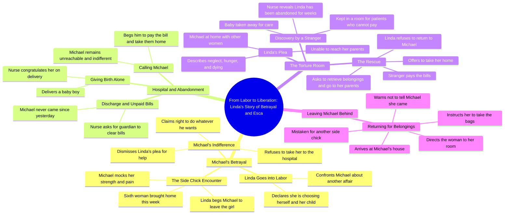

# Woman Chooses Herself Over Cheating Husband

> 🌐 **Read this in:** [English](../../en/2026-09/tiktok-transcript-part-one-the-strong-woman-s-tears-africanfolklore-africanfol-19f7.md) · **中文**

> **Creator:** [@storiesby___stan](https://www.tiktok.com/@storiesby___stan) · **Views:** 1.9M · **Posted:** 2026-09-16 · **Niche:** entertainment
>
> **TL;DR:** Immediately establishes high-stakes conflict by juxtaposing imminent childbirth with infidelity.

[Watch original video →](https://vm.tiktok.com/ZN86JK21d/)

## Why This Went Viral

## 钩子（前3秒）
- 逐字原文：“Michael，我明天就要生了。而你又带着另一个小三出现了。”
- 模式：**对比 + 利害关系**（人生大事与背叛在同一句话中碰撞）
- 为什么能让人停下滚动：两个高能名词——“分娩”和“小三”——在一句话中相撞。观众瞬间就有了反派、受害者和倒计时。无需任何铺垫。

## 情绪节奏
- **好奇**（0–5秒）：Michael是谁？为什么她宣布要生了还这么平静？
- **紧张**（5–25秒）：丈夫无视她，带第6个女人回家，拒绝送她去医院。
- **共鸣**（25–40秒）：“我求你了……让我们把这个孩子生下来”——这种羞辱具体而令人感同身受。
- **恐惧**（40–60秒）：切到医院。“没有人来。”被抛弃的打击落地。
- **绝望峰值**（60–90秒）：欠费病房，“没有护理，没有食物。我快死了。”
- **解脱 / 反转**（90–110秒）：一个陌生人付了账单，带她回家。
- **高潮时刻**：“你可以带我去那里拿我的东西……甚至不要告诉Michael我来过。”——安静的离开，最大的力量。
- **反转落地：** 她没有和解。她取回行李然后离开。复仇是沉默，不是喊叫。

## 关键词密度
- “Michael”（锚定名字——重复建立反派身份）
- “小三” / “女人” / “出轨”（背叛集群）
- “分娩” / “孩子” / “医院” / “账单”（利害关系集群）
- “坚强的女人”（讽刺性回扣，使用两次）
- “求你了”（反复乞求 = 情绪压力）
- “丈夫” / “妻子”（角色对比）
- “房间” / “房子”（空间困局）
- **算法触达驱动因素：**“分娩”、“小三”、“出轨”、“医院账单”——高搜索量、高互动性词汇，能引发评论区争论。
- **情绪拉动驱动因素：**“坚强的女人”、“求你了”、“我快死了”、“我的孩子”——这些将被动观众转化为评论者和分享者。

## 为什么它会传播
- **即时反派 + 受害者框架**——第一句中的“另一个小三”让观众有了可恨之人和可护之人，这是评论区活动的第一驱动力。
- **不断升级的不公阶梯**——每个节拍都比上一个更过分：无视分娩 → 带第6个女人回家 → 拒绝去医院 → 抛弃她 → 欠费病房。观众留下来看还能更糟到什么程度。
- **讽刺性回扣**——“你一直声称自己是个坚强的女人”被Michael当作武器，然后被护士翻转（“你确实是个坚强的女人，Linda”）。这种文字游戏给观众提供了一句可转发的金句。
- **延迟满足 / 救援节拍**——陌生人付账单满足了正义渴望，却没有解决婚姻问题，让结局足够开放，以激发“接下来会发生什么”的评论。
- **沉默退场结局**——“甚至不要告诉Michael我来过”是一个干净、可分享的麦克风时刻，奖励看到最后的观众（留存 + 重看）。

## 你可以借鉴什么
1. **在第一句话中碰撞两个对立的利害关系。** 不要用背景开场——用一个生活事件撞上背叛、截止日期或损失来开场。（例如：“我今天升职了，而我老板刚刚解雇了我最好的朋友。”）
2. **让不公升级，而不是重复。** 每个节拍都应该明显比上一个更糟。同样的冲突，更大的代价。
3. **以一句安静、可引用的话结尾，而不是大声的话。** 观众截图的那句话就是他们会分享的那句话。为字幕写你的最后一句话，而不是为场景。

## Mind Map

## Full Transcript (Generated by [拆解你自己的 TikTok](https://toktranscript.com/?utm_source=github&utm_medium=breakdown&utm_campaign=tool_attribution))

> 📝 Transcripts on this page are auto-generated and show the first 60%. Want to transcribe any TikTok in 30 seconds and get the full version? [Try TokTranscript free →](https://toktranscript.com/?utm_source=github&utm_medium=breakdown&utm_campaign=transcript_cta)

Michael, I'm going into labor tomorrow. And there you are again with another side chick. I'm not surprised, and I'm not going to argue with you. I've made up my mind, and this time I'm choosing myself and my child. Oh, please, Linda, spare me the speech. You're going into labor tomorrow. So what? You think that suddenly gives you the right to question me? I'll do whatever I want in my own house. If you don't like it, you know where the door is. Michael, is that your wife? Yes, side chick. I'm his wife. And you are the sixth woman he's bringing home this week. Anyways, you both should have a great time. I've got better things to do than worry about who Michael brings through that door. Michael, please. For the first time in all these years of cheating, I'm begging you. Leave that girl and come take me to the hospital. Let's have this baby. I'm in so much pain. Linda, I don't care. My mother gave birth to 7 children, and on no occasion did she ask my dad to take her to the hospital. You have always claimed to be a strong woman. Please leave here and don't interrupt our moment. Michael, since you brought me to this house, all you do is cheat and cheat, bringing different women to this home. And now I'm telling you to help me. Let's birth this baby, and you are saying no? It's okay. I already made A mistake. Mrs. Linda, congratulations on the delivery of your baby boy. You could be discharged now. And we would appreciate it if you would call your guardian or husband to come and clear the bills, take you home and give you full postpartum care. Nurse, are you trying to tell me my husband Michael haven't come since yesterday to see me and the child? Yes, Mrs. Nobody came. You are indeed a strong woman, Linda. Hello? Hello, Michael. Were you too busy cheating that you forgot me and your baby are still in the hospital? Michael, please come and clear the Bill so we would come back home. That's all I'm asking. Hello, my baby. I'm so sorry for bringing you into this type of chaos. Yes, sir. She's Mrs. Linda, one of the patients that nobody has come to ask for since weeks now. We had to bring her he

*[Read the full transcript on TokTranscript →](https://toktranscript.com/plaza/tiktok-transcript-part-one-the-strong-woman-s-tears-africanfolklore-africanfol-19f7?utm_source=github&utm_medium=breakdown&utm_campaign=transcript_full)*

## Browse More

- All [entertainment](../../by-niche/zh-CN/entertainment.md) breakdowns
- All [Urgent Confrontation](../../by-pattern/zh-CN/hook-urgent-confrontation.md) examples

## Video Info

| | |
|---|---|
| Creator | [@storiesby___stan](https://www.tiktok.com/@storiesby___stan) |
| Original video | [https://vm.tiktok.com/ZN86JK21d/](https://vm.tiktok.com/ZN86JK21d/) |
| Original title | PART ONE: The Strong Woman’s Tears 🤲🏿 #africanfolklore #africanfolkta... |
| Views | 1.9M (1900000) |
| Posted | 2026-09-16 |
| Duration | 0s |
| Niche | `entertainment` |
| Hook pattern | `Urgent Confrontation` |
| Original language | `en` (this page translated by AI) |
| Available languages | en, zh-CN |
| Generated | 2026-09-17 by [TokTranscript](https://toktranscript.com/) |

---

*This breakdown is for educational analysis under fair use. Original video © [@storiesby___stan](https://www.tiktok.com/@storiesby___stan). All transcripts are auto-generated and may contain errors.*

*Want to analyze your own TikToks like this? [TokTranscript →](https://toktranscript.com/viral-breakdown?utm_source=github&utm_medium=breakdown&utm_campaign=footer_cta)*