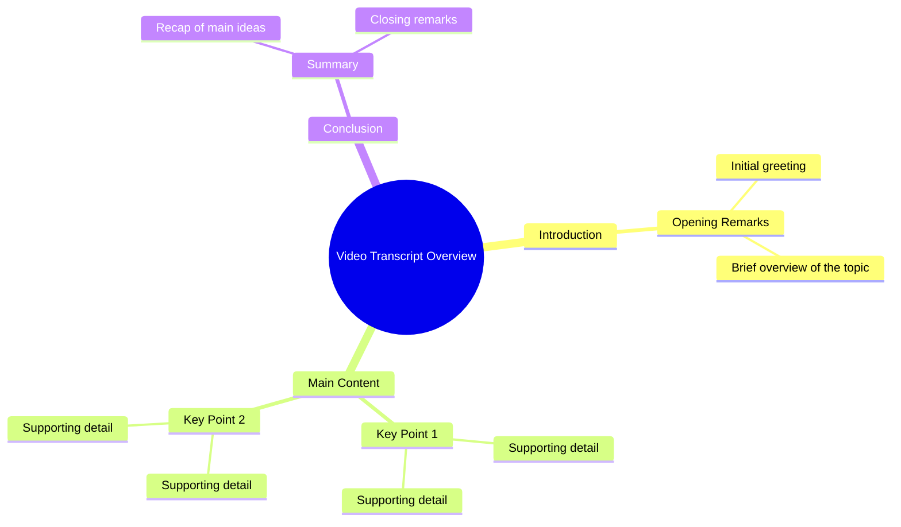

# Platform Shoes Fall Fashion Look

> 🌐 **Read this in:** [English](../../en/2026-09/tiktok-transcript-platformshoes-fall-fallfashion-superbrandclub-viralontiktoks-2b08.md) · **中文**

> **Creator:** [@millermakaila](https://www.tiktok.com/@millermakaila) · **Views:** 1.8M · **Posted:** 2026-09-22 · **Niche:** other
>
> **TL;DR:** The transcript contains only a single word, so no real hook, retention arc, or shareable content can be identified.

[Watch original video →](https://www.tiktok.com/@millermakaila/video/7548187643389988126)

## Why This Went Viral

## 钩子（前3秒）
- 提供的文字记录只有“I”这一个词——没有逐字的开场白、主张、问题或场景可供分析。
- 钩子模式：**不确定／数据不足**。一个孤立的第一人称代词是片段，不是钩子。
- 为什么它能让观众停下滚动：单凭它本身并不能。“I”只制造了一个微型缺口（“我怎么了？”）——一个没有回报信号的微弱好奇心钩子。

## 情绪节奏
- 节拍图：**好奇（微弱）→ 无**。只有一个词，就没有节拍序列、没有张力积累、没有释放、也没有反转。
- 悬念：只有未解决的语法承诺，即谓语即将出现。
- 高潮：**所提供的文字记录中不存在**。
- 注意：如果这是被截断的粘贴内容，请重新发送完整文字记录——节奏分析完全取决于缺失的内容。

## 关键词密度
- 最强的重复词：**“I”**（出现1次）。不存在其他词可供衡量。
- 算法触达关键词：未检测到。
- 情绪拉动关键词：未检测到。
- 结论：无法从单词样本计算关键词密度。

## 为什么它会传播
- 无法从给定文本中确定——单个代词中看不到任何机制。
- 可能（但无法验证）的解读：一个突兀的“I”可以作为悬念式剪辑发挥作用，但那是推测，不是分析。
- 不存在具体台词，无法将病毒式传播机制追溯到其上。
- 需要采取的行动：提供完整文字记录，以便进行真正的拆解。

## 你可以借鉴什么
- **前置一个完整的钩子句**——绝不要以片段开场；在前3秒给观众一个完整的主张、问题或场景。
- **设计明确的情感弧线**——埋下好奇、升级张力、落下一个反转；单个节拍无法留住观众。
- **重复1–2个锚点关键词**——选择既能服务算法触达又能拉动情绪的词语，并将它们贯穿脚本。
- **分析前先核实你的文字记录**——截断的输入会产生截断的策略。

## Mind Map

## Full Transcript (Generated by [TikTok 转录工具](https://toktranscript.com/?utm_source=github&utm_medium=breakdown&utm_campaign=tool_attribution))

> 📝 Transcripts on this page are auto-generated and show the first 60%. Want to transcribe any TikTok in 30 seconds and get the full version? [Try TokTranscript free →](https://toktranscript.com/?utm_source=github&utm_medium=breakdown&utm_campaign=transcript_cta)

_(transcript not available)_

*[Read the full transcript on TokTranscript →](https://toktranscript.com/plaza/tiktok-transcript-platformshoes-fall-fallfashion-superbrandclub-viralontiktoks-2b08?utm_source=github&utm_medium=breakdown&utm_campaign=transcript_full)*

## Browse More

- All [other](../../by-niche/zh-CN/other.md) breakdowns
- All [Incomplete / Unverifiable](../../by-pattern/zh-CN/hook-incomplete-unverifiable.md) examples

## Video Info

| | |
|---|---|
| Creator | [@millermakaila](https://www.tiktok.com/@millermakaila) |
| Original video | [https://www.tiktok.com/@millermakaila/video/7548187643389988126](https://www.tiktok.com/@millermakaila/video/7548187643389988126) |
| Original title | #platformshoes #fall #fallfashion #SuperBrandClub #ViralOnTikTokShop |
| Views | 1.8M (1800000) |
| Posted | 2026-09-22 |
| Duration | 0s |
| Niche | `other` |
| Hook pattern | `Incomplete / Unverifiable` |
| Original language | `en` (this page translated by AI) |
| Available languages | en, zh-CN |
| Generated | 2026-09-25 by [TokTranscript](https://toktranscript.com/) |

---

*This breakdown is for educational analysis under fair use. Original video © [@millermakaila](https://www.tiktok.com/@millermakaila). All transcripts are auto-generated and may contain errors.*

*Want to analyze your own TikToks like this? [TokTranscript →](https://toktranscript.com/viral-breakdown?utm_source=github&utm_medium=breakdown&utm_campaign=footer_cta)*