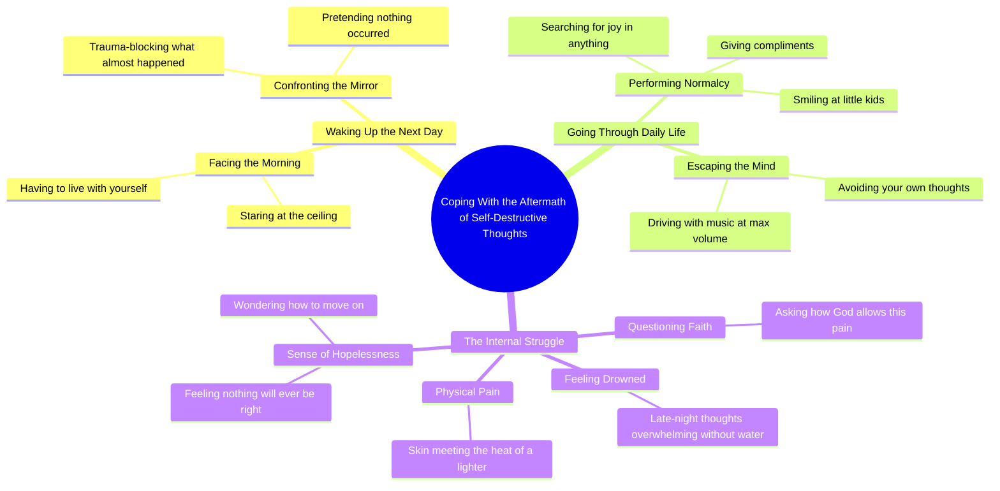

# Spoken Word Poem About Living With Trauma

> 🌐 **Read this in:** [English](../../en/2026-09/tiktok-transcript-poetry-poem-poems-poet-writer-7e92.md) · **中文**

> **Creator:** [@mia_emiliaa](https://www.tiktok.com/@mia_emiliaa) · **Views:** 744.0K · **Posted:** 2026-09-23 · **Niche:** entertainment
>
> **TL;DR:** It immediately presents the aftermath of a traumatic event, creating intrigue and emotional weight.

[Watch original video →](https://vm.tiktok.com/ZGdQbpTfJ/)

## Why This Went Viral

## 钩子（前3秒）
- **逐字开场白：** “经历了这一切之后，第二天你还得好好地醒来，盯着天花板。”
- **钩子模式：** *中途切入／余波式开场*——视频从一个未言明的事件*之后*开始，迫使观众反向推断究竟发生了什么。
- **为什么它能让人停下滑动：** “经历了这一切之后”是一个悬而未决的指代。大脑无法放着悬空的先行词不管。将一个模糊的灾难与一个极具共鸣的画面（“盯着天花板”）配对，会瞬间激发个人投射——每个观众都会用自己的最糟糕的夜晚来填补这个空白。

## 情绪节奏
- **0–5秒——好奇＋恐惧：** “第二天你还得好好地醒来”暗示前一晚*并不*好。扣住事件不说是引擎。
- **5–15秒——羞耻螺旋：** “和自己相处下去”“创伤会屏蔽掉那些差点可能发生的事”“假装你刚才没有做你做过的事”。紧张感通过反复使用*你*来累积——带着指责、亲密、第二人称。
- **15–25秒——伪装／失调：** “给别人赞美，对小孩子们微笑”——内心混乱与外在正常之间的对比是情绪的支点。共鸣在这里落得最重。
- **25–35秒——升级为绝望：** “把音乐开到最大来避开你自己的大脑”“神怎么会允许我这样感受？”——反问句层层堆叠，一句比一句更黑暗。
- **高潮：** “当连你的皮肤都碰过打火机的热度时，你怎么继续往前走？”——这是整个脚本中第一个具体、身体性的细节。它回溯性地重新框定了之前的一切，并作为反转落地。
- **最后节拍——没有解脱：** 视频以一个未回答的问题结束。这种扣留是刻意的——它推动评论和重看。

## 关键词密度
- **“你／你的”**——第二人称称呼，占主导的词类。推动准社会式的亲密感。
- **“继续往前走”**——在结尾附近重复3次。主题锚点。
- **“你怎么”**——首语重复模式；标示情绪高潮部分。
- **“这样感受”**——情绪牵引关键词；高共鸣指数。
- **“假装”／“创伤屏蔽”／“避开”**——伪装词汇；通过心理健康相关术语获得算法触达。
- **“神”**——触达驱动词；触发信仰＋危机评论线程。
- **“打火机”／“皮肤”／“热度”**——感官具体性；将抽象痛苦转化为让人停下滑动的画面。
- **算法 vs. 情绪：** “创伤”“神”“继续往前走”“这样感受”通过搜索／兴趣聚类驱动触达。“盯着天花板”“把音乐开到最大”“对小孩子们微笑”驱动*情绪牵引*——这些是人们会在评论和拼接视频中引用的句子。

## 为什么它会传播
- **第二人称沉浸迫使认同。** 每一句都以“你”开头。没有叙述者，没有故事，没有“我”——观众*就是*主体。“之后你还得和自己相处下去”让人无法被动观看。
- **策略性模糊邀请投射。** “这里差点可能发生的事”从未被定义。观众会补上自己的事件——分手、复吸、自残、险情——这意味着同一个视频能对十几种不同受众说话，并被分享进十几种不同社群。
- **伪装段落是可分享的镜子。** “你给别人赞美，对小孩子们微笑”是会被截图的那句。它命名了高功能抑郁的确切体验——人们认得，却很少看到被说出来的东西。
- **打火机那句是值得重看的反转。** 它是一段抽象独白中唯一具体的意象。第一次看时它令人震惊；重看时它重新语境化了前面每一句。重看是顶级算法信号。
- **它以未回答的问题结束，而不是解决方案。** “你怎么继续……”却没有答案，迫使观众要么评论、要么收藏、要么发给同样有这种感觉的人。三者都是互动行为。

## 你可以借鉴什么
- **从余波开始，而不是从事件开始。** 在事情发生*之后*开始你的故事。“经历了这一切之后……”让观众去做重建前情的工作——而这项工作正是让他们继续看下去的原因。
- **用第二人称首语重复来建立节奏。** 堆叠4–6句都以“你……”或“你怎么……”开头的句子。重复会形成一种催眠般的韵律，带着观众穿过沉重情绪内容，而他们不会注意到长度。
- **在高潮处落下一个具体、身体性的细节。** 抽象情绪（“我感觉很糟”）不会传播。一个感官意象（“你的皮肤碰过打火机的热度”）会——它是人们引用、截图和拼接的那句。

## Mind Map

## Full Transcript (Generated by [免费 TikTok 文稿生成器](https://toktranscript.com/?utm_source=github&utm_medium=breakdown&utm_campaign=tool_attribution))

> 📝 Transcripts on this page are auto-generated and show the first 60%. Want to transcribe any TikTok in 30 seconds and get the full version? [Try TokTranscript free →](https://toktranscript.com/?utm_source=github&utm_medium=breakdown&utm_campaign=transcript_cta)

After all that, you have to wake up fine the next day, staring at the ceiling. You have to live with yourself after. You have to look in the mirror trying to trauma block what almost could have happened here. You have to go on with your day pretending that you didn't just do what you did. So you give people compliments and you smile at little kids. You try to find joy or something, anything to lighten your day. You would give anything not to feel this way. You get in your car, music to the max to avo

*[Read the full transcript on TokTranscript →](https://toktranscript.com/plaza/tiktok-transcript-poetry-poem-poems-poet-writer-7e92?utm_source=github&utm_medium=breakdown&utm_campaign=transcript_full)*

## Browse More

- All [entertainment](../../by-niche/zh-CN/entertainment.md) breakdowns
- All [Consequence Hook](../../by-pattern/zh-CN/hook-consequence-hook.md) examples

## Video Info

| | |
|---|---|
| Creator | [@mia_emiliaa](https://www.tiktok.com/@mia_emiliaa) |
| Original video | [https://vm.tiktok.com/ZGdQbpTfJ/](https://vm.tiktok.com/ZGdQbpTfJ/) |
| Original title | #poetry #poem #poems #poet #writer  |
| Views | 744.0K (744000) |
| Posted | 2026-09-23 |
| Duration | 0s |
| Niche | `entertainment` |
| Hook pattern | `Consequence Hook` |
| Original language | `en` (this page translated by AI) |
| Available languages | en, zh-CN |
| Generated | 2026-09-26 by [TokTranscript](https://toktranscript.com/) |

---

*This breakdown is for educational analysis under fair use. Original video © [@mia_emiliaa](https://www.tiktok.com/@mia_emiliaa). All transcripts are auto-generated and may contain errors.*

*Want to analyze your own TikToks like this? [TokTranscript →](https://toktranscript.com/viral-breakdown?utm_source=github&utm_medium=breakdown&utm_campaign=footer_cta)*