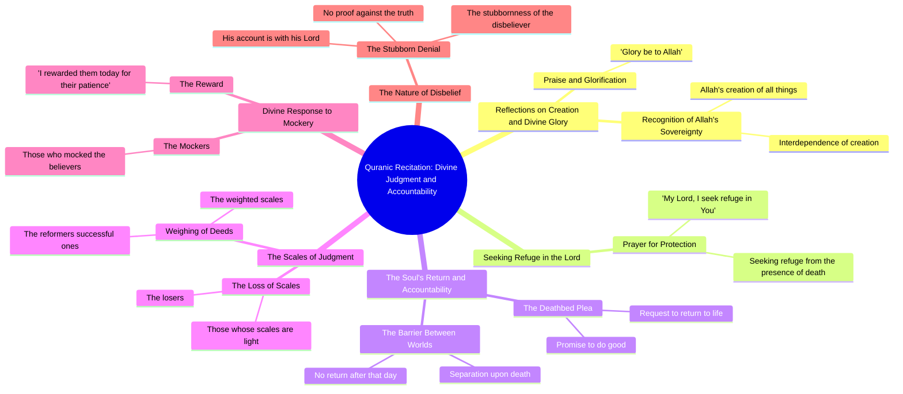

# Quran Verse 84: Who Owns the Earth and All in It

> 🌐 **Read this in:** [English](../../en/2026-09/tiktok-transcript-say-5958.md) · **中文**

> **Creator:** [@adh_su](https://www.tiktok.com/@adh_su) · **Views:** 5.9M · **Posted:** 2026-09-12 · **Niche:** other
>
> **TL;DR:** The hook immediately confronts the audience with a provocative label and a divine mystery, sparking curiosity and emotional engagement.

[Watch original video →](https://www.tiktok.com/@adh_su/video/7676659264894717204)

## Why This Went Viral

## 钩子（前3秒）
- **逐字开场：** “骗子，安拉从一个男孩那里拿走了什么”——直接指控（“骗子”）后紧跟一个关于失去和“男孩”的神圣/宗教断言。
- **钩子模式：** **大胆断言 + 对比**（指控 vs. 神圣引用），包裹在宗教诵经节奏而非对话节奏中。
- **为什么能阻止滑动：** “骗子”一词是攻击触发点——它迫使大脑做出战或逃的微决策。将其与“安拉”和“一个男孩”搭配，瞬间制造认知失调（谁在撒谎？哪个男孩？哪种失去？）。观众没有获得上下文，所以大脑会留下来解决这个缺口。宗教音频钩子还借助现有的身份驱动注意力：信徒停下，怀疑者停下争论。

## 情绪节奏
- **节拍1——对抗（0–3秒）：** “骗子”→ 震惊、防御、好奇。
- **节拍2——敬畏（3–10秒）：** “荣耀归于安拉”、“我的主，我寻求庇护”→ 转向庄严，降低观众防备，传递真实性。
- **节拍3——紧张/恳求（10–20秒）：** “有人死亡说……我的主，回来吧，我行善”→ 临终反转，经典的“太迟了”套路。悬念在此达到顶峰。
- **节拍4——审判意象（20–30秒）：** “称重的天平”、“那些是改革者”、“谁的天平倾斜了……那些亏损的人”→ 道德赌注具体化。这是**共鸣节拍**——观众将其映射到自己的生活。
- **节拍5——反转/嘲弄（30–40秒）：** “他们中有些人在嘲笑/我今天以他们曾忍耐的报酬赏赐了他们”→ 反转：嘲笑者被揭露，忍耐者得报酬。**这是高潮**——让人重看或评论的情绪回报。
- **节拍6——警告收尾：** “他的账目是他主的固执”→ 留下未解决的威胁，驱动评论和分享。

## 关键词密度
- **安拉/神/我的主**——身份锚点；通过宗教音频聚类驱动算法触达。
- **骗子**——情绪拉力最强的词；打开循环的指控。
- **天平/称重/倾斜**——道德隐喻；承载“审判”主题。
- **回来/我行善**——悔恨母题；最可引用、可分享的台词。
- **忍耐/忍耐者**——美德回报；将视频从指控转化为教训。
- **嘲笑**——反派标签；给观众一个可以反对的对象。
- **庇护/寻求庇护**——仪式语言；传递真诚并提升宗教音频留存。
- **死亡/账目**——赌注词；让观众看到最后。

**算法驱动因素：** “安拉”、“主”、“庇护”——这些将视频聚类到高留存的宗教内容信息流中。
**情绪驱动因素：** “骗子”、“回来”、“嘲笑”、“忍耐者”——这些是人们输入评论和私信的内容。

## 为什么它会传播
- **身份诱饵开场。** “骗子，安拉从一个男孩那里拿走了什么”在一秒内迫使每个观众选边（信徒/怀疑者/好奇者）——而身份驱动的内容会被分享以表明归属。
- **未解决的叙事缺口。** 文字稿从未解释“男孩”是谁或“骗子”是谁。缺失的上下文就是引擎：评论填补缺口，而评论量是最强的排名信号。
- **临终悔恨套路。** “我的主，回来吧，我行善”是一个普遍可理解的情绪单元——它跨语言和宗教有效，所以视频能传播到核心受众之外。
- **道德反转回报。** “他们中有些人在嘲笑/我今天以他们曾忍耐的报酬赏赐了他们”提供了一个干净的报应弧线——正是让人截图和转发的结构。
- **开放式威胁收尾。** “他的账目是他主的固执”以警告而非解决结束——观众重看以解读它，并将其作为对他人的警告分享。

## 你可以借鉴什么
1. **以指控开场，而非提问。** “骗子……”胜过“你有没有想过……”因为它迫使表态。你的下一个视频，从命名一个你的受众已有看法的群体或行为开始。
2. **故意扣留上下文。** 永远不要在视频中解释“男孩”、“骗子”或“天平”。留下一个未解释的具体名词，让评论成为你内容的第二幕。
3. **构建反转，而非教训。** 结构：指控 → 庄严 → 悔恨 → 审判 → 反转 → 开放式警告。反转（“我今天赏赐了他们”）是将讲座转化为可分享故事的关键——在写其他任何东西之前先规划好这句台词。

## Mind Map

## Full Transcript (Generated by [我们用的转录工具](https://toktranscript.com/?utm_source=github&utm_medium=breakdown&utm_campaign=tool_attribution))

> 📝 Transcripts on this page are auto-generated and show the first 60%. Want to transcribe any TikTok in 30 seconds and get the full version? [Try TokTranscript free →](https://toktranscript.com/?utm_source=github&utm_medium=breakdown&utm_campaign=transcript_cta)

Liars, what Allah took from a boy And what was with him from God So go all what created And put each other on each other Glory be to Allah And say my Lord, I seek refuge in you And I seek refuge in you, my Lord, that attend Someone death said He said, my Lord, come back I do good Saab between them on that day And they don't wonder weighted scales Those are reformers. And who slipped his scales? And th

*[Read the full transcript on TokTranscript →](https://toktranscript.com/plaza/tiktok-transcript-say-5958?utm_source=github&utm_medium=breakdown&utm_campaign=transcript_full)*

## Browse More

- All [other](../../by-niche/zh-CN/other.md) breakdowns
- All [Direct Address with Controversy](../../by-pattern/zh-CN/hook-direct-address-with-controversy.md) examples

## Video Info

| | |
|---|---|
| Creator | [@adh_su](https://www.tiktok.com/@adh_su) |
| Original video | [https://www.tiktok.com/@adh_su/video/7676659264894717204](https://www.tiktok.com/@adh_su/video/7676659264894717204) |
| Original title | قُل لِّمَنِ ٱلْأَرْضُ وَمَن فِيهَآ إِن كُنتُمْ تَعْلَمُونَ ۝٨٤/Say... |
| Views | 5.9M (5900000) |
| Posted | 2026-09-12 |
| Duration | 0s |
| Niche | `other` |
| Hook pattern | `Direct Address with Controversy` |
| Original language | `en` (this page translated by AI) |
| Available languages | en, zh-CN |
| Generated | 2026-09-13 by [TokTranscript](https://toktranscript.com/) |

---

*This breakdown is for educational analysis under fair use. Original video © [@adh_su](https://www.tiktok.com/@adh_su). All transcripts are auto-generated and may contain errors.*

*Want to analyze your own TikToks like this? [TokTranscript →](https://toktranscript.com/viral-breakdown?utm_source=github&utm_medium=breakdown&utm_campaign=footer_cta)*