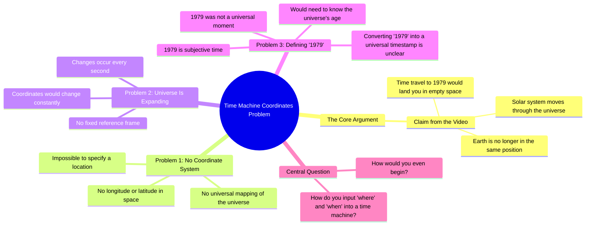

# Time Travel Question About Earth's Position in 1979

> 🌐 **Read this in:** [English](../../en/2026-09/tiktok-transcript-the-time-travel-questions-never-end-timetravel-timetraveler-43c7.md) · **中文**

> **Creator:** [@junkmotherjess](https://www.tiktok.com/@junkmotherjess) · **Views:** 2.9M · **Posted:** 2026-09-29 · **Niche:** entertainment
>
> **TL;DR:** The hook presents a shocking, counterintuitive consequence of time travel that immediately grabs attention and sets up the logical problem.

[Watch original video →](https://vm.tiktok.com/ZSbBW1rKn)

## Why This Went Viral

## 钩子（前3秒）
- **逐字开场白：**“我刚看到一个视频，里面有个家伙说，因为我们的太阳系正在宇宙中移动，如果你现在坐进时间机器，让它带你回到1979年，你会出现在太空里，因为地球现在的位置和1979年时不一样了。”
- **钩子模式：**场景设定／转述他人说法（“我刚看到一个视频，里面有个家伙说……”）——一种借来的前提钩子，搭上别人爆款创意的顺风车。
- **为什么能让人停下滑动：**它从半句话开始，带着一个生动又荒诞的画面（你在虚空中出现），再加一个具体的锚定年份（1979）。大脑被迫先想象这个失败场景，然后才能决定要不要继续看。

## 情绪节奏
- **好奇（0–5秒）：**1979年太空死亡的前提种下了一个“等等，这是真的吗？”的痒点。
- **紧张／升级（5–20秒）：**连珠炮式的反问堆叠起来——坐标？映射？膨胀？每一个都在施压，却都不解决。
- **共鸣节拍（约15秒）：**“1979是主观时间，对吧？1979并不是宇宙中的一个时间。”这是智力上的一记重击——它把整个前提重新框定为范畴错误。
- **高潮（约20–25秒）：**“那你怎么把你要去的地点和时间输入时间机器？认真问。你到底要怎么开始做这件事？”——反问堆叠到顶点，视频在未解决中结束。
- **没有缓解／刻意反解决：**视频拒绝给出答案。那个开放循环就是引擎。

## 关键词密度
- **“时间机器”**——承重的SEO短语；驱动搜索＋推荐流量。
- **“1979”**——具体、好记、可引用的数字；锚定心理画面。
- **“坐标”**——逻辑楔子；把科幻前提转化成谜题。
- **“地点和时间”**——两个词构成的反问式论点；高度可重复。
- **“宇宙”／“膨胀”**——宇宙尺度的关键词，标示“大想法”内容。
- **“主观时间”**——智力炫技词；驱动评论区争论。
- **“你到底要怎么开始”**——情绪牵引短语；邀请观众来回答。
- **算法驱动因素：**“时间机器”“宇宙”“1979”（搜索／趋势）。**情绪驱动因素：**“认真问”“你到底要怎么开始”（评论诱饵）。

## 为什么会传播
- **它用一个平淡无奇的物流异议攻击一个备受喜爱的科幻前提。**“你怎么给时间机器弄到坐标？”这句话把时间旅行降格成GPS问题——立刻就能作为“从没想过这一点”的观点被分享。
- **它堆叠问题，而不是答案。**“没有经度或纬度……那些坐标难道不会每秒都变吗？”每个未回答的问题都是评论区提示。
- **它包含一个感觉像启示的重新框定。**“1979并不是宇宙中的一个时间”就是人们截图并转发的那句话——一个紧凑、可引用的洞见。
- **它以开放循环结束。**“认真问。你到底要怎么开始做这件事？”不给观众任何可关闭的东西，于是他们自己在评论里关闭它——最强的互动信号。
- **它借势病毒式传播。**以“我刚看到一个视频，里面有个家伙说……”开场，搭上已有趋势，同时加入一个独特视角，因此会与原视频一起被推荐。

## 你可以偷走什么
- **用借来的前提开场，然后加入你自己的转折。**“我刚看到一个视频，里面有个家伙说X……”让你进入一场已有对话，并继承它的势头。
- **堆叠反问，而不是给出答案。**每个未回答的问题都是一条评论。以“你到底要怎么开始做这件事？”结束——永远不要解决。
- **植入一个可引用的重新框定。**把整个视频构建到一句可截图的话上（“1979并不是宇宙中的一个时间”），让观众会脱离语境转发。

## Mind Map

## Full Transcript (Generated by [免费 TikTok 文稿生成器](https://toktranscript.com/?utm_source=github&utm_medium=breakdown&utm_campaign=tool_attribution))

> 📝 Transcripts on this page are auto-generated and show the first 60%. Want to transcribe any TikTok in 30 seconds and get the full version? [Try TokTranscript free →](https://toktranscript.com/?utm_source=github&utm_medium=breakdown&utm_campaign=transcript_cta)

I just saw a video of a guy saying that because our solar system is moving through universe, if you got in a time machine right now and asked it to take you back to 1979, you would appear in space because the earth is in a different place now than it was in 1979. And. Yeah, quick question. How do you get coordinates for a time machine? There are no longitude or latitude, no mapping of our universe. And even if there was, it's constantly expanding, so wouldn't thos

*[Read the full transcript on TokTranscript →](https://toktranscript.com/plaza/tiktok-transcript-the-time-travel-questions-never-end-timetravel-timetraveler-43c7?utm_source=github&utm_medium=breakdown&utm_campaign=transcript_full)*

## Browse More

- All [entertainment](../../by-niche/zh-CN/entertainment.md) breakdowns
- All [Mind-Blowing Fact](../../by-pattern/zh-CN/hook-mind-blowing-fact.md) examples

## Video Info

| | |
|---|---|
| Creator | [@junkmotherjess](https://www.tiktok.com/@junkmotherjess) |
| Original video | [https://vm.tiktok.com/ZSbBW1rKn](https://vm.tiktok.com/ZSbBW1rKn) |
| Original title | The time travel questions never end #timetravel #timetraveler #timetr... |
| Views | 2.9M (2900000) |
| Posted | 2026-09-29 |
| Duration | 0s |
| Niche | `entertainment` |
| Hook pattern | `Mind-Blowing Fact` |
| Original language | `en` (this page translated by AI) |
| Available languages | en, zh-CN |
| Generated | 2026-09-30 by [TokTranscript](https://toktranscript.com/) |

---

*This breakdown is for educational analysis under fair use. Original video © [@junkmotherjess](https://www.tiktok.com/@junkmotherjess). All transcripts are auto-generated and may contain errors.*

*Want to analyze your own TikToks like this? [TokTranscript 转录工具 →](https://toktranscript.com/viral-breakdown?utm_source=github&utm_medium=breakdown&utm_campaign=footer_cta)*