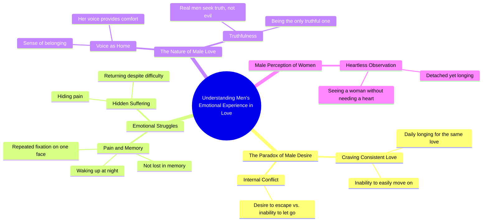

# Man Longing for a Woman's Love Every Day

> 🌐 **Read this in:** [English](../../en/2026-09/tiktok-transcript-tiktok-video-7680354107663715592-ccdd.md) · **中文**

> **Creator:** [@imranimmighaziani](https://www.tiktok.com/@imranimmighaziani) · **Views:** 1.5M · **Posted:** 2026-09-17 · **Niche:** entertainment
>
> **TL;DR:** The hook uses a cryptic, almost philosophical statement followed by a relatable question to spark curiosity and emotional engagement.

[Watch original video →](https://vt.tiktok.com/ZSqgK2mVE/)

## Why This Went Viral

## 钩子（前3秒）
- 逐字开场：“要是男人有身体就好了。为什么他每天都渴望同样的爱？”
- 钩子模式：**提问 + 悖论**（建立在矛盾前提上的反问句）
- 为什么能阻止划走：措辞在语法上不太对劲（“有身体就好了”），这制造了一个大脑想要解开的微型谜题。“为什么他每天都渴望同样的爱？”这个问题情绪浓度高，而且明确指向男性——它迫使观众在 consciously 决定留下之前先自我检查（“这是我吗？”）。

## 情绪节奏
- **0–3秒——好奇：** 悖论式提问打开了一个观众需要闭合的回路（“为什么是同样的爱？”）。
- **3–8秒——紧张：** “但如果他想，他完全可以轻易脱身”引入了禁忌的可能性——观众开始为一场坦白或背叛做好准备。
- **8–14秒——忧郁：** “不是迷失在记忆里。不是夜里醒来。不是同一张脸反复出现。”“不是”的重复建立起一种否认的节奏——观众感受到他*无法*逃脱之物的重量。
- **14–20秒——共鸣：** “她们的声音就是她们的家。他自己则是那根针。”这是情绪锚点——抽象的痛苦变成了具体的意象（家、针）。观众正是在这里感到*被看见*。
- **20–26秒——反转 / 高潮：** “因为真正的男人不只是寻找邪恶。他是唯一真实的人。”视频从脆弱翻转为一种道德主张——这就是**高潮**，情绪回报在这里落地。
- **26–30秒——释然 / 收束：** “当一个男人看见一个女人，他不需要一颗心。”一句冷酷、几乎虚无主义的收尾——让观众感到不安，从而推动重看和评论。

- 高潮时刻：**“他是唯一真实的人。”**——这是会被引用、截图和拼接传播的那一句。

## 关键词密度
- **man / he / his**——锚定目标身份；通过释放明确的受众细分信号来推动算法触达。
- **love / loved / loves**——情绪核心；对收藏和分享的拉动最强。
- **same / every day / repeatedly**——重复类词汇，映射视频自身的结构；强化“忠诚 vs. 痛苦”的主题。
- **wake up at night / memory / face**——感官关键词，触发个人回忆；推动评论（“这说的就是我”）。
- **home / pin / voice**——把抽象转化为意象的具体名词；这些是人们会引用的话。
- **truthful / real man**——道德关键词；推动评论区争论，从而提升互动。
- **heart / pain / hides**——脆弱类关键词；推动情绪共鸣和收藏。

- 算法触达驱动词：“man”“real man”“love”——宽泛、高流量词汇，把视频推入性别关系类信息流。
- 情绪拉动驱动词：“wake up at night”“voice is their home”“hides his pain”——这些是让观众觉得被直接点名的句子。

## 为什么会传播
- **它一边奉承一种特定身份，一边又指控这种身份。** “真正的男人不只是寻找邪恶。他是唯一真实的人。”男人转发它来表明深度；女人转发它来表明自己理解男人。两边都觉得自己被说中了。
- **语法略有破损，让它显得原始、像翻译过来的。** 像“要是男人有身体就好了”和“她们的声音就是她们的家”这样的句子，读起来像诗或字幕——观众把模糊性理解为深度，并填入自己的意义。这是一台**投射引擎**。
- **它以一个未解决、几乎自相矛盾的句子收尾。** “他不需要一颗心”与前面关于渴望爱的整个铺垫相矛盾。这种矛盾迫使重看和评论（“等等，这是什么意思？”），而算法会把这解读为高互动。
- **每一句都可引用。** “她们的声音就是她们的家。”“他藏起自己的痛苦。然后他回来。”这个视频本质上是一叠可直接做字幕的句子——非常适合 TikTok/Reels 的文字叠加和截图分享。
- **它瞄准一个普遍痛点（得不到回报的忠诚），却不点名具体故事。** 没有名字，没有情节——只有原型。这使它可以在不同语言、剪辑和音轨中无限混剪。

## 你可以偷走什么
- **用悖论式提问开场，而不是陈述。** “为什么他每天都渴望同样的爱？”胜过“男人渴望忠诚。”悖论会迫使大脑停留到它被解开——而它永远不会完全解开，这正是重点。
- **用否定节奏搭建中段。** “不是迷失在记忆里。不是夜里醒来。不是同一张脸。”连续三句“不是”制造出鼓点。用这个模式在高潮前堆叠情绪重量。
- **用矛盾收尾，而不是结论。** 最后一句应该稍微打破前文的逻辑。这种未解决的张力，正是推动评论、重看和分享的东西——也是算法最奖励的三个信号。

## Mind Map

## Full Transcript (Generated by [我们用的转录工具](https://toktranscript.com/?utm_source=github&utm_medium=breakdown&utm_campaign=tool_attribution))

> 📝 Transcripts on this page are auto-generated and show the first 60%. Want to transcribe any TikTok in 30 seconds and get the full version? [Try TokTranscript free →](https://toktranscript.com/?utm_source=github&utm_medium=breakdown&utm_campaign=transcript_cta)

If only a man had a body. Why does he crave the same love every day? But if he wanted to, he could easily get away with it. Not lost in memory. Not to wake up at night. Not a single face repeatedly. But he longs. He doesn’t just want to be with her. Their voice is their home. His own pin. 

*[Read the full transcript on TokTranscript →](https://toktranscript.com/plaza/tiktok-transcript-tiktok-video-7680354107663715592-ccdd?utm_source=github&utm_medium=breakdown&utm_campaign=transcript_full)*

## Browse More

- All [entertainment](../../by-niche/zh-CN/entertainment.md) breakdowns
- All [Provocative Question](../../by-pattern/zh-CN/hook-provocative-question.md) examples

## Video Info

| | |
|---|---|
| Creator | [@imranimmighaziani](https://www.tiktok.com/@imranimmighaziani) |
| Original video | [https://vt.tiktok.com/ZSqgK2mVE/](https://vt.tiktok.com/ZSqgK2mVE/) |
| Original title | TikTok video #7680354107663715592 |
| Views | 1.5M (1500000) |
| Posted | 2026-09-17 |
| Duration | 0s |
| Niche | `entertainment` |
| Hook pattern | `Provocative Question` |
| Original language | `en` (this page translated by AI) |
| Available languages | en, zh-CN |
| Generated | 2026-09-18 by [TokTranscript](https://toktranscript.com/) |

---

*This breakdown is for educational analysis under fair use. Original video © [@imranimmighaziani](https://www.tiktok.com/@imranimmighaziani). All transcripts are auto-generated and may contain errors.*

*Want to analyze your own TikToks like this? [TokTranscript 转录工具 →](https://toktranscript.com/viral-breakdown?utm_source=github&utm_medium=breakdown&utm_campaign=footer_cta)*