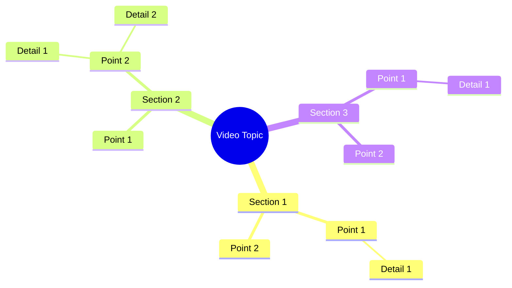

# Husband's Struggle When Money Is Tight

> 🌐 **Read this in:** [English](../../en/2026-09/tiktok-transcript-video-1180.md) · **中文**

> **Creator:** [@Queen of Growth](https://www.tiktok.com/@Queen of Growth) · **Views:** 8.0M · **Posted:** 2026-09-07 · **Niche:** other
>
> **TL;DR:** The hook uses rhythmic, nonsensical phrasing that immediately intrigues and amuses, prompting viewers to stay for the punchline.

[Watch original video →](https://www.facebook.com/share/r/1Euuh1QDA7/)

## Why This Went Viral

## Hook（前3秒）
- **逐字开场：** "સામીર કાછે જખુન ટાકા પહે શામ થાકે તખુન અર્થે રભાપતાકે જતોટાના ભેંએ દાયે તારચે બેશી ભે" — 一串快速、有节奏、几乎像音乐一样的古吉拉特语词汇，以高能量状态说出。
- **钩子模式：** 场景 + 节奏/模式打断。这不是一个问题，也不是一个大胆的断言；它是一个语言绕口令或民间风格的口头禅，听起来像节拍。
- **为什么它能阻止滑动：** 大脑检测到一个熟悉的语音模式（像宝莱坞歌词或民间韵律），但无法立即解码其含义。这创造了一个"模式中断"——观众会停下来，要么解码语言，要么捕捉韵律，要么只是在决定划走之前感受一下节奏。

## 情绪节奏
- **节拍1 – 好奇/困惑（0–3秒）：** 观众听到一个密集、快速的短语。大脑会问：*"他刚才说了什么？这是首歌吗？一个挑战？"*
- **节拍2 – 参与/紧张（3–7秒）：** 随着短语循环或继续，观众会凑近去捕捉他们认识的具体词汇。当他们试图解析句子结构时，紧张感逐渐累积。
- **节拍3 – 共鸣/识别（7–10秒）：** 观众要么意识到这是一个地区方言谚语，一个关于日常疲惫的 relatable 笑话（"下班后，你只想休息"），要么只是享受声音的质感。这是"啊哈"时刻。
- **节拍4 – 释放/解脱（10秒以上）：** 视频以一个有力的收尾结束（"બેશી ભે" — 大致意思是"就坐下吧"），带来一个喜剧性或宣泄性的回报，使循环令人满足。
- **高潮：** 最后一个词"બેશી ભે"作为点睛之笔落地——它是整串话中最简单、最 relatable 的短语，以一个普遍真理穿透复杂的铺垫：*就坐下休息吧。*

## 关键词密度
- **"થાકે"（累了/疲惫）** – 情感吸引力。它将视频锚定在一个普遍的人类状态（精疲力竭）上，使其跨越方言界限都能引发共鸣。
- **"બેશી ભે"（就坐下）** – 情感吸引力 + 行动号召。它是释放阀，也是最容易被重复的短语——观众会评论它来@朋友。
- **"જખુન/તખુન"（当/然后）** – 算法触达。这些是有节奏的连接词，使短语听起来像一首歌，增加观看时长，因为人们会重播以捕捉结构。
- **"સામીર"（专有名词）** – 情感吸引力。一个具体的名字让它感觉个人化，推动评论如"Samiro 兄弟，我也是。"
- **"જતોટાના"（故事/传说的）** – 算法触达。这个词标志着民间/传统内容，在区域内容垂直领域中表现良好。

## 为什么它会传播
- **普遍的疲惫，本土化的风味：** 核心信息（"漫长的一天后，就坐下吧"）在全球范围内都能引起共鸣，但古吉拉特语的表达让它感觉独特而真实。观众分享它来表达*"这就是我们。"*
- **语言谜题机制：** 密集、快速的短语充当"脑筋急转弯"。观众评论要求翻译或重复这个短语，推动评论参与和重播——这两者都是关键的算法信号。
- **节奏的可循环性：** "જખુન... તખુન... ભેંએ... ભે"的韵律是音乐性的。视频被设计为为了声音而重播，提升留存率，这是短视频排名的第一因素。
- **文化自豪感触发器：** 听起来诗意或民间风格的区域语言内容会触发"分享以展示我的文化"的冲动。非古吉拉特语使用者将其作为异国情调的声音片段分享；古吉拉特语使用者将其作为身份标识分享。
- **低投入、高释放的回报：** 最后一句"બેશી ભે"是最简单的部分。它给观众一个快速、容易的收获，可以截图、引用或用作状态消息——使视频成为一个"可模因化"的资产。

## 你可以借鉴什么
- **以有节奏的模式中断开场：** 用你的母语方言或小众术语中的快速、押韵或绕口令式短语开场。不要先解释——让声音本身成为钩子。困惑感驱动前3秒的留存。
- **构建"复杂铺垫 → 简单回报"的结构：** 用80%的视频时间构建密集、快节奏的能量，然后以一个极其简单、普遍的短语结束，释放紧张感（例如，"就休息吧"、"我也是"、"就这样"）。这创造了一个令人满意的循环，让人忍不住重播。
- **将普遍情绪本土化：** 选择一个每个人都有的感受（疲惫、饥饿、沮丧），用高度具体的本地语言或引用包裹它。具体性让它感觉真实；情绪让它跨越语言障碍被分享。

## Mind Map

## Full Transcript (Generated by [TokTranscript](https://toktranscript.com/?utm_source=github&utm_medium=breakdown&utm_campaign=tool_attribution))

> 📝 Transcripts on this page are auto-generated and show the first 60%. Want to transcribe any TikTok in 30 seconds and get the full version? [Try TokTranscript free →](https://toktranscript.com/?utm_source=github&utm_medium=breakdown&utm_campaign=transcript_cta)

સામીર કાછે જખુન ટાકા પહે શામ થાકે તખુન અર્થે રભાપતા

*[Read the full transcript on TokTranscript →](https://toktranscript.com/plaza/tiktok-transcript-video-1180?utm_source=github&utm_medium=breakdown&utm_campaign=transcript_full)*

## Browse More

- All [other](../../by-niche/zh-CN/other.md) breakdowns
- All [Nonsense Rhyme](../../by-pattern/zh-CN/hook-nonsense-rhyme.md) examples

## Video Info

| | |
|---|---|
| Creator | [@Queen of Growth](https://www.tiktok.com/@Queen of Growth) |
| Original video | [https://www.facebook.com/share/r/1Euuh1QDA7/](https://www.facebook.com/share/r/1Euuh1QDA7/) |
| Original title | স্বামীর কাছে যখন টাকা-পয়সা কম থাকে, তখন অর্থের অভাব তাকে যতটা না ভেঙে দেয়, |
| Views | 8.0M (8031574) |
| Posted | 2026-09-07 |
| Duration | 0s |
| Niche | `other` |
| Hook pattern | `Nonsense Rhyme` |
| Original language | `en` (this page translated by AI) |
| Available languages | en, zh-CN |
| Generated | 2026-09-08 by [TokTranscript](https://toktranscript.com/) |

---

*This breakdown is for educational analysis under fair use. Original video © [@Queen of Growth](https://www.tiktok.com/@Queen of Growth). All transcripts are auto-generated and may contain errors.*

*Want to analyze your own TikToks like this? [TikTok 转录工具 →](https://toktranscript.com/viral-breakdown?utm_source=github&utm_medium=breakdown&utm_campaign=footer_cta)*