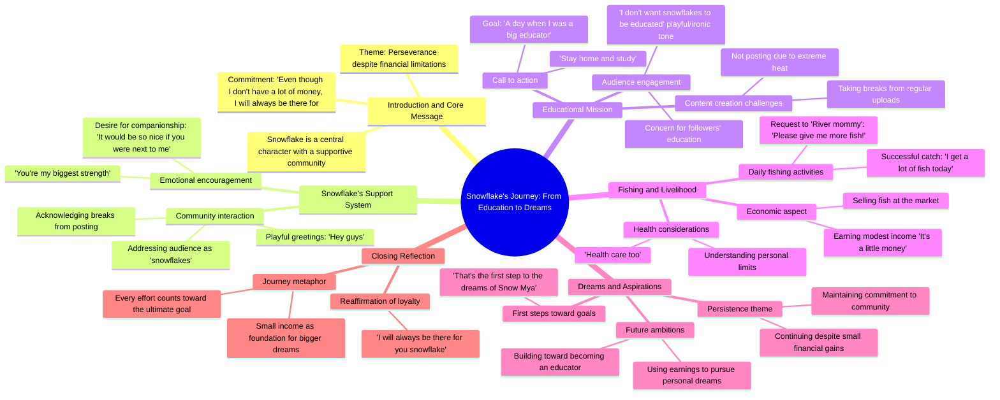

# Snowflake Part 2: A Promise of Support and Study

> 🌐 **Read this in:** [English](../../en/2026-09/tiktok-transcript-video-403c.md) · **中文**

> **Creator:** [@hninmya641](https://www.tiktok.com/@hninmya641) · **Views:** 1.6M · **Posted:** 2026-09-08 · **Niche:** other
>
> **TL;DR:** Directly addresses the audience as 'snowflake' and makes a heartfelt promise, instantly creating intimacy and curiosity.

[Watch original video →](https://vt.tiktok.com/ZSqhYmL9j/)

## Why This Went Viral

## 钩子（前3秒）
- **逐字开场：** “雪花。即使我没有很多钱，我也会永远在你身边，雪花”
- **钩子模式：** 情感承诺 + 身份点名（直接将观众称为“雪花”——一个表达亲昵/忠诚的称呼）
- **为何能阻止滑动：** 它瞬间建立起拟社会化的亲密感。创作者是在*对*观众说话，而不是*冲着*观众说。“我没有很多钱”这句话传递出谦逊和接地气的感觉，而“我会永远在你身边”则触发忠诚反应——观众在3秒内感到被看见、被重视。

## 情绪节奏
1. **温暖/亲密** — “雪花……我会永远在你身边”（建立个人纽带）
2. **渴望/决心** — “待在家里学习，我会去那个只有被嘲笑过的地方”（逆袭叙事开始）
3. **脆弱** — “你是我最大的力量……有一天我成为大教育家的那一天”（说出梦想，暗含脆弱）
4. **幽默/轻松** — “哈哈嘿大家，只是休息一下”（打破紧张，保持随意）
5. **挫败/共鸣** — “我不发帖是因为太热了……健康护理你也懂的”（日常挣扎）
6. **俏皮升级** — “河妈妈！请多给我一些鱼！哈哈我今天收获了好多鱼”（喜剧调剂，荒诞感）
7. **胜利/高潮** — “把这些拿回市场，我要去做我想做的事，做一个雪花”（从被动到主动的转变）
8. **解决/希望** — “虽然钱不多，但这是通往Snow Mya梦想的第一步”（胜利收尾，情感回报）

**高潮时刻：** “我要去做我想做的事，做一个雪花”——这是创作者重新夺回主动权的转折点。观众经历了一段从“我一无所有”到“我在建设些什么”的旅程。

## 关键词密度
- **“雪花”**（出现6次）——*情感吸引力：* 创造群体身份认同，一个部落名称。*算法层面：* 低竞争关键词，高度品牌化。
- **“钱”**（出现3次）——*情感吸引力：* 普遍的财务焦虑。*算法层面：* 覆盖面广，触发财务类内容推荐集群。
- **“梦想”**（出现2次）——*情感吸引力：* 励志核心。*算法层面：* 高互动的“激励”类别。
- **“鱼”**（出现3次）——*情感吸引力：* 日常奔波/收入的隐喻。*算法层面：* 小众但令人印象深刻，提升评论互动。
- **“学习/受过教育/教育家”**（出现3次）——*情感吸引力：* 自我提升叙事。*算法层面：* 连接“生产力”和“学习”内容垂直领域。
- **“永远在你身边”**（出现1次，但情感密度高）——*情感吸引力：* 忠诚承诺。*算法层面：* 触发关于社群的评论串。

## 为何能传播
- **身份创造：** 反复使用“雪花”这一称呼，给观众一个可以采纳的标签。人们分享那些让他们感觉属于某个群体的内容——评论区会充满“我也是雪花”。
- **60秒内的逆袭弧线：** 文字从“我没有钱”推进到“通往梦想的第一步”。这种压缩版的从贫穷到富有的弧线是短视频中最具分享性的情感结构。
- **不完美、原生态的表达：** 语法错误和碎片化句子（“冷的人们我不发帖是因为太热了”）传递出真实感。精致会扼杀病毒式传播——观众对这种内容的信任超过对精良制作的信任。
- **自嘲幽默 + 雄心壮志的组合：** 像“河妈妈！请多给我一些鱼！”这样的句子让创作者讨人喜欢，而“我要去做我想做的事”则让人敬佩。这种对比具有磁性吸引力。
- **全程直接面向观众说话：** 每一个节拍都在对“雪花”或“你”说话。这不是独白——这是对话。观众感到有必要回应，从而推动评论速度（一个顶级算法信号）。

## 你可以借鉴什么
1. **发明一个部落名称并不断重复。** 给你的观众一个特定的称呼（“雪花”、“奋斗者”、“追梦人”），并在开头和最后10秒使用它。这把被动观众变成自我认同并回访的社群成员。
2. **将你的视频构建为60秒的情绪过山车。** 以脆弱开场，中间插入幽默，以胜利的、面向未来的台词收尾。不要在任何一种情绪状态中停留超过15秒。
3. **如果语法和精致度能换来真实感，就保留不完美。** 碎片化的句子和随意的错别字传递出“真实的人在跟朋友说话”，而不是“品牌在广播”。如果你的内容太干净，观众就不会相信奋斗叙事。

## Mind Map

## Full Transcript (Generated by [TokTranscript 转录工具](https://toktranscript.com/?utm_source=github&utm_medium=breakdown&utm_campaign=tool_attribution))

> 📝 Transcripts on this page are auto-generated and show the first 60%. Want to transcribe any TikTok in 30 seconds and get the full version? [Try TokTranscript free →](https://toktranscript.com/?utm_source=github&utm_medium=breakdown&utm_campaign=transcript_cta)

snowflake. even though i dont have a lot of money i will always be there for you snowflake Stay home and study, I'll go to the place only over laughed. you're my biggest strength A day when I was a big educator It would be so nice if you were next to me haha Hey guys only over Take a break for a while, didn't you send me a snow rice? Cold people I m not posting because it s too hot Are you going to fish for pride now? health 

*[Read the full transcript on TokTranscript →](https://toktranscript.com/plaza/tiktok-transcript-video-403c?utm_source=github&utm_medium=breakdown&utm_campaign=transcript_full)*

## Browse More

- All [other](../../by-niche/zh-CN/other.md) breakdowns
- All [Emotional direct address](../../by-pattern/zh-CN/hook-emotional-direct-address.md) examples

## Video Info

| | |
|---|---|
| Creator | [@hninmya641](https://www.tiktok.com/@hninmya641) |
| Original video | [https://vt.tiktok.com/ZSqhYmL9j/](https://vt.tiktok.com/ZSqhYmL9j/) |
| Original title | #နှင်းမြ ဒုတိယပိုင်းလေး တင်ပေးမယ်နော်  နောင်တနဲ့အတူ နှင်းမြ ဇာတ်လမ်းလ... |
| Views | 1.6M (1600000) |
| Posted | 2026-09-08 |
| Duration | 0s |
| Niche | `other` |
| Hook pattern | `Emotional direct address` |
| Original language | `en` (this page translated by AI) |
| Available languages | en, zh-CN |
| Generated | 2026-09-09 by [TokTranscript](https://toktranscript.com/) |

---

*This breakdown is for educational analysis under fair use. Original video © [@hninmya641](https://www.tiktok.com/@hninmya641). All transcripts are auto-generated and may contain errors.*

*Want to analyze your own TikToks like this? [TokTranscript →](https://toktranscript.com/viral-breakdown?utm_source=github&utm_medium=breakdown&utm_campaign=footer_cta)*